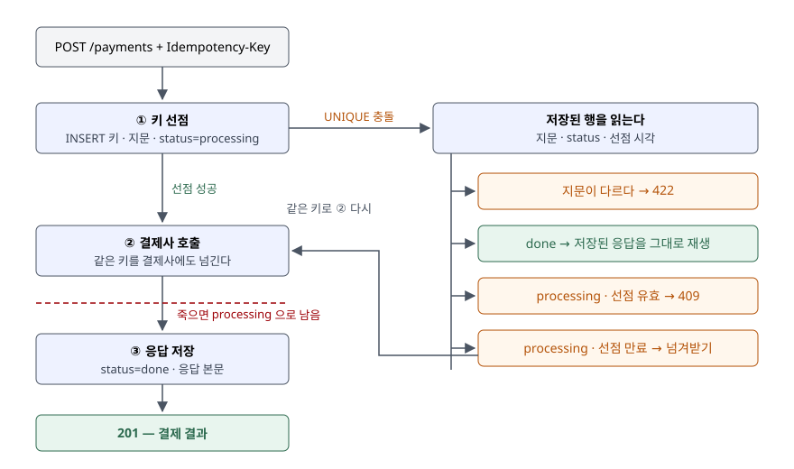

## 들어가며

주문 화면의 결제 버튼을 누르고 응답을 기다리는데, 모바일 네트워크가 잠깐 끊겨 앱이 "시간 초과"를 띄운다.
사용자는 버튼을 한 번 더 누르고, 앱의 재시도 로직도 같은 요청을 다시 보낸다. 서버 쪽에서 첫 요청은 이미
결제사 승인까지 끝났으므로, 이 주문은 두 번 결제된다. 흔히 하는 대응은 "같은 주문 번호로 결제가 있으면 막는다"인데,
조회와 결제 사이에 두 번째 요청이 끼어들면 둘 다 조회에서 아무것도 못 보고 결제한다. 이 글의 예제에서 그 구현은
네 상황 가운데 두 상황에서 승인을 2건 냈다.

## 개념

**멱등**(idempotent)은 같은 요청을 여러 번 보내도 서버에 남는 효과가 한 번 보낸 것과 같다는 성질이다.
HTTP 표준은 PUT·DELETE와 안전한 메서드(GET 등)를 멱등 메서드로 정하고, POST는 그 목록에 넣지 않는다(RFC 9110). 결제 생성은 POST다.

**멱등키**는 POST를 멱등하게 만들려고 클라이언트가 요청마다 붙이는 유일한 값이다. 서버는 그 키로 들어온
첫 요청의 결과를 저장해 두고, 같은 키가 다시 오면 처리하지 않고 저장한 결과를 돌려준다. IETF는 이를 `Idempotency-Key`
요청 헤더로 표준화하는 초안을 냈고(2025-10 개정 07판, 현재 만료 상태), Stripe 같은 결제 API가 같은 방식을 쓴다.

초안이 정한 오류 응답은 세 가지다.

| 상황 | 응답 |
|---|---|
| 키가 필요한 요청에 키가 없다 | 400 |
| 같은 키가 **다른 본문**으로 다시 왔다 | 422 |
| 같은 키의 첫 요청이 **아직 처리 중**이다 | 409 |

## 구조



> **출처**: 오류 응답 400·422·409는 [IETF draft-ietf-httpapi-idempotency-key-header-07 §2.7 Error Handling](https://www.ietf.org/archive/id/draft-ietf-httpapi-idempotency-key-header-07.html#section-2.7),
> 요청 본문 지문은 [같은 초안 §2.4 Idempotency Fingerprint](https://www.ietf.org/archive/id/draft-ietf-httpapi-idempotency-key-header-07.html#section-2.4)를 따랐다.
> 선점·만료·넘겨받기 흐름은 이 글 예제(`claim_first`)의 구현이고, 결과는 [`code/output.txt`](code/output.txt)에 있다.

## 동작 원리

비교한 구현은 셋이다.

- `naive` — 키를 받지 않는다. 요청마다 결제한다
- `check_then_act` — 키로 저장된 응답을 조회하고, 없으면 결제한 뒤 키와 응답을 저장한다
- `claim_first` — 결제 **전에** 키를 `processing` 상태로 INSERT 한다. 키 컬럼은 기본 키라서 같은 키의 두 번째 INSERT는
  UNIQUE 위반으로 실패한다. 선점에 성공한 요청만 결제사를 부르고, 끝나면 `done`과 응답을 저장한다

`check_then_act`의 약점은 **조회와 저장 사이에 결제가 있다**는 것이다. 그 사이에 같은 키가 오면 조회가 비어 있고,
결제 뒤 저장 전에 서버가 죽으면 키가 영영 저장되지 않는다. `claim_first`는 판정을 DB의 UNIQUE 제약 하나에 맡겨,
"조회하고 쓰기" 두 단계를 "쓰기" 한 단계로 줄인다. SQLite는 쓰기를 한 번에 하나씩 처리하므로 같은 키의 INSERT 둘 중 하나만 성공한다.

남는 문제는 결제사가 우리 DB 트랜잭션 밖에 있다는 점이다. 결제 승인 뒤 `done`을 쓰기 전에 죽으면 행은 `processing`으로 남는다.
`claim_first`는 선점 시각을 같이 저장해, 선점이 `LEASE_TICKS`(예제에서는 30)보다 오래되면 주인이 죽은 것으로 보고 넘겨받아 다시 처리한다.
이때 결제사를 **같은 키로** 다시 불러야 결제사가 중복을 걸러 준다.

## 실습 예제

전체 소스: [`code/idempotency_key.py`](code/idempotency_key.py), 실행 기록: [`code/output.txt`](code/output.txt).
결제 건수는 결제사 객체가 실제로 승인한 건수로 센다. 시각은 정수 틱이다.

### A. 응답 유실 후 재시도

```text
  naive           첫 요청 (201, {'charge_id': 'ch_1'})  재시도 (201, {'charge_id': 'ch_2'})  → 승인 2건
  check_then_act  첫 요청 (201, {'charge_id': 'ch_1'})  재시도 (201, {'charge_id': 'ch_1'})  → 승인 1건
  claim_first     첫 요청 (201, {'charge_id': 'ch_1'})  재시도 (201, {'charge_id': 'ch_1'})  → 승인 1건
```

순차 재시도는 키를 조회만 해도 막힌다. 여기까지는 두 구현의 차이가 보이지 않는다.

### B. 같은 키, 다른 금액

```text
  check_then_act  두 번째(50000원) 요청 응답 (201, {'charge_id': 'ch_1'})  → 승인 [('ch_1', 30000)]
  claim_first     두 번째(50000원) 요청 응답 (422, {'error': '이 키는 다른 요청 본문에 이미 쓰였다'})
```

`check_then_act`는 50,000원 요청에 30,000원 결제 결과를 성공으로 돌려줬다. 클라이언트가 키를 재사용하는 버그가 있으면
이 응답만 보고는 알 수 없다. `claim_first`는 본문의 SHA-256 지문을 같이 저장해 두었다가 422로 막았다.

### C. 첫 요청이 결제사 응답을 기다리는 동안 같은 키 요청이 또 온다

```text
  check_then_act  첫 요청 (201, {'charge_id': 'ch_2'})  두 번째 요청 (201, {'charge_id': 'ch_1'})  → 승인 2건
  claim_first     첫 요청 (201, {'charge_id': 'ch_1'})  두 번째 요청 (409, {'error': '같은 키의 요청이 아직 처리 중이다'})  → 승인 1건
```

예제는 결제사의 첫 호출을 붙잡아 두고 그 사이에 두 번째 요청을 보낸다. `check_then_act`는 두 번 결제했고,
**같은 키로 받은 두 응답의 `charge_id`가 서로 달랐다.** 키 테이블에는 나중에 저장한 쪽 하나만 남으므로, 다른 한 건은 키로 추적할 수도 없다.

### D. 결제 후, 응답 저장 전에 서버가 죽음

```text
  check_then_act (결제사에 키를 넘기지 않음)
    t=5   재시도 (201, {'charge_id': 'ch_2'})
    → 승인 2건
  claim_first (결제사가 키를 인식)
    t=5   재시도 (409, {'error': '같은 키의 요청이 아직 처리 중이다'})
    t=40  재시도 (201, {'charge_id': 'ch_1'})
    → 승인 1건
  claim_first (결제사가 키를 무시)
    t=5   재시도 (409, ...)
    t=40  재시도 (201, {'charge_id': 'ch_2'})
    → 승인 2건
```

예상과 달랐던 것은 마지막 줄이다. 선점·지문·만료를 다 갖춘 `claim_first`도 **결제사가 키를 무시하면** 두 번 결제했다.
우리 서버는 결제사 호출이 끝났는지 알 수 없는 상태로 남기 때문이다. 넘겨받은 요청이 할 수 있는 일은 다시 부르는 것뿐이고,
그 재호출을 한 번으로 만드는 것은 결제사 쪽의 멱등 처리다.

## 실무에서 주의할 점

- **키 저장과 판정은 UNIQUE 제약으로 한다.** 애플리케이션에서 조회한 뒤 쓰면 그 사이가 경합 구간이다(C).
  여러 DB 노드로 나뉜 저장소라면 키가 항상 같은 노드로 가는지부터 확인한다.
- **본문 지문을 저장한다.** 키만 보면 다른 요청을 같은 요청으로 착각한다(B). 초안은 지문을 선택 사항으로 두지만,
  금액이 걸린 API에서는 빼지 않는다. 지문은 키 순서를 정렬한 정규화 본문으로 만든다.
- **외부 호출에는 같은 키를 넘긴다.** 결제사·송금 API가 멱등키를 받는다면 우리 키를 그대로 넘기거나 그 키에서 만든 값을 넘긴다(D).
  받지 않는다면 결제사의 조회 API로 "이 주문에 승인이 있는가"를 먼저 묻는 복구 경로가 필요하다.
- **선점 유효 시간은 결제사 최대 응답 시간보다 길게 잡는다.** 짧으면 아직 살아 있는 첫 요청의 선점을 두 번째 요청이 넘겨받는다.
  예제에서 t=5 재시도는 409, t=40 재시도는 넘겨받기였다.
- **키의 보관 기간을 정하고 공개한다.** 초안은 서버가 키 만료 정책을 문서로 밝히라고 하고, Stripe는 24시간이 지난 키를
  지울 수 있으며 지워진 뒤 같은 키가 오면 새 요청으로 처리한다고 적는다. 클라이언트의 재시도 기간이 이보다 길면 안 된다.
- **키에 개인정보를 넣지 않는다.** Stripe는 V4 UUID처럼 충돌하지 않는 무작위 값을 권하고, 이메일 같은 식별 정보를 키로 쓰지 말라고 한다.

## 정리

- POST는 멱등이 아니므로, 재시도가 있는 결제 API는 클라이언트가 붙인 멱등키로 첫 결과를 저장하고 재생한다.
- 키는 결제 **전에** UNIQUE 제약으로 선점한다. 조회 후 결제하는 구현은 처리 중 중복 요청과 서버 사망에서 두 번 결제했다.
- 같은 키·다른 본문은 422, 처리 중은 409로 막고, 선점 시각으로 죽은 요청을 넘겨받는다.
- 우리 DB 밖의 결제사까지 한 번으로 만들려면 결제사에도 같은 키를 넘겨야 한다.

## 참고 자료

- [IETF draft-ietf-httpapi-idempotency-key-header-07, *The Idempotency-Key HTTP Header Field* (2025-10, 만료)](https://www.ietf.org/archive/id/draft-ietf-httpapi-idempotency-key-header-07.html) — [§2.2 Uniqueness of Idempotency Key](https://www.ietf.org/archive/id/draft-ietf-httpapi-idempotency-key-header-07.html#section-2.2), [§2.4 Idempotency Fingerprint](https://www.ietf.org/archive/id/draft-ietf-httpapi-idempotency-key-header-07.html#section-2.4), [§2.5.2 Resource](https://www.ietf.org/archive/id/draft-ietf-httpapi-idempotency-key-header-07.html#section-2.5.2), [§2.7 Error Handling](https://www.ietf.org/archive/id/draft-ietf-httpapi-idempotency-key-header-07.html#section-2.7)
- [RFC 9110 HTTP Semantics §9.2.2 Idempotent Methods](https://www.rfc-editor.org/rfc/rfc9110.html#section-9.2.2) — 멱등 메서드의 정의와 목록(POST는 없다)
- [SQLite — File Locking And Concurrency In SQLite Version 3](https://www.sqlite.org/lockingv3.html) — 한 번에 하나의 쓰기만 허용하는 잠금
- [Stripe API Reference — Idempotent requests](https://docs.stripe.com/api/idempotent_requests) — 첫 결과(500 포함) 저장과 재생, 매개변수 비교, 24시간 뒤 정리, 키 길이 255자, 동시 요청 충돌 시 결과 미저장
- [Python 3.13 — sqlite3](https://docs.python.org/3.13/library/sqlite3.html) — 연결별 스레드 사용, `IntegrityError`
