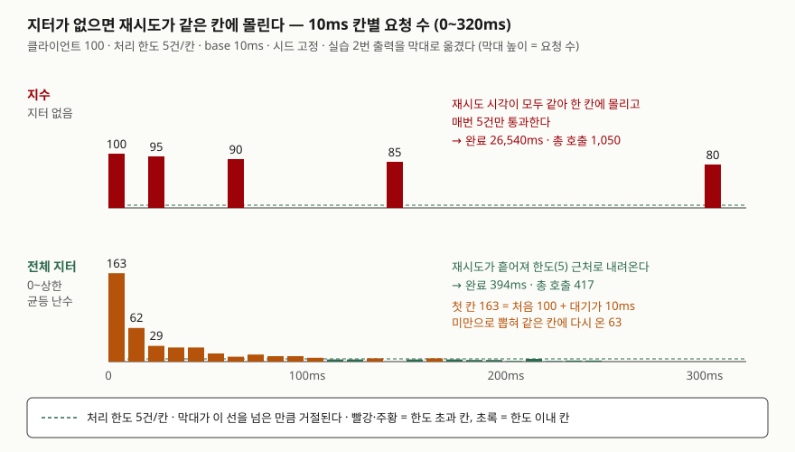

## 들어가며

외부 API가 몇 초 멈췄다 돌아온 뒤 대시보드를 보면, 복구 직후에 요청이 평소의 몇 배로 치솟았다가 다시 에러가
쌓이는 모양이 남아 있다. 클라이언트 코드에는 "실패하면 1초 쉬고 다시"가 들어 있고, 누군가 이걸 "1초, 2초, 4초로
늘린다"로 바꿔 둔 상태다. 그런데도 복구 직후의 파도는 그대로다. 장애 순간에 실패한 클라이언트들이 같은 순간에 같은
규칙으로 기다리니, 대기 시간을 아무리 늘려도 **다 같이 늦게** 몰려올 뿐이다. 이 글의 시뮬레이션에서 그 방식은 100개
클라이언트를 처리하는 데 26.5초가 걸렸다. 이론상 0.2초면 되는 일이다.

## 개념

재시도의 대기 시간을 정하는 규칙을 **백오프**라고 한다. 백오프에는 두 축이 있다.

- **지수 백오프**: 실패할 때마다 대기 상한을 곱으로 늘린다. 서버가 오래 아프면 그만큼 덜 두드린다. **총 부하**를 줄인다.
- **지터**: 계산한 대기에 난수를 섞는다. 같은 순간에 실패한 클라이언트들이 서로 다른 순간에 돌아오게 한다. **동시성**을 깬다.

Marc Brooker가 AWS 아키텍처 블로그(2015-03-04)에 정리한 공식이 업계에서 자주 인용된다. `n`은 실패 횟수다.

| 방식 | 대기 시간 |
|---|---|
| 지수 | `min(cap, base · 2ⁿ)` |
| 지수 + 전체 지터 | `random(0, min(cap, base · 2ⁿ))` |
| 지수 + 절반 지터 | `t/2 + random(0, t/2)`, `t = min(cap, base · 2ⁿ)` |
| 비상관 지터 | `min(cap, random(base, 직전 대기 · 3))` |

gRPC 연결 백오프 규약은 다른 방식을 쓴다. 계산한 대기의 ±20%(JITTER 0.2)만 흔든다.
Google SRE 책의 연쇄 장애 장은 재시도에 "항상 난수를 섞은 지수 백오프를 쓰라"고 적는다.

## 구조



> **출처**: 공식은 [AWS Architecture Blog — Exponential Backoff And Jitter (2015-03-04)](https://aws.amazon.com/blogs/architecture/exponential-backoff-and-jitter/)를 따랐다.
> 막대의 숫자는 아래 실습 2번의 실행 결과다.

## 동작 원리

장애가 나는 순간, 그 사이에 요청을 보낸 클라이언트는 **거의 같은 시각에 실패**한다. 지터가 없으면 다음 시도 시각은
`실패 시각 + f(n)`이고, 실패 시각과 `n`이 같으니 다음 시도도 같은 시각이다. 서버가 그 순간 처리할 수 있는 몇 건만
통과하고 나머지는 다시 같은 시각에 실패한다. 지수로 늘리면 **파도 사이의 간격**이 벌어질 뿐 파도의 높이는 그대로다.
실습에서 0ms에 100, 20ms에 95, 60ms에 90, 140ms에 85, 300ms에 80건이 한 칸에 몰렸다.

지터는 같은 `n`을 가진 클라이언트들의 다음 시도 시각을 구간 전체에 퍼뜨린다. 퍼진 폭이 넓을수록 칸 하나에 몰리는
수가 줄어 처리 한도 아래로 내려온다. 폭이 좁으면 여전히 몰린다. ±20%는 계산값 주변 40% 폭만 쓰고, 전체 지터는 0부터
상한까지 100% 폭을 쓴다.

지수는 여전히 필요하다. 고정 간격에 지터만 섞으면 서버가 오래 죽어 있을 때 같은 빈도로 계속 두드린다. 지수는 시간이
지날수록 시도 빈도를 낮춰 **복구를 기다리는 동안의 부하**를 줄이고, 지터는 **복구 순간의 동시성**을 깬다.

## 실습 예제

전체 소스: [`code/retry_storm.py`](code/retry_storm.py), 실행 기록: [`code/output.txt`](code/output.txt).
클라이언트 100개가 0ms에 동시에 요청한다. 서버는 10ms 칸마다 5건만 받고 나머지는 즉시 거절한다. 그래서 아무리 잘해도
20칸(마지막 칸 시작 190ms)이 걸리고 호출은 최소 100회다. base 10ms, cap 2,000ms, 시드 20261006.

### 방식별 결과

| 방식 | 총 호출 | 완료(ms) | 최대 칸 부하 |
|---|---|---|---|
| 고정 10ms | 1,050 | 190 | 100 |
| 지수 | 1,050 | 26,540 | 100 |
| 지수 + ±20% | 407 | 697 | 100 |
| 지수 + 전체 지터 | 417 | 394 | 163 |
| 지수 + 절반 지터 | 410 | 534 | 100 |
| 비상관 지터 | 391 | 542 | 100 |

(실습 1번 출력을 표로 옮겼다. 포기한 클라이언트는 모든 방식에서 0이다.)

### 지터가 없으면 같은 칸에 몰린다

```text
  [지수] 0~400ms 칸별 요청 수 (10ms 칸, 처리 한도 5)
       0ms: 100   0  95   0   0   0  90   0   0   0   0   0   0   0  85   0   0   0   0   0
     200ms:   0   0   0   0   0   0   0   0   0   0  80   0   0   0   0   0   0   0   0   0

  [지수 + 전체 지터] 0~400ms 칸별 요청 수 (10ms 칸, 처리 한도 5)
       0ms: 163  62  29  26  26  15   9  13  10  10   7   4   4   6   0   4   6   4   3   3
     200ms:   1   5   1   2   2   0   0   0   0   0   0   0   0   0   0   1   0   0   0   1
```

지수는 매 파도에서 5건만 통과하니 100개를 끝내려면 20번의 파도가 필요하다. 대기가 cap(2초)에 닿은 뒤로는 2초마다 한 번씩
5건이 빠지는 셈이라 26.5초가 걸렸다. 같은 공식에 전체 지터를 씌우자 0.39초에 끝났다. **지수가 아니라 지터가 시간을 줄였다.**

### 예상과 달랐던 세 가지

**고정 10ms가 가장 빨리 끝났다.** 190ms, 이론 하한 그대로다. 매 칸 남은 클라이언트가 전부 다시 와서 한도 5를 늘 채우기
때문이다. 대신 호출이 1,050회로 지터 방식의 약 2.5배다. 이 모델은 거절에 비용이 없다고 두었다. 실제 서버는 거절에도
연결·인증·파싱 비용을 쓰므로, 과부하 상태에서 호출 2.5배는 회복을 늦추는 쪽으로 돌아온다.

**전체 지터의 최대 칸 부하(163)가 다른 방식보다 높았다.** 대기를 0부터 뽑으니 첫 재시도의 절반가량이 10ms 안에 다시 와서
첫 칸에 겹쳤다. 전체 지터는 "가장 짧은 대기"를 0으로 열어 두는 방식이다. 첫 칸 다음부터는 빠르게 흩어진다.

**±20% 지터는 시드에 따라 결과가 크게 흔들렸다.** 실습 3번에서 시드 1~5로 다시 돌렸다.

```text
  시드     | 전체 지터 호출/완료 | 절반 지터 호출/완료 | ±20% 호출/완료
         1 |   421 /    398ms |   409 /    498ms |   414 /    694ms
         3 |   426 /    427ms |   417 /    540ms |   426 /   1411ms
```

(5줄 중 2줄을 옮겼다. 원문은 `output.txt`의 3번이다.)

호출 수는 세 방식이 400대로 비슷하다. 완료 시각은 전체 지터가 다섯 번 중 네 번 가장 짧았고(시드 4에서는 절반 지터와
528ms 대 527ms), ±20%는 다섯 번 모두 가장 길었다(시드 3에서 1,411ms). 폭이 좁으면 늦게 남은 몇 클라이언트가 계속
같은 근처에서 부딪힌다.
Brooker의 글은 전체 지터가 일은 적게 하고 시간은 조금 더 쓴다고 정리했는데, 이 실험에서는 시간이 대체로 가장 짧고
호출은 절반 지터보다 조금 많았다. 그 글은 낙관적 동시성 제어로 같은 행을 갱신하는 경합을 모델로 썼고, 이 글은 처리 한도가
고정된 서버를 모델로 썼다. **모델이 다르면 순위가 바뀐다.** 지터 방식끼리의 차이는 지터 유무의 차이보다 훨씬 작다.

## 실무에서 주의할 점

- **재시도 횟수와 총 대기 시간에 상한을 둔다.** SRE 책은 요청당 재시도를 제한하고 서버 전체의 재시도 예산을 두라고 한다.
  상한이 없으면 백오프가 있어도 장애가 길어질수록 대기 중인 재시도가 쌓인다.
- **여러 계층에서 재시도하지 않는다.** 계층마다 3번씩 재시도하면 3계층에서 맨 아래 서버는 최대 3³ = 27배 요청을 받는다.
  SRE 책이 명시적으로 경고하는 증폭이다. 재시도는 한 계층에서만 한다.
- **멱등하지 않은 요청은 재시도 전에 멱등성을 확보한다.** 응답만 잃은 결제를 다시 보내면 두 번 결제된다.
  [멱등키 글](../2026-10-06-idempotency-key-duplicate-payment/index.md)에서 다뤘다.
- **재시도할 에러를 고른다.** 잘못된 요청(400 계열)이나 권한 오류는 다시 보내도 같은 결과다. 과부하·일시 장애만 재시도하고,
  서버가 과부하 전용 응답을 주면 그 응답을 백오프 신호로 쓴다.
- **최소 대기를 0으로 둘지 정한다.** 전체 지터는 거의 즉시 재시도하는 클라이언트를 만든다(실습의 첫 칸 163).
  첫 재시도까지 최소 간격이 필요하면 절반 지터나 비상관 지터가 하한을 남긴다.

## 정리

- 지수 백오프는 장애가 길 때의 총 부하를, 지터는 복구 순간의 동시성을 줄인다. 하는 일이 다르다.
- 지터 없는 지수 백오프는 파도의 간격만 벌리고 높이는 그대로 둔다. 실습에서 26.5초가 걸렸고 전체 지터로 0.39초가 됐다.
- 고정 간격은 빨리 끝날 수 있지만 호출이 2.5배다. 거절에도 비용이 드는 서버에서는 회복을 늦춘다.
- 지터의 폭이 좁으면(±20%) 결과가 흔들린다. 지터 방식끼리의 순위는 부하 모델에 따라 바뀐다.

## 참고 자료

- [AWS Architecture Blog — Marc Brooker, *Exponential Backoff And Jitter* (2015-03-04)](https://aws.amazon.com/blogs/architecture/exponential-backoff-and-jitter/) — 지수·전체·절반·비상관 지터 공식과 낙관적 동시성 경합 시뮬레이션
- [Google SRE Book — Addressing Cascading Failures, Retries](https://sre.google/sre-book/addressing-cascading-failures/) — Retries 절. 난수를 섞은 지수 백오프, 요청당 재시도 제한, 재시도 예산, 계층 간 증폭
- [gRPC — Connection Backoff Protocol](https://github.com/grpc/grpc/blob/master/doc/connection-backoff.md) — Proposed Backoff Algorithm 절. INITIAL_BACKOFF 1초, MULTIPLIER 1.6, JITTER 0.2, MAX_BACKOFF 120초
