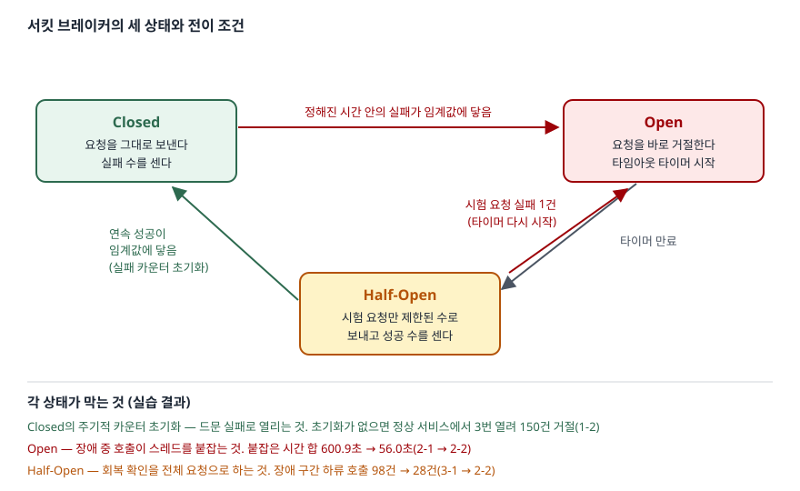

## 들어가며

결제 서비스가 외부 환율 API를 부르는데, 어느 날 그 API가 응답을 멈춘다. 타임아웃은 2초로 걸어 두었으니 괜찮을 것 같지만,
초당 10건씩 들어오는 요청이 각자 2초씩 스레드를 붙잡으면서 스레드 풀이 바닥나고, 환율과 상관없는 주문 조회까지 느려진다.
흔한 대응은 재시도를 늘리거나 타임아웃을 더 줄이는 것이다. 재시도는 죽은 서비스에 호출을 몇 배로 늘리고,
타임아웃을 줄여도 30초 장애 동안 300건이 전부 실패를 기다리는 것은 같다. 실패할 것이 뻔한 호출을 **보내지 않는** 장치가 필요하다.

## 개념

**서킷 브레이커**(circuit breaker)는 원격 호출을 감싸는 대리 객체다. 최근 실패를 세다가 실패가 임계값에 닿으면 한동안
호출을 보내지 않고 바로 실패를 돌려주고, 시간이 지나면 몇 건만 보내 하류가 살아났는지 확인한다.
Martin Fowler가 2014년 글에서 Michael Nygard의 책 *Release It!* 을 출처로 소개하면서 널리 알려졌다.

[재시도](../2026-10-06-retry-backoff-jitter/index.md)와 목적이 반대다. Azure 아키텍처 센터는 재시도가 "결국 성공하리라는 기대로
다시 시도하는 것"이고 서킷 브레이커는 "실패할 가능성이 높은 작업을 하지 못하게 막는 것"이라고 구분한다.
둘을 함께 쓸 때는 재시도가 브레이커를 거쳐 호출하되, 브레이커가 돌려준 거절은 재시도하지 않아야 한다.

## 구조



> **출처**: [Azure Architecture Center — Circuit Breaker pattern: Solution](https://learn.microsoft.com/en-us/azure/architecture/patterns/circuit-breaker#solution)(세 상태와 전이 조건, Closed 실패 카운터의 주기적 초기화, Half-Open 성공 카운터).
> 아래쪽 수치는 이 글의 실습 결과다.

## 동작 원리

Azure 문서의 설명을 그대로 옮기면 세 상태는 이렇다.

| 상태 | 요청 | 세는 것 | 나가는 조건 |
|---|---|---|---|
| Closed | 그대로 보낸다 | 실패 수. **주기적으로 0으로 돌린다** | 정해진 시간 안의 실패가 임계값 → Open |
| Open | 바로 거절한다 | 없음. 타임아웃 타이머만 돈다 | 타이머 만료 → Half-Open |
| Half-Open | 제한된 수만 보낸다 | 연속 성공 수 | 성공 임계 → Closed, 실패 1건 → Open(타이머 재시작) |

각 상태가 왜 있는지는 문서가 이유를 붙여 둔다. Closed의 카운터를 주기적으로 초기화하는 것은 **가끔 생기는 실패**로 열리지 않게 하려는 것이고,
Half-Open은 **막 회복한 서비스에 요청이 한꺼번에 몰려** 다시 쓰러지는 것을 막으려는 것이다.

실습 코드는 이 표를 그대로 구현했다([`code/circuit_breaker.py`](code/circuit_breaker.py)). 요청 도착과 호출 완료를 시간순 이벤트로 처리하므로,
타임아웃으로 끝나는 호출의 실패는 **2초 뒤에야** 브레이커에 기록된다. 이 지연이 아래 결과의 한 축이다.

## 실습 예제

0.1초마다 요청 1건(초당 10건), 정상 응답 0.05초, 장애 중에는 2초 뒤 타임아웃이다. 브레이커는 10초 안에 실패 5건이면 열리고,
5초 뒤 Half-Open에서 시험 호출을 한 번에 1건씩 보내 3건 연속 성공하면 닫힌다. 난수가 없어 몇 번을 돌려도 같다.
실행 기록: [`code/output.txt`](code/output.txt).

### Open — 장애 중 스레드를 붙잡지 않는다

하류는 10~40초 무응답, 40~50초에는 동시 2건까지만 처리하고, 50초부터 정상이다.

```text
-- 2-1. 브레이커 없음
   하류 호출 800 / 즉시 거절 0 / 성공 482 / 실패 318
   실패 호출이 붙잡은 시간 합 600.9초 / 동시 진행 최대 20건
   구간별 하류 호출(실패): 정상 100(0), 장애 300(300), 회복 중 100(18), 회복 후 300(0)

-- 2-2. 브레이커 (임계 5건/10초, Open 5초, 시험 1건씩 3건 연속 성공)
   하류 호출 473 / 즉시 거절 327 / 성공 445 / 실패 28
   실패 호출이 붙잡은 시간 합 56.0초 / 동시 진행 최대 20건
   구간별 하류 호출(실패): 정상 100(0), 장애 28(28), 회복 중 45(0), 회복 후 300(0)
```

장애 30초 동안 하류로 간 호출이 300건에서 28건으로, 실패를 기다리며 붙잡힌 시간이 600.9초에서 56.0초로 줄었다.
**예상과 달랐던 것은 동시 진행 최대가 20건 그대로라는 점이다.** 장애가 시작된 10초부터 첫 실패가 기록되는 12초까지,
브레이커는 아무것도 모른 채 20건을 내보냈다. 5번째 실패가 기록된 12.40초에야 열렸다. 브레이커는 실패를 보고 나서 움직이므로,
**열리기 전 한 타임아웃 동안의 적체는 막지 못한다.** 그 크기는 요청 속도 × 타임아웃이다. 스레드 풀이 20보다 작았다면 브레이커가 있어도 풀이 고갈됐다.

### Half-Open — 회복 확인을 전체 요청으로 하지 않는다

같은 장애에서 Half-Open을 빼고, Open 5초 뒤 곧바로 Closed로 돌아가게 했다.

```text
-- 3-1. Half-Open 없이 Open 5초 뒤 바로 Closed
   하류 호출 548 / 즉시 거절 252 / 성공 445 / 실패 103
   실패 호출이 붙잡은 시간 합 196.3초 / 동시 진행 최대 20건
   구간별 하류 호출(실패): 정상 100(0), 장애 98(98), 회복 중 50(5), 회복 후 300(0)
   상태 전이 10회
      12.40s     closed -> open      실패 5건
      17.50s       open -> closed    타임아웃 경과 (시험 없이)
      19.90s     closed -> open      실패 5건
```

2-2에서는 Open이 끝날 때마다 시험 호출 1건만 나갔고, 그것이 2초 뒤 실패하는 동안 나머지 요청은 거절됐다(17.50초 → 19.50초 다시 Open).
3-1은 Closed로 돌아가자마자 초당 10건이 다시 나가 2.4초 동안 24건씩 타임아웃을 기다렸다. 장애 구간 하류 호출이 28건에서 98건,
붙잡힌 시간이 56.0초에서 196.3초로 늘었다. 회복 중(40~50초) 구간에서도 3-1은 동시 2건 제한에 걸려 5건이 실패했고 2-2는 0건이었다.

### Closed — 드문 실패로는 열리지 않는다

이번에는 하류가 살아 있고 3초에 한 번 실패하는 간헐 오류만 있다(60초, 실패 20건).

```text
-- 1-1. 실패 카운터를 10초마다 0으로 (임계 5건)
   하류 호출 600 / 즉시 거절 0 / 성공 580 / 실패 20
   상태 전이 0회

-- 1-2. 실패 카운터를 돌리지 않음 (임계 5건)
   하류 호출 450 / 즉시 거절 150 / 성공 433 / 실패 17
   상태 전이 9회
      13.55s     closed -> open      실패 5건
```

카운터를 초기화하지 않으면 실패가 계속 쌓여 13.55초에 열렸고, 같은 일이 세 번 반복돼 정상 요청 150건(25%)이 거절됐다.
10초 창 안에는 실패가 최대 4건이라 1-1은 한 번도 열리지 않았다. 임계값만큼 **창 크기**가 브레이커의 감도를 정한다.

## 다른 구현에서는

Resilience4j(Java)는 같은 세 상태에 실패 **수** 대신 실패 **비율**을 쓴다. 문서의 기본값은 실패율 임계 50%, 최근 100건(건수 기준 창),
최소 호출 100건, Open 유지 60초, Half-Open 시험 10건이다. 느린 호출 비율(기본 60초 이상인 호출이 100%)로도 열 수 있고,
Open에서 Half-Open으로의 전환은 기본적으로 **다음 호출이 들어올 때** 일어난다(`automaticTransitionFromOpenToHalfOpenEnabled` 기본 false).
이 글의 구현도 같은 방식이다. 실습 수치는 이 글의 단순 구현 기준이며 Resilience4j로 잰 것이 아니다.

## 실무에서 주의할 점

- **타임아웃이 먼저다.** 브레이커는 실패가 기록된 뒤에야 열린다. 2-2에서 열리기 전까지 20건이 쌓였고, 그 양은 요청 속도 × 타임아웃이다.
  Azure 문서도 하류의 타임아웃이 길면 브레이커가 실패를 알아차리기 전에 많은 스레드가 묶인다고 경고한다. 타임아웃을 짧게, 스레드 풀(벌크헤드)을 따로 둔다.
- **Half-Open의 시험 수를 작게 둔다.** 시험 호출을 많이 허용할수록 3-1에 가까워진다. 회복 중인 서비스는 적은 양만 감당할 수 있다.
- **실패 집계 창을 둔다.** 누적 카운터는 결국 열린다(1-2). 창 크기와 임계값은 평소 오류율에서 열리지 않는 값으로 정한다.
- **하류마다 브레이커를 따로 둔다.** 샤드가 여럿인 저장소를 브레이커 하나로 묶으면 한 샤드의 장애로 나머지까지 막힌다(Azure 문서의 자원 구분 항목).
- **Open일 때 무엇을 돌려줄지 정한다.** 예외만 던지면 장애가 사용자에게 그대로 보인다. 캐시된 값이나 기본값으로 기능을 줄여 응답하고,
  상태 전이를 지표로 남겨 Open이 되면 알림이 가게 한다.

## 정리

- Closed는 실패를 세되 주기적으로 초기화해, 드문 실패로 열리지 않게 한다.
- Open은 실패할 호출을 보내지 않아 장애 중 스레드 점유를 600.9초에서 56.0초로 줄였다. 다만 열리기 전 한 타임아웃 동안의 적체는 막지 못한다.
- Half-Open은 회복 확인을 시험 호출 몇 건으로 해, 장애 중 하류 호출을 98건에서 28건으로 줄였다.
- 브레이커는 타임아웃·재시도·대체 응답과 함께 설계해야 제 역할을 한다.

## 참고 자료

- [Azure Architecture Center — Circuit Breaker pattern](https://learn.microsoft.com/en-us/azure/architecture/patterns/circuit-breaker) — 세 상태와 전이, 주기적 카운터 초기화, Half-Open의 목적, 고려사항(타임아웃·자원 구분·수동 전환)
- [Azure Architecture Center — Circuit Breaker pattern: Solution](https://learn.microsoft.com/en-us/azure/architecture/patterns/circuit-breaker#solution) — 상태 기계 설명
- [Azure Architecture Center — Retry pattern](https://learn.microsoft.com/en-us/azure/architecture/patterns/retry) — 재시도와의 구분
- [Martin Fowler — CircuitBreaker (2014-03-06)](https://martinfowler.com/bliki/CircuitBreaker.html) — 패턴 소개, *Release It!* 출처
- [Resilience4j — CircuitBreaker](https://resilience4j.readme.io/docs/circuitbreaker) — 실패율·느린 호출 비율, 건수·시간 기준 창, 기본 설정값
