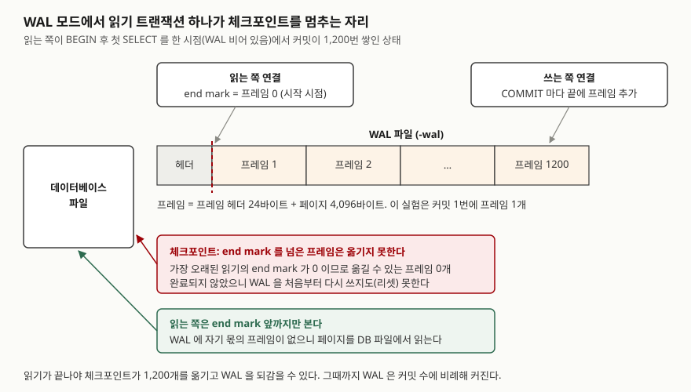

## 들어가며

배치 작업이 도는 동안 사용자 화면이 멈춘다는 신고가 들어온다. 원인을 찾아보면 한쪽은 몇 분짜리 집계
조회를 돌리고, 다른 쪽은 그 표에 짧은 갱신을 계속 넣고 있다. 흔한 대응은 조회를 새벽으로 옮기거나 갱신에
재시도 루프를 거는 것인데, 둘 다 겹치는 시간을 줄일 뿐 막는 구조는 그대로다. MVCC를 쓰는 엔진으로
바꾸면 조회가 갱신을 막지 않는다. 그러면 비용이 사라진 것인가. 이 글은 SQLite의 두 저장 모드를 같은
순서로 돌려 막힘이 어디로 옮겨 가는지 잰다. 조회 하나가 열려 있는 동안 커밋 1,200번이 쌓이면
그 비용은 파일 크기로 드러난다.

## 개념

**MVCC**(다중 버전 동시성 제어)는 데이터를 고칠 때 옛 버전을 바로 지우지 않고 새 버전을 따로 남겨,
읽는 트랜잭션이 **자기가 시작한 시점의 버전**을 보게 하는 방식이다. 읽는 쪽이 옛 버전을 보면 되므로
쓰는 쪽을 막을 이유가 없고, 쓰는 쪽도 읽는 쪽을 기다리지 않는다.

잠금으로 일관성을 지키는 방식은 다르다. 읽는 동안 값이 바뀌지 않게 하려면 읽는 쪽이 공유 잠금을 잡고,
쓰는 쪽은 그 잠금이 풀릴 때까지 기다린다. SQLite의 rollback journal 모드가 이 방식이다.
쓰는 쪽이 커밋하려면 배타 잠금이 필요하고, 공유 잠금이 하나라도 남아 있으면 얻지 못한다.

SQLite의 **WAL**(write-ahead log) 모드는 MVCC를 **페이지 단위**로 구현한다. 커밋은 바뀐 페이지를
DB 파일에 덮어쓰지 않고 `-wal` 파일 끝에 붙인다. 같은 페이지의 옛 버전은 DB 파일에, 새 버전은 WAL에
있으니 두 버전이 동시에 존재한다. 행마다 버전을 두는 엔진과 단위는 다르지만, "옛 버전을 남겨 두고
읽는 쪽이 고른다"는 원리는 같다.

## 구조



> **출처**: end mark와 체크포인트가 멈추는 조건은 [SQLite — Write-Ahead Logging: How WAL Works](https://www.sqlite.org/wal.html#how_wal_works)와 [Checkpointing](https://www.sqlite.org/wal.html#checkpointing),
> 헤더 32바이트·프레임 헤더 24바이트와 WAL 리셋 조건은 [SQLite Database File Format: WAL File Format](https://www.sqlite.org/fileformat2.html#wal_file_format)과 [WAL Reset](https://www.sqlite.org/fileformat2.html#wal_reset)을 따랐다.
> 프레임 수 1,200과 end mark 위치는 아래 실습 3의 실행 조건이다.

## 동작 원리

WAL 모드의 읽기는 시작할 때 WAL의 마지막 커밋 위치를 기억한다. 이것이 **end mark**다. 이후 페이지를
읽을 때 WAL에서 end mark 앞의 가장 최근 프레임을 찾고, 없으면 DB 파일에서 읽는다. end mark 뒤에 붙은
프레임은 보지 않는다. 그래서 다른 연결이 커밋해도 이 읽기 트랜잭션의 결과는 바뀌지 않는다.

WAL이 끝없이 쌓이지 않게 하는 것이 **체크포인트**다. WAL의 프레임을 DB 파일로 옮겨 적는 작업이다.
그런데 DB 파일은 모든 읽기가 공유한다. end mark가 프레임 0인 읽기가 DB 파일에서 페이지를 읽고 있는데
프레임 1,200의 내용을 DB 파일에 덮어쓰면, 그 읽기가 보는 값이 바뀐다. 그래서 체크포인트는
**가장 오래된 읽기의 end mark를 넘은 프레임을 옮기지 못한다.**

체크포인트가 끝까지 가야 WAL을 **리셋**할 수 있다. 다음 쓰기가 WAL을 처음부터 다시 쓰는 것이다.
리셋이 없으면 새 커밋은 계속 파일 끝에 붙는다. 읽기 잠금이 쓰기를 막던 비용이, 오래 열린 읽기가
**공간 회수를 막는 비용**으로 옮겨 간 것이다.

## 실습 예제

임시 폴더에 파일 DB를 만들고 연결 둘(읽는 쪽·쓰는 쪽)을 연다. 계좌 100개에 잔액 1,000씩 넣었다.
`timeout=0`으로 잠금에 걸리면 기다리지 않고 바로 에러를 받게 했다.
전체 소스: [`code/mvcc_wal_cost.py`](code/mvcc_wal_cost.py), 실행 기록: [`code/output.txt`](code/output.txt)

### 1. rollback journal 모드 — 읽기가 커밋을 막는다

```text
  읽기   BEGIN                                            성공
  읽기   SELECT balance FROM account WHERE id = 1         성공 -> [(1000,)]
  쓰기   BEGIN                                            성공
  쓰기   UPDATE account SET balance = 900 WHERE id = 1    성공
  쓰기   COMMIT                                           에러: database is locked
  읽기   COMMIT                                           성공
  쓰기   COMMIT                                           성공
```

막힌 곳이 `UPDATE`가 아니라 `COMMIT`이다. `UPDATE`는 예약 잠금만 잡고 변경을 메모리에 둔다. DB 파일에
쓰려면 배타 잠금이 필요한데, 읽는 쪽의 공유 잠금이 남아 있어 얻지 못했다. 읽는 쪽이 끝나자 같은
`COMMIT`이 통과했다.

### 2. WAL 모드 — 커밋이 통과하고 읽기는 옛 값을 본다

```text
  쓰기   COMMIT                                           성공
  쓰기   SELECT balance FROM account WHERE id = 1         성공 -> [(900,)]
  읽기   SELECT balance FROM account WHERE id = 1         성공 -> [(1000,)]
  읽기   COMMIT                                           성공
  읽기   SELECT balance FROM account WHERE id = 1         성공 -> [(900,)]
```

앞 네 줄(`BEGIN`·`SELECT`·`BEGIN`·`UPDATE`)은 1과 같아 뺐다. 같은 순서인데 `COMMIT`이 바로 성공했다.
같은 순간 쓰는 쪽은 900을, 읽는 쪽은 1,000을 본다. 읽는 쪽이 트랜잭션을 끝내고 새로 읽자 900이 나왔다.

### 3. 대가 — 커밋 200번마다 PASSIVE 체크포인트를 돌렸다

`page_size = 4096`, `wal_autocheckpoint = 1000`(기본값)이다. 한 커밋은 한 계좌의 잔액을 1 줄인다.

```text
[읽기 트랜잭션 없이] 커밋 200번마다 PASSIVE 체크포인트 결과와 WAL 크기
  커밋 누계 | busy | log | checkpointed | WAL 크기(바이트)
        200 |    0 | 200 |          200 |        824,032
        400 |    0 | 200 |          200 |        824,032
      1,200 |    0 | 200 |          200 |        824,032

[읽기 트랜잭션을 연 채] 커밋 200번마다 PASSIVE 체크포인트 결과와 WAL 크기
  읽는 쪽 시작 시점 SUM(balance) = 100000
  커밋 누계 | busy | log | checkpointed | WAL 크기(바이트)
        200 |    0 | 200 |            0 |        824,032
        400 |    0 | 400 |            0 |      1,648,032
        600 |    0 | 600 |            0 |      2,472,032
      1,200 |    0 | 1200 |            0 |      4,944,032
  읽는 쪽이 지금 보는 SUM(balance) = 100000
  최신 SUM(balance) = 98800
```

가운데 줄 일부는 뺐다. 빠진 줄도 같은 규칙으로 늘었다. 두 가지가 예상과 달랐다.

**첫째, 크기가 계산과 바이트 단위로 맞는다.** 824,032 = 32 + 200 × (24 + 4,096)이다. 계좌 100개가 한
페이지에 들어가 커밋 한 번이 프레임 한 개를 붙였다. 읽기가 없으면 200개를 옮긴 뒤 리셋되어 파일이
그 크기에서 멈췄다. 파일을 줄이지는 않고 앞에서부터 다시 쓴다. 읽기가 열려 있으면 커밋마다 4,120바이트씩
그대로 늘었다. 자동 체크포인트 조건인 1,000페이지를 넘긴 뒤에도 옮긴 프레임은 0개였다.

**둘째, `busy`가 0이다.** 체크포인트가 한 프레임도 못 옮겼는데 "바빴다"는 표시가 없다. PASSIVE 모드는
읽기를 기다리지 않고 옮길 수 있는 만큼만 옮기고 끝난다. 막혔다는 신호는 `busy`가 아니라
**`log`와 `checkpointed`의 차이**로만 드러난다. 모니터링에서 `busy`만 보면 이 상태를 놓친다.

읽는 쪽은 커밋 1,200번이 지나도록 합계 100,000을 봤다. 최신 합계는 98,800이다.
읽기가 끝난 뒤 `wal_checkpoint(TRUNCATE)`를 부르자 WAL 크기가 0이 됐다. 이 모드는 성공하면 `log`와
`checkpointed`를 0으로 돌려준다.

## 실무에서 주의할 점

- **읽기 트랜잭션을 짧게 끊는다.** `BEGIN` 후 첫 `SELECT`를 한 연결은 `COMMIT`할 때까지 end mark를
  붙잡는다. 연결 풀에 그런 연결이 하나 남아 있으면 이 실험처럼 커밋 1,200번분의 공간 회수가 막힌다.
- **체크포인트 상태는 `log - checkpointed`로 본다.** PASSIVE는 막혀도 `busy=0`을 돌려줬다. 차이가 계속
  벌어지면 오래 열린 읽기가 있다는 뜻이다.
- **WAL은 리셋돼도 줄지 않는다.** 읽기가 없을 때도 WAL은 824,032바이트에서 머물렀다. 한때 크게 불어난
  WAL을 줄이려면 `TRUNCATE` 체크포인트를 부르거나 `journal_size_limit`를 둔다.
- **읽기가 옛 값을 본다는 것 자체를 설계에 넣는다.** 2에서 읽는 쪽은 이미 커밋된 900이 아니라 1,000을
  봤다. 읽은 값으로 다시 쓰는 로직(잔액을 읽고 계산해 갱신)은 그 사이 바뀐 값을 덮어쓸 수 있다.
- **rollback journal 모드의 막힘은 `COMMIT`에서 난다.** `UPDATE`가 성공했다고 커밋까지 된다고 보지
  않는다. `COMMIT`이 실패해도 트랜잭션은 열린 채 남아, 1에서는 같은 `COMMIT`을 다시 불러 통과했다.
  재시도 코드가 이 실패를 롤백으로 처리하는지, 커밋만 다시 부르는지 정해 둔다.

## 정리

- rollback journal 모드에서는 열린 읽기의 공유 잠금 때문에 `COMMIT`이 `database is locked`로 실패했다.
- WAL 모드에서는 같은 순서의 `COMMIT`이 성공했고, 읽는 쪽은 자기 end mark 시점의 값을 계속 봤다.
- 대가는 공간이다. 읽기 하나가 열린 동안 체크포인트는 0프레임을 옮겼고 WAL은 커밋마다 4,120바이트씩 커졌다.
- PASSIVE 체크포인트는 막혀도 `busy=0`이라, 막힘은 `log`와 `checkpointed`의 차이로 봐야 한다.

## 참고 자료

- [SQLite — Write-Ahead Logging](https://www.sqlite.org/wal.html#how_wal_works) — end mark, 체크포인트가 멈추는 조건, [Concurrency](https://www.sqlite.org/wal.html#concurrency), [Avoiding Excessively Large WAL Files](https://www.sqlite.org/wal.html#avoiding_excessively_large_wal_files)
- [SQLite Database File Format: WAL File Format](https://www.sqlite.org/fileformat2.html#wal_file_format) — WAL 헤더·프레임 헤더 크기, [WAL Reset](https://www.sqlite.org/fileformat2.html#wal_reset)
- [SQLite — File Locking And Concurrency In SQLite Version 3 §5.0 Writing to a database file](https://www.sqlite.org/lockingv3.html#writing) — 커밋에 배타 잠금이 필요하고 공유 잠금이 남아 있으면 얻지 못한다는 설명
- [SQLite — sqlite3_wal_checkpoint_v2()](https://www.sqlite.org/c3ref/wal_checkpoint_v2.html) — PASSIVE·TRUNCATE 모드와 `pnLog`·`pnCkpt`의 뜻
- [SQLite — PRAGMA wal_checkpoint](https://www.sqlite.org/pragma.html#pragma_wal_checkpoint) — 돌려주는 세 컬럼(busy, log, checkpointed)
- [SQLite — PRAGMA journal_size_limit](https://www.sqlite.org/pragma.html#pragma_journal_size_limit) — 체크포인트 뒤 남는 WAL 파일 크기 상한
- [SQLite — Write-Ahead Logging: Automatic Checkpoint](https://www.sqlite.org/wal.html#automatic_checkpoint) — 1,000페이지 기본 조건
