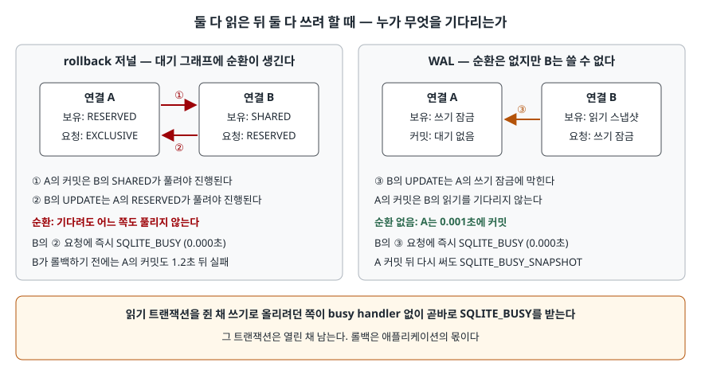

## 들어가며

작은 서비스에서 SQLite 파일 하나를 워커 두 개가 같이 쓰다 보면 가끔 `database is locked`가 찍힌다.
보통은 `busy_timeout`을 1초에서 5초, 10초로 늘린다. 기다릴 시간을 주면 풀릴 것이라고 보는 것이다.
그런데 로그를 보면 이 에러의 일부는 **대기 시간과 무관하게 0초 만에** 난다. 타임아웃을 몇 번 올려도
그 몫은 줄지 않고, 오히려 옆 워커의 커밋이 늘린 시간만큼 매달렸다가 같이 실패한다.
이 글은 두 연결이 서로를 기다리는 순서를 직접 만들고, SQLite가 그중 누구에게 에러를 돌려주는지와
그 뒤에 무엇이 남는지를 잰다.

## 개념

**데드락(교착 상태)** 은 둘 이상의 트랜잭션이 각자 쥔 잠금을 놓지 않은 채 상대가 쥔 잠금을 기다려,
어느 쪽도 진행할 수 없는 상태다. 누가 누구를 기다리는지를 화살표로 이은 것을 **대기 그래프(wait-for
graph)** 라 하고, 이 그래프에 순환이 생기면 교착이다. 기다려도 풀리지 않으므로 DB는 누군가를
포기시켜야 한다.

서버형 DB는 순환을 **찾아서** 하나를 골라 롤백한다. SQLite는 행 단위 잠금이 없고 파일 전체에 잠금
단계를 둔다. rollback 저널 모드에서 쓰는 단계는 `SHARED`(읽기, 여럿 가능) → `RESERVED`(쓸 예정,
한 연결만) → `PENDING` → `EXCLUSIVE`(파일에 쓰기, 다른 잠금과 공존 불가)다. `RESERVED`는 `SHARED`와
함께 있을 수 있지만, 커밋에 필요한 `EXCLUSIVE`는 다른 모든 `SHARED`가 풀려야 얻는다.

## 구조



> **출처**: 잠금 단계와 공존 규칙은 [SQLite — File Locking And Concurrency: Locking](https://www.sqlite.org/lockingv3.html#locking), 교착으로 판단하면 busy handler를 부르지 않는다는 규정은 [SQLite C Interface — sqlite3_busy_handler](https://www.sqlite.org/c3ref/busy_handler.html), WAL의 스냅샷 에러는 [SQLite Result Codes — SQLITE_BUSY_SNAPSHOT](https://www.sqlite.org/rescode.html#busy_snapshot)을 따랐다. 도식의 시간 값은 실습 2-A와 4의 실행 기록이다.

## 동작 원리

두 연결 A, B가 각자 `BEGIN` 뒤 `SELECT`를 하면 둘 다 `SHARED`를 쥔다. 이어서 A가 `UPDATE`를 하면
`RESERVED`를 얻는다. `SHARED`와 공존하므로 바로 된다. 이제 B가 `UPDATE`를 하면 `RESERVED`가 필요한데
A가 쥐고 있다. B는 A를 기다리고, A는 커밋하려면 B의 `SHARED`가 풀려야 하니 B를 기다린다. 순환이다.

SQLite는 여기서 그래프를 탐색하지 않는다. busy handler 문서가 이 장면을 그대로 들고, **읽기 잠금을
쥔 채 올리려는 쪽**에게 busy handler를 부르지 않고 곧바로 `SQLITE_BUSY`를 돌려준다고 적는다. 그 에러를
받은 쪽이 읽기 잠금을 놓아 주기를 기대한다는 것이다. 트랜잭션 문서도 같은 규칙을 다른 말로 적는다.
다른 연결이 이미 쓰는 중이면 읽기 트랜잭션은 쓰기로 올라갈 수 없고, 그 쓰기 문장은 `SQLITE_BUSY`로 실패한다.

두 가지를 짚어 둔다. 첫째, 이 판단에는 트랜잭션의 나이나 잠금 개수가 들어가지 않는다. **나중에 올리려던
쪽**이 에러를 받는다. 둘째, 문서는 에러를 돌려준다고만 할 뿐 **롤백한다고 적지 않는다.** 실습이 이 두 점을 확인한다.

## 실습 예제

같은 DB 파일에 연결 두 개를 열고, 둘 다 `busy_timeout`을 1초로 뒀다. **시간** 칸이 약 1초면 기다리다
포기한 것이고 0초면 기다리지 않은 것이다. 전체 소스: [`code/deadlock_victim.py`](code/deadlock_victim.py),
실행 기록: [`code/output.txt`](code/output.txt)

표는 `account(account_id, owner, balance)`에 A·B 두 행, 잔액 100씩이다.

### 1. 교착이 없는 경합 — 기다린다

```text
  A  BEGIN IMMEDIATE                                                 성공                     0.000s  트랜잭션 열림
  A  UPDATE account SET balance = balance - 10 WHERE account_id = 1  성공                     0.001s  트랜잭션 열림
  B  BEGIN IMMEDIATE                                                 SQLITE_BUSY            1.202s  트랜잭션 없음
```

B는 아무것도 쥐지 않은 채 쓰기를 요청했다. 기다리면 풀릴 수 있는 경합이라 busy handler가 불렸고,
1초 설정에 1.2초를 기다린 뒤 포기했다.

### 2. 교착 — 기다리지 않는다

```text
[2-A] 교착 — 둘 다 읽은 뒤 A 가 먼저 쓴다 (rollback 저널)
  A  UPDATE account SET balance = 90 WHERE account_id = 1            성공                     0.000s  트랜잭션 열림
  B  UPDATE account SET balance = 90 WHERE account_id = 2            SQLITE_BUSY            0.000s  트랜잭션 열림
  A  COMMIT                                                          SQLITE_BUSY            1.184s  트랜잭션 열림
  B  ROLLBACK                                                        성공                     0.000s  트랜잭션 없음
  A  COMMIT                                                          성공                     0.005s  트랜잭션 없음
```

B의 `UPDATE`는 0.000초에 실패했다. 타임아웃을 몇 초로 두든 이 줄은 바뀌지 않는다.
예상과 달랐던 것은 그다음이다. **B의 트랜잭션은 열린 채 남았고**, 그래서 B가 쥔 `SHARED`도 그대로다.
살아남은 A의 `COMMIT`이 1.2초를 기다리다 `SQLITE_BUSY`로 실패했다. B가 `ROLLBACK`한 뒤에야 A의 커밋이
5밀리초에 끝났다. SQLite는 누구도 롤백하지 않았다. 에러를 받은 쪽을 롤백하는 것은 애플리케이션이다.

쓰는 순서를 바꾼 2-B에서는 결과가 정확히 뒤집혔다. A가 0.000초에 에러를 받고, B의 커밋이 1.19초 뒤 실패했다.
누가 에러를 받는지는 **누가 두 번째로 쓰려 했는가**로만 정해진다.

### 3. `BEGIN IMMEDIATE` — 순환이 생기지 않는다

```text
  B  BEGIN IMMEDIATE                                                 성공                     0.335s  트랜잭션 열림
  B  UPDATE account SET balance = 90 WHERE account_id = 2            성공                     0.003s  트랜잭션 열림
```

둘 다 시작할 때 쓰기 잠금을 요청하면 `SHARED`를 쥔 채 올리는 단계가 없다. A가 0.3초 뒤 커밋하자 B는 0.335초를
기다린 뒤 이어서 진행했다. 1번과 같은 "기다리면 풀리는 경합"이 된 것이다.

### 4. WAL — 순환은 없지만 결과는 같다

```text
  A  UPDATE account SET balance = 90 WHERE account_id = 1            성공                     0.000s  트랜잭션 열림
  B  UPDATE account SET balance = 90 WHERE account_id = 2            SQLITE_BUSY            0.000s  트랜잭션 열림
  A  COMMIT                                                          성공                     0.001s  트랜잭션 없음
  B  UPDATE account SET balance = 90 WHERE account_id = 2            SQLITE_BUSY_SNAPSHOT   0.000s  트랜잭션 열림
```

WAL에서는 쓰는 쪽이 읽는 쪽을 기다리지 않으므로 A의 커밋은 B와 무관하게 끝났다. 대기 그래프에 순환이 없다.
그래도 B의 `UPDATE`는 0초에 실패했고, A가 커밋한 뒤 같은 문장을 다시 보내자 이번에는 `SQLITE_BUSY_SNAPSHOT`이었다.
B가 읽은 스냅샷이 이미 낡았으므로 **그 트랜잭션 안에서 몇 번을 다시 시도해도 쓸 수 없다.**

## 다른 환경에서는

아래 두 열은 매뉴얼만 옮겼다. 실행 검증 없음.

| 항목 | SQLite 3.49.1 (이 글) | PostgreSQL 16 | MySQL 8.0 InnoDB |
|---|---|---|---|
| 교착을 아는 방법 | 올리려는 순간 규칙으로 판단 | 잠금을 `deadlock_timeout`(기본 1초)만큼 기다린 뒤 검사 | 교착 검출(끄면 `innodb_lock_wait_timeout`에 맡김) |
| 누구를 고르는가 | 읽기를 쥔 채 나중에 올리려던 쪽 | 매뉴얼은 어느 쪽인지 예측하기 어렵고 기대면 안 된다고 적는다 | 삽입·수정·삭제한 행 수가 적은 트랜잭션을 고르려 한다 |
| 고른 쪽의 트랜잭션 | 열린 채 남음 (위 실측) | 중단된다 | 롤백된다 |

설계가 다르다. 서버형 DB는 행 잠금이 많아 순환을 찾아야 하고, SQLite는 잠금이 파일 하나라 규칙 하나로 판단한다.
대신 뒷정리를 애플리케이션에 맡긴다.

## 실무에서 주의할 점

- **`database is locked`의 시간을 먼저 본다.** 타임아웃만큼 걸렸으면 경합이고 0초면 교착이다. 교착 몫은
  타임아웃을 늘려도 그대로이고, 늘린 만큼 살아남은 쪽의 커밋만 길게 매달린다.
- **에러를 받으면 문장이 아니라 트랜잭션을 다시 시작한다.** 2번에서 B의 트랜잭션은 열린 채 남았고, WAL에서는
  같은 문장을 다시 보내도 `SQLITE_BUSY_SNAPSHOT`이었다. `ROLLBACK` 뒤 `BEGIN`부터 다시 한다.
- **읽고 나서 쓸 트랜잭션은 `BEGIN IMMEDIATE`로 연다.** 결과 코드 문서는 이것이 성공하면 커밋까지 `SQLITE_BUSY`가
  나지 않는다고 적는다. 3번에서 B는 0.335초 기다린 뒤 끝까지 갔다. 대신 읽기만 하는 동안에도 쓰기 잠금을 쥐므로
  쓰는 쪽끼리는 줄을 선다.
- **파이썬 `sqlite3`의 기본 트랜잭션 처리를 확인한다.** 이 예제는 `isolation_level=None`으로 모듈이 `BEGIN`을
  끼워 넣지 않게 했다. 기본 설정에서는 모듈이 쓰기 문장 앞에 `BEGIN`을 넣으므로 트랜잭션 경계가 코드와 다를 수 있다.

## 정리

- 교착은 대기 그래프의 순환이다. SQLite에서는 둘 다 `SHARED`를 쥔 뒤 둘 다 쓰려 할 때 생긴다.
- SQLite는 순환을 탐색하지 않고, 읽기를 쥔 채 나중에 쓰려던 쪽에 busy handler 없이 0초 만에 `SQLITE_BUSY`를 준다.
- 에러를 받은 트랜잭션은 열린 채 남는다. 롤백하지 않으면 살아남은 쪽의 커밋도 대기 시간을 다 쓰고 실패한다.
- WAL에서는 순환이 없어도 나중에 쓰려던 쪽은 쓸 수 없다. `BEGIN IMMEDIATE`로 열면 이 경로가 생기지 않는다.

## 참고 자료

- [SQLite — File Locking And Concurrency In SQLite Version 3: Locking](https://www.sqlite.org/lockingv3.html#locking) — `SHARED`·`RESERVED`·`PENDING`·`EXCLUSIVE`의 정의와 공존 규칙
- [SQLite C Interface — sqlite3_busy_handler](https://www.sqlite.org/c3ref/busy_handler.html) — 교착으로 판단하면 busy handler를 부르지 않는다는 규정과 예시
- [SQLite — Transaction: Read transactions versus write transactions](https://www.sqlite.org/lang_transaction.html#read_transactions_versus_write_transactions), [DEFERRED, IMMEDIATE, and EXCLUSIVE transactions](https://www.sqlite.org/lang_transaction.html#deferred_immediate_and_exclusive_transactions)
- [SQLite Result Codes — SQLITE_BUSY](https://www.sqlite.org/rescode.html#busy), [SQLITE_BUSY_SNAPSHOT](https://www.sqlite.org/rescode.html#busy_snapshot)
- [PostgreSQL 16 — Explicit Locking: Deadlocks](https://www.postgresql.org/docs/16/explicit-locking.html#LOCKING-DEADLOCKS), [deadlock_timeout](https://www.postgresql.org/docs/16/runtime-config-locks.html#GUC-DEADLOCK-TIMEOUT)
- [MySQL 8.0 Reference Manual — Deadlock Detection](https://dev.mysql.com/doc/refman/8.0/en/innodb-deadlock-detection.html)
- [Python 3.13 — sqlite3: Transaction control via the isolation_level attribute](https://docs.python.org/3.13/library/sqlite3.html#sqlite3-transaction-control-isolation-level)
