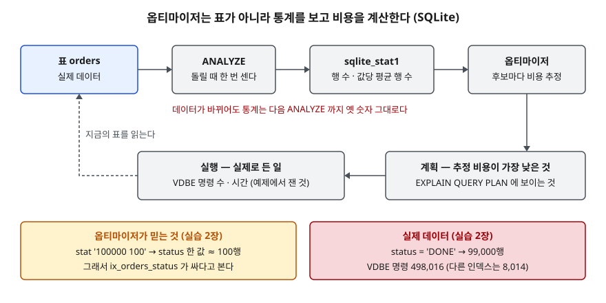

## 들어가며

어제까지 0.2ms에 끝나던 주문 조회가 배치 작업 한 번 뒤로 수 ms로 늘었다. 쿼리도 인덱스도 바뀌지 않았고, 실행계획을
찍어 보면 여전히 인덱스를 탄다. 이때 흔히 하는 일은 계획의 비용 숫자를 보며 "비용이 낮으니 계획은 괜찮다"고 판단한 뒤
하드웨어나 잠금 쪽을 뒤지는 것이다. 그런데 그 비용은 옵티마이저가 **통계를 보고 계산한 추정치**라서, 통계가 옛 데이터를
가리키고 있으면 비용이 낮게 나오는 계획이 실제로는 수십 배 일을 할 수 있다. 계획이 "인덱스를 탄다"는 사실만으로는
그 인덱스가 몇 행을 읽는지 알 수 없다.

## 개념

실행계획의 **비용(cost)** 은 옵티마이저가 후보 계획마다 매기는 **예상 작업량**이다. 옵티마이저는 비용이 가장 낮은 후보를
고른다. 비용을 계산하는 재료는 표를 실제로 읽은 결과가 아니라 **미리 모아 둔 통계**다.

| 엔진 | 통계를 모으는 방법 | 통계가 스스로 갱신되는가 | 비용을 보여 주는가 |
|---|---|---|---|
| SQLite 3.49.1 | `ANALYZE` → `sqlite_stat1` | 아니다. 다시 `ANALYZE`해야 한다 | 아니다 (`EXPLAIN QUERY PLAN`에 비용 칸이 없다) |
| PostgreSQL 16 | `ANALYZE` | autovacuum 이 켜져 있으면 변경량에 따라 자동으로 돈다 | 보여 준다 (`cost=시작..전체`) |

SQLite 문서는 통계가 **데이터가 바뀌어도 갱신되지 않는다**고 적는다. 비용의 단위도 엔진마다 다르다.
SQLite의 차세대 쿼리 플래너 문서는 비용을 **로그 값**으로 다루며, 질의 시작 때 한 번 드는 준비 비용과
반복마다 드는 비용처럼 여러 숫자로 이뤄진다고 설명한다. PostgreSQL 문서는 비용이 **플래너 비용 파라미터가 정하는 임의 단위**이고
관례상 디스크 페이지 한 번 읽기를 1.0으로 둔다고 적는다. 어느 쪽이든 밀리초가 아니다.

## 구조



> **출처**: 통계가 자동 갱신되지 않고 `ANALYZE sqlite_schema`로 다시 읽힌다는 것은 [SQLite — ANALYZE](https://www.sqlite.org/lang_analyze.html),
> `stat` 칸의 숫자 뜻은 [SQLite Database File Format — The SQLITE_STAT1 table](https://www.sqlite.org/fileformat2.html#the_sqlite_stat1_table),
> 옵티마이저가 통계로 비용을 매겨 계획을 고른다는 것은 [The SQLite Query Optimizer Overview — Choosing Between Multiple Indexes](https://www.sqlite.org/optoverview.html#choosing_between_multiple_indexes)를 따랐다.
> 아래 두 상자의 숫자는 실습 2장의 실행 기록이다.

## 동작 원리

`sqlite_stat1`의 `stat` 칸은 공백으로 나뉜 정수 목록이다. 파일 포맷 문서에 따르면 첫 정수는 인덱스의 행 수,
N번째 정수는 **앞 N-1개 컬럼 값이 같은 행이 평균 몇 개인가**다. `'100000 100'`은 "10만 행이고 `status` 한 값당 평균 100행"이라는 뜻이다.

옵티마이저는 `WHERE status = ? AND customer_id = 42`를 받으면 두 인덱스를 비교한다.

1. `ix_orders_status`: 한 값당 100행을 읽고 표에서 행을 가져와 `customer_id`를 거른다
2. `ix_orders_customer_id`: 한 값당 1,000행을 읽고 `status`를 거른다

통계대로라면 1번이 열 배 싸다. 이 판단에 **어떤 값을 찾는지(`'DONE'`인지 `'S041'`인지)는 들어가지 않는다.** `stat1`에는
평균만 있기 때문이다. 값별 분포(히스토그램)는 `SQLITE_ENABLE_STAT4`로 컴파일한 SQLite만 `sqlite_stat4`에 모은다.

## 실습 예제

전체 소스: [`code/stale_statistics.py`](code/stale_statistics.py), 실행 기록: [`code/output.txt`](code/output.txt).
주문 표 `orders` 10만 행에 `status`(서로 다른 값 1,000개, 값당 100행)와 `customer_id`(100명, 한 명당 1,000행) 인덱스를 둔다.
SQLite는 비용을 찍지 않으므로 **실제 든 일**을 따로 잰다. `set_progress_handler`를 VDBE(SQLite의 가상 머신) 명령 1개마다
불리게 걸어 질의 하나가 실행한 명령 수를 센다. 같은 데이터·같은 계획이면 매번 같은 값이 나온다.

| 단계 | 통계 `status` | 찾는 값 | 옵티마이저가 고른 인덱스 | VDBE 명령 | 고르지 않은 인덱스 | VDBE 명령 |
|---|---|---|---|---:|---|---:|
| 1. `ANALYZE` 직후 | `100000 100` | `S041` | `status` | 820 | `customer_id` | 5,317 |
| 2. 99%를 `DONE`으로 | `100000 100` (낡음) | `DONE` | `status` | **498,016** | `customer_id` | 8,014 |
| 3. 다시 `ANALYZE` | `100000 9091` | `DONE` | `customer_id` | 8,018 | — | — |
| 3. 같은 통계 | `100000 9091` | `S100` | `customer_id` | **5,014** | `status` | 519 |
| 4. 통계 조작 | `100000 9091` | `DONE` | `status` | 498,019 | — | — |

인덱스 칸은 `EXPLAIN QUERY PLAN`의 `detail` 원문(`SEARCH orders USING INDEX ix_orders_status (status=?)` 등)을 줄여 적었다.
"고르지 않은 인덱스"는 `INDEXED BY`로 고정해 잰 값이다.

### 낡은 통계 — 계획은 그대로, 일은 607배

```text
-- 2-a 낡은 통계로 고른 계획  (status = 'DONE')
   QUERY PLAN
   `--SEARCH orders USING INDEX ix_orders_status (status=?)
   결과 (건수, 합계) = (1000, 249718)
   VDBE 명령 수 = 498,016
   시간 중앙값 = 4.25 ms
```

`UPDATE`로 주문 99%를 `'DONE'`으로 바꿨지만 `sqlite_stat1`은 여전히 `'100000 100'`이다. 옵티마이저는 `'DONE'`도 100행이라
믿고 1장과 **똑같은 계획**을 골랐다. 실제로는 9만 9천 행을 읽었다. 같은 질의를 `customer_id` 인덱스로 고정하면 8,014로,
옵티마이저의 선택이 **62배** 더 일했다. 1장과 비교하면 계획 모양은 한 글자도 다르지 않은데 명령 수는 820에서 498,016으로
**607배**가 됐다. 계획만 봐서는 이 차이가 보이지 않는다.

### 다시 모아도 평균은 평균이다

`ANALYZE`를 다시 돌리자 `status`의 두 번째 숫자가 9091이 됐다. 남은 값이 11개(`DONE` + `S000`·`S100`…`S900`)이므로
100,000 ÷ 11 = 9,090.9를 올린 값과 같다. 이제 옵티마이저는 `status` 한 값당 9천 행으로 보고 `customer_id` 인덱스를 골라
`'DONE'` 조회가 8,018로 내려왔다.

**예상과 달랐던 것은 3-b다.** 같은 통계에서 `'S100'`(실제 100행)을 찾자 옵티마이저는 역시 `customer_id` 인덱스를 골라 5,014를 썼다.
`status` 인덱스로 고정하면 519다. `'DONE'` 한 값이 평균을 끌어올려 드문 값까지 비싸 보이게 만든 것이다. 이 파이썬에 딸린
SQLite의 `PRAGMA compile_options`에는 `STAT4`가 없었다. 값별 분포를 볼 수단이 없으니 `stat1`만으로는 두 값을 동시에 맞힐 수 없다.

### 통계만 바꿔도 계획이 바뀐다

4장은 데이터를 건드리지 않고 `ix_orders_customer_id`의 통계만 `'100000 100000'`(값당 10만 행)으로 고친 뒤
`ANALYZE sqlite_schema`로 다시 읽혔다. 옵티마이저는 곧바로 `status` 인덱스로 돌아가 498,019를 썼다.
비용이 표가 아니라 이 숫자에서 계산된다는 것을 가장 짧게 보여 주는 실험이다.
ANALYZE 문서는 통계 표를 손으로 고칠 수는 있지만 `ANALYZE` 말고 다른 방법으로 바꾸지 말라고 권한다.

## 다른 환경에서는

<!-- related:start -->
> **같은 기능을 다른 환경에서 다룬 글** (`explain-plan`)
> - [EXPLAIN QUERY PLAN 읽는 법 — SCAN, SEARCH, USE TEMP B-TREE](../sql-basics/2026-10-08-explain-query-plan-reading/index.md) — SQLite 3.49.1, Python 3.13.5, Windows 11
> - [Tibero 7 실행계획 보기 — EXPLAIN PLAN과 DBMS_XPLAN](../tibero/2026-09-30-tibero7-explain-plan-dbms-xplan/index.md) — Tibero 7
<!-- related:end -->

| 항목 | SQLite 3.49.1 (이 글, 실측) | PostgreSQL 16 (매뉴얼, 미검증) | Tibero 7.2.6 (매뉴얼, 미검증) |
|---|---|---|---|
| 계획에 비용이 나오는가 | 나오지 않는다 | `cost=시작..전체`, `rows`, `width` | `DBMS_XPLAN` 형식 항목 `COST`, 예측 행 수는 `CARDS` |
| 비용의 단위 | 공개된 단위 없음, 내부적으로 로그 값 | 비용 파라미터가 정하는 임의 단위, 관례상 순차 페이지 읽기 = 1.0 | 매뉴얼은 "옵티마이저가 예측한 비용"으로만 적는다 |
| 예측과 실제를 나란히 보는 법 | 없음 — 이 글처럼 따로 잰다 | `EXPLAIN ANALYZE`가 실제 행 수·시간을 함께 찍는다 | `GATHER_SQL_PLAN_STAT`을 켜고 수행하면 `ROWS`·`ELAPTIME`이 함께 나온다 |
| 통계 자동 갱신 | 없음 | autovacuum 이 변경량에 따라 `ANALYZE` | 이 글에서는 확인하지 않았다 |

세 엔진 모두 **비용은 예측, 실제는 따로**라는 구조는 같다. SQLite는 가벼운 내장 DB로 계획 출력을 최소로 두었고, 서버형 DB는
예측과 실측을 한 화면에 놓는 도구를 따로 갖췄다. 서버형 DB라면 이 글의 VDBE 명령 수 대신 예측 행 수와 실제 행 수를 노드별로 비교하면 된다.

## 실무에서 주의할 점

- **비용 숫자를 시간으로 읽지 않는다.** 단위가 엔진마다 다르고, 같은 엔진에서도 통계가 틀리면 비용도 틀린다.
  비교할 것은 비용이 아니라 **예측 행 수와 실제 행 수의 차이**다. 차이가 크면 먼저 통계를 의심한다.
- **대량 변경 뒤에는 통계를 다시 모은다.** SQLite는 스스로 갱신하지 않는다. 배치 작업 끝에 `ANALYZE`(또는 문서가 권하는
  `PRAGMA optimize`)를 넣지 않으면 2장처럼 계획은 그대로인데 일은 수백 배가 된다.
- **치우친 컬럼은 통계를 새로 모아도 틀린다.** `stat1`은 평균이라 3-b처럼 드문 값에서 거꾸로 오판한다.
  한 값이 대부분인 컬럼은 인덱스 앞자리에 두지 않거나, 그 값을 빼는 부분 인덱스(`WHERE status <> 'DONE'`)를 검토한다.
- **통계를 손으로 고쳐 계획을 고정하지 않는다.** 4장처럼 효과는 즉시 나지만, 다음 `ANALYZE`가 덮어쓰고 데이터가 바뀌면
  틀린 숫자만 남는다. 계획을 고정해야 하면 `INDEXED BY`처럼 쿼리에 드러나는 방법을 쓴다.

## 정리

- 실행계획의 비용은 옵티마이저가 통계로 계산한 예상 작업량이다. 표를 읽어서 센 값이 아니고, 단위도 엔진마다 다르다.
- SQLite 3.49.1에서 통계를 낡은 채 두자 계획 모양은 그대로인데 VDBE 명령이 820에서 498,016으로 늘었고, 다른 인덱스보다 62배 더 일했다.
- 통계를 다시 모아도 `stat1`은 값당 평균만 담아, 치우친 컬럼의 드문 값에서는 거꾸로 오판했다.
- 계획을 볼 때는 "무엇을 골랐나"보다 "예측한 행 수가 실제와 맞나"를 본다.

## 참고 자료

- [SQLite — ANALYZE](https://www.sqlite.org/lang_analyze.html) — 통계가 자동 갱신되지 않음, `ANALYZE sqlite_schema`, 통계 표를 손으로 고칠 때의 주의, STAT4
- [SQLite Database File Format — The SQLITE_STAT1 table](https://www.sqlite.org/fileformat2.html#the_sqlite_stat1_table) — `stat` 칸의 정수 목록 뜻
- [The SQLite Query Optimizer Overview — Choosing Between Multiple Indexes](https://www.sqlite.org/optoverview.html#choosing_between_multiple_indexes)
- [The Next-Generation Query Planner](https://www.sqlite.org/queryplanner-ng.html) — 비용이 로그 값이고 여러 숫자로 이뤄진다는 설명
- [SQLite — INDEXED BY](https://www.sqlite.org/lang_indexedby.html)
- [PostgreSQL 16 — Using EXPLAIN: EXPLAIN Basics](https://www.postgresql.org/docs/16/using-explain.html#USING-EXPLAIN-BASICS) — 비용 단위, 시작·전체 비용
- [PostgreSQL 16 — Updating Planner Statistics](https://www.postgresql.org/docs/16/routine-vacuuming.html#VACUUM-FOR-STATISTICS) — autovacuum 의 자동 `ANALYZE`
- [Tibero 7.2.6 tbPSM 참조 안내서 — DBMS_XPLAN](https://docs.tibero.com/tibero-manuals/7.2.6.manuals/tbpsm-reference-guide/dbms_xplan.md) — `CARDS`·`COST`·`ROWS`, `GATHER_SQL_PLAN_STAT`
