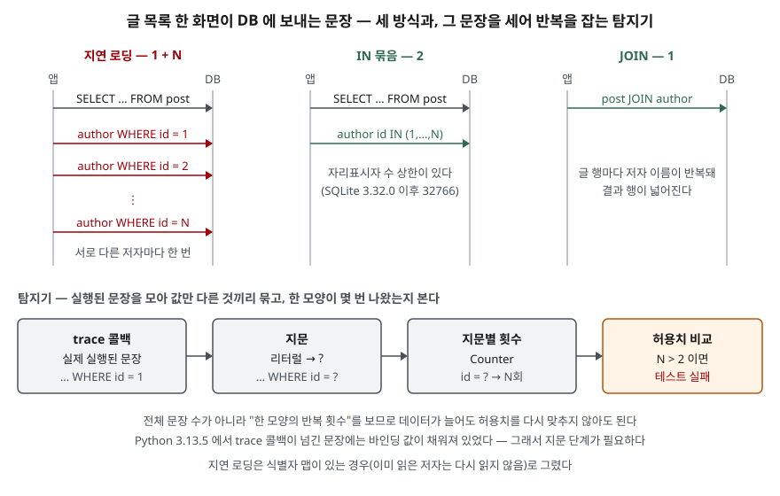

## 들어가며

게시판 목록 화면을 ORM으로 만들면 코드는 `for post in posts: post.author.name` 한 줄이다. 개발 DB에 글이 열 개일 때는 아무 문제가 없다가,
운영 데이터가 쌓이고 나서 목록 화면만 유독 느리다는 말이 나온다. 이때 흔히 하는 일은 느린 쿼리 로그를 뒤지는 것인데, 거기에는 아무것도 없다.
문장 하나하나는 기본 키 조회라 빠르기 때문이다. 이 글의 예제에서 저자가 1,000명이면 화면 하나가 문장 1,001개를 보냈고,
느린 쿼리 로그는 개수를 세지 않으므로 이 문제를 잡지 못한다.

## 개념

**N+1 쿼리**는 목록을 한 번 읽고(1), 목록의 각 항목에 딸린 데이터를 항목마다 따로 읽는(N) 접근 모양이다.
SQLAlchemy 문서는 지연 로딩(`lazyload`) 전략이 이 문제를 낳는다고 직접 적는다. 객체 N개를 읽은 뒤 지연 로딩 속성에 접근하면 SELECT가 N+1번 나간다는 것이다.

반복해서 생기는 이유는 코드에 문장이 보이지 않기 때문이다. `post.author`는 속성 접근처럼 생겼지만 처음 읽을 때 SELECT를 보낸다.
리뷰에서 보이지 않고, 데이터가 적은 개발 환경에서는 느리지도 않다. 그래서 사람이 찾는 대신 **문장 수를 세는 테스트**로 막는다.

## 구조



> **출처**: 지연 로딩이 N+1을 만든다는 것과 식별자 맵 동작은 [SQLAlchemy 2.0 — Relationship Loading Techniques, Lazy Loading](https://docs.sqlalchemy.org/en/20/orm/queryguide/relationships.html#lazy-loading),
> trace 콜백은 [Python 3.13 — sqlite3 Connection.set_trace_callback](https://docs.python.org/3.13/library/sqlite3.html#sqlite3.Connection.set_trace_callback),
> 자리표시자 상한은 [SQLite — Limits, Maximum Number Of Host Parameters](https://www.sqlite.org/limits.html#max_variable_number)를 따랐다. 문장 모양은 이 글의 예제([`code/output.txt`](code/output.txt))에서 나온 것이다.

## 동작 원리

ORM은 연관 객체를 두 가지 방식으로 채운다. **지연 로딩**은 속성에 처음 접근할 때 그 객체 하나만 읽는다. **즉시 로딩**은 목록을 읽을 때 연관 객체까지 미리 읽는데,
JOIN 한 번으로 읽거나(SQLAlchemy의 `joinedload`) 목록의 키를 모아 `IN (...)` 한 번으로 읽는다(`selectinload`).

지연 로딩이라도 이미 읽은 객체는 다시 읽지 않는다. SQLAlchemy 문서는 기본 키로 식별되는 단순 다대일 관계에서 그 객체가 세션에 이미 있으면 SQL을 보내지 않는다고 적는다.
그래서 글 12편·저자 4명이면 N은 글 수 12가 아니라 서로 다른 저자 수 4다. 이 글의 모델도 같은 **식별자 맵**을 두었다.

탐지는 DB 드라이버가 실제로 실행한 문장을 가로채 세는 방식이다. 파이썬 `sqlite3`는 `set_trace_callback`으로 실행되는 문장을 콜백에 넘긴다.
문서는 이 콜백이 트랜잭션 관리 문장과 트리거가 실행하는 문장까지 받을 수 있다고 적으므로, 셀 때는 그 점을 감안한다.

## 실습 예제

메모리 SQLite에 저자 4명, 저자당 글 3편을 넣었다. 전체 소스: [`code/n_plus_one.py`](code/n_plus_one.py), [`code/test_n_plus_one.py`](code/test_n_plus_one.py), 실행 기록: [`code/output.txt`](code/output.txt)

지연 로딩 모델의 핵심은 속성 하나다.

```python
@property
def author_name(self) -> str:
    cache = self._session.author_names
    if self.author_id not in cache:
        # 지연 로딩 — 화면 코드에는 이 줄이 보이지 않는다
        row = self._session.conn.execute(
            "SELECT name FROM author WHERE id = ?", (self.author_id,)
        ).fetchone()
        cache[self.author_id] = row[0]
    return cache[self.author_id]
```

### 같은 화면, 세 방식

```text
[지연 로딩] 화면 12줄 · 문장 5개
  SELECT id, author_id, title FROM post
  SELECT name FROM author WHERE id = 1
  SELECT name FROM author WHERE id = 2
  SELECT name FROM author WHERE id = 3
  … 1개 더
[JOIN] 화면 12줄 · 문장 1개
  SELECT p.title, a.name FROM post p JOIN author a ON a.id = p.author_id
[IN 묶음] 화면 12줄 · 문장 2개
  SELECT id, author_id, title FROM post
  SELECT id, name FROM author WHERE id IN (1,2,3,4)
```

코드에는 `WHERE id = ?`라고 썼는데 콜백에는 `id = 1`처럼 값이 채워진 문장이 왔다. 문서는 "실행되는 문장"이라고만 적고 값을 채우는지는 말하지 않는다.
Python 3.13.5에서 확인한 동작이다. 값이 채워져 오므로 문장을 그대로 세면 전부 다른 문장으로 보인다.

### 지문으로 묶어 테스트에 건다

리터럴을 `?`로, `IN` 목록을 `(?+)`로 바꿔 **지문**(fingerprint)을 만들고 지문별 횟수를 센다.

```python
@contextmanager
def assert_no_repeated_query(conn: sqlite3.Connection, max_repeat: int = 2):
    with capture_queries(conn) as statements:
        yield statements
    counts = Counter(fingerprint(s) for s in statements)
    shape, repeat = counts.most_common(1)[0] if counts else ("", 0)
    if repeat > max_repeat:
        raise AssertionError(
            f"같은 모양의 문장이 {repeat}번 실행됐다 (허용 {max_repeat}): {shape}"
        )
```

```text
== 2. 지문으로 묶기 ==
    4회  SELECT name FROM author WHERE id = ?
    1회  SELECT id, author_id, title FROM post
== 5. unittest 로 돌리면 ==
  test_lazy_loading ... FAIL
    AssertionError: 같은 모양의 문장이 20번 실행됐다 (허용 2): SELECT name FROM author WHERE id = ?
  test_join ... ok
  test_in_batch ... ok
```

테스트는 "전체 문장이 몇 개 이하"가 아니라 "한 모양이 몇 번 이하"를 본다. 전체 개수 상한은 화면에 기능이 붙을 때마다 다시 맞춰야 하지만,
같은 모양이 반복되는 횟수는 데이터 크기와 무관하게 상수로 둘 수 있다. 테스트 데이터는 저자 20명으로 만들었다. 저자가 한두 명이면 지연 로딩도 허용치 안에 들어간다.

### 저자 수를 늘리면 — 예상과 달랐던 결과

```text
  저자 |      방식 | 문장 수 | VDBE 명령 수 | 경과(ms)
  1000 |     지연 로딩 |    1001 |       24,006 |     3.36
  1000 |      JOIN |       1 |       18,007 |     1.55
  1000 |     IN 묶음 |       2 |       25,017 |     2.15
```

**VDBE 명령 수**는 SQLite 가상 머신이 실행한 명령 수로, `set_progress_handler(콜백, 1)`로 셌다. 실행할 때마다 같은 값이 나온다.
지연 로딩의 명령 수는 IN 묶음보다 오히려 적었다. 기본 키 조회 1,000번과 `IN` 목록 1,000개 조회는 DB 안에서 하는 일이 거의 같다는 뜻이다.
그런데도 경과 시간은 지연 로딩이 가장 길었다. 차이는 DB 안이 아니라 문장마다 드는 준비·실행·결과 전달 비용에서 났다.

이 측정은 같은 프로세스 안의 메모리 DB라 네트워크 왕복이 없다. 원격 DB에서는 문장마다 왕복 시간이 한 번씩 더해지므로, 그 비용은 문장 수에 비례해 커진다.

## 실무에서 주의할 점

- **느린 쿼리 로그로는 못 찾는다.** 문장 하나는 빠르다. 요청 단위로 문장 수를 세거나 같은 지문의 반복을 봐야 드러난다.
  개발 단계에서는 이 글처럼 테스트로 본다.
- **허용치를 데이터 크기에 묶지 않는다.** "문장 50개 이하" 같은 상한은 테스트 데이터가 49개면 N+1을 통과시킨다.
  지문별 반복 횟수를 보고, 테스트 데이터는 허용치보다 넉넉히 크게 만든다.
- **`IN` 묶음은 상한을 확인한다.** SQLite의 자리표시자 수 상한은 3.32.0 이전 999, 이후 32766이다. 다른 DB의 목록 길이·바인드 변수 수 제한은 그 DB 문서에서 따로 확인하고,
  키가 많으면 나눠 보낸다. ORM의 `selectinload`류가 내부에서 나눠 보내는지 해당 ORM 문서를 확인한다.
- **JOIN이 늘 답은 아니다.** 일대다를 JOIN으로 읽으면 부모 컬럼이 자식 행 수만큼 반복돼 결과가 넓어지고, 일대다 두 개를 함께 JOIN하면 행 수가 곱으로 늘어난다.
  다대일은 JOIN, 일대다는 IN 묶음처럼 관계 방향에 따라 고른다.
- **지연 로딩을 막는 설정도 있다.** SQLAlchemy는 지연 로딩 대신 오류를 내는 `raiseload`를 제공한다. 화면처럼 접근 패턴이 정해진 곳에서는
  이것으로 실수를 즉시 드러내고, 테스트의 문장 수 검사는 그 밖의 경로를 덮는 보조 수단으로 둔다.

## 정리

- N+1은 목록 1번 + 항목마다 연관 데이터 N번을 읽는 모양이고, 지연 로딩 속성 접근이 코드에 문장을 숨겨서 반복해서 생긴다.
- 식별자 맵이 있으면 N은 항목 수가 아니라 서로 다른 연관 객체 수다.
- 드라이버의 trace 콜백으로 실행 문장을 모으고, 값을 지운 지문별 반복 횟수로 테스트를 실패시키면 데이터 크기와 무관하게 막을 수 있다.
- 저자 1,000명 기준 DB 안의 일(VDBE 명령 수)은 세 방식이 비슷했고, 차이는 문장 수에서 났다. 원격 DB에서는 왕복 시간이 문장 수만큼 더해진다.

## 참고 자료

- [SQLAlchemy 2.0 — Relationship Loading Techniques](https://docs.sqlalchemy.org/en/20/orm/queryguide/relationships.html) — [Lazy Loading](https://docs.sqlalchemy.org/en/20/orm/queryguide/relationships.html#lazy-loading)(N+1, 다대일 식별자 맵), [Preventing unwanted lazy loads using raiseload](https://docs.sqlalchemy.org/en/20/orm/queryguide/relationships.html#preventing-unwanted-lazy-loads-using-raiseload)
- [Python 3.13 — sqlite3 Connection.set_trace_callback](https://docs.python.org/3.13/library/sqlite3.html#sqlite3.Connection.set_trace_callback) — 실행 문장 콜백, 트랜잭션·트리거 문장 포함
- [Python 3.13 — sqlite3 Connection.set_progress_handler](https://docs.python.org/3.13/library/sqlite3.html#sqlite3.Connection.set_progress_handler) — VDBE 명령 수 세기
- [SQLite — Limits In SQLite, Maximum Number Of Host Parameters](https://www.sqlite.org/limits.html#max_variable_number) — 999 / 32766
