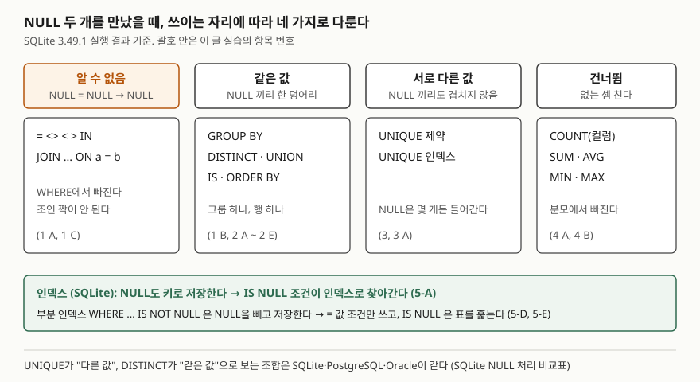

<!-- related:start -->
> **같은 기능을 다른 환경에서 다룬 글** (`null-semantics`)
> - [COALESCE와 NULLIF — NULL을 다루는 두 함수](../sql-basics/2026-09-28-coalesce-nullif-null-handling/index.md) — SQLite 3.49.1, Python 3.13.5, Windows 11
> - [COUNT(*)와 COUNT(컬럼)이 다른 값을 내는 이유](../sql-basics/2026-10-02-count-star-vs-column-null/index.md) — SQLite 3.49.1, Python 3.13.5, Windows 11
> - [NULL 비교 — = NULL이 안 되는 이유](../sql-basics/2026-10-02-null-comparison-three-valued-logic/index.md) — SQLite 3.49.1, Python 3.13.5, Windows 11
<!-- related:end -->

## 들어가며

주문 표의 쿠폰 코드 컬럼을 다루다 보면 같은 NULL이 질의마다 다르게 굴어 헷갈린다. `GROUP BY coupon_code`를
돌리면 쿠폰 없는 주문이 한 줄로 묶여 나오는데, 같은 컬럼으로 자기 조인을 하면 그 주문들끼리는 짝이 안 된다.
UNIQUE를 걸어 두었는데 NULL은 세 줄이나 들어가 있다. 이럴 때 대개는 경우마다 결과를 외워서 대응한다.
그러면 새 문법(UNION, NULLS LAST, 부분 인덱스)을 만날 때마다 또 돌려 봐야 한다. NULL이 쓰이는 자리를 네 종류로
나누면 질의를 보기만 해도 결과를 짐작할 수 있다.

## 개념

NULL은 "값이 없거나 모름"을 나타내는 표시다. 문제는 **NULL 두 개가 같은가**라는 질문에 SQL이 자리마다
다른 답을 쓴다는 것이다.

| 자리 | NULL 두 개를 | 근거 |
|---|---|---|
| `=`·`<>`·`IN`·조인 조건 | 같은지 모른다 (결과가 NULL) | 삼값 논리 |
| `GROUP BY`·`DISTINCT`·`UNION`·`IS`·`ORDER BY` | 같은 값으로 본다 | 중복 제거·정렬 규칙 |
| `UNIQUE` 제약·인덱스 | 서로 다른 값으로 본다 | 중복 검사 규칙 |
| `COUNT(컬럼)`·`SUM`·`AVG`·`MIN`·`MAX` | 아예 세지 않는다 | 집계 함수 정의 |

SQLite 문서는 이 조합을 다른 엔진들과 맞춘 결과라고 설명한다. NULL 처리 비교표에서 SQLite·PostgreSQL·Oracle은
모두 "UNIQUE에서는 서로 다르고, DISTINCT·UNION에서는 같다"로 답한다. 문서는 이 선택을 다소 임의적이라고 평한다.
논리로 끌어낸 규칙이 아니라 엔진들이 맞춰 온 관례라서 외울 수밖에 없는 부분이 있다는 뜻이다.

## 구조



> **출처**: UNIQUE·DISTINCT·UNION 칸은 [SQLite — NULL Handling in SQLite Versus Other Database Engines](https://www.sqlite.org/nulls.html)의 비교표,
> ORDER BY의 NULL 위치는 [SQLite — Datatypes: Sort Order](https://www.sqlite.org/datatype3.html#sort_order),
> `IS` 비교는 [SQLite — SQL Language Expressions: IS DISTINCT FROM](https://www.sqlite.org/lang_expr.html#isdf),
> 부분 인덱스 칸은 [SQLite — Partial Indexes: Queries Using Partial Indexes](https://www.sqlite.org/partialindex.html#queries_using_partial_indexes)를 따랐다.
> 칸 아래 번호의 결과는 이 글의 예제를 실행해 얻은 값이다.

## 동작 원리

네 갈래는 각 연산이 **무엇을 묻는지**에서 나온다.

- **비교**는 "두 값이 같은가"를 묻는다. 모르는 값끼리는 같은지 모르므로 NULL이 나오고, WHERE·조인은 참인 행만 남기므로 빠진다.
- **묶기와 정렬**은 "어느 칸에 넣을까"를 묻는다. 행을 버릴 수 없으니 NULL에도 자리를 하나 준다.
  SQLite 문서는 정렬에서 NULL을 **어떤 값보다도 작은 값**으로 둔다. 그래서 오름차순이면 맨 앞에 온다.
- **UNIQUE**는 "이미 같은 값이 있는가"를 묻는다. SQLite 문서는 UNIQUE에서 NULL을 다른 NULL을 포함한
  모든 값과 **다른 값**으로 본다고 적는다. 겹치는 값이 없으니 막지 않는다.
- **집계**는 값을 더하거나 고른다. NULL은 더할 값이 없으므로 대상에서 뺀다. 모든 값이 NULL이면 `SUM`은 NULL을,
  SQLite 전용 `total()`은 0.0을 돌려준다.

인덱스는 이와 별개의 저장 구조 문제다. SQLite의 B-tree 인덱스는 NULL도 하나의 키로 저장한다. 정렬 규칙상
가장 작은 값이므로 인덱스 맨 앞에 모인다. 그래서 `IS NULL`이 `=` 조건처럼 인덱스로 찾아간다.

## 실습 예제

주문 6건 중 3건이 쿠폰 없이(NULL) 들어갔고, 6번 주문은 금액도 NULL이다.
전체 소스: [`code/null_four_rules.py`](code/null_four_rules.py), 실행 기록: [`code/output.txt`](code/output.txt)

```text
  id | customer_id | coupon_code | amount
  ---+-------------+-------------+-------
   1 |          10 | WELCOME     |  12000
   2 |          11 | NULL        |   8000
   3 |          10 | NULL        |  15000
   4 |          12 | WELCOME     |   9000
   5 |          13 | VIP         |  30000
   6 |          11 | NULL        |   NULL
```

### 같은 세 행이 자리마다 다르게 세어진다

```text
[1-C 자기 자신과 조인해도 NULL 행끼리는 짝이 안 된다]
  ('coupon_code', 'pairs')
  ('VIP', 1)
  ('WELCOME', 4)

[2-A GROUP BY]
  ('coupon_code', 'cnt')
  (None, 3)
  ('VIP', 1)
  ('WELCOME', 2)

[2-D ORDER BY: NULL 은 맨 앞, NULLS LAST 로 뒤로 보낸다]
  ("NULL NULL NULL 'VIP' 'WELCOME' 'WELCOME'",)
[2-E]
  ("'VIP' 'WELCOME' 'WELCOME' NULL NULL NULL",)
```

조인 결과에는 NULL 줄이 아예 없다. `ON a.coupon_code = b.coupon_code`가 NULL 행끼리는 참이 되지 않기 때문이다.
같은 세 행이 GROUP BY에서는 3건짜리 그룹 하나가 된다.

UNIQUE 컬럼에는 `'WELCOME'` 두 번째 줄이 막혔지만 NULL은 세 번 다 들어갔다. 그 표를 `DISTINCT`로 보면 행이 2개(`WELCOME`, NULL)다.
`COUNT(DISTINCT coupon_code)`는 1이다. 집계 함수라 NULL을 빼고 세기 때문이다(3-A). 같은 표에서 "서로 다른 값"을
세는 방법 세 가지가 4·2·1로 갈린다.

### 인덱스: NULL도 키다

NULL 비율 90%, 20만 행 표에 쿠폰 코드 인덱스를 걸고 실행계획을 봤다(난수 시드 고정).

```text
[5-A 일반 인덱스 · IS NULL]
  QUERY PLAN
  `--SEARCH orders USING COVERING INDEX ix_coupon (coupon_code=?)

[5-E 부분 인덱스 · IS NULL]
  QUERY PLAN
  `--SCAN orders

[5-G 부분 인덱스를 강제하면]
  SELECT id FROM orders INDEXED BY ix_coupon WHERE coupon_code IS NULL
  -> OperationalError: no query solution
```

일반 인덱스에서는 `IS NULL`이 `(coupon_code=?)` 꼴로 인덱스를 탄다. NULL을 키 하나로 찾는다는 뜻이다.
`WHERE coupon_code IS NOT NULL`로 만든 부분 인덱스에는 NULL이 없으므로 `IS NULL`은 표 전체를 훑는다. 강제로 쓰게 하면 에러가 난다.
`= 'C0042'`는 부분 인덱스를 썼다(5-D). SQLite 문서는 `=`·`<`·`IN`·`LIKE` 같은 비교 조건이 `IS NOT NULL`을
함축한다고 보고 부분 인덱스를 쓴다고 적는다.

### 예상과 달랐던 결과 — 인덱스 크기의 차이

```text
[5-F 파일 크기 — VACUUM 뒤 page_count, 페이지 4096바이트]
  인덱스 없음                     466 페이지   인덱스 몫    0 페이지 (0 KiB)
  일반 인덱스                     925 페이지   인덱스 몫  459 페이지 (1,836 KiB)
  부분 인덱스 (IS NOT NULL)       535 페이지   인덱스 몫   69 페이지 (276 KiB)
```

인덱스 하나가 표 본체(466페이지)와 맞먹는 459페이지를 썼다. 항목의 90%가 NULL이니 크기도 10분의 1이 될 거라 예상했는데,
부분 인덱스는 69페이지로 약 6.7분의 1이었다. SQLite 파일 형식의 레코드 형식 정의에 따르면 NULL 항목은 키 값의 본문 바이트 없이 형식 번호와 행 번호만 들어가 항목 하나가 짧고,
NULL이 아닌 항목은 `C0042` 같은 문자열을 함께 저장해 더 길기 때문이다. 그래도 쿠폰을 쓴 주문만 찾는 질의라면
인덱스 몫의 85%가 한 번도 읽히지 않는 NULL 항목이다.

## 다른 환경에서는

같은 키(`null-semantics`)의 다른 글은 모두 SQLite 3.49.1 기준이다. 아래 Oracle·PostgreSQL 칸은 공식 문서 근거이고 **실행 검증 없음**이다.

| 항목 | SQLite 3.49.1 | PostgreSQL 16 | Oracle 19c |
|---|---|---|---|
| UNIQUE 컬럼의 NULL 여러 개 | 허용 (실행 확인) | 기본 허용. `NULLS NOT DISTINCT`로 막을 수 있다 | 허용 (SQLite 비교표) |
| DISTINCT·UNION의 NULL | 하나로 묶는다 (실행 확인) | 하나로 묶는다 (SQLite 비교표) | 하나로 묶는다 (SQLite 비교표) |
| 오름차순에서 NULL 위치 | 맨 앞 (실행 확인) | 맨 뒤 (`NULLS LAST`가 기본) | 문서 확인 안 함 |
| B-tree 인덱스에 NULL 키 저장 | 저장한다, `IS NULL`이 인덱스 사용 (실행 확인) | `IS NULL`·`IS NOT NULL`에 B-tree 사용 가능 | 키 컬럼이 **전부 NULL인 행은 저장하지 않는다** |

Oracle 칸이 가장 크게 갈린다. 단일 컬럼 B-tree 인덱스에는 NULL 행이 없으므로, SQLite에서 `IS NULL`이 인덱스를 타던
질의가 Oracle에서는 같은 인덱스로 답할 수 없다. 대신 NULL이 대부분인 컬럼에서는 SQLite의 부분 인덱스와 비슷하게
인덱스가 작다. 어느 쪽이 낫다기보다, `IS NULL` 검색과 인덱스 크기 중 무엇을 기본으로 택했는지가 다르다.

## 실무에서 주의할 점

- **"고유한 값의 개수"를 셀 때 NULL을 어느 쪽에 넣을지 정한다.** 같은 표에서 UNIQUE·`DISTINCT`·`COUNT(DISTINCT)`가 NULL을
  각각 여러 개·하나·0개로 센다(3-A). 대시보드 숫자가 화면마다 다르면 여기부터 의심한다.
- **NULL이 많은 컬럼은 부분 인덱스를 검토한다.** 그 컬럼으로 `IS NULL`을 찾는 질의가 없다면 인덱스의 대부분이 읽히지 않는다.
  반대로 `IS NULL`을 찾는 질의가 있으면 부분 인덱스로는 그 질의가 표를 훑게 된다(5-E).
- **정렬 기본값에 기대지 않는다.** 오름차순에서 NULL이 SQLite는 앞, PostgreSQL은 뒤다. 페이지 경계가 이 위치로
  정해지는 목록이면 `NULLS FIRST`·`NULLS LAST`를 직접 적는다. SQLite는 3.30.0부터 이 문법을 받는다.
  정렬 위치만 따로 다룬 글은 [ORDER BY — 다중 정렬과 NULL이 놓이는 자리](../sql-basics/2026-09-21-order-by-null-placement/index.md)다.
- **엔진을 옮길 때 `IS NULL` 질의의 실행계획을 다시 본다.** 같은 인덱스 정의라도 Oracle에서는 NULL 행이 인덱스에 없다.

## 정리

- NULL 두 개는 비교에서는 "모름", 묶기·정렬에서는 "같음", UNIQUE에서는 "다름", 집계에서는 "없음"이다.
- 각 연산이 묻는 질문(같은가 / 어디에 넣을까 / 이미 있는가 / 더할 값인가)에서 갈래가 나온다.
- SQLite 인덱스는 NULL을 키로 저장해 `IS NULL`을 인덱스로 찾고, 부분 인덱스는 NULL을 빼서 작아진다.
- NULL 90% 컬럼에서 일반 인덱스는 459페이지, `IS NOT NULL` 부분 인덱스는 69페이지였다.

## 참고 자료

- [SQLite — NULL Handling in SQLite Versus Other Database Engines](https://www.sqlite.org/nulls.html) — 엔진별 UNIQUE·DISTINCT·UNION 비교표
- [SQLite — Datatypes: Sort Order](https://www.sqlite.org/datatype3.html#sort_order) — NULL은 어떤 값보다도 작다
- [SQLite — SQL Language Expressions: IS DISTINCT FROM](https://www.sqlite.org/lang_expr.html#isdf)
- [SQLite — SELECT: The ORDER BY clause](https://www.sqlite.org/lang_select.html#the_order_by_clause) — `NULLS FIRST`·`NULLS LAST`
- [SQLite — Built-in Aggregate Functions](https://www.sqlite.org/lang_aggfunc.html) — `sum()`과 `total()`의 차이
- [SQLite — CREATE TABLE: UNIQUE constraints](https://www.sqlite.org/lang_createtable.html#unique_constraints) — NULL을 다른 모든 값과 다른 값으로 보는 규칙
- [SQLite Database File Format: Record Format](https://www.sqlite.org/fileformat2.html#record_format) — NULL은 본문 바이트 없이 헤더의 형식 번호 0으로만 저장된다
- [SQLite — Partial Indexes: Queries Using Partial Indexes](https://www.sqlite.org/partialindex.html#queries_using_partial_indexes)
- [SQLite Release 3.30.0](https://www.sqlite.org/releaselog/3_30_0.html) — `NULLS FIRST`·`NULLS LAST` 추가
- [PostgreSQL 16 — CREATE INDEX](https://www.postgresql.org/docs/16/sql-createindex.html) — `NULLS NOT DISTINCT`, `NULLS FIRST`·`NULLS LAST` 기본값
- [PostgreSQL 16 — Index Types: B-Tree](https://www.postgresql.org/docs/16/indexes-types.html#INDEXES-TYPES-BTREE) — `IS NULL`·`IS NOT NULL`에 B-tree 사용
- [Oracle Database 19c Concepts — Indexes and Index-Organized Tables](https://docs.oracle.com/en/database/oracle/oracle-database/19/cncpt/indexes-and-index-organized-tables.html) — 키 컬럼이 모두 NULL인 행은 B-tree에 저장하지 않는다
