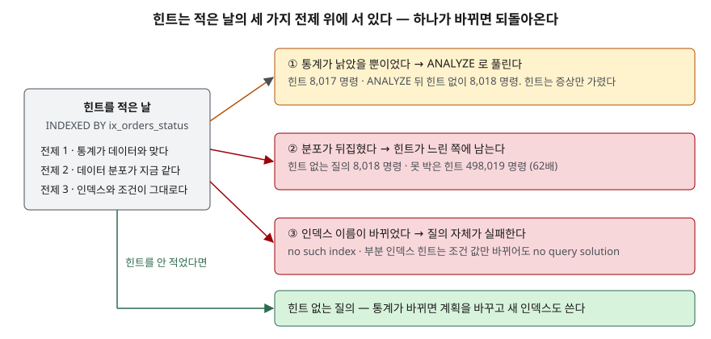

<!-- related:start -->
> **같은 기능을 다른 환경에서 다룬 글** (`optimizer-hint`)
> - [Tibero 7 옵티마이저 힌트 — 문법과 적용 확인](../tibero/2026-09-29-tibero7-optimizer-hints/index.md) — Tibero 7
<!-- related:end -->

## 들어가며

야간 배치가 느려졌다는 알림을 받고 실행계획을 보니 옵티마이저가 엉뚱한 인덱스를 잡고 있다. 급한 대로 힌트를 붙여
원하는 인덱스를 고정하자 4초짜리 질의가 0.2초가 됐다. 배포하고 잊는다. 반년 뒤 같은 질의가 다시 느리다는 알림이
오는데 이번엔 계획이 **힌트가 시킨 대로** 나와 있어서 어디를 봐야 할지 모른다. 또는 DBA가 인덱스를 재구성하며 이름을
바꾼 날 아침, 그 질의가 아예 에러로 멈춘다. 힌트는 "지금 이 순간의 옵티마이저 판단을 내 판단으로 덮는 것"이다.
덮는 순간 옵티마이저가 보던 세 가지, 통계·데이터·스키마에 대한 책임이 글쓴이에게 넘어온다. 그 세 가지를 힌트를 쓰기
**전에** 확인하는 글이다.

## 개념

힌트는 옵티마이저에게 특정 실행 방향을 지시하는 문법이다. 제품마다 모양이 다르다.

| 제품 | 모양 | 틀린 힌트의 처리 |
|---|---|---|
| Tibero 7 · Oracle | `SELECT /*+ INDEX(e ix_emp_dept) */ ...` | 주석으로 취급, **오류 없음** (Tibero 7.2.6 매뉴얼) |
| SQLite | `FROM orders INDEXED BY ix_orders_status` | 쓸 수 없으면 **준비 단계에서 실패** |
| SQLite | `WHERE +status = ?` (단항 `+`) | 그 조건을 인덱스 후보에서 뺀다 |
| SQLite | `likelihood(조건, 0.1)` | 조건이 참일 확률만 알려준다 |

SQLite 문서는 `INDEXED BY`를 **성능 조정 수단이 아니라** 스키마 변경으로 계획이 바뀌는 것을 **회귀 테스트에서 잡아내는
장치**라고 적고, 설계·구현·튜닝 단계에서는 쓰지 말라고 권한다. 조인 순서는 `CROSS JOIN`으로 고정할 수 있지만 문서는
"최선의 방침은 `PRAGMA optimize`로 최신 통계를 주는 것"이라고 적는다. 이 글은 `INDEXED BY`를 주로 쓴다. 힌트가
되돌아오는 길을 가장 분명하게 보여 주기 때문이다.

## 구조



> **출처**: ③의 동작은 [SQLite — The INDEXED BY Clause](https://www.sqlite.org/lang_indexedby.html)("지정한 인덱스를 쓸 수 없으면 질의가 오류로 실패한다",
> "스키마 변경으로 계획이 바뀌는 것을 잡아내는 용도")를 따랐다. ①·②의 명령 수와 "힌트 없는 질의" 칸의 동작은 이 글의 예제를 실행해 얻은 값이다.
> 세 전제로 나눈 것은 글쓴이의 분류다.

## 동작 원리

옵티마이저는 **통계**(`sqlite_stat1`의 행 수와 키당 평균 행 수)로 각 인덱스를 썼을 때 읽을 행 수를 추정하고 가장 적은
쪽을 고른다. 통계가 틀리면 추정이 틀리고, 데이터가 바뀌어도 통계를 다시 모으면 추정이 따라온다. 스키마가 바뀌면 바뀐
스키마로 다시 고른다. 즉 옵티마이저의 선택은 **세 입력에 대한 함수**다.

힌트는 이 함수를 끄고 상수를 넣는 것이다. 상수는 적은 날의 세 입력에서 나온 값이므로, 입력이 하나라도 바뀌면 상수는
그 날의 답일 뿐 오늘의 답이 아니다. 세 입력 중 무엇이 바뀌었느냐에 따라 되돌아오는 모양이 다르다.

| 바뀐 입력 | 힌트 없는 질의 | 힌트 질의 |
|---|---|---|
| 통계가 낡음 | 틀린 계획 (ANALYZE로 회복) | 맞는 계획 — 그러나 **원인을 가린다** |
| 데이터 분포 | 새 통계로 계획을 바꾼다 | 옛 계획에 남는다 |
| 스키마 (인덱스 이름·정의) | 남은 인덱스로 다시 고른다 | **질의 실패** (SQLite) / 조용히 무시 (Tibero·Oracle) |

## 실습 예제

주문 표 10만 행, `status` 1,000가지 × 100행, `customer_id` 100명 × 1,000행이다. 질의는 `status = ? AND customer_id = 42`의 건수와
합계다. 실제 일의 양은 가상 머신(VDBE) 명령 수로 센다. 같은 데이터·같은 계획이면 매번 같은 값이 나온다.
전체 소스: [`code/hint_three_checks.py`](code/hint_three_checks.py), 실행 기록: [`code/output.txt`](code/output.txt)

```text
  order_id | status | customer_id | amount
  ---------+--------+-------------+-------
         1 | S001   |           2 |    117
         2 | S002   |           3 |    418
  … 99998행 더 있음

  ix_orders_customer_id | orders | CREATE INDEX ix_orders_customer_id ON orders (customer_id)
  ix_orders_status      | orders | CREATE INDEX ix_orders_status ON orders (status)
```

### 확인 1 — 통계가 맞는가

`ANALYZE`를 돌린 뒤 주문 99%를 `'DONE'`으로 바꾸고 통계는 그대로 뒀다. 옵티마이저는 통계(`status` 키당 100행)를 믿고
`status` 인덱스를 잡는다.

```text
-- 1-a 낡은 통계로 고른 계획  (status = 'DONE')
   `--SEARCH orders USING INDEX ix_orders_status (status=?)
   VDBE 명령 수 = 498,020
-- 1-b 힌트로 customer_id 인덱스를 강제
   `--SEARCH orders USING INDEX ix_orders_customer_id (customer_id=?)
   VDBE 명령 수 = 8,017
-- 1-c ANALYZE 뒤 힌트 없이
   `--SEARCH orders USING INDEX ix_orders_customer_id (customer_id=?)
   VDBE 명령 수 = 8,018
```

힌트(1-b)와 `ANALYZE`(1-c)의 결과가 같다. 힌트가 고친 것은 **낡은 통계라는 원인이 아니라 증상**이다. 힌트를 붙이면 이 질의는
빨라지지만 같은 통계를 보는 다른 질의는 그대로 느리고, 통계가 낡았다는 사실은 아무도 모르게 된다. 통계가 왜 틀어지는지는
[옵티마이저가 틀린 계획을 고르는 이유 — 낡은 통계](../2026-09-30-optimizer-cost-stale-statistics/index.md)에서 다뤘다.

### 확인 2 — 데이터가 바뀌어도 맞는가

데이터를 원래 분포로 되돌리고 통계도 다시 모았다. 지금은 `status` 인덱스가 맞고(2-a, 820 명령), 그 계획을 힌트로 못 박았다(2-b).
반년 뒤 주문 99%가 `'DONE'`이 됐다. 이번엔 **통계도 다시 모았다.**

```text
-- 2-c 힌트 없는 질의 — 새 통계로 계획을 바꿨다  (status = 'DONE')
   `--SEARCH orders USING INDEX ix_orders_customer_id (customer_id=?)
   VDBE 명령 수 = 8,018
-- 2-d 못 박아 둔 힌트 — 그대로 status 인덱스
   `--SEARCH orders USING INDEX ix_orders_status (status=?)
   VDBE 명령 수 = 498,019
```

힌트 없는 질의는 새 통계를 보고 계획을 바꿨다. 힌트 질의는 **62배**를 일하면서도 계획은 "힌트대로"라서 실행계획만 봐서는
이상한 점이 없다. 들어가며의 두 번째 장면이 이것이다. 힌트가 맞는 날은 옵티마이저도 같은 계획을 골랐으니(2-a·2-b) 힌트가
이득이었던 날은 없고, 틀린 날의 손해만 남는다.

### 확인 3 — 스키마가 바뀌어도 사는가

`INDEXED BY`는 문서가 적은 대로 **요구**다. 세 경우를 봤다.

```text
-- 3-b 조건이 못 쓰는 인덱스를 힌트로 지정 (WHERE customer_id = 42 만 있음)
   `--SCAN orders USING INDEX ix_orders_status
   VDBE 명령 수 = 401,013           (힌트 없는 3-a 는 3,013)
-- 3-d 부분 인덱스(WHERE status = 'DONE') 힌트, 조건 값 'S041' 을 글자로 적음
   -> OperationalError: no query solution
-- 3-d' 같은 힌트, 조건 값을 바인딩 변수로 넘김 (값은 'DONE')
   -> OperationalError: no query solution
-- 3-f 인덱스를 새 이름으로 다시 만든 뒤, 옛 이름을 적은 힌트
   -> OperationalError: no such index: ix_orders_status
```

**예상과 달랐던 것이 둘이다.** 첫째, 3-b는 실패하리라 예상했다. 문서가 "쓸 수 없으면 실패한다"고 적었고 `status` 조건이 없으니
`status` 인덱스를 쓸 수 없다고 봤다. 그런데 SQLite는 그 인덱스를 **처음부터 끝까지 훑는 것**도 "쓰는 것"으로 쳐서 에러 없이
133배의 일을 했다. 힌트가 가리킨 인덱스가 조건과 무관해지면 전체 스캔이 되는데, 계획에 인덱스 이름이 찍혀 있어 힌트가 먹은 것처럼 보인다.

둘째, 3-d'다. 부분 인덱스 힌트는 조건 값이 `'S041'`로 바뀌면 실패하리라 예상했고 그대로였다(3-d). 그런데 값이 `'DONE'`이어도
**바인딩 변수**(`:status`)로 넘기면 실패했다. 옵티마이저는 질의를 준비하는 시점에 변수 값을 모르므로 `status = :status`가
부분 인덱스의 `WHERE status = 'DONE'`을 보장한다고 증명할 수 없다. 부분 인덱스 힌트는 값을 글자로 박은 SQL에서만 산다는 뜻이고,
변수를 쓰는 애플리케이션 코드에서는 처음부터 동작하지 않는다.

이름이 바뀐 3-f는 예상대로 질의가 통째로 실패했다. 힌트 없는 질의(3-e)는 새 인덱스를 알아서 썼는데, 새 인덱스에 통계가 없어
`status` 인덱스를 잡아 498,020 명령을 일했고 `ANALYZE` 뒤에야 8,018로 돌아왔다(3-g). 스키마 변경 뒤 `ANALYZE`를 빼먹으면
힌트 없는 질의도 확인 1의 상황이 된다. 인덱스를 전부 막는 `NOT INDEXED`는 전체 스캔으로 501,015 명령이었다(3-h).

### 덤 — 단항 +는 인덱스만 막지 않는다

```text
-- 4-a code = 5 (TEXT 컬럼에 숫자 리터럴)
   `--SEARCH product USING COVERING INDEX ix_product_code (code=?)
   결과 1행: [(1, '5')]
-- 4-b +code = 5
   `--SCAN product USING COVERING INDEX ix_product_code
   결과 0행: []
```

인덱스를 피하려고 `+`를 붙였더니 **결과 행이 사라졌다.** 문서가 적은 대로 단항 `+`는 컬럼의 타입 친화도도 벗긴다. `code = 5`는
TEXT 친화도가 숫자 5를 `'5'`로 바꿔 비교하지만, `+code = 5`는 문자열 `'5'`와 정수 5를 그대로 비교해 거짓이다. 계획을 바꾸려던
힌트가 **결과를 바꿨다.**

`likelihood(customer_id = 42, 0.9)`로 확률만 알려 준 5-b는 계획이 `status` 인덱스로 바뀌어 498,020 명령을 일했다. 통계가 맞는
상황에서 틀린 확률을 알려 주면 그만큼 틀린다. 다만 `status` 인덱스를 지운 5-c에서 질의는 실패하지 않고 전체 스캔으로 넘어갔다.
확률 힌트는 틀려도 질의를 깨뜨리지는 않는다.

## 다른 환경에서는

같은 기능(`optimizer-hint`)을 Tibero 7.2.6 매뉴얼 기준으로 정리한 글이 [Tibero 7 옵티마이저 힌트 — 문법과 적용 확인](../tibero/2026-09-29-tibero7-optimizer-hints/index.md)이다.
세 확인이 Tibero에서는 어떻게 나타나는지를 매뉴얼 범위에서 적는다. Tibero 칸은 **실행 검증 없음**이다.

| 확인 | SQLite 3.49.1 (실행 확인) | Tibero 7.2.6 (매뉴얼) |
|---|---|---|
| 1 통계 | `ANALYZE` / `PRAGMA optimize` | `DBMS_STATS.GATHER_TABLE_STATS`. 통계가 틀린 표의 건수를 알려 주는 `CARD` 힌트가 따로 있다 |
| 2 데이터 | 힌트는 데이터를 보지 않는다 — 같다 | 같다. `INDEX` 힌트는 지정한 인덱스를 쓸 수 있는 한 쓴다 |
| 3 스키마 | `INDEXED BY`는 **실패**한다. 조건과 무관한 인덱스는 전체 스캔 | 쓸 수 없는 접근 방법 힌트는 **무시**되고 오류가 없다. 계획으로만 확인 가능 |
| 틀린 이름·별칭 | `no such index` | 주석으로 처리, 오류 없음 |

SQLite는 힌트가 어긋나면 **시끄럽게** 실패하고, Tibero·Oracle은 **조용히** 무시한다. 회귀 테스트에서 계획 변화를 잡으려면
시끄러운 쪽이 낫고, 운영 중 스키마가 바뀌어도 서비스가 멈추지 않으려면 조용한 쪽이 낫다. 어느 쪽이든 확인 2의 문제, 힌트가
느린 쪽에 남는 것은 같다. 설계가 다른 것이지 한쪽이 안전한 것이 아니다.

## 실무에서 주의할 점

- **힌트를 붙이기 전에 `ANALYZE`부터 돌려 본다.** 통계만 갱신해서 계획이 돌아오면 힌트가 필요 없었던 것이다(1-c). 힌트로
  덮으면 같은 통계를 쓰는 다른 질의의 문제가 그대로 남는다.
- **힌트를 붙인 날의 분포와 계획을 주석으로 남긴다.** 힌트 질의는 실행계획이 항상 "힌트대로"라서 느려져도 계획으로는 알 수 없다(2-d).
  "status 값이 1,000가지일 때 status 인덱스가 맞았다"는 한 줄이 반년 뒤의 단서가 된다.
- **부분 인덱스 힌트는 바인딩 변수와 함께 쓰지 못한다.** 값이 맞아도 준비 단계에서 실패한다(3-d'). 변수를 쓰는 코드라면 힌트 없이
  옵티마이저가 부분 인덱스를 고르게 두거나 전체 인덱스를 쓴다.
- **인덱스 이름을 바꾸는 작업은 `INDEXED BY`를 쓰는 SQL 전체를 함께 바꾸는 작업이다.** 이름을 바꾼 순간 그 질의는 실패한다(3-f).
  새 인덱스를 만든 뒤에는 `ANALYZE`도 같이 돌린다(3-e).
- **단항 `+`를 붙일 때 컬럼 친화도와 리터럴 타입을 확인한다.** TEXT 컬럼에 숫자 리터럴을 비교하는 자리에 `+`를 붙이면 결과가
  바뀐다(4-b). 리터럴을 문자열로 적거나 `CAST`로 타입을 맞춘다.
- **힌트는 마지막 수단으로, 만료일과 함께 쓴다.** SQLite 문서는 `INDEXED BY`를 개발 끝에 설계를 잠글 때만 쓰라고 적는다.
  운영 질의에 붙였다면 분포를 다시 재는 날짜를 정해 둔다.

## 정리

- 힌트는 옵티마이저의 세 입력(통계·데이터·스키마)에 대한 판단을 상수로 바꾼다. 세 입력이 바뀌면 각각 다른 모양으로 되돌아온다.
- 낡은 통계는 힌트가 아니라 `ANALYZE`로 푼다. 둘의 결과는 8,017 대 8,018로 같았다.
- 분포가 뒤집히자 힌트 질의는 62배를 일했고, 계획은 여전히 힌트대로였다.
- SQLite의 `INDEXED BY`는 인덱스 이름이 바뀌면 실패하고, 조건과 무관하면 전체 스캔이 되며, 부분 인덱스에 바인딩 변수를 쓰면 처음부터 실패한다.
- 단항 `+`는 타입 친화도를 벗겨 결과를 바꿀 수 있다.

## 참고 자료

- [SQLite — The INDEXED BY Clause](https://www.sqlite.org/lang_indexedby.html) — `INDEXED BY`·`NOT INDEXED`의 뜻, 쓸 수 없을 때 실패, 회귀 테스트 용도, 설계·튜닝 단계에서 쓰지 말라는 권고
- [SQLite — The SQLite Query Optimizer Overview: Manual Control Of Join Order](https://www.sqlite.org/optoverview.html#manual_control_of_join_order) — `CROSS JOIN`과 `PRAGMA optimize` 권고
- [SQLite — The SQLite Query Optimizer Overview: Disqualifying WHERE Clause Terms using Unary-"+"](https://www.sqlite.org/optoverview.html#disqualifying_where_clause_terms_using_unary_) — 단항 `+`가 인덱스 사용을 막고 타입 친화도를 없애는 것
- [SQLite — Built-In Scalar SQL Functions: likelihood()](https://www.sqlite.org/lang_corefunc.html#likelihood) — `likelihood`·`likely`·`unlikely`
- [SQLite — Partial Indexes: Queries Using Partial Indexes](https://www.sqlite.org/partialindex.html#queries_using_partial_indexes) — 옵티마이저가 부분 인덱스를 쓰려면 질의의 WHERE가 인덱스의 WHERE를 함축함을 증명해야 한다
- [SQLite — Datatypes In SQLite: Type Affinity](https://www.sqlite.org/datatype3.html#type_affinity) — 비교 전 친화도 적용 규칙
- [SQLite — The ANALYZE Command](https://www.sqlite.org/lang_analyze.html) — `sqlite_stat1`의 내용
- [Tibero 7.2.6 SQL 참조 안내서 — 주석과 힌트](https://docs.tibero.com/tibero-manuals/7.2.6.manuals/sql-reference-guide/sql-elements/comments-and-hints.md) — 틀린 힌트의 주석 처리, 접근 방법 힌트의 무시 조건, `CARD`
