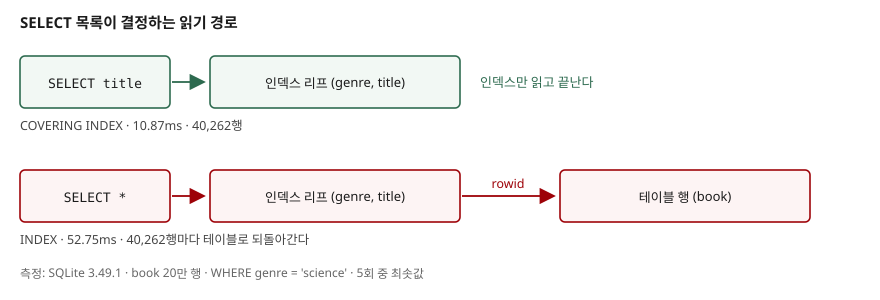

## 들어가며

SQL을 처음 배우면 대개 `SELECT * FROM 테이블` 로 시작한다. 별표 하나로 모든 컬럼이
나오니 편하고, 화면에 다 보이니 안심도 된다. 그래서 조회 화면을 만들 때도 일단 별표로
가져와서 애플리케이션 코드에서 필요한 값만 꺼내 쓰게 된다.

문제는 목록 화면에서 드러난다. 화면에 뿌리는 컬럼은 제목 하나인데, 질의는 본문과
가격과 저자까지 전부 가져온다. 행이 4만 개면 쓰지도 않을 값을 4만 번 읽어 4만 번
버리는 셈이다. 실제로 재 보면 같은 조건, 같은 결과 행 수인데 시간이 다섯 배 가까이
차이 난다.

이 글은 SELECT 목록에 무엇을 쓰는지가 DB 입장에서 어떤 일을 만드는지 보고,
컬럼에 새 이름을 붙이는 별칭(alias)을 어디까지 쓸 수 있는지 확인한다.

## 개념

`SELECT` 다음에 쓰는 컬럼 목록을 **SELECT 목록**(select list)이라고 한다. 여기에
컬럼 이름을 나열하면 그 컬럼만, `*` 를 쓰면 테이블의 모든 컬럼이 순서대로 나온다.

**별칭**은 결과에 나올 컬럼 이름을 새로 지어 주는 것이다. `AS` 로 붙인다.

```sql
SELECT title AS book_title, price / 1000 AS price_in_thousand FROM book;
```

계산식에는 원래 이름이 없으므로 별칭이 사실상 필수다. 별칭을 안 붙이면 결과 컬럼
이름이 `price / 1000` 같은 식 자체가 되어 프로그램에서 다루기 어려워진다.
이름에 공백이나 한글을 넣고 싶으면 큰따옴표로 감싼다.

여기까지는 문법이다. 실제로 성능을 가르는 것은 **DB가 그 값을 어디서 읽어 오는가**다.

## 구조



> **구조 근거**: [SQLite — Covering Indices](https://www.sqlite.org/optoverview.html#covidx)
> (필요한 모든 컬럼이 인덱스에 있으면 원본 테이블을 찾아가지 않는다는 점),
> [SQLite Database File Format §2.2 Representation Of SQL Indices](https://www.sqlite.org/fileformat2.html#representation_of_sql_indices)
> (인덱스 항목이 인덱싱된 컬럼 값 뒤에 해당 행의 rowid를 붙여 저장한다는 점).
> 그림의 측정값 10.87ms / 52.75ms는 이 글에서 직접 측정한 값이다.

`book(genre, title)` 인덱스에는 `genre`, `title`, 그리고 그 행을 가리키는 `rowid`가
들어 있다. 그래서 `SELECT title` 은 인덱스만 읽고 끝난다. 이것을
**커버링 인덱스**(covering index)라고 한다.

`SELECT *` 는 `summary`, `price` 처럼 인덱스에 없는 컬럼이 필요하다. 그러면 인덱스에서
rowid를 얻어 **행마다 테이블로 되돌아가야** 한다. 조건에 맞는 행이 4만 개면 이 되돌아가기가
4만 번 일어난다. 별표 하나가 늘리는 일은 컬럼 개수가 아니라 이 왕복 횟수다.

## 동작 원리

`EXPLAIN QUERY PLAN` 은 DB가 질의를 어떻게 처리할지 보여준다. SELECT 목록만 바꿔
같은 조건으로 돌리면 이렇게 갈린다.

```text
SELECT *      52.75ms  40,262행
    SEARCH book USING INDEX ix_book_genre_title (genre=?)
SELECT title  10.87ms  40,262행
    SEARCH book USING COVERING INDEX ix_book_genre_title (genre=?)
```

`INDEX` 와 `COVERING INDEX`, 단어 하나 차이다. 조건도 결과 행 수도 같은데 시간은
4.9배다. 컬럼을 덜 고르는 것만으로 계획이 바뀌었다.

별칭은 처리 순서 때문에 쓸 수 있는 자리가 정해진다. DB는 `WHERE` 로 행을 고른 **뒤에**
SELECT 목록을 계산한다. `WHERE` 를 볼 시점에는 별칭이 아직 존재하지 않는다.
그래서 표준 SQL과 PostgreSQL은 `ORDER BY`, `GROUP BY` 에서는 결과 컬럼 이름을 허용하고
`WHERE`, `HAVING` 에서는 허용하지 않는다.

## 실습 예제

전체 소스: [`code/select_basics.py`](code/select_basics.py) (표준 라이브러리만 사용,
`python select_basics.py`)

```text
### 2. 별칭을 쓸 수 있는 자리
  ORDER BY에서 별칭 사용:
    ('book-000460', 89)
  WHERE에서 별칭 사용:
    에러 없이 실행됐다. 별칭 21,189행 / 식 직접 21,189행 → 같은가: True
  별칭이 컬럼명을 가릴 때 (AS price, WHERE price > 80):
    별칭을 가진 질의 200,000행 / 원본 컬럼 기준 200,000행
```

예상과 달랐던 부분은 두 번째 줄이다. **SQLite 3.49.1은 `WHERE` 에서 별칭을 그냥 받아준다.**
에러도 나지 않고, 식을 직접 쓴 것과 결과 행 수도 같았다. 표준에 없는 관용이다.

세 번째 줄은 그 관용의 함정을 보여준다. `price / 1000 AS price` 처럼 별칭이 원본
컬럼명과 겹치면 `WHERE price > 80` 은 별칭이 아니라 **원본 컬럼**으로 해석됐다.
20만 행이 전부 통과했다. 별칭으로 해석됐다면 21,189행이어야 했다.
같은 질의를 다른 DB로 옮기면 여기서 에러가 나거나 결과가 달라진다.

`SELECT *` 의 또 다른 문제는 스키마가 바뀔 때다.

```text
추가 전: 6컬럼 [... 'summary', 'price']   마지막 값 = 85982
추가 후: 7컬럼 [... 'price', 'stock_count'] 마지막 값 = 0
```

컬럼을 하나 추가하자 결과의 컬럼 개수와 마지막 위치가 바뀌었다. 결과를 순서로 꺼내
쓰던 코드는 이 시점에 조용히 틀린 값을 읽는다. `SELECT price` 로 썼다면 영향이 없다.

## 실무에서 주의할 점

- **필요한 컬럼만 쓴다.** 별표는 값을 더 가져오는 것을 넘어 실행계획을 바꾼다.
  커버링 인덱스가 성립하느냐 마느냐가 여기서 갈린다.
- **`SELECT *` 는 스키마 변경에 약하다.** 컬럼 추가만으로 결과의 모양이 바뀐다.
  탐색용 임시 질의에는 편하지만 애플리케이션 코드에 남기지 않는다.
- **별칭을 `WHERE` 에 쓰지 않는다.** SQLite는 받아주지만 표준도 PostgreSQL도 아니다.
  게다가 원본 컬럼명과 겹치면 조용히 다른 뜻이 된다.
- **계산식에는 반드시 별칭을 붙인다.** 이름 없는 결과 컬럼은 프로그램에서 다루기 어렵다.
- **별칭 이름은 컬럼명과 겹치지 않게 짓는다.** 겹치면 어느 쪽으로 해석되는지가
  DB마다 다르다.

## 정리

- SELECT 목록은 "무엇을 보여줄지"가 아니라 "DB가 어디를 읽을지"를 정한다.
- 필요한 컬럼만 고르면 인덱스만 읽고 끝나 52.75ms가 10.87ms가 됐다. 조건과 결과 행 수는 같다.
- 별칭은 `AS` 로 붙이고 `ORDER BY` 에서 쓴다. `WHERE` 에서는 쓰지 않는다.
- SQLite가 `WHERE` 의 별칭을 허용하는 것은 표준이 아니다. 다른 DB에서 깨진다.
- 확인 방법은 하나다. `EXPLAIN QUERY PLAN` 을 붙여 직접 보는 것.

## 참고 자료

- [SQLite — Covering Indices](https://www.sqlite.org/optoverview.html#covidx)
- [SQLite Database File Format §2.2 Representation Of SQL Indices](https://www.sqlite.org/fileformat2.html#representation_of_sql_indices)
- [SQLite — EXPLAIN QUERY PLAN](https://www.sqlite.org/eqp.html)
- [SQLite — SELECT](https://www.sqlite.org/lang_select.html)
- [PostgreSQL 16 — SELECT (SELECT List)](https://www.postgresql.org/docs/16/sql-select.html)
