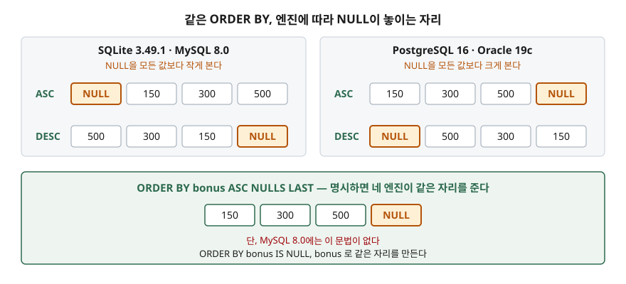

## 들어가며

직원 목록에 "보너스 많이 받은 순으로 보여 달라"는 요청이 붙는 일은 흔하다.
`ORDER BY bonus DESC` 한 줄이면 끝날 것 같아서 그렇게 넣고 화면을 연다.
그런데 맨 위에 보너스 금액이 비어 있는 사람이 줄줄이 올라와 있다.

이럴 때 대부분은 조건절로 막는다. `WHERE bonus IS NOT NULL`을 붙여서 아예 안 보이게
하거나, 애플리케이션 코드로 목록을 한 번 더 걸러 낸다. 그러면 "보너스가 아직 안 정해진
사람"은 화면에서 사라지는데, 정작 그 사람들을 확인하려던 요청이었다면 다시 질의를
만들어야 한다. 화면 하나에 질의가 두 개로 늘고, 개발 DB에서는 맞던 순서가
운영 DB에서 달라지는 일까지 생긴다.

막을 일이 아니다. NULL이 어디에 놓일지는 정해진 규칙이 있고, 그 규칙은 **엔진마다 다르다.**

## 개념

`ORDER BY`는 결과 행의 순서를 정하는 절이다. 기본형은 세 가지만 알면 된다.

- **정렬 키** — 무엇을 기준으로 줄을 세울지. 컬럼 이름을 적는다
- **방향** — `ASC`(오름차순, 작은 값이 먼저)와 `DESC`(내림차순, 큰 값이 먼저).
  아무것도 안 적으면 `ASC`다
- **키의 개수** — 쉼표로 여러 개를 적을 수 있다. 앞의 키가 같은 행끼리만 뒤의 키로 다시 줄을 세운다

여기까지는 직관과 맞는다. 문제는 **NULL**이다.

NULL은 "값이 없음"을 뜻하는 표시다. 0도 아니고 빈 문자열도 아니다. 그래서
`NULL > 300`처럼 크기를 비교하면 참도 거짓도 아닌 결과가 나온다. 그런데 줄을 세우려면
어디엔가는 놓아야 한다. 각 DB는 이 곤란함을 **"NULL을 전부보다 작다고 치자"** 또는
**"전부보다 크다고 치자"** 중 하나로 정해 두고 통과한다. 그리고 그 선택이 갈린다.

## 구조



> **구조 근거**: SQLite는 [SQLite — SELECT §4 The ORDER BY clause](https://www.sqlite.org/lang_select.html#the_order_by_clause)
> 가 "SQLite considers NULL values to be smaller than any other values for sorting purposes"라고 적는다.
> MySQL은 [MySQL 8.0 Reference Manual §5.3.4.6 Working with NULL Values](https://dev.mysql.com/doc/refman/8.0/en/working-with-null.html)
> 가 ASC일 때 NULL이 먼저 온다고 적는다. PostgreSQL은
> [PostgreSQL 16 §7.5 Sorting Rows](https://www.postgresql.org/docs/16/queries-order.html)
> 가 "NULLS FIRST is the default for DESC order, and NULLS LAST otherwise"라고 적고,
> Oracle은 [Oracle Database 19c SQL Language Reference — SELECT, order_by_clause](https://docs.oracle.com/en/database/oracle/oracle-database/19/sqlrf/SELECT.html)
> 가 "NULLS LAST is the default for ascending order, and NULLS FIRST is the default for descending order"라고 적는다.
> 150·300·500과 NULL의 배치는 아래 실습의 SQLite 실행 결과와 위 네 문서를 합쳐 그렸다.

왼쪽 두 엔진은 NULL을 가장 작은 값으로 본다. 그래서 오름차순이면 NULL이 맨 위로 온다.
오른쪽 두 엔진은 반대로 가장 큰 값으로 보므로 오름차순에서 맨 아래로 간다.
**같은 SQL 한 줄이 엔진을 옮기면 정반대 화면을 만든다.**

## 동작 원리

정렬 키를 여러 개 적었을 때 DB는 이렇게 처리한다.

1. 맨 왼쪽 키로 전체를 줄 세운다
2. 그 키 값이 **같은 행들끼리만** 모아서 두 번째 키로 다시 줄 세운다
3. 키가 남아 있으면 반복한다

여기서 자주 놓치는 것이 있다. 방향(`ASC`/`DESC`)과 NULL 위치(`NULLS FIRST`/`NULLS LAST`)는
**키마다 따로 붙는다.** `ORDER BY team DESC, bonus ASC`에서 `DESC`는 `team`에만 걸린다.
`bonus`까지 내림차순이 되지 않는다.

그리고 더 중요한 것 — 모든 키 값이 같은 행끼리의 순서는 **정해져 있지 않다.**
SQLite 문서는 이를 못박아 둔다. 정렬 키로 구별되지 않는 행의 순서는 그때그때
DB가 데이터를 어떻게 읽었는지에 따라 달라진다. 아래에서 실제로 뒤집어 본다.

## 실습 예제

직원 6명 중 2명의 `bonus`가 NULL인 표를 만들어 돌렸다.
전체 소스: [`code/order_by_nulls.py`](code/order_by_nulls.py)

```sql
-- 1. 오름차순 기본값
SELECT name, team, bonus FROM employee ORDER BY bonus ASC;
```

```
김서연  개발   NULL
정우성  영업   NULL
최유진  영업    150
강민수  개발    300
박지훈  개발    300
이하늘  영업    500
```

NULL이 맨 위다. 문서가 말한 그대로다. `DESC`로 바꾸면 두 NULL이 맨 아래로 내려간다.
뒤로 보내고 싶으면 방향은 그대로 두고 `NULLS LAST`만 붙인다.

```sql
-- 3. 오름차순인데 NULL을 뒤로
SELECT name, team, bonus FROM employee ORDER BY bonus ASC NULLS LAST;
```

```
최유진  영업    150
강민수  개발    300
박지훈  개발    300
이하늘  영업    500
김서연  개발   NULL
정우성  영업   NULL
```

키를 두 개 쓰면 방향이 키마다 붙는 것을 볼 수 있다.

```sql
-- 6. 키마다 방향을 따로 준다
SELECT name, team, bonus FROM employee ORDER BY team DESC, bonus ASC NULLS LAST;
```

```
최유진  영업    150
이하늘  영업    500
정우성  영업   NULL
강민수  개발    300
박지훈  개발    300
김서연  개발   NULL
```

`team`은 내림차순이라 "영업"이 먼저 나왔지만, 팀 안에서 `bonus`는 오름차순이다.

### 동점 행의 순서는 믿을 수 없다

보너스가 똑같이 300인 강민수와 박지훈 중 누가 먼저 나오는지는 위 출력에서 일정해 보인다.
정말 그런지 확인하려고 **질의는 한 글자도 바꾸지 않고 인덱스만 하나 만들어** 다시 돌렸다.

```
인덱스 없음         결과: ['강민수', '박지훈']
               계획: SCAN employee
인덱스 생성 후       결과: ['박지훈', '강민수']
               계획: SEARCH employee USING COVERING INDEX idx_bonus_name (bonus=?)
```

순서가 뒤집혔다. `ORDER BY bonus DESC`는 그대로인데 결과가 달라진 것은,
`bonus`가 같은 두 행에 대해 이 질의가 아무 순서도 요구하지 않았기 때문이다.
DB는 테이블을 훑을 때와 인덱스를 탈 때 행을 만나는 순서가 다르고, 요구받지 않은 것은
맞춰 주지 않는다. 운영에서 인덱스 하나가 추가되는 순간 목록 순서가 바뀌는 사고가
이렇게 난다. **순서가 중요하면 동점을 가를 키를 끝까지 적어야 한다.**

```sql
-- 7. 동점을 가르는 3순위 키
SELECT name, team, bonus FROM employee
 ORDER BY bonus DESC NULLS LAST, hired_on ASC;
```

## 실무에서 주의할 점

- **엔진을 옮기면 NULL 자리가 바뀐다.** SQLite·MySQL은 NULL을 가장 작게, PostgreSQL·Oracle은
  가장 크게 본다. 이식성이 필요하면 기본값에 기대지 말고 `NULLS FIRST`/`NULLS LAST`를 명시한다.
- **MySQL 8.0에는 `NULLS FIRST`/`NULLS LAST` 문법이 없다.**
  [8.0 SELECT 구문 정의](https://dev.mysql.com/doc/refman/8.0/en/select.html)의
  `order_by_clause`에는 `[ASC | DESC]`만 있다. 같은 효과가 필요하면
  `ORDER BY bonus IS NULL, bonus`처럼 "NULL 여부"를 첫 정렬 키로 넣어 같은 자리를 만든다.
- **SQLite도 버전을 본다.** `NULLS FIRST`/`NULLS LAST`는
  [3.30.0(2019-10-04)](https://www.sqlite.org/changes.html)에서 들어갔다. 그 이전 버전에서는 구문 오류가 난다.
- **동점 키를 끝까지 적는다.** 위에서 본 대로 인덱스 하나에 순서가 뒤집힌다.
  페이지 나누기(`LIMIT`/`OFFSET`)를 쓰는 목록이라면 같은 행이 두 페이지에 나오거나
  아예 빠지는 형태로 드러난다.
- **NULL을 `WHERE`로 지우기 전에 요청을 다시 본다.** "보너스 미정인 사람"을 봐야 하는
  요청이었다면 순서만 옮기면 될 일이다.

## 정리

- `ORDER BY`는 키를 왼쪽부터 적용하고, 앞 키가 같은 행끼리만 뒤 키로 다시 정렬한다.
- `ASC`/`DESC`와 `NULLS FIRST`/`NULLS LAST`는 **키마다** 따로 붙는다.
- NULL의 기본 자리는 엔진이 갈린다. SQLite·MySQL은 가장 작은 값, PostgreSQL·Oracle은 가장 큰 값으로 본다.
- 모든 정렬 키가 같은 행의 순서는 보장되지 않는다. 인덱스 하나에 뒤집히는 것을 직접 확인했다.
- 순서가 화면 규격이라면 동점을 가르는 키까지 적는 것이 유일한 방법이다.

## 참고 자료

- [SQLite — SELECT §4 The ORDER BY clause](https://www.sqlite.org/lang_select.html#the_order_by_clause)
- [SQLite — Datatypes In SQLite §4.1 Sort Order](https://www.sqlite.org/datatype3.html#sort_order)
- [SQLite — Release History (3.30.0)](https://www.sqlite.org/changes.html)
- [PostgreSQL 16 — §7.5 Sorting Rows](https://www.postgresql.org/docs/16/queries-order.html)
- [MySQL 8.0 Reference Manual — §5.3.4.6 Working with NULL Values](https://dev.mysql.com/doc/refman/8.0/en/working-with-null.html)
- [MySQL 8.0 Reference Manual — SELECT Statement](https://dev.mysql.com/doc/refman/8.0/en/select.html)
- [Oracle Database 19c SQL Language Reference — SELECT, order_by_clause](https://docs.oracle.com/en/database/oracle/oracle-database/19/sqlrf/SELECT.html)
