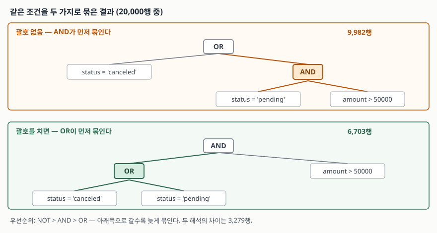

## 들어가며

주문 목록 화면에 필터를 붙이는 일은 흔하다. "취소된 주문과, 결제 대기 중인 고액 주문을
같이 보여 달라"는 요청을 받으면 대개 요청받은 문장을 그대로 SQL로 옮긴다.

```sql
WHERE status = 'canceled' OR status = 'pending' AND amount > 50000
```

한국어 문장과 순서가 같으니 맞아 보인다. 그런데 화면에 뜬 건수가 어쩐지 많다.
이럴 때 대부분은 데이터를 의심해서 원본 테이블을 열어 보거나, 조건을 하나씩 지워 가며
건수를 다시 세기 시작한다. 조건이 네 개면 지웠다 넣었다를 열 번 넘게 반복하게 된다.

문제는 데이터가 아니라 저 한 줄이다. DB는 저 조건을 사람이 읽은 순서대로 읽지 않는다.

## 개념

`AND`와 `OR`은 조건을 잇는 **논리 연산자**다. `AND`는 양쪽이 모두 참일 때 참,
`OR`은 한쪽만 참이어도 참이다. 여기까지는 어렵지 않다.

문제는 둘을 섞었을 때다. `A OR B AND C`에는 읽는 방법이 두 가지 있다.

- `A OR (B AND C)` — B와 C를 먼저 묶는다
- `(A OR B) AND C` — A와 B를 먼저 묶는다

어느 쪽으로 읽을지는 **연산자 우선순위**(operator precedence)가 정한다. 우선순위가
높은 연산자가 먼저 자기 양옆을 붙잡는다. 곱셈이 덧셈보다 먼저인 것과 같은 규칙이고,
`2 + 3 * 4`를 20이 아니라 14로 계산하는 것과 정확히 같은 이야기다.

SQL에서 순서는 **`NOT` → `AND` → `OR`**이다. `AND`가 `OR`보다 높으므로
`A OR B AND C`는 언제나 `A OR (B AND C)`로 읽힌다.

## 구조



> **출처**: [SQLite — SQL Language Expressions §2 Operators, and Parse-Affecting Attributes](https://www.sqlite.org/lang_expr.html#operators_and_parse_affecting_attributes)
> 의 우선순위 표. 높은 것부터 나열된 목록의 맨 아래 세 줄이 `NOT [expr]` → `AND` → `OR` 순이다.
> 그림의 9,982행 / 6,703행 / 3,279행은 이 글에서 직접 측정한 값이다.

위쪽이 괄호를 안 썼을 때 DB가 실제로 읽는 모양이다. `AND`가 먼저 `status = 'pending'`과
`amount > 50000`을 붙잡아 한 덩어리로 만들고, `OR`은 그 덩어리와 `status = 'canceled'`를
잇는다. 그래서 **취소된 주문은 금액과 무관하게 전부 들어온다.**

아래쪽이 요청한 사람이 기대한 모양이다. 이렇게 읽히게 하려면 괄호를 직접 쳐야 한다.

## 동작 원리

20,000행짜리 주문 테이블로 같은 조건을 세 가지 방식으로 세어 봤다.

```text
   9,982행  WHERE status = 'canceled' OR status = 'pending' AND amount > 50000
   6,703행  WHERE (status = 'canceled' OR status = 'pending') AND amount > 50000
   9,982행  WHERE status = 'canceled' OR (status = 'pending' AND amount > 50000)
  괄호 없음 == AND 먼저 : True
  괄호 없음 == OR 먼저  : False
  두 해석의 차이        : 3,279행
```

괄호를 안 쓴 질의는 `AND`를 먼저 묶은 쪽과 **정확히 같은 건수**를 냈다. 우연이 아니라
규칙이다. 차이는 3,279행, 원래 의도의 절반이 더 붙은 셈이다.

`NOT`은 `AND`보다도 먼저 묶인다. 그래서 `NOT`은 바로 뒤 조건 하나만 뒤집는다.

```text
   6,703행  WHERE NOT status = 'paid' AND amount > 50000
   6,703행  WHERE (NOT status = 'paid') AND amount > 50000
  16,702행  WHERE NOT (status = 'paid' AND amount > 50000)
  괄호 없음 == NOT 먼저 : True
  괄호 없음 == 전체 부정: False
```

"결제된 것 말고 5만 원 넘는 주문"을 조건 전체의 부정으로 생각했다면 16,702행을
기대했을 텐데 실제로는 6,703행이 나온다. 2.5배 차이다.

DB가 조건을 어떻게 묶었는지는 `EXPLAIN QUERY PLAN`으로도 드러난다.

```text
  WHERE status = 'canceled' OR status = 'pending' AND amount > 50000
      MULTI-INDEX OR
      INDEX 1
      SEARCH customer_order USING INDEX ix_customer_order_status (status=?)
      INDEX 2
      SEARCH customer_order USING INDEX ix_customer_order_status (status=?)
```

`OR` 갈래가 **세 개가 아니라 두 개**다. `AND`가 먼저 묶여 한 덩어리가 됐기 때문이다.
건수를 세기 전에 이 계획만 봐도 어떻게 해석됐는지 알 수 있다.

## 실습 예제

전체 소스: [`code/where_and_or.py`](code/where_and_or.py) (표준 라이브러리만 사용,
`python where_and_or.py`)

예상과 달랐던 건 세 번째 실험이다. 쿠폰 코드 컬럼에 값이 없는 행을 섞고
`= 'CP1'`과 `<> 'CP1'`을 각각 세어 봤다.

```text
  쿠폰 있음 5,986행 / 쿠폰 NULL 14,014행 / 합계 20,000행
   1,238행  WHERE coupon_code = 'CP1'
   4,748행  WHERE coupon_code <> 'CP1'
  = 와 <> 의 합 5,986행 → 전체 20,000행과 같은가: False
```

"같다"와 "같지 않다"를 더하면 전체가 나와야 할 것 같은데 14,014행이 사라졌다.
값이 없는 칸, 즉 `NULL`은 **어느 쪽에도 속하지 않는다.** `NULL = 'CP1'`은 거짓이 아니라
"알 수 없음"이고, `NULL <> 'CP1'` 역시 "알 수 없음"이라서 둘 다 `WHERE`를 통과하지 못한다.

이 "알 수 없음"을 `AND`와 `OR`은 다르게 삼킨다.

```text
  20,000행  WHERE coupon_code = 'CP1' OR 1 = 1
       0행  WHERE coupon_code = 'CP1' AND 1 = 0
```

`OR` 한쪽이 참이면 나머지가 알 수 없음이어도 결과는 참이고, `AND` 한쪽이 거짓이면
나머지가 무엇이든 거짓이다. 그래서 `NULL`이 섞인 조건에 괄호를 잘못 치면
사라지는 행이 어디서 사라졌는지 추적하기가 특히 어렵다.

## 실무에서 주의할 점

- **`AND`와 `OR`을 섞으면 무조건 괄호를 친다.** 우선순위를 외우고 있어도 괄호를 친다.
  질의를 읽는 다음 사람이 외우고 있다는 보장이 없다.
- **`NOT`은 바로 뒤 조건 하나만 뒤집는다.** 조건 전체를 부정하려면 `NOT (...)`으로 감싼다.
- **`NULL`이 들어올 수 있는 컬럼은 `= `/`<>`로 나누어 세지 않는다.**
  두 결과를 합쳐도 전체가 되지 않는다. `IS NULL` / `IS NOT NULL`을 따로 쓴다.
- **건수가 이상하면 데이터보다 괄호를 먼저 본다.** 조건을 지웠다 넣었다 하기 전에
  `EXPLAIN QUERY PLAN`으로 `OR` 갈래가 몇 개인지 확인하는 편이 빠르다.
- **`OR`은 인덱스 사용을 바꾼다.** 같은 컬럼끼리의 `OR`은 인덱스를 타지만
  다른 컬럼과 묶인 `OR`은 전체 스캔이 됐다.

```text
  WHERE status = 'paid' AND amount > 50000
      SEARCH customer_order USING INDEX ix_customer_order_status (status=?)

  WHERE status = 'paid' OR amount > 50000
      SCAN customer_order

  WHERE status = 'paid' OR status = 'pending'
      SEARCH customer_order USING COVERING INDEX ix_customer_order_status (status=?)
```

같은 컬럼끼리의 `OR`이 인덱스를 타는 건 SQLite가 그 조건을 `IN`으로 바꿔 쓰기 때문이다.

## 정리

- 우선순위는 `NOT` → `AND` → `OR`이다. `A OR B AND C`는 항상 `A OR (B AND C)`다.
- 괄호를 빼먹은 질의는 9,982행, 의도한 질의는 6,703행이었다. 3,279행 차이가 조용히 생긴다.
- `NOT`은 바로 뒤 조건 하나만 뒤집는다. 전체를 부정하려면 괄호로 감싼다.
- `NULL`은 `=`에도 `<>`에도 걸리지 않는다. 두 건수를 합쳐도 전체가 되지 않는다.
- 해석이 의심스러우면 `EXPLAIN QUERY PLAN`의 `OR` 갈래 개수를 센다.

## 참고 자료

- [SQLite — SQL Language Expressions §2 Operators, and Parse-Affecting Attributes](https://www.sqlite.org/lang_expr.html#operators_and_parse_affecting_attributes)
- [SQLite — Query Optimizer Overview §4 OR Optimizations](https://www.sqlite.org/optoverview.html#or_opt)
- [SQLite — NULL Handling](https://www.sqlite.org/nulls.html)
- [SQLite — EXPLAIN QUERY PLAN](https://www.sqlite.org/eqp.html)
- [PostgreSQL 16 — Operator Precedence](https://www.postgresql.org/docs/16/sql-syntax-lexical.html#SQL-PRECEDENCE)
