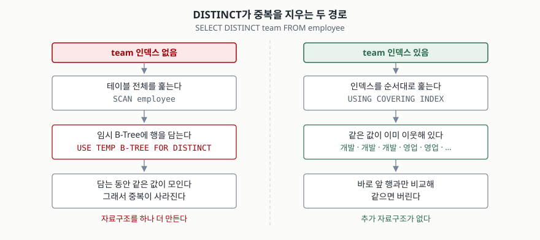

## 들어가며

관리자 화면에 "팀" 드롭다운을 붙이는 일이 생긴다. 직원 테이블에 팀 이름이 있으니
`SELECT team FROM employee`를 돌려 본다. 그런데 화면에 "개발"이 세 번, "영업"이 세 번
나온다. 직원 수만큼 줄이 나온 것이다.

이때 많은 사람이 애플리케이션 쪽에서 막는다. 결과를 전부 받아다가 파이썬 `set`이나
자바 `HashSet`에 넣어 중복을 지운다. 직원이 8명이면 아무 문제가 없다. 그런데 직원이
5만 명이면 팀 이름 세 개를 얻으려고 **5만 행을 네트워크로 끌어온다.** DB는 이 일을
훨씬 적은 비용으로 할 수 있는데, 그 방법이 `DISTINCT`다.

## 개념

`DISTINCT`는 `SELECT` 바로 뒤에 붙여서 **결과에서 중복된 줄을 지우는** 키워드다.

```sql
SELECT DISTINCT team FROM employee;
```

여기서 가장 자주 오해하는 것이 하나 있다. `DISTINCT`는 **컬럼 하나에 붙는 것이 아니라
SELECT 목록 전체에 붙는다.** `SELECT DISTINCT team, name` 이라고 쓰면 "team의 중복을
지우고 name도 같이 보여 달라"가 아니라 "`(team, name)` 쌍이 같은 줄을 지워 달라"가 된다.
사람 이름은 보통 겹치지 않으니 결과는 한 줄도 줄지 않는다. 실습에서 그대로 나온다.

지워야 할 중복을 찾으려면 DB는 **어떤 줄이 서로 같은지** 알아야 한다. 방법은 둘 중 하나다.
모든 줄을 다른 모든 줄과 비교하거나, **같은 줄끼리 나란히 모아 놓고 이웃하고만 비교하거나.**
DB가 고르는 쪽은 언제나 뒤쪽이고, 여기서 정렬이 등장한다.

## 구조



> **출처**: 임시 B-Tree를 만드는 쪽은
> [SQLite — EXPLAIN QUERY PLAN §1.2 Temporary Sorting B-Trees](https://www.sqlite.org/eqp.html#temporary_sorting_b_trees)
> 가 "If a SELECT query contains an ORDER BY, GROUP BY or DISTINCT clause, SQLite may need to
> use a temporary b-tree structure to sort the output rows"라고 적고, 그때 계획에
> `USE TEMP B-TREE FOR DISTINCT`가 나온다고 적는다. 인덱스를 쓰는 쪽은
> [SQLite — Query Planner Overview §10 ORDER BY Optimizations](https://www.sqlite.org/optoverview.html#order_by_optimizations)
> 가 "If the nested loops of the join can be arranged such that rows that are equivalent for
> the GROUP BY or for the DISTINCT are consecutive, then the GROUP BY or DISTINCT logic can
> determine ... simply by comparing the current row to the previous row"라고 적는다.
> 계획 문자열 두 줄은 아래 실습의 실제 출력이다.

## 동작 원리

인덱스가 없으면 DB는 테이블을 처음부터 끝까지 읽으면서 값을 **임시 B-Tree에 넣는다.**
B-Tree는 값을 넣으면 제자리를 찾아 들어가는 구조라, 다 넣고 나면 같은 값끼리 붙어 있다.
그 상태에서 앞에서부터 읽으며 이웃과 같은 것만 버리면 중복 제거가 끝난다.

**정렬은 이 과정의 부산물이다.** 중복을 지우려고 값을 모았더니 정렬까지 돼 버린 것이지,
`DISTINCT`가 정렬을 약속한 적은 없다. 이 구분이 왜 중요한지는 실습 4장에서 드러난다.

인덱스가 이미 있으면 사정이 다르다. 인덱스는 만들어질 때부터 값 순서로 정렬돼 있으므로
**같은 값이 처음부터 이웃해 있다.** DB는 인덱스를 순서대로 훑으며 바로 앞 행과만 비교하면
된다. 임시 B-Tree를 만들 이유가 사라진다.

## 실습 예제

직원 8명짜리 표로 확인했다. 전체 소스: [`code/distinct_plan.py`](code/distinct_plan.py),
실행 기록: [`code/output.txt`](code/output.txt)

### DISTINCT는 줄 전체를 본다

```
SELECT DISTINCT team, grade FROM employee    →  5행 (8행에서 3행 줄었다)
SELECT DISTINCT team, name  FROM employee    →  8행 (한 행도 안 줄었다)
```

`name`을 하나 끼운 것만으로 중복 제거가 아무 일도 하지 않게 됐다.

### 인덱스가 없을 때

```
SQL : SELECT DISTINCT team FROM employee
QUERY PLAN
|--SCAN employee
`--USE TEMP B-TREE FOR DISTINCT
```

`GROUP BY team`으로 바꿔도 `USE TEMP B-TREE FOR GROUP BY`가 나온다. 같은 일을 이름만
달리 부르는 것이다. `DISTINCT`를 떼면 계획은 `SCAN employee` 한 줄로 줄어든다.

### 인덱스를 만들면

```
CREATE INDEX ix_employee_team ON employee (team);

SQL : SELECT DISTINCT team FROM employee
QUERY PLAN
`--SCAN employee USING COVERING INDEX ix_employee_team
```

**`USE TEMP B-TREE FOR DISTINCT` 줄이 사라졌다.** 다만 이 인덱스는 `team` 하나뿐이라,
컬럼을 하나 늘리면 다시 임시 B-Tree가 돌아온다.

```
SQL : SELECT DISTINCT team, grade FROM employee
QUERY PLAN
|--SCAN employee USING INDEX ix_employee_team
`--USE TEMP B-TREE FOR DISTINCT
```

`(team, grade)` 인덱스를 추가로 만들자 다시 한 줄이 된다. **중복 판정에 쓰는 컬럼이
인덱스에 전부, 그 순서대로 들어 있어야** 임시 B-Tree가 빠진다.

### 정렬은 덤이지 약속이 아니다

여기가 이 글을 쓴 이유다. `(team, grade)` 인덱스가 있는 상태에서 **SELECT 목록 순서만
뒤집어** 돌렸다.

```
SQL  : SELECT DISTINCT grade, team FROM employee
QUERY PLAN
`--SCAN employee USING COVERING INDEX ix_employee_team_grade
행   : 선임 | 개발
행   : 책임 | 개발
행   : 선임 | 영업
행   : 책임 | 영업
행   : 책임 | 지원
```

첫 컬럼인 `grade`가 **선임·책임·선임·책임·책임** 순으로 나왔다. 정렬돼 있지 않다.
중복 제거에 쓰인 인덱스가 `(team, grade)` 순이라 결과가 `team` 기준으로 줄 서 있을 뿐이다.
`ORDER BY grade, team`을 붙이자 순서가 잡히는데, 그 대신 계획에 줄이 하나 늘었다.

```
SQL : SELECT DISTINCT grade, team FROM employee ORDER BY grade, team
QUERY PLAN
|--SCAN employee USING COVERING INDEX ix_employee_team_grade
`--USE TEMP B-TREE FOR ORDER BY
```

**중복 제거로 아낀 임시 B-Tree를 정렬하느라 다시 만들었다.** 순서가 필요하면 `DISTINCT`에
기대지 말고 `ORDER BY`를 쓰고, 그 비용이 계획에 드러난다는 것까지 알고 쓰는 것이 맞다.

### 중복이 있을 수 없으면 아예 안 한다

```
SQL : SELECT DISTINCT id FROM employee
QUERY PLAN
`--SCAN employee USING COVERING INDEX ix_employee_team

SQL : SELECT id FROM employee
QUERY PLAN
`--SCAN employee USING COVERING INDEX ix_employee_team
```

`id`는 기본 키라 중복이 나올 수 없다. 두 계획이 글자까지 같다는 것은 `DISTINCT`가
**통째로 지워졌다**는 뜻이다. 붙여도 손해는 없지만, 이런 자리에 붙어 있는 `DISTINCT`는
보통 "중복이 왜 나는지 모르겠어서 일단 붙였다"의 흔적이다.

## 실무에서 주의할 점

- **`DISTINCT`로 조인 중복을 덮지 않는다.** 결과가 두 배로 나올 때 `DISTINCT`를 붙이면
  화면은 맞아 보인다. 그런데 원인은 조인 조건이 빠진 것이고, 조건이 빠진 채로 데이터가
  늘면 다시 틀린다. 줄 수가 왜 늘었는지를 먼저 확인한다.
- **정렬이 필요하면 `ORDER BY`를 적는다.** 위에서 본 대로 `DISTINCT`의 정렬은
  중복 제거 방식에 딸려 오는 결과일 뿐이다. 인덱스를 하나 만들거나 SELECT 목록 순서를
  바꾸는 것만으로 순서가 달라진다.
- **중복 제거 컬럼을 인덱스에 순서대로 담는다.** `(team)` 인덱스는 `DISTINCT team`만
  살리고 `DISTINCT team, grade`는 못 살린다. 자주 쓰는 조합이면 그 조합으로 인덱스를 만든다.
- **`DISTINCT`는 함수가 아니다.** `SELECT DISTINCT(team), grade`는 괄호가 `team`을
  감쌌을 뿐 결과가 `DISTINCT team, grade`와 같다. 괄호가 오해를 만든다.
- **`COUNT(DISTINCT x)`는 별개다.** 이쪽은 컬럼 하나에만 걸리는 집계 함수다.

## 정리

- `DISTINCT`는 컬럼 하나가 아니라 **SELECT 목록 전체**를 한 줄로 보고 중복을 지운다.
- DB는 같은 값을 이웃으로 모아 놓고 앞뒤만 비교한다. 모으는 도구가 임시 B-Tree고,
  SQLite 계획에서는 `USE TEMP B-TREE FOR DISTINCT`로 보인다.
- 중복 판정 컬럼이 인덱스에 순서대로 들어 있으면 그 줄이 사라진다. 직접 확인했다.
- **결과가 정렬돼 보이는 것은 중복 제거 방식의 부산물이다.** SELECT 목록 순서만 바꿔도
  정렬이 무너지는 것을 실행 결과로 확인했다.
- 순서가 화면 규격이면 `ORDER BY`를 적는다. 그 비용은 실행계획에 그대로 나타난다.

## 참고 자료

- [SQLite — EXPLAIN QUERY PLAN §1.2 Temporary Sorting B-Trees](https://www.sqlite.org/eqp.html#temporary_sorting_b_trees)
- [SQLite — The Query Planner §10 ORDER BY Optimizations](https://www.sqlite.org/optoverview.html#order_by_optimizations)
- [SQLite — The Query Planner §9 Covering Indexes](https://www.sqlite.org/optoverview.html#covering_indexes)
- [SQLite — SELECT §3 Generation of the set of result rows](https://www.sqlite.org/lang_select.html#generation_of_the_set_of_result_rows)
