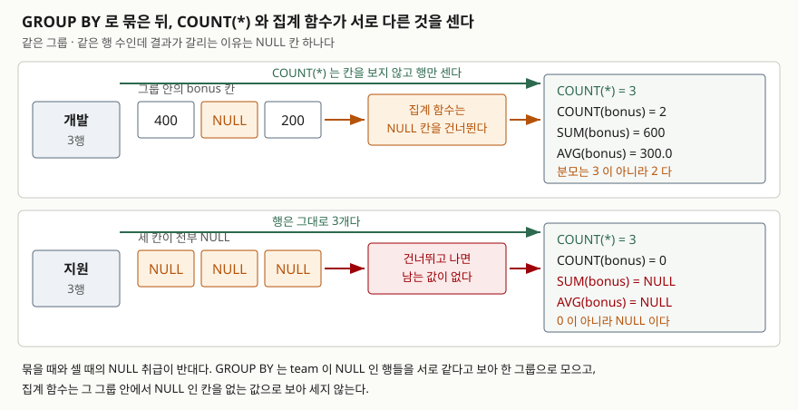

## 들어가며

월말에 팀별 인원수와 성과급 평균을 표로 정리해 달라는 요청이 온다. 직원 목록을 엑셀로
내려받아 팀 이름으로 필터를 걸고, 걸린 줄 수를 세고, 성과급 칸을 선택해 평균을 읽는다.
그리고 다음 팀으로 필터를 바꿔 같은 일을 반복한다.

팀이 세 개면 3분이면 끝난다. 그런데 팀이 열두 개면 열두 번을 반복하고, 다음 달에 또
열두 번을 반복한다. **팀이 하나 늘면 절차도 하나 늘어난다.** 이 반복을 한 문장으로
바꾸는 것이 `GROUP BY`다. 그런데 이렇게 구한 평균이 엑셀에서 읽은 평균과 다르게 나오는
일이 생긴다. 원인은 거의 항상 빈 칸이다.

## 개념

`GROUP BY`는 **같은 값을 가진 행들을 한 덩어리로 묶고, 덩어리마다 한 줄씩 결과를
내놓는** 절이다. 묶은 덩어리를 요약하는 함수를 **집계 함수**라고 부른다.

```sql
SELECT team, COUNT(*), AVG(bonus) FROM employee GROUP BY team;
```

이 문장은 "`team`이 같은 행끼리 모으고, 모인 덩어리마다 행이 몇 개인지와 `bonus`의
평균을 한 줄로 내놓아라"는 뜻이다. 엑셀에서 필터를 열두 번 바꾼 일을 DB가 한 번에 한다.

집계 함수 중 개수를 세는 것만 형태가 두 가지다.

- `COUNT(*)` — 그룹에 속한 **행**의 개수
- `COUNT(bonus)` — 그룹 안에서 `bonus`가 **NULL이 아닌** 칸의 개수

`NULL`은 "값이 없다"는 표시다. 그리고 여기서부터 갈린다.

## 구조



> **출처**: 그룹을 만들 때 `NULL`을 같다고 보는 규칙은
> [SQLite — SELECT §2.4 Generation of the set of result rows](https://www.sqlite.org/lang_select.html#generation_of_the_set_of_result_rows)
> 가 "For the purposes of grouping rows, NULL values are considered equal"이라고 적는다.
> 세는 대상이 갈리는 쪽은
> [SQLite — Aggregate Functions §count](https://www.sqlite.org/lang_aggfunc.html#count)
> 가 "The count(X) function returns a count of the number of times that X is not NULL
> in a group"이라고 적고, 전부 `NULL`일 때의 결과는 같은 문서
> [§sum, total](https://www.sqlite.org/lang_aggfunc.html#sumunc)
> 이 "If there are no non-NULL input rows then sum() returns NULL but total() returns 0.0"
> 이라고 적는다. 도식의 숫자는 모두 아래 실습의 실제 출력이다.

## 동작 원리

**묶을 때와 셀 때의 `NULL` 취급이 반대다.** 이 한 줄이 이 글의 전부다.

묶는 단계에서 DB는 `team` 값이 같은 행을 모은다. 이때 `team`이 비어 있는 행들끼리는
서로 같다고 보아 **하나의 그룹이 된다.**

세는 단계는 반대다. 집계 함수는 그룹 안의 칸을 훑으면서 `NULL`인 칸을 **없는 값으로 보아
건너뛴다.** `SUM`은 더하지 않고 `AVG`는 분모에도 넣지 않는다. 엑셀에서 읽은 평균과
어긋나는 지점이 여기다. 사람은 빈 칸을 0으로 보고, DB는 없는 값으로 본다.

순서는 `WHERE`로 행을 걸러 낸 다음 그룹을 만들고, 집계를 계산한 뒤 `HAVING`으로
**그룹을 걸러 내는** 차례다. 그래서 `WHERE`에는 집계 함수를 못 쓰고 `HAVING`에는 쓴다.

## 실습 예제

직원 9명짜리 표로 확인했다. `bonus`에 `NULL`이 네 개, `team`에 하나 있다.
전체 소스: [`code/group_by_null.py`](code/group_by_null.py),
실행 기록: [`code/output.txt`](code/output.txt)

### 무엇을 세는지에 따라 답이 달라진다

```
SQL  : SELECT team, COUNT(*), COUNT(bonus), SUM(bonus), AVG(bonus) FROM employee GROUP BY team
행   : NULL | 1 | 1 | 100 | 100.0
행   : 개발 | 3 | 2 | 600 | 300.0
행   : 영업 | 2 | 2 | 600 | 300.0
행   : 지원 | 3 | 0 | NULL | NULL
```

개발팀은 행이 3개인데 `bonus` 칸은 2개만 세어졌다. 지원팀은 세어진 칸이 0개고 `SUM`과
`AVG`가 **0이 아니라 `NULL`이다.** 더할 값이 하나도 없으면 합계가 0이 아니라 "없음"이
된다. 0을 원한다면 SQLite에는 `TOTAL`이 따로 있다.

```
SQL  : SELECT team, TOTAL(bonus) FROM employee WHERE team = '지원' GROUP BY team
행   : 지원 | 0.0
```

### 평균의 분모

개발팀의 `bonus`는 `400`, `NULL`, `200`이다. `AVG`와 손계산을 나란히 돌렸다.

```
SQL  : SELECT team, AVG(bonus), SUM(bonus) * 1.0 / COUNT(*) FROM employee WHERE team = '개발' GROUP BY team
행   : 개발 | 300.0 | 200.0
```

`AVG`는 `600 / 2`, 뒤는 `600 / 3`이다. **둘 다 맞는 계산이고 뜻이 다르다.**
"성과급을 받은 사람의 평균"이 앞이고 "팀 인원당 평균"이 뒤다. 빈 칸을 0으로 보기로
정했다면 `AVG(COALESCE(bonus, 0))`로 적는다. 실제로 `200.0`이 나온다.

### 묶을 때는 NULL이 한 그룹이 된다

위 결과의 첫 줄이 `team`이 `NULL`인 그룹이다. 같은 행을 `WHERE`로 찾으면 이렇게 된다.

```
SQL  : SELECT COUNT(*) FROM employee WHERE team = NULL     →  0
SQL  : SELECT COUNT(*) FROM employee WHERE team IS NULL    →  1
```

비교에서는 `NULL = NULL`이 참이 아니어서 한 줄도 못 찾는데, 묶을 때는 같다고 보아
한 그룹이 됐다. 같은 `NULL`을 두 규칙이 다르게 다룬다.

### 그룹에 없는 컬럼을 SELECT에 두면

SQLite는 다른 DB가 거부하는 이 문장을 받아 준다. 그래서 더 조심해야 한다.

```
SQL  : SELECT team, name, MAX(bonus) FROM employee GROUP BY team
행   : 지원 | 신겨울 | NULL

SQL  : SELECT team, name, COUNT(*) FROM employee GROUP BY team
행   : 지원 | 한여름 | 3
```

`GROUP BY`에도 없고 집계 함수 안에도 없는 `name`을 SQLite는 **그룹 안의 아무 행에서나**
가져온다. 지원팀에서 앞은 `신겨울`, 뒤는 `한여름`이 나왔다. 집계 함수만 바꿨는데 사람
이름이 바뀐 것이다. 오류가 아니라 정의되지 않은 값이다.

### HAVING은 그룹을 버린다

```
SQL  : SELECT team, COUNT(*) FROM employee GROUP BY team HAVING COUNT(*) >= 3
행   : 개발 | 3
행   : 지원 | 3

SQL  : SELECT team, COUNT(*) FROM employee WHERE bonus IS NOT NULL GROUP BY team HAVING COUNT(*) >= 3
행   : (없음)
```

`WHERE`를 붙인 것만으로 결과가 사라졌다. 행을 먼저 걸러 내니 그룹의 크기가 줄어 세 개
이상인 그룹이 남지 않았다. `WHERE`는 행을, `HAVING`은 그룹을 버린다.

### 실행계획

```
SQL : SELECT team, COUNT(*) FROM employee GROUP BY team
QUERY PLAN
|--SCAN employee
`--USE TEMP B-TREE FOR GROUP BY
```

그룹을 만들려면 같은 값이 이웃해 있어야 하고, 그래서 DB는 임시 B-Tree에 값을 모은다.
`team` 인덱스를 만들면 값이 이미 순서대로 있으니 그 줄이 사라진다.

```
CREATE INDEX ix_employee_team ON employee (team);

SQL : SELECT team, COUNT(*) FROM employee GROUP BY team
QUERY PLAN
`--SCAN employee USING COVERING INDEX ix_employee_team
```

## 실무에서 주의할 점

- **`COUNT(*)`와 `COUNT(컬럼)`을 의식해서 고른다.** "회원 수"는 `COUNT(*)`,
  "전화번호를 등록한 회원 수"는 `COUNT(phone)`이다. 습관적으로 `COUNT(컬럼)`을 쓰면
  그 컬럼이 나중에 nullable로 바뀌는 순간 숫자가 조용히 줄어든다.
- **`SUM`이 `NULL`을 돌려줄 수 있다.** 조건에 맞는 행이 없거나 대상 칸이 전부 비어 있으면
  0이 아니라 `NULL`이다. 0으로 쓰겠다면 `COALESCE(SUM(x), 0)`로 감싼다.
- **평균은 분모를 먼저 정한다.** "인원당"으로 적어야 하면 `SUM(x) * 1.0 / COUNT(*)`처럼
  분모를 직접 쓴다. 정수끼리 나누면 몫만 남으므로 `* 1.0`을 잊지 않는다.
- **`GROUP BY`에 없는 컬럼을 SELECT에 두지 않는다.** SQLite는 받아 주지만 값이
  정해지지 않는다. 다른 DB로 옮기면 문법 오류가 된다.
- **그룹 조건은 `HAVING`, 행 조건은 `WHERE`에 적는다.** 둘 다 되는 조건이면 `WHERE`가
  낫다. 묶기 전에 행을 줄이면 그룹을 만드는 비용도 같이 줄어든다.

## 정리

- `GROUP BY`는 같은 값의 행을 묶고, 집계 함수가 묶인 덩어리를 한 줄로 요약한다.
- **묶을 때와 셀 때의 `NULL` 취급이 반대다.** 묶을 때는 같은 값으로 보아 한 그룹이 되고,
  셀 때는 없는 값으로 보아 건너뛴다.
- `COUNT(*)`는 행을, `COUNT(컬럼)`은 `NULL`이 아닌 칸을 센다. 9행에서 5가 나왔다.
- 대상이 전부 `NULL`이면 `SUM`과 `AVG`는 0이 아니라 `NULL`이다. 0을 원하면 `TOTAL`이나
  `COALESCE`를 쓴다.
- 순서는 `WHERE` → 그룹 만들기 → 집계 → `HAVING`이다. 그래서 `HAVING`에만 집계 함수를 쓴다.

## 참고 자료

- [SQLite — SELECT §2.4 Generation of the set of result rows](https://www.sqlite.org/lang_select.html#generation_of_the_set_of_result_rows) — 그룹 형성 시 `NULL`을 같다고 보는 규칙과 `HAVING` 평가 시점
- [SQLite — SELECT §2.5 Bare columns in an aggregate query](https://www.sqlite.org/lang_select.html#bare_columns_in_an_aggregate_query) — 그룹에 없는 컬럼의 값이 정해지지 않는 이유와 `min()`·`max()` 예외
- [SQLite — Aggregate Functions §count](https://www.sqlite.org/lang_aggfunc.html#count) — `count(X)`와 `count(*)`의 차이
- [SQLite — Aggregate Functions §sum, total](https://www.sqlite.org/lang_aggfunc.html#sumunc) — 입력이 전부 `NULL`일 때 `sum()`과 `total()`의 결과
- [SQLite — Aggregate Functions §avg](https://www.sqlite.org/lang_aggfunc.html#avg) — `avg()`가 `NULL`이 아닌 값만 평균 내는 규칙
- [SQLite — EXPLAIN QUERY PLAN §1.2 Temporary Sorting B-Trees](https://www.sqlite.org/eqp.html#temporary_sorting_b_trees) — `USE TEMP B-TREE FOR GROUP BY`가 나오는 조건
