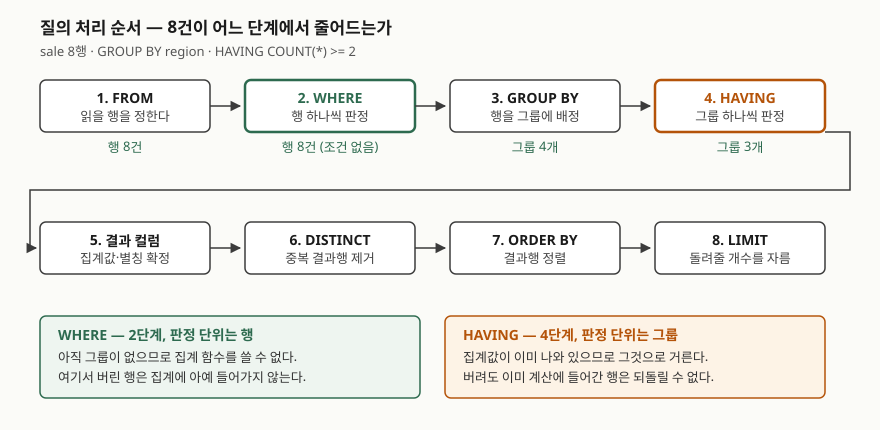

## 들어가며

주문 표에서 "주문이 두 건 이상인 지역"을 뽑아 달라는 요청을 받는다. `GROUP BY region`까지는
쉽게 쓰는데, "두 건 이상"을 어디에 적을지에서 손이 멈춘다. 습관대로 `WHERE COUNT(*) >= 2`를
붙이면 에러가 나고, 에러 문구는 `misuse of aggregate`라고만 말한다.

그래서 많은 사람이 검색 끝에 "집계 조건은 HAVING에 쓴다"는 한 줄을 외우고 넘어간다.
문제는 이 암기가 **조건이 조금만 달라져도 안 통한다는 것**이다. `WHERE`에 쓸 수 있는 조건을
`HAVING`에 써도 대개 에러가 안 나기 때문에, 틀린 자리에 쓴 것을 알아챌 기회가 없다.
암기 대신 **각 절이 질의 처리의 몇 번째 단계에 있는지**를 한 번 그려 두면 매번 판단할 수 있다.

## 개념

`WHERE`와 `HAVING`은 둘 다 조건에 맞지 않는 것을 버린다. 다른 것은 **버리는 대상의 단위**다.

- `WHERE` — **행**을 버린다. 판정할 때 그 행 하나만 본다
- `HAVING` — **그룹**을 버린다. 판정할 때 그 그룹에 속한 행 전부를 본다

`GROUP BY`가 행 여러 개를 그룹 하나로 접기 때문에 이 구분이 생긴다. 접기 **전**에 거는 것이
`WHERE`, 접은 **뒤**에 거는 것이 `HAVING`이다. 그래서 `WHERE`에서는 아직 `COUNT(*)` 같은
집계값이 존재하지 않는다. 집계값은 접는 과정에서 만들어지기 때문이다.

## 구조



> **출처**: 단계의 순서와 각 단계가 하는 일은 SQLite 공식 문서
> [SELECT — WHERE clause filtering](https://www.sqlite.org/lang_select.html#where_clause_filtering_)
> 및 [Generation of the set of result rows](https://www.sqlite.org/lang_select.html#generation_of_the_set_of_result_rows)
> 를 따랐다. 앞 절은 `WHERE` 식이 입력 데이터의 **행마다** 판정된다고 적고, 뒤 절은
> `HAVING`이 **행 그룹마다** 한 번씩 판정되며 거짓이면 그 그룹을 버린다고 적는다.
> 그림의 건수(8행 → 그룹 4개 → 그룹 3개)는 아래 실습에서 나온 실제 출력이다.

## 동작 원리

도식의 순서를 그대로 읽으면 헷갈리던 것이 전부 풀린다.

**`WHERE`는 2단계다.** 3단계인 `GROUP BY`가 아직 안 돌았으므로 집계값이 없다.
그래서 `WHERE COUNT(*) >= 2`는 계산할 값이 없어 실패한다. 실습에서 SQLite는
`misuse of aggregate: COUNT()`를 돌려줬다.

**`HAVING`은 4단계다.** 집계값이 이미 나와 있으니 그것으로 거른다. 대신 **이미 계산에 들어간
행은 되돌릴 수 없다.** `WHERE channel = '온라인'`으로 오프라인 행을 버리면 `SUM`에 그 금액이
아예 안 들어가지만, 같은 조건을 `HAVING`에 적으면 `SUM`은 이미 오프라인까지 더한 뒤다.
**두 절을 바꿔 쓰면 결과 숫자가 달라지는 이유가 이것이다.**

여기서 한 가지가 더 갈린다. `HAVING`에 집계가 아닌 컬럼을 적으면 SQLite는 에러를 내지 않고,
**그 그룹에서 임의로 고른 행 하나**를 기준으로 판정한다. 공식 문서가 그렇게 적는다. 그룹을
나눈 기준 컬럼(`region`)은 그룹 안에서 값이 하나뿐이라 결과가 맞아떨어지지만, 그룹 안에서
값이 갈리는 컬럼(`channel`)을 적으면 **그룹마다 어느 행이 뽑히느냐에 답이 달라진다.**

## 실습 예제

메모리 SQLite에 판매 8건을 넣고 돌렸다. 전체 소스: [`code/having_vs_where.py`](code/having_vs_where.py),
실행 기록: [`code/output.txt`](code/output.txt)

| id | region | channel | amount |
|---|---|---|---|
| 1~3 | 서울 | 온라인·오프라인·온라인 | 120, 80, 200 |
| 4~5 | 부산 | 온라인·오프라인 | 150, 90 |
| 6~7 | 대구 | 온라인·온라인 | 300, NULL |
| 8 | 광주 | 오프라인 | 50 |

### 같은 조건을 어디에 두느냐로 숫자가 갈린다

```text
WHERE channel = '온라인' → GROUP BY region
   ('대구', 2, 300)
   ('부산', 1, 150)
   ('서울', 2, 320)

GROUP BY region → HAVING COUNT(*) >= 2
   ('대구', 2, 300)
   ('부산', 2, 240)
   ('서울', 3, 400)
```

서울을 보면 `WHERE`를 건 쪽은 2건에 320, 안 건 쪽은 3건에 400이다. `WHERE`가 버린 오프라인
80원이 `SUM`에 들어갔는지가 차이다. **집계에 넣을 행을 고르는 것은 `WHERE`이고,
`HAVING`은 이미 나온 결과를 고를 뿐이다.**

### WHERE에 집계 함수를 쓰면 에러다

```text
SELECT region, COUNT(*) AS cnt FROM sale WHERE COUNT(*) >= 2 GROUP BY region
  [에러] OperationalError: misuse of aggregate: COUNT()
```

이건 그나마 친절한 경우다. 바로 멈추므로 잘못 쓴 것을 알 수 있다.

### GROUP BY 없이 HAVING만 쓰면

```text
SELECT COUNT(*), SUM(amount) FROM sale HAVING SUM(amount) > 100
   (8, 990)

SELECT COUNT(*), SUM(amount) FROM sale HAVING SUM(amount) > 100000
   (0건)
```

`GROUP BY`가 없어도 집계 함수가 있으면 **테이블 전체가 그룹 하나**다. 그래서 `HAVING`이
붙는다. 눈여겨볼 것은 아래쪽이다. 집계 질의는 보통 무조건 한 줄을 돌려주는데,
`HAVING`이 거짓이면 **0줄**이 된다. 결과가 항상 한 줄이라고 가정한 코드가 여기서 깨진다.

### 그룹 안에서 값이 갈리는 컬럼을 HAVING에 쓰면

```text
GROUP BY region → HAVING channel = '온라인'
   ('대구', 2, '온라인,온라인')
   ('부산', 2, '온라인,오프라인')
   ('서울', 3, '온라인,오프라인,온라인')
```

부산 그룹에는 오프라인 행이 섞여 있는데 통과했고, 오프라인만 있는 광주는 빠졌다.
**"온라인 주문이 있는 지역"도 "온라인만 있는 지역"도 아닌, 어느 쪽도 아닌 답이다.**
그룹에서 임의로 고른 행이 우연히 온라인이었을 뿐이다. 에러가 안 나므로 그대로 배포된다.
이 조건은 `WHERE`에 적어야 한다.

### 별칭은 어디까지 통하는가

```text
SELECT region, amount AS won FROM sale WHERE won > 250   →  ('대구', 300)
SELECT region, SUM(amount) AS total FROM sale GROUP BY region HAVING total > 250
   →  ('대구', 300) ('서울', 400)
```

둘 다 SQLite에서는 통과한다. 그런데 **표준이 보장하는 동작이 아니다.** PostgreSQL 문서는
출력 컬럼 이름을 `ORDER BY`·`GROUP BY`에서는 쓸 수 있지만 `WHERE`·`HAVING`에서는 쓸 수 없고
식을 그대로 적어야 한다고 명시한다. SQLite에서 돌던 질의가 다른 DBMS로 옮기면 깨지는
대표적인 자리다.

## 실무에서 주의할 점

- **거를 수 있으면 `WHERE`에서 먼저 거른다.** `HAVING`으로 미루면 버릴 행까지 집계에 넣고
  계산한 뒤 버린다. 실습에서 `region` 조건은 인덱스가 있을 때 두 절 모두
  `SEARCH sale USING COVERING INDEX ix_sale_region (region=?)`로 같은 계획이 나왔지만,
  최적화기가 알아서 맞춰 준 것이지 기대할 수 있는 동작은 아니다.
- **`HAVING`에 집계가 아닌 조건을 적지 않는다.** 그룹 기준 컬럼이면 우연히 맞고, 아니면
  조용히 틀린다. "에러가 안 났으니 맞다"가 가장 위험한 자리다.
- **집계 함수는 NULL을 세지 않는다.** 대구 그룹에서 `COUNT(*)`는 2, `COUNT(amount)`는 1,
  `AVG(amount)`는 300.0이었다. 평균의 분모가 2가 아니라 1이다. `HAVING AVG(...) > x`를
  걸 때 이 차이가 곧바로 판정을 뒤집는다.
- **`HAVING`이 붙은 집계 질의는 0줄을 돌려줄 수 있다.** `GROUP BY` 없는 집계라도 그렇다.
  애플리케이션에서 첫 행을 바로 꺼내 쓰는 코드는 여기서 예외를 낸다.
- **별칭을 조건절에 쓰지 않는다.** SQLite와 MySQL에서 되던 것이 PostgreSQL·Oracle에서
  깨진다. 식을 한 번 더 적는 편이 옮길 때 안전하다.

## 정리

- 판정 단위가 다르다. `WHERE`는 행을, `HAVING`은 그룹을 버린다.
- 순서가 다르다. `WHERE`(2단계)는 `GROUP BY`(3단계) 앞이라 집계값이 아직 없고,
  `HAVING`(4단계)은 뒤라서 집계값을 쓸 수 있다.
- 같은 조건을 어디에 두느냐로 숫자가 달라진다. 서울 그룹이 2건 320과 3건 400으로 갈렸다.
- `WHERE`에 집계를 쓰면 에러지만, `HAVING`에 비집계 컬럼을 쓰면 **에러 없이 틀린다.**
  임의로 고른 한 행으로 그룹 전체를 판정한다.
- `GROUP BY` 없는 집계도 `HAVING`이 붙으면 0줄이 나올 수 있다.

## 참고 자료

- [SQLite — SELECT: WHERE clause filtering](https://www.sqlite.org/lang_select.html#where_clause_filtering_) — `WHERE` 식이 입력 행마다 판정되고 참인 행만 다음 단계로 넘어간다는 규정
- [SQLite — SELECT: Generation of the set of result rows](https://www.sqlite.org/lang_select.html#generation_of_the_set_of_result_rows) — `GROUP BY`로 그룹을 만드는 순서, `HAVING`이 그룹마다 판정된다는 것, 비집계 식은 그룹에서 임의로 고른 행 기준으로 평가된다는 것
- [PostgreSQL 16 — SELECT: SELECT List](https://www.postgresql.org/docs/16/sql-select.html) — 출력 컬럼 이름을 `WHERE`·`HAVING`에서 쓸 수 없다는 규정
- [PostgreSQL 16 — Table Expressions: GROUP BY and HAVING](https://www.postgresql.org/docs/16/queries-table-expressions.html#QUERIES-GROUP) — `HAVING`이 그룹을 걸러 내는 절이라는 설명
