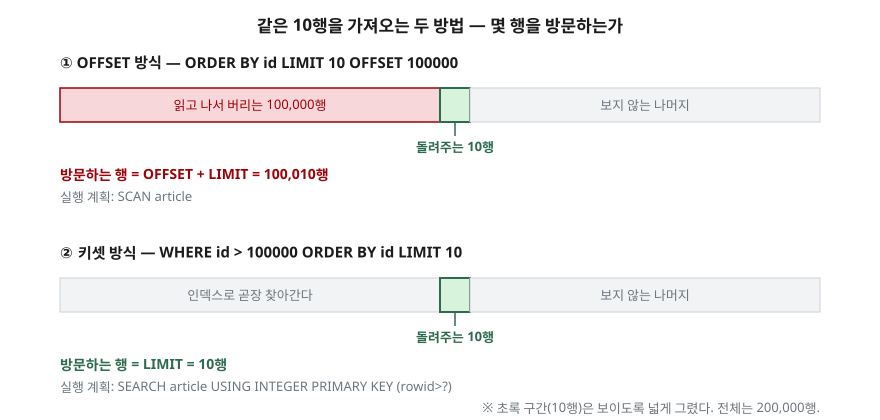

## 들어가며

게시판 목록 화면을 만든다. 글이 20만 개 쌓여 있으니 한 번에 다 내려보낼 수는 없고,
한 페이지에 10개씩 끊어 보여주기로 한다. `LIMIT 10 OFFSET 0`으로 1페이지,
`LIMIT 10 OFFSET 10`으로 2페이지. 잘 돌아간다.

그러다 누가 마지막 페이지로 바로 간다. 주소창의 페이지 번호를 20000으로 바꾼 것뿐인데
화면이 안 뜬다. 이때 대개는 인덱스를 의심하고 `id`에 인덱스를 하나 더 만들어 본다.
그래도 그대로다. 인덱스 문제가 아니기 때문이다.

`OFFSET 199990`은 "199,990번째부터 달라"는 뜻이 아니다. **"앞에서부터 199,990행을 읽고
전부 버린 다음, 그 다음 10행을 달라"**는 뜻이다. 버리는 일에도 값이 매겨진다.

## 개념

`LIMIT`은 결과 행 수에 상한을 두는 절이다. `OFFSET`은 그 앞에서 몇 행을 건너뛸지 정한다.

| 문법 | 뜻 |
|---|---|
| `LIMIT 10` | 앞에서 10행 |
| `LIMIT 10 OFFSET 30` | 30행을 건너뛰고 그 다음 10행 |
| `LIMIT 30, 10` | **같은 뜻이다.** 앞이 OFFSET, 뒤가 개수 |

세 번째 줄을 눈여겨본다. 쉼표 문법은 `OFFSET` 키워드를 쓸 때와 **두 숫자의 순서가
반대다.** SQLite 문서도 이것을 "counter-intuitive"라고 적어 두고, 다른 DB와의 호환을
위해 일부러 그렇게 뒀으니 쉼표 대신 `OFFSET` 키워드를 쓰라고 권한다.

한 가지 더. `LIMIT`에 음수를 주면 오류가 아니라 **상한 없음**이 된다. 상한만 풀리고
`OFFSET`은 그대로 살아 있다.

## 구조



> **출처**: 건너뛴 행까지 방문한다는 것은 SQLite 가상 머신의
> [SQLite Opcodes — OffsetLimit](https://www.sqlite.org/opcode.html#OffsetLimit)에 적혀 있다.
> 이 명령이 `LIMIT`과 `OFFSET`을 더한 값을 계산하며, 그 값이
> "the total number of rows that will need to be visited"라고 설명한다.
> `OFFSET`이 앞의 M행을 버린다는 규정은
> [SQLite — SELECT §5 The LIMIT clause](https://www.sqlite.org/lang_select.html#the_limit_clause)에 있다.
> 아래 두 실행 계획은 실습에서 `EXPLAIN QUERY PLAN`으로 뽑은 것이다.

## 동작 원리

DB가 `LIMIT 10 OFFSET 100000`을 만나면 하는 일은 이렇다.

1. `OFFSET`과 `LIMIT`을 더해 **방문해야 할 행 수**를 먼저 계산한다 (100,010)
2. 행을 하나씩 꺼내면서 카운터를 깎는다. 카운터가 남아 있는 동안은 **꺼낸 행을 버린다**
3. 100,000개를 버리고 나면 그때부터 10행을 결과로 담는다
4. 10행을 채우면 더 읽지 않고 멈춘다

2번이 핵심이다. 버려지는 행도 디스크나 캐시에서 실제로 꺼내진다. 그래서 비용은
**가져오는 행 수가 아니라 건너뛴 행 수를 따라간다.** 페이지 번호가 커질수록
같은 10행을 위해 더 많이 읽는다.

## 실습 예제

20만 행짜리 표를 만들어 `OFFSET`을 키워 가며 돌렸다.
전체 소스: [`code/limit_offset.py`](code/limit_offset.py)

시간은 돌릴 때마다 흔들리므로 **SQLite 가상 머신이 실행한 명령 개수**를 셌다.
`set_progress_handler(tick, 1)`로 명령 하나마다 불리는 콜백을 걸면 된다.
공식 문서가 이 인자를 "the approximate number of virtual machine instructions"로 정의한다.

```
   OFFSET       0  명령        70개  (첫 페이지의    1.0배)     0.0 ms
   OFFSET   1,000  명령     2,070개  (첫 페이지의   29.6배)     0.2 ms
   OFFSET  10,000  명령    20,070개  (첫 페이지의  286.7배)     1.7 ms
   OFFSET 100,000  명령   200,070개  (첫 페이지의 2858.1배)    17.1 ms
   OFFSET 199,990  명령   400,050개  (첫 페이지의 5715.0배)    34.6 ms
```

숫자가 너무 반듯해서 다시 봤다. `70`, `2,070`, `20,070`, `200,070`, `400,050` —
전부 `건너뛴 행 수 × 2 + 70`이다. 건너뛴 행 하나가 명령 정확히 2개다.
"조금씩 느려진다"가 아니라 **건너뛴 행 수에 정비례한다.**

가져오는 행 수는 다섯 번 모두 10행으로 같았다. 비싼 쪽은 가져오는 행이 아니라 버리는 행이다.

같은 10행을 "마지막으로 본 `id` 다음부터"로 바꿔 요청하면 이렇게 된다.

```sql
SELECT id, title FROM article WHERE id > 100000 ORDER BY id LIMIT 10;
```

```
   id >       0   명령        60개     0.0 ms
   id >   1,000   명령        59개     0.0 ms
   id >  10,000   명령        59개     0.0 ms
   id > 100,000   명령        59개     0.0 ms
   id > 199,990   명령        59개     0.0 ms
```

어느 위치든 59개다. 실행 계획도 `SCAN article`에서
`SEARCH article USING INTEGER PRIMARY KEY (rowid>?)`로 바뀐다. 버릴 행을 읽지 않으니
읽을 것이 없다.

### ORDER BY 없는 LIMIT은 어느 행인지 정해져 있지 않다

`LIMIT 3`만 쓰고 `ORDER BY`를 빠뜨리면 "아무거나 3개"가 아니라 **"그때그때 다른 3개"**다.
질의는 그대로 두고 상관없는 컬럼에 인덱스 하나만 만들어 다시 돌렸다.

```
   인덱스 없음       결과 [1, 2, 3]
                계획 SCAN article
   인덱스 생성 후     결과 [1000, 2000, 3000]
                계획 SCAN article USING COVERING INDEX ix_article_view_count
```

돌려준 글이 통째로 바뀌었다. SQLite 문서가 `ORDER BY`가 없으면 행 순서는 정의되지 않는다고
못박아 둔 그대로다. **페이지를 나눌 생각이라면 `ORDER BY`는 선택이 아니다.**

## 실무에서 주의할 점

- **쉼표 문법은 쓰지 않는다.** `LIMIT 30, 10`은 30개가 아니라 10개를 돌려준다.
  공식 문서도 `OFFSET` 키워드 쪽을 쓰라고 권한다. 쉼표 문법은 SQLite와 MySQL에만 있다.
  PostgreSQL 16은 `LIMIT n OFFSET m`만 받고, Oracle 19c에는 `LIMIT` 키워드가 아예 없어
  `OFFSET m ROWS FETCH NEXT n ROWS ONLY`를 쓴다.
- **OFFSET이 커지는 화면이면 키셋 방식을 쓴다.** 무한 스크롤이나 "다음" 버튼처럼
  순서대로만 넘어가는 화면은 `WHERE id > 마지막_id`로 바꿀 수 있다.
  반대로 "37페이지로 점프"가 필요한 화면은 키셋으로 못 옮긴다.
- **정렬 키가 동점이면 페이지가 겹치거나 빠진다.** `ORDER BY created_at`만 쓰고
  같은 시각의 글이 여럿이면, 1페이지에 나온 글이 2페이지에 또 나오거나 아예 사라진다.
  `ORDER BY created_at DESC, id DESC`처럼 동점을 가르는 키까지 적는다.
- **전체 개수를 함께 세지 않는다.** 페이지 번호를 그리려고 매번 `COUNT(*)`를 돌리면
  목록 질의보다 그쪽이 더 비싸지는 일이 흔하다. `LIMIT 11`로 한 행 더 받아
  "다음 페이지 있음"만 판단하는 방법이 있다.
- **음수 LIMIT은 제한을 푼다.** 변수로 `LIMIT ?`를 넘기는 코드에서 `-1`이 흘러들면
  20만 행이 전부 올라온다. 오류로 막아 주지 않으니 코드에서 검사한다.

## 정리

- `LIMIT`은 돌려줄 행의 상한, `OFFSET`은 그 앞에서 버릴 행 수다.
- `OFFSET`이 버리는 행도 실제로 읽는다. 방문 행 수는 `OFFSET + LIMIT`이다.
- 건너뛴 행 하나당 가상 머신 명령이 정확히 2개씩 늘어나는 것을 20만 행에서 확인했다.
- `WHERE id > 마지막_id` 방식은 위치와 무관하게 명령 59개로 일정했다.
- `ORDER BY` 없는 `LIMIT`은 인덱스 하나에 결과가 통째로 바뀐다. 동점을 가르는 키까지 적는다.

## 참고 자료

- [SQLite — SELECT §5 The LIMIT clause](https://www.sqlite.org/lang_select.html#the_limit_clause)
- [SQLite — SELECT §4 The ORDER BY clause](https://www.sqlite.org/lang_select.html#the_order_by_clause)
- [SQLite Opcodes — OffsetLimit](https://www.sqlite.org/opcode.html#OffsetLimit)
- [SQLite C Interface — sqlite3_progress_handler](https://www.sqlite.org/c3ref/progress_handler.html)
- [PostgreSQL 16 — §7.6 LIMIT and OFFSET](https://www.postgresql.org/docs/16/queries-limit.html)
- [MySQL 8.0 Reference Manual — SELECT Statement](https://dev.mysql.com/doc/refman/8.0/en/select.html)
