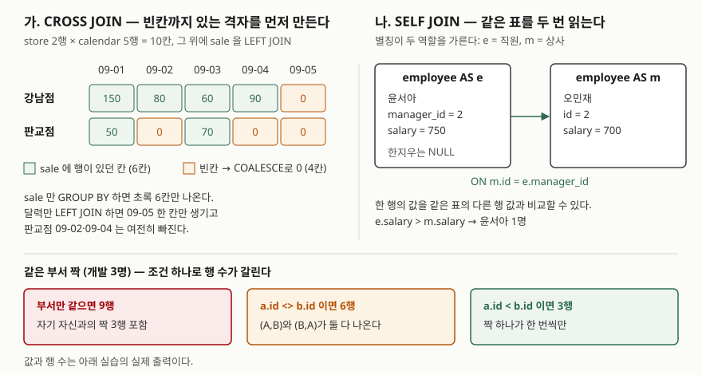

## 들어가며

매장별 일 매출 그래프를 그려 달라는 요청을 받고 `GROUP BY 매장, 날짜`로 뽑아 넘긴다.
그래프를 본 사람이 "판교점은 2일과 4일 매출이 없었는데 왜 선이 그냥 이어지느냐"고 묻는다.
매출이 없던 날은 행 자체가 없으니 결과에도 없고, 그래프 도구는 있는 점끼리 선을 잇는다.
흔히 하는 대처는 결과를 스프레드시트로 옮겨 빠진 날짜를 손으로 끼워 넣는 것인데,
매장 2곳 닷새면 10칸이지만 매장 40곳 한 달이면 1,200칸을 맞춰 봐야 한다.
이 빈칸을 SQL이 먼저 만들게 하는 것이 `CROSS JOIN`의 대표적인 쓰임이다.

## 개념

**`CROSS JOIN`** 은 조건 없이 두 표의 행을 모두 짝짓는 조인이다. 왼쪽이 N행, 오른쪽이 M행이면
결과는 N×M행이다. 이런 조합 전체를 **카티전 곱**이라 부른다. PostgreSQL 문서는
`FROM T1 CROSS JOIN T2`가 `FROM T1, T2`(쉼표 조인), `FROM T1 INNER JOIN T2 ON TRUE`와
같다고 적는다. 다른 조인과 달리 `ON`이 없다.

**`SELF JOIN`** 은 새 문법이 아니다. 같은 표를 `FROM`에 두 번 쓰고 **별칭을 달리 붙인** 조인이다.
`employee AS e`와 `employee AS m`은 같은 표지만 SQL 안에서는 서로 다른 두 표처럼 다뤄진다.
그래서 한 행의 값(직원의 `manager_id`)을 같은 표의 다른 행 값(상사의 `id`)과 맞출 수 있다.
별칭 없이는 두 쪽을 구분할 방법이 없으므로 PostgreSQL 문서도 자기 자신과 조인할 때는
별칭이 필요하다고 적는다.

## 구조



> **출처**: 행 수(N×M)와 쉼표 조인과의 동치는 PostgreSQL 16 공식 문서
> [Table Expressions — Joined Tables](https://www.postgresql.org/docs/16/queries-table-expressions.html#QUERIES-JOIN),
> 자기 조인에 별칭이 필요하다는 점은 같은 문서의
> [Table and Column Aliases](https://www.postgresql.org/docs/16/queries-table-expressions.html#QUERIES-TABLE-ALIASES)
> 를 따랐다. 칸의 값과 행 수는 아래 실습의 실제 출력이다.

## 동작 원리

날짜 채우기는 세 단계로 된다. 먼저 **있어야 할 칸 전체**를 만든다. 매장 표와 날짜 목록을
`CROSS JOIN`하면 매출과 상관없이 10칸이 생긴다. 다음으로 그 격자에 매출을 `LEFT JOIN`한다.
`LEFT JOIN`은 짝이 없는 왼쪽 행도 남기므로 매출 없는 칸은 매출 컬럼이 NULL인 채로 남는다.
마지막으로 `COALESCE(SUM(...), 0)`이 NULL을 0으로 바꾼다.

핵심은 **왼쪽에 무엇을 두느냐**다. 결과에 나올 칸은 `LEFT JOIN`의 왼쪽이 정한다.
날짜 목록만 왼쪽에 두면 "어느 매장이든 매출이 있던 날"이 기준이 되어, 한 매장이라도 팔았던
날은 다른 매장의 빈칸이 만들어지지 않는다. 매장과 날짜를 둘 다 왼쪽에 두려면 둘을 먼저
`CROSS JOIN`해야 한다.

`SELF JOIN`은 조인이 하는 일이 다른 조인과 똑같다. 다른 점은 짝을 찾는 대상이 같은 표라는
것뿐이다. 그래서 짝이 없는 행(상사가 없는 대표)을 남기려면 `LEFT JOIN`을 쓰고, 짝이 중복되지
않게 하려면 조건으로 직접 막아야 한다.

## 실습 예제

메모리 SQLite에 매장 2곳, 매출 7건, 직원 5명을 넣었다. 전체 소스:
[`code/cross_and_self_join.py`](code/cross_and_self_join.py), 실행 기록:
[`code/output.txt`](code/output.txt)

```text
  id | store_id | sold_on    | amount
  ---+----------+------------+-------
   1 |        1 | 2026-09-01 |    120
   2 |        1 | 2026-09-01 |     30
   3 |        1 | 2026-09-02 |     80
   4 |        1 | 2026-09-03 |     60
   5 |        1 | 2026-09-04 |     90
   6 |        2 | 2026-09-01 |     50
   7 |        2 | 2026-09-03 |     70

  id | name   | manager_id | dept | salary
  ---+--------+------------+------+-------
   1 | 한지우 |       NULL | 경영 |    900
   2 | 오민재 |          1 | 개발 |    700
   3 | 윤서아 |          2 | 개발 |    750
   4 | 장하준 |          2 | 개발 |    500
   5 | 임채원 |          1 | 영업 |    600
```

위가 `sale`, 아래가 `employee`다. 매장은 1번 강남점, 2번 판교점이다. 날짜 목록은 따로 표를
두지 않고 재귀 CTE로 09-01부터 닷새를 만들었다. 아래 출력은 실행 기록에서 SQL 줄을 빼고
결과만 옮겼다.

### 빠진 날짜 채우기

```text
[2-A sale 만 GROUP BY]
  ('강남점', '2026-09-01', 150)
  ('강남점', '2026-09-02', 80)
  ('강남점', '2026-09-03', 60)
  ('강남점', '2026-09-04', 90)
  ('판교점', '2026-09-01', 50)
  ('판교점', '2026-09-03', 70)
  -> 6행

[2-C 매장 CROSS JOIN 달력 LEFT JOIN sale]
  ('강남점', '2026-09-01', 150)
  ('강남점', '2026-09-02', 80)
  ('강남점', '2026-09-03', 60)
  ('강남점', '2026-09-04', 90)
  ('강남점', '2026-09-05', 0)
  ('판교점', '2026-09-01', 50)
  ('판교점', '2026-09-02', 0)
  ('판교점', '2026-09-03', 70)
  ('판교점', '2026-09-04', 0)
  ('판교점', '2026-09-05', 0)
  -> 10행
```

2-C는 매장 2 × 날짜 5 = 10행이 빠짐없이 나온다. 중간 단계인 `CROSS JOIN`만 돌린 1-A도 10행이었다.

그 사이에 둔 2-B가 앞에서 말한 함정이다. 날짜 목록만 왼쪽에 두고 매출을 `LEFT JOIN`했다.

```text
[2-B 달력 LEFT JOIN sale (매장 구분 없이)]
  ('2026-09-01', 1, 150)
  ('2026-09-01', 2, 50)
  ('2026-09-02', 1, 80)
  ('2026-09-03', 1, 60)
  ('2026-09-03', 2, 70)
  ('2026-09-04', 1, 90)
  ('2026-09-05', None, 0)
  -> 7행
```

두 매장 모두 매출이 없던 09-05만 한 줄 생겼고, 그 줄의 매장 번호는 `None`(NULL)이다.
판교점의 09-02·09-04는 **그날 강남점이 팔았기 때문에** 여전히 빠져 있다.

### 조건을 빠뜨린 쉼표 조인

```text
[3-A 조인 조건 있음]
  ('강남점', 380)
  ('판교점', 120)
  -> 2행

[3-B 조인 조건 빠짐]
  ('강남점', 500)
  ('판교점', 500)
  -> 2행
```

쉼표 조인에서 `WHERE s.store_id = t.id`를 빠뜨리면 에러 없이 `CROSS JOIN`이 된다. 매장마다
매출 7건 전부가 붙어서 두 매장 모두 전체 합계 500이 나왔다. 행 수(2행)가 그럴듯해서
숫자를 보기 전에는 알아채기 어렵다.

### 직원과 상사

```text
[4-A INNER JOIN]
  ('오민재', '한지우')
  ('윤서아', '오민재')
  ('장하준', '오민재')
  ('임채원', '한지우')
  -> 4행

[4-B LEFT JOIN]
  ('한지우', None)
  ('오민재', '한지우')
  ('윤서아', '오민재')
  ('장하준', '오민재')
  ('임채원', '한지우')
  -> 5행

[4-C 상사보다 급여가 많은 직원]
  ('윤서아', 750, '오민재', 700)
  -> 1행
```

`INNER JOIN`으로 쓰면 `manager_id`가 NULL인 대표 한지우가 빠진다. 전 직원 목록이 필요하면
`LEFT JOIN`으로 쓴다. 4-C처럼 **같은 표의 두 행을 한 줄에 놓고 비교하는 일**이 `SELF JOIN`의
본래 쓰임이다.

### 같은 부서 짝

개발 부서 세 명의 짝을 뽑았다. 조건 하나가 행 수를 9 → 6 → 3으로 바꿨다.

```text
[5-B a.id <> b.id]
  ('오민재', '윤서아')
  ('오민재', '장하준')
  ('윤서아', '오민재')
  ('윤서아', '장하준')
  ('장하준', '오민재')
  ('장하준', '윤서아')
  -> 6행

[5-C a.id < b.id]
  ('오민재', '윤서아')
  ('오민재', '장하준')
  ('윤서아', '장하준')
  -> 3행
```

부서만 같으면 되는 5-A는 자기 자신과의 짝까지 9행이 나왔다. `<>`로 자신을 빼도
(오민재, 윤서아)와 (윤서아, 오민재)가 둘 다 남는다. `<`로 바꾸면 짝마다 한 번만 나온다.

### SQLite에서는 CROSS JOIN이 표 순서를 고정한다

같은 결과를 내는 두 질의를 `store`부터 적어 비교했다. 결과는 둘 다 7행으로 같았다.

```text
[6-A store INNER JOIN sale]
  QUERY PLAN
  |--SCAN s
  `--SEARCH t USING INTEGER PRIMARY KEY (rowid=?)

[6-B store CROSS JOIN sale]
  QUERY PLAN
  |--SCAN t
  |--BLOOM FILTER ON s (store_id=?)
  `--SEARCH s USING AUTOMATIC COVERING INDEX (store_id=?)
```

예상하지 못한 차이였다. 6-A는 적은 순서와 달리 `sale`(s)을 먼저 훑고 매장을 기본키로 찾았다.
6-B는 적은 순서대로 `store`(t)를 먼저 훑었고, `sale`에 쓸 인덱스가 없으니 질의 도중에
**임시 인덱스(`AUTOMATIC COVERING INDEX`)를 만들어** 썼다. SQLite 문서는 `CROSS JOIN`으로 묶인
표의 순서를 옵티마이저가 절대 바꾸지 않는다고 적는다. 개발자가 순서를 직접 정하는 수단으로
남겨 둔 것이다. 이것은 SQLite의 규칙이고, 조인 순서를 어떻게 정하는지는 DB마다 다르다.

## 실무에서 주의할 점

- **`CROSS JOIN`은 행 수를 먼저 계산하고 쓴다.** 매장 40 × 365일은 14,600행이지만 고객 1만 명
  × 상품 1만 개는 1억 행이다. 격자는 작은 목록끼리 만든다.
- **쉼표 조인보다 `JOIN ... ON`으로 쓴다.** 조건을 빠뜨린 쉼표 조인은 3-B처럼 에러 없이
  곱을 만든다. `ON`을 쓰면 조건이 빠진 자리가 눈에 띈다. 곱이 목적이면 `CROSS JOIN`이라고 적어
  의도를 드러낸다.
- **날짜 채우기에서 기준 목록은 전부 `LEFT JOIN`의 왼쪽에 둔다.** 날짜만 왼쪽에 두면 2-B처럼
  다른 매장이 판 날의 빈칸이 안 생긴다.
- **`SELF JOIN`의 짝 조건은 `<`로 쓴다.** `<>`는 같은 짝을 두 번 내고, 조건이 없으면 자기
  자신과도 짝을 짓는다. n명이면 n², n(n-1), n(n-1)/2행으로 갈린다.
- **SQLite에서 `CROSS JOIN`은 단순한 표기가 아니다.** 표 순서를 고정하므로, 곱이 목적이 아닌
  질의에 습관처럼 쓰면 6-B처럼 옵티마이저가 더 나은 순서를 고르지 못한다.

## 정리

- `CROSS JOIN`은 조건 없이 N×M행을 만든다. 쉼표 조인에서 조건을 빠뜨린 것과 같다.
- 빠진 날짜를 채울 때는 매장×날짜 격자를 `CROSS JOIN`으로 만들고 매출을 `LEFT JOIN`한 뒤
  `COALESCE`로 0을 넣는다.
- `SELF JOIN`은 같은 표에 별칭을 둘 붙여 한 행을 다른 행과 비교하는 조인이다.
- 짝을 뽑을 때 `<`를 쓰면 중복이 없다. 짝 없는 행을 남기려면 `LEFT JOIN`을 쓴다.
- SQLite는 `CROSS JOIN`으로 묶인 표의 순서를 바꾸지 않는다.

## 참고 자료

- [PostgreSQL 16 — Table Expressions: Joined Tables](https://www.postgresql.org/docs/16/queries-table-expressions.html#QUERIES-JOIN) — `CROSS JOIN`의 행 수(N×M)와 `FROM T1, T2`·`INNER JOIN ... ON TRUE`와의 동치
- [PostgreSQL 16 — Table Expressions: Table and Column Aliases](https://www.postgresql.org/docs/16/queries-table-expressions.html#QUERIES-TABLE-ALIASES) — 자기 자신과 조인할 때 별칭이 필요하다는 설명
- [SQLite — The SQLite Query Optimizer Overview: Manual Control of Query Plans using CROSS JOIN](https://www.sqlite.org/optoverview.html#manual_control_of_query_plans_using_cross_join) — `CROSS JOIN`으로 묶인 표는 순서를 바꾸지 않는다는 규정
- [SQLite — The SQLite Query Optimizer Overview: Automatic Query-Time Indexes](https://www.sqlite.org/optoverview.html#autoindex) — 질의 도중 임시 인덱스를 만드는 동작
- [SQLite — The WITH Clause: Recursive Common Table Expressions](https://www.sqlite.org/lang_with.html#recursive_common_table_expressions) — 날짜 목록을 만든 재귀 CTE
