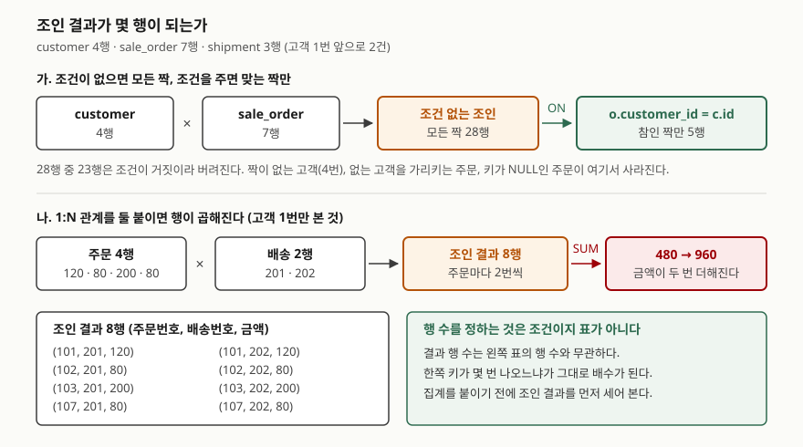

## 들어가며

고객 표와 주문 표를 따로 만들어 두고 한동안 잘 쓰다가, "고객 이름과 주문 금액을 같이
보여 달라"는 요청을 받는다. 두 표에 나눠 담은 것을 다시 합쳐야 하는 순간이다.

흔히 택하는 방법이 두 가지다. 하나는 고객을 조회하고 그 결과를 돌면서 주문을 고객마다
한 번씩 더 조회하는 것이다. 고객이 1,000명이면 질의가 1,001번 나간다. 다른 하나는
`FROM customer, sale_order`라고 쓰고 조건을 빠뜨리는 것이다. 이쪽은 질의가 한 번인데,
고객 4명과 주문 7건으로도 결과가 **28행**이 되어 돌아온다.

두 표를 합치는 일은 `INNER JOIN` 한 문장이면 되는데, 이 문장이 **행 수를 어떻게 정하는지**를
모르면 결과가 맞는지 틀린지 판단할 수가 없다.

## 개념

조인은 두 표의 행을 짝지어 하나의 넓은 행으로 만드는 연산이다. 여기서 두 가지를 정해야 한다.

- **어떤 짝을 만들 것인가** — 조인 조건(`ON` 또는 `USING`)이 정한다
- **짝이 안 맞는 행을 어떻게 할 것인가** — 조인 종류가 정한다

`INNER JOIN`은 뒤쪽 질문에 "버린다"고 답하는 종류다. 왼쪽에만 있는 행도, 오른쪽에만 있는
행도 결과에 남지 않는다. 짝이 맞은 것만 나온다.

**조인 조건이 없는 조인**은 `CROSS JOIN`이라 부르고, 결과는 두 표의 모든 짝이다.
PostgreSQL 문서는 두 표가 각각 N행과 M행이면 조인된 표가 N × M행이 된다고 적는다.
그리고 `FROM T1, T2`라고 쉼표로 적는 것은 `FROM T1 CROSS JOIN T2`와 같고, 이것은 다시
`FROM T1 INNER JOIN T2 ON TRUE`와 같다. **조인 조건을 빼먹은 `INNER JOIN`은 문법 오류가
아니라 `CROSS JOIN`이다.** 에러가 안 나는 이유가 이것이다.

## 구조



> **출처**: 행 수 규칙은 PostgreSQL 16 공식 문서
> [Table Expressions — Joined Tables](https://www.postgresql.org/docs/16/queries-table-expressions.html#QUERIES-JOIN)
> 를 따랐다. 같은 절이 `CROSS JOIN`에 대해 "두 표가 N행과 M행이면 조인된 표는 N × M행이
> 된다"고 적고, 조건이 붙은 조인에 대해 "T1의 각 행 R1마다, 조인된 표는 R1과 조인 조건을
> 만족하는 T2의 행마다 한 행씩을 가진다"고 적는다. 그림의 건수(28행 → 5행, 8행, 480 → 960)는
> 아래 실습에서 나온 실제 출력이다.

## 동작 원리

도식의 왼쪽에서 오른쪽으로 읽으면 된다. **조인은 먼저 모든 짝을 만들고, 조건으로 거른다.**
실제 엔진이 28개 짝을 전부 만들어 놓고 버리지는 않지만(그건 최적화기가 알아서 한다),
결과가 무엇이 될지를 따질 때는 이 순서로 읽는 것이 맞다.

그러면 결과 행 수는 이렇게 정해진다. 왼쪽 표의 행 하나마다, 조건을 만족하는 오른쪽 행의
개수만큼 결과 행이 생긴다. 오른쪽에 맞는 행이 **0개면 그 왼쪽 행은 사라지고**, **3개면
그 왼쪽 행이 3번 반복된다.** 결과 행 수가 왼쪽 표의 행 수보다 적을 수도, 많을 수도 있는
이유가 이것이다.

조건 `o.customer_id = c.id`는 **참일 때만** 짝을 남긴다는 점도 함께 본다. 한쪽이 NULL이면
비교 결과는 참이 아니라 NULL이고, NULL은 참이 아니므로 짝이 안 된다. SQLite 문서는 `IS`가
`=`와 달리 양쪽이 모두 NULL일 때 1(참)로 평가된다고 적는다. **NULL끼리도 `=`로는 짝이
되지 않는다.**

## 실습 예제

메모리 SQLite에 고객 4명·주문 7건·배송 3건을 넣고 돌렸다. 전체 소스:
[`code/inner_join_basics.py`](code/inner_join_basics.py), 실행 기록:
[`code/output.txt`](code/output.txt)

고객은 1~4번, 주문은 101~107번이다. 4번 고객은 주문이 없고, 105번 주문은 존재하지 않는
9번 고객을 가리키며, 106번 주문은 `customer_id`가 NULL이다. 배송은 1번 고객 앞으로 2건,
2번 고객 앞으로 1건이다.

### 조건이 없으면 모든 짝이 나온다

```text
SELECT COUNT(*) FROM customer CROSS JOIN sale_order            (28,)
SELECT COUNT(*) FROM customer, sale_order                      (28,)
SELECT COUNT(*) FROM customer INNER JOIN sale_order ON 1 = 1   (28,)
```

세 가지 표기가 전부 4 × 7 = 28을 돌려준다. 문서가 같다고 적은 대로다. **`INNER JOIN`이라고
써 놓고 `ON`을 빠뜨리거나 `ON 1=1`처럼 항상 참인 조건을 주면 결과는 `CROSS JOIN`이다.**

### 조건을 주면 맞는 짝만 남는다

```text
SELECT c.name, o.id, o.amount FROM customer AS c
INNER JOIN sale_order AS o ON o.customer_id = c.id ORDER BY o.id
   ('김서준', 101, 120)
   ('김서준', 102, 80)
   ('김서준', 103, 200)
   ('이하윤', 104, 150)
   ('김서준', 107, 80)
   -> 5행
```

28행이 5행으로 줄었다. 고객은 4명인데 결과는 5행이고, 김서준은 4번 나온다. **결과 행 수가
고객 수와 무관하다**는 것이 여기서 그대로 보인다.

쉼표로 적고 `WHERE`에 같은 조건을 넣어도 5행으로 같다. `INNER JOIN`에서는 조건을 `ON`에
두든 `WHERE`에 두든 결과가 같다. (`LEFT JOIN`에서는 달라지는데, 그건 다른 글의 주제다.)

### 짝이 없는 행 세 가지

```text
c.id = 4  (주문이 없는 고객)          -> 0건
o.id = 105 (없는 고객을 가리키는 주문) -> 0건
o.id = 106 (customer_id 가 NULL)      -> 0건
```

셋 다 조용히 사라진다. 에러도, 경고도 없다. **`INNER JOIN` 결과의 행 수를 원본 표의 행 수와
맞춰 보지 않으면 데이터가 빠진 것을 알 방법이 없다.**

NULL은 한 번 더 확인해 볼 값이 있다. 같은 표를 자기 자신과 조인해 106번 행끼리 짝지어 봤다.

```text
SELECT COUNT(*) FROM sale_order AS a
INNER JOIN sale_order AS b ON a.customer_id = b.customer_id
WHERE a.id = 106 AND b.id = 106                              (0,)
```

같은 행인데도 0건이다. 양쪽 `customer_id`가 둘 다 NULL이라 `=` 비교가 참이 되지 않는다.

### 합계가 두 배가 되는 자리

여기가 실무에서 가장 자주 틀리는 곳이다. 1번 고객의 주문 금액 합계를 두 가지 방법으로 냈다.

```text
SELECT SUM(amount) FROM sale_order WHERE customer_id = 1                  (480,)

SELECT SUM(o.amount) FROM sale_order AS o
INNER JOIN shipment AS s ON s.customer_id = o.customer_id
WHERE o.customer_id = 1                                                   (960,)
```

배송 표를 붙였을 뿐인데 합계가 두 배다. 조인 결과를 그대로 보면 이유가 보인다.

```text
(101, 201, 120)   (101, 202, 120)
(102, 201, 80)    (102, 202, 80)
(103, 201, 200)   (103, 202, 200)
(107, 201, 80)    (107, 202, 80)
   -> 8행
```

주문 4건이 배송 2건과 각각 짝지어져 8행이 됐고, 모든 금액이 두 번씩 더해졌다.
**배송이 3건이었다면 세 배가 됐을 것이다.** 배수는 조인한 쪽에 같은 키가 몇 번
나오느냐로 정해진다.

이럴 때 `DISTINCT`를 붙여 덮으려는 시도를 자주 본다. 그것도 돌려 봤다.

```text
SELECT SUM(DISTINCT o.amount) FROM sale_order AS o
INNER JOIN shipment AS s ON s.customer_id = o.customer_id
WHERE o.customer_id = 1                                                   (400,)
```

**480도 960도 아닌 세 번째 답이 나왔다.** 102번과 107번의 금액이 둘 다 80이라 `DISTINCT`가
서로 다른 주문을 같은 값으로 보고 하나만 남겼기 때문이다. 중복 행이 아니라 중복 **값**을
지운 것이다. 금액이 우연히 전부 달랐다면 480이 나와 고쳐진 것처럼 보였을 텐데, 그게 더 나쁘다.

### 조인 키 인덱스가 언제 쓰이는가

```text
[인덱스 없음]
QUERY PLAN
|--SCAN o
`--SEARCH c USING INTEGER PRIMARY KEY (rowid=?)

[sale_order(customer_id) 에 인덱스를 만든 뒤]  — 계획이 같다
QUERY PLAN
|--SCAN o
`--SEARCH c USING INTEGER PRIMARY KEY (rowid=?)

[WHERE c.city = '서울' 을 붙이면]
QUERY PLAN
|--SCAN c
`--SEARCH o USING INDEX ix_sale_order_customer_id (customer_id=?)
```

예상과 달랐던 부분이다. 조인 키에 인덱스를 만들었는데 실행계획이 그대로였다. SQLite가
주문을 훑으면서 고객을 기본키로 찾는 순서를 골랐고, 그 순서에서는 `sale_order`의 인덱스를
쓸 자리가 없다. 고객 쪽을 조건으로 먼저 좁혀 주자 순서가 뒤집히고 인덱스가 쓰였다.
**인덱스는 만들었다고 쓰이는 것이 아니라, 그것을 쓰는 조인 순서가 골라져야 쓰인다.**

## 실무에서 주의할 점

- **조인을 쓴 질의는 결과 행 수를 먼저 세어 본다.** 원본 표의 행 수보다 많으면 어딘가에서
  1:N이 곱해진 것이다. 실습에서 주문 4건이 배송 2건과 만나 8행이 됐다.
- **집계 함수를 조인 위에 바로 얹지 않는다.** `SUM`·`COUNT`·`AVG`가 전부 배수만큼 틀린다.
  집계할 쪽을 먼저 서브쿼리로 집계한 뒤 조인하거나, 조인을 하나만 건다.
- **`DISTINCT`로 덮지 않는다.** 실습에서 480이 나와야 할 자리에 400이 나왔다. 값이 같은
  서로 다른 행까지 지우기 때문이다. 문제는 중복 행이지 중복 값이 아니다.
- **`INNER JOIN`은 데이터를 조용히 버린다.** 짝이 없는 행, 없는 키를 가리키는 행, 키가
  NULL인 행이 전부 에러 없이 사라진다. 조인 키에는 가능하면 `NOT NULL`을 걸고, 빠진 것이
  없는지는 `LEFT JOIN`으로 한 번 돌려 개수를 비교해 본다.
- **쉼표 조인을 쓰지 않는다.** `INNER JOIN ... ON`으로 쓰면 조인 조건과 필터 조건이
  자리로 구분되고, `ON`을 빠뜨리면 문법이 어색해서 눈에 띈다. 쉼표 조인은 조건을
  빠뜨려도 멀쩡한 문장으로 보인다.

## 정리

- `INNER JOIN`은 조건에 맞는 짝만 남긴다. 왼쪽에만 있든 오른쪽에만 있든 버려진다.
- 조인 조건이 없으면 모든 짝이다. 4행과 7행이 28행이 됐다. 쉼표 조인도, `ON 1=1`도 같다.
- 결과 행 수는 원본 표의 행 수와 무관하다. 오른쪽에 맞는 행이 3개면 왼쪽 행이 3번 반복된다.
- 1:N을 둘 붙이면 곱해진다. 합계가 480에서 960으로 두 배가 됐다.
- `DISTINCT`는 해결책이 아니다. 같은 자리에서 400이라는 세 번째 틀린 답이 나왔다.
- NULL 키는 무엇과도, 자기 자신과도 짝이 되지 않는다.

## 참고 자료

- [PostgreSQL 16 — Table Expressions: Joined Tables](https://www.postgresql.org/docs/16/queries-table-expressions.html#QUERIES-JOIN) — `CROSS JOIN`의 결과가 N × M행이라는 규정, 조건이 붙은 조인에서 왼쪽 행마다 조건을 만족하는 오른쪽 행 수만큼 결과 행이 생긴다는 규정, 쉼표 조인이 `CROSS JOIN`과 같다는 규정, `USING`이 같은 이름의 컬럼에 등호 조건을 만들어 준다는 설명
- [SQLite — SELECT: Determination of input data (FROM clause processing)](https://www.sqlite.org/lang_select.html#determination_of_input_data_from_clause_processing_) — `FROM` 절이 조인을 처리해 입력 데이터를 정하는 단계
- [SQLite — Expressions: Operators](https://www.sqlite.org/lang_expr.html#operators_and_parse_affecting_attributes) — `IS`가 `=`와 달리 양쪽이 NULL일 때 참으로 평가된다는 규정. `=`는 그렇지 않다
- [SQLite — Query Planning: EXPLAIN QUERY PLAN](https://www.sqlite.org/eqp.html) — `SCAN`·`SEARCH` 표기와 조인 순서가 실행계획에 나타나는 방식
