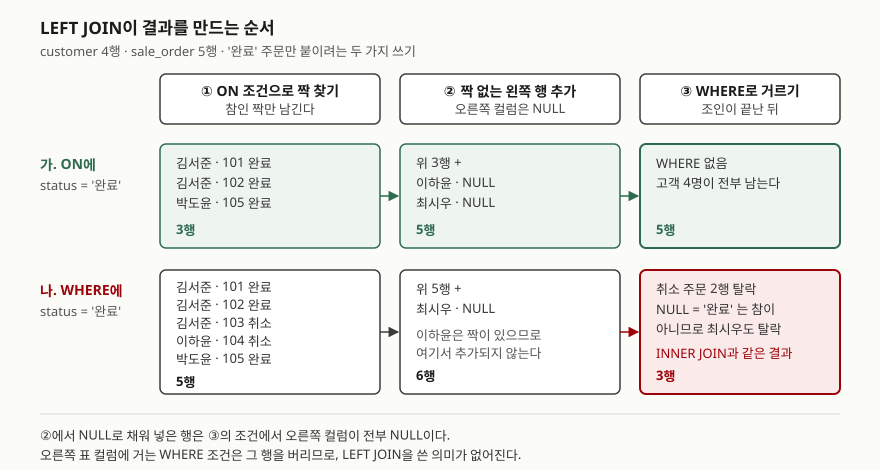

## 들어가며

고객별 주문 수를 뽑아 달라는 요청을 받고 `INNER JOIN`으로 짰더니, 주문이 한 건도 없는 고객이
목록에서 빠졌다는 답이 돌아온다. 그래서 `LEFT JOIN`으로 바꾸고, 완료된 주문만 세야 하니
`WHERE o.status = '완료'`를 붙인다. 결과를 보면 주문 없는 고객이 **또** 빠져 있다.

이때 흔히 하는 일은 `OR o.id IS NULL`을 덧붙이거나, 고객 목록을 따로 뽑아 스프레드시트에서
맞춰 보는 것이다. 고객이 4명이면 눈으로 맞출 수 있지만 4만 명이면 그럴 수 없고, 앞의 방법은
아래 실습에서 보듯 **한 명을 여전히 빠뜨린다.** 원인은 조건을 어느 자리에 썼느냐 하나다.

## 개념

`LEFT JOIN`(정식 이름은 `LEFT OUTER JOIN`)은 왼쪽 표의 행을 **하나도 버리지 않는** 조인이다.

- 오른쪽에 짝이 있는 왼쪽 행은 `INNER JOIN`과 똑같이 짝지어 나온다
- 짝이 없는 왼쪽 행도 버리지 않고 한 번 나온다. 이때 **오른쪽 표의 컬럼은 전부 NULL**로 채운다

PostgreSQL 문서는 이것을 두 단계로 적는다. 먼저 `INNER JOIN`을 수행하고, 그다음 오른쪽의
어떤 행과도 조건을 만족하지 못한 왼쪽 행마다 오른쪽 컬럼을 NULL로 채운 행을 추가한다.
그래서 결과에는 왼쪽 표의 행이 **적어도 한 번씩** 들어 있다.

여기서 "왼쪽"은 `FROM`에 먼저 쓴 표다. `customer LEFT JOIN sale_order`면 고객이 전부 남고,
순서를 바꿔 쓰면 주문이 전부 남는다.

## 구조



> **출처**: 조인 단계는 PostgreSQL 16 공식 문서
> [Table Expressions — Joined Tables](https://www.postgresql.org/docs/16/queries-table-expressions.html#QUERIES-JOIN)
> 의 `LEFT OUTER JOIN` 정의(내부 조인 후 짝 없는 왼쪽 행을 NULL로 채워 추가)와, 같은 절의
> "`ON` 조건은 조인 전에, `WHERE` 조건은 조인 후에 처리된다"는 설명을 따랐다.
> 그림의 행과 건수는 아래 실습의 실제 출력이다.

## 동작 원리

도식의 ①→②→③ 순서가 전부다. 핵심은 **②에서 NULL로 채워 넣은 행이 ③을 거친다**는 점이다.

`ON`에 쓴 조건은 ①에서 쓰인다. "짝으로 인정할 것인가"를 정하므로, 조건에 안 맞으면 짝이
안 될 뿐 왼쪽 행은 ②에서 살아남는다. 이하윤은 취소 주문밖에 없어서 ①에서 짝을 못 찾았고,
②에서 NULL 행으로 돌아왔다.

`WHERE`에 쓴 조건은 ③에서 쓰인다. 이미 만들어진 행을 버릴지 말지를 정한다. ②에서 추가된
최시우 행은 `status`가 NULL이고, `NULL = '완료'`는 참이 아니라 NULL이다. `WHERE`는 참인
행만 남기므로 최시우는 버려진다. 결국 **오른쪽 표 컬럼에 거는 `WHERE` 조건은 ②가 한 일을
되돌린다.** 결과가 `INNER JOIN`과 같아지는 이유다.

## 실습 예제

메모리 SQLite에 고객 4명, 주문 5건, 배송 2건을 넣었다. 전체 소스:
[`code/left_join_basics.py`](code/left_join_basics.py), 실행 기록:
[`code/output.txt`](code/output.txt)

```text
  id | name
  ---+-------
   1 | 김서준
   2 | 이하윤
   3 | 박도윤
   4 | 최시우

  id  | customer_id | status | amount | coupon_code
  ----+-------------+--------+--------+------------
  101 |           1 | 완료   |    120 | WELCOME
  102 |           1 | 완료   |     80 | NULL
  103 |           1 | 취소   |    200 | NULL
  104 |           2 | 취소   |    150 | WELCOME
  105 |           3 | 완료   |     90 | NULL
```

이하윤은 취소 주문만 있고, 최시우는 주문이 없다. 배송(`shipment`)은 101번과 105번 주문에만
잡혀 있다. 아래 출력은 실행 기록에서 SQL 줄을 빼고 결과만 옮겼다. 파이썬에서 SQL의 NULL은
`None`으로 보인다.

### 조건을 어디에 쓰는가

`INNER JOIN`은 5행, 조건 없는 `LEFT JOIN`은 최시우 한 행이 더 붙어 6행이다. 여기에 "완료 주문만"
이라는 조건을 세 가지 자리에 넣어 봤다.

```text
[2-A 조건을 WHERE 에]
  ('김서준', 101, '완료')
  ('김서준', 102, '완료')
  ('박도윤', 105, '완료')
  -> 3행

[2-B 조건을 ON 에]
  ('김서준', 101, '완료')
  ('김서준', 102, '완료')
  ('이하윤', None, None)
  ('박도윤', 105, '완료')
  ('최시우', None, None)
  -> 5행

[2-C WHERE 에 OR IS NULL 을 덧붙이면]
  ('김서준', 101, '완료')
  ('김서준', 102, '완료')
  ('박도윤', 105, '완료')
  ('최시우', None, None)
  -> 4행
```

2-A는 `LEFT JOIN`이라고 써 놓고 `INNER JOIN`과 같은 3행을 냈다. 2-B가 원하던 답이다.

**2-C가 이 글에서 가장 놓치기 쉬운 결과다.** 자주 권하는 "고친 방법"인데 이하윤이 빠졌다.
이하윤은 ①에서 104번 주문과 짝이 됐으므로 ②에서 NULL 행이 생기지 않는다. ③에 도착한 것은
`('이하윤', 104, '취소')` 한 행뿐이고, 이 행은 `'완료'`도 아니고 `o.id`가 NULL도 아니다.
**`OR IS NULL`은 주문이 아예 없는 고객만 살리고, 조건에 안 맞는 주문만 있는 고객은 못 살린다.**

### 실행계획에서 LEFT JOIN이 사라진다

```text
[7-A LEFT JOIN, 조건을 ON 에]
  QUERY PLAN
  |--SCAN c
  |--BLOOM FILTER ON o (customer_id=? AND status=?)
  `--SEARCH o USING AUTOMATIC PARTIAL COVERING INDEX (customer_id=? AND status=?) LEFT-JOIN

[7-B LEFT JOIN, 조건을 WHERE 에]
  QUERY PLAN
  |--SCAN o
  `--SEARCH c USING INTEGER PRIMARY KEY (rowid=?)
```

예상하지 못한 결과였다. 7-A는 끝에 `LEFT-JOIN` 표시가 붙고 고객을 먼저 훑는다. 7-B는 그 표시가
없고 **주문을 먼저 훑은 뒤 고객을 찾는다.** 왼쪽 표를 전부 남겨야 하는 조인이라면 오른쪽 표부터
훑는 순서는 성립하지 않는다. SQLite 문서는 `WHERE`가 참이 되려면 오른쪽 표의 어떤 컬럼이 NULL이
아니어야 하는 경우 `LEFT JOIN`을 일반 조인으로 낮춘다고 적는다. **엔진도 2-A를 `INNER JOIN`으로
읽은 것이다.**

### 고객별로 셀 때

```text
[3-A COUNT(*)]
  ('김서준', 2)
  ('이하윤', 1)
  ('박도윤', 1)
  ('최시우', 1)

[3-B COUNT(o.id)]
  ('김서준', 2)
  ('이하윤', 0)
  ('박도윤', 1)
  ('최시우', 0)

[3-C SUM 은 0 이 아니라 NULL]
  ('김서준', 200, 200)
  ('이하윤', None, 0)
  ('박도윤', 90, 90)
  ('최시우', None, 0)
```

`COUNT(*)`는 행을 세므로 NULL로 채운 행도 1로 센다. 완료 주문이 없는 두 사람이 1건으로 나왔다.
`COUNT(o.id)`는 NULL이 아닌 값만 세서 0이 나온다. `SUM`은 더할 값이 하나도 없으면 0이 아니라
NULL을 돌려주므로(3-C의 가운데 칸), 화면에 0을 보여야 하면 `COALESCE(SUM(o.amount), 0)`으로
바꾼다(오른쪽 칸).

### 주문 없는 고객 찾기

```text
[4-A 키 컬럼으로 IS NULL]
  ('최시우',)
  -> 1행

[4-B 비어 있을 수 있는 컬럼으로 IS NULL]
  ('김서준', 102)
  ('김서준', 103)
  ('박도윤', 105)
  ('최시우', None)
  -> 4행
```

`LEFT JOIN` 뒤에 `IS NULL`을 걸면 짝이 없는 행을 찾을 수 있다. 단 **원래 NULL이 될 수 없는
컬럼**(기본키나 `NOT NULL` 컬럼)으로 검사해야 한다. 4-B는 원래 비어 있을 수 있는 쿠폰 컬럼을
썼다가, 쿠폰 없이 주문한 사람까지 뽑았다. 같은 뜻을 `NOT EXISTS`로 쓴 4-C도 최시우 1행을 냈다.

### 뒤에 INNER JOIN을 이으면

```text
[6-B 이어서 INNER JOIN shipment]
  ('김서준', 101, 301)
  ('박도윤', 105, 302)
  -> 2행

[6-C 이어서 LEFT JOIN shipment]
  ('김서준', 101, 301)
  ('김서준', 102, None)
  ('이하윤', None, None)
  ('박도윤', 105, 302)
  ('최시우', None, None)
  -> 5행
```

2-B의 5행 뒤에 배송 표를 `INNER JOIN`으로 붙이자 2행이 됐다. 이하윤·최시우 행은 `o.id`가
NULL이라 어떤 배송과도 짝이 안 되고, 102번은 배송이 없어서 사라졌다. 앞에서 공들여 남긴 행을
뒤의 조인 하나가 전부 지운다. 뒤도 `LEFT JOIN`으로 이으면 5행이 유지된다.

## 실무에서 주의할 점

- **오른쪽 표 조건은 `ON`에, 왼쪽 표 조건은 `WHERE`에 쓴다.** 거꾸로 왼쪽 표 조건 `c.id = 1`을
  `ON`에 쓰면 고객이 걸러지지 않는다. 실습 5-B에서 1번 고객만 보려던 질의가 나머지 세 명을
  NULL 행으로 달고 6행을 냈다(`WHERE`에 쓴 5-A는 3행).
- **`OR IS NULL`로 고치지 않는다.** 2-C처럼 조건에 안 맞는 짝만 가진 행을 빠뜨린다.
  조건을 `ON`으로 옮기는 것이 맞다.
- **`LEFT JOIN` 위의 집계는 `COUNT(오른쪽 키)`로 센다.** `COUNT(*)`는 없는 것을 1로 센다.
  합계는 NULL이 나올 수 있으니 `COALESCE`를 붙인다.
- **짝 없는 행은 키 컬럼으로 찾는다.** 비어 있을 수 있는 컬럼으로 `IS NULL`을 검사하면
  데이터가 우연히 채워져 있을 때만 맞는다.
- **`LEFT JOIN` 뒤의 조인도 `LEFT JOIN`으로 잇는다.** 중간에 `INNER JOIN`이 하나 끼면 6-B처럼
  앞에서 남긴 NULL 행이 거기서 전부 사라진다.

## 정리

- `LEFT JOIN`은 짝이 없는 왼쪽 행도 오른쪽 컬럼을 NULL로 채워 한 번 남긴다.
- `ON`은 조인 전에 짝을 고르고, `WHERE`는 조인 후에 행을 버린다.
- 오른쪽 표 조건을 `WHERE`에 쓰면 NULL 행이 버려져 `INNER JOIN`이 된다. SQLite는 실행계획에서
  실제로 일반 조인으로 바꿨다.
- `OR IS NULL`은 해결책이 아니다. 취소 주문만 있는 고객이 빠졌다.
- `COUNT(*)` 대신 `COUNT(오른쪽 키)`, 짝 없는 행은 키 컬럼의 `IS NULL`이나 `NOT EXISTS`로 찾는다.

## 참고 자료

- [PostgreSQL 16 — Table Expressions: Joined Tables](https://www.postgresql.org/docs/16/queries-table-expressions.html#QUERIES-JOIN) — `LEFT OUTER JOIN`의 정의, `ON` 조건과 `WHERE` 조건의 처리 시점 차이
- [SQLite — The SQLite Query Optimizer Overview: The OUTER JOIN Strength Reduction Optimization](https://www.sqlite.org/optoverview.html#the_outer_join_strength_reduction_optimization) — `WHERE`가 오른쪽 컬럼의 NULL 아님을 요구하면 `LEFT JOIN`을 일반 조인으로 낮춘다는 규정
- [SQLite — Built-in Aggregate Functions: count()](https://www.sqlite.org/lang_aggfunc.html#count) — `count(X)`가 NULL이 아닌 값만 세고 `count(*)`는 행을 센다는 규정
- [SQLite — Built-in Aggregate Functions: sum() and total()](https://www.sqlite.org/lang_aggfunc.html#sumunc) — 입력이 전부 NULL이면 `sum()`은 NULL을 돌려준다는 규정
- [SQLite — Query Planning: EXPLAIN QUERY PLAN](https://www.sqlite.org/eqp.html) — `SCAN`·`SEARCH` 표기와 조인 순서가 실행계획에 나타나는 방식
