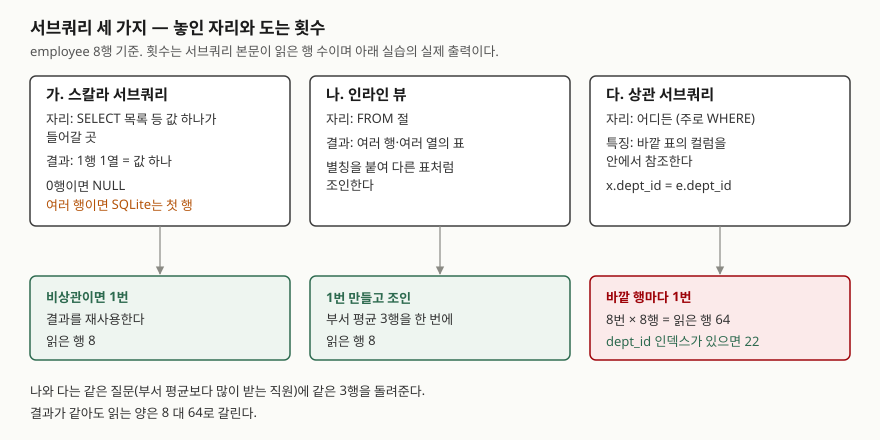

## 들어가며

"부서 평균보다 급여를 많이 받는 사람을 뽑아 달라"는 요청을 받는다. 처음 떠오르는 방법은 두 번에
나눠 하는 것이다. 부서별 평균을 먼저 뽑아 메모장에 적어 두고, 그 숫자를 부서마다 손으로 넣어
`WHERE dept_id = 10 AND salary > 600` 같은 질의를 따로 돌린다. 부서가 3개면 질의 4번이고 부서가
40개면 41번이다. 그사이 누가 급여를 고치면 적어 둔 평균은 이미 틀린 값이 된다.
질의 안에 다른 질의를 넣는 **서브쿼리**를 쓰면 이것이 한 번에 끝난다.

## 개념

**서브쿼리**는 괄호로 감싸 다른 SQL 안에 넣은 `SELECT` 문이다. 놓이는 자리와 돌려주는 모양에 따라
세 가지로 나눠 부른다.

| 이름 | 놓이는 자리 | 돌려주는 것 |
|---|---|---|
| 스칼라 서브쿼리 | `SELECT` 목록, `WHERE`의 비교 식 등 값 하나가 들어갈 곳 | 1행 1열, 즉 값 하나 |
| 인라인 뷰 | `FROM` 절 | 여러 행·여러 열의 표 |
| 상관 서브쿼리 | 어디든 | 바깥 질의의 컬럼을 안에서 참조하는 서브쿼리 |

셋은 같은 기준으로 나눈 것이 아니다. 스칼라와 인라인 뷰는 **자리**로 나눈 이름이고, 상관은
**바깥을 참조하느냐**로 나눈 이름이다. 그래서 "상관 스칼라 서브쿼리"처럼 겹칠 수 있다.
바깥을 참조하지 않는 서브쿼리는 비상관(uncorrelated) 서브쿼리라 부른다.

## 구조



> **출처**: 서브쿼리 값의 규칙(0행이면 NULL, 여러 행이면 첫 행)과 상관 서브쿼리의 재평가는
> [SQLite — SQL Language Expressions: Subquery Expressions](https://www.sqlite.org/lang_expr.html#subquery_expressions)와
> [Correlated Subqueries](https://www.sqlite.org/lang_expr.html#correlated_subqueries),
> 인라인 뷰의 처리 방식은 [SQLite Query Optimizer Overview: Subquery Co-routines](https://www.sqlite.org/optoverview.html#subquery_co_routines)
> 를 따랐다. 읽은 행 수는 아래 실습의 실제 출력이다.

## 동작 원리

**비상관 서브쿼리**는 바깥 행과 상관없이 값이 같다. SQLite 문서는 이런 서브쿼리를 한 번만
계산하고 결과를 다시 쓴다고 적는다. 회사 전체 평균을 8행 옆에 붙여도 평균 계산은 한 번이다.

**상관 서브쿼리**는 바깥 행의 값을 받아야 계산할 수 있다. `x.dept_id = e.dept_id`에서 `e.dept_id`는
바깥 행이 바뀔 때마다 달라지므로 서브쿼리도 **바깥 행마다 다시 돈다**. 문서도 결과가 필요할 때마다
다시 계산한다고 적는다. 서브쿼리 안에 인덱스가 없으면 한 번 돌 때마다 표 전체를 훑는다.

**인라인 뷰**는 `FROM` 절 안에서 표 하나를 만들어 낸다. 부서 평균 3행을 한 번 만들고, 그 결과를
보통 표처럼 조인한다. SQLite는 이 서브쿼리를 **코루틴**(co-routine)으로 돌린다. 결과를 전부 쌓아 두지
않고 바깥 질의가 요구할 때 한 행씩 만들어 넘기는 방식이다.

## 실습 예제

메모리 SQLite에 부서 3개와 직원 8명을 넣었다. 서브쿼리의 `WHERE`에 호출될 때마다 1씩 세는 함수
`tick()`을 넣어, 서브쿼리 본문이 행을 몇 번 읽었는지 찍었다. 전체 소스:
[`code/subquery_kinds.py`](code/subquery_kinds.py), 실행 기록: [`code/output.txt`](code/output.txt)

```text
  id | name   | dept_id | salary
  ---+--------+---------+-------
   1 | 한지우 |      10 |    700
   2 | 오민재 |      10 |    500
   3 | 윤서아 |      10 |    600
   4 | 장하준 |      20 |    400
   5 | 임채원 |      20 |    800
   6 | 서도윤 |      20 |    600
   7 | 배수아 |      30 |    450
   8 | 문태오 |      30 |    550
```

부서 10·20·30은 각각 개발·영업·인사다. 부서 평균은 600, 600, 500이다.

### 스칼라 서브쿼리

```text
[1-A 회사 평균을 옆 칸에]
  ('한지우', 700, 575.0)
  ...
  ('문태오', 550, 575.0)
  -> 8행, tick() 호출 8회

[1-C 결과가 0행이면 NULL]
  ('개발', None)
  ('영업', '임채원')
  ('인사', None)

[1-D 결과가 여러 행이면? (SQLite)]
  ('개발', '한지우')
  ('영업', '장하준')
  ('인사', '배수아')
```

1-A는 8행에 평균을 붙였지만 `tick()`은 8회, 즉 표를 **한 번** 훑었다. 1-C는 750을 넘는 사람이 없는
부서에 NULL이 들어갔다. 1-D는 서브쿼리가 부서마다 여러 명을 돌려주는데도 에러 없이 **첫 행**만
썼다. SQLite 문서에 적힌 규칙이다. PostgreSQL 문서는 같은 상황을 에러로 정한다. 이 부분은
PostgreSQL에서 돌려 보지 않았다.

### 상관 서브쿼리와 인라인 뷰

같은 질문을 두 방식으로 풀었다.

```sql
-- 상관 서브쿼리
WHERE e.salary > (SELECT AVG(x.salary) FROM employee AS x
                  WHERE tick() AND x.dept_id = e.dept_id)
-- 인라인 뷰
INNER JOIN (SELECT dept_id, AVG(salary) AS avg_salary
            FROM employee WHERE tick() GROUP BY dept_id) AS d
        ON d.dept_id = e.dept_id
WHERE e.salary > d.avg_salary
```

```text
[2-A 부서 평균보다 많이 받는 직원]
  ('한지우', 10, 700)
  ('임채원', 20, 800)
  ('문태오', 30, 550)
  -> 3행, tick() 호출 64회

[3-B 같은 질문을 인라인 뷰로]
  ('한지우', 10, 700, 600.0)
  ('임채원', 20, 800, 600.0)
  ('문태오', 30, 550, 500.0)
  -> 3행, tick() 호출 8회
```

결과 3명은 같다. 읽은 행은 64 대 8이다. 64는 바깥 8행 × 안쪽 8행이다. 부서는 3개뿐인데
서브쿼리는 **바깥 행 수만큼 8번** 돌았다. 같은 부서 값이 다시 와도 앞의 결과를 쓰지 않았다.

처음에는 `tick()`을 조건 뒤에 뒀는데 22회가 나왔다(2-B). `x.dept_id = e.dept_id`가 거짓인 행에서는
뒤쪽 `tick()`까지 가지 않기 때문이다. 22는 "부서가 맞은 행 수"(3×3 + 3×3 + 2×2)였고, 훑은 행 수를
보려면 `tick()`을 앞에 둬야 했다.

### 실행계획

```text
[4-A 스칼라 (비상관)]
  QUERY PLAN
  |--SCAN e
  `--SCALAR SUBQUERY 1
     `--SCAN employee

[4-B 상관]
  QUERY PLAN
  |--SCAN e
  `--CORRELATED SCALAR SUBQUERY 1
     `--SCAN x

[4-C 인라인 뷰]
  QUERY PLAN
  |--CO-ROUTINE d
  |  |--SCAN employee
  |  `--USE TEMP B-TREE FOR GROUP BY
  |--SCAN e
  |--BLOOM FILTER ON d (dept_id=?)
  `--SEARCH d USING AUTOMATIC COVERING INDEX (dept_id=?)
```

실행계획이 두 서브쿼리를 이름부터 구분한다. 4-B의 `CORRELATED`가 "바깥 행마다 다시 돈다"는
표시이고, 그 아래 `SCAN x`가 매번 표 전체를 훑는다는 뜻이다. 4-C는 `CO-ROUTINE d`로 부서 평균을
만든 뒤 바깥 `e`와 조인했다.

`dept_id`에 인덱스를 만들면 4-B의 `SCAN x`가 `SEARCH x USING INDEX ix_employee_dept_id (dept_id=?)`로
바뀌고 읽은 행은 64에서 22로 줄었다. 서브쿼리가 8번 도는 것은 그대로지만, 매번 해당 부서 행만 찾아간다.

## 실무에서 주의할 점

- **상관 서브쿼리는 바깥 행 수 × 안쪽 비용이다.** 8행에서는 64였지만 바깥이 1만 행이고 안쪽에 인덱스가
  없으면 1만 번 표를 훑는다. 실행계획에 `CORRELATED`가 보이면 안쪽이 `SEARCH`인지부터 확인한다.
- **그룹마다 같은 값을 구하는 경우는 인라인 뷰로 바꾼다.** 부서 평균처럼 바깥 행이 달라도 그룹이
  같으면 값이 같은 계산은 3-B처럼 한 번 만들어 조인하면 읽는 양이 표 크기만큼으로 줄어든다.
- **스칼라 서브쿼리가 여러 행을 돌려줘도 SQLite는 조용히 넘어간다.** 1-D처럼 첫 행을 쓰고 에러가 없다.
  어느 행이 첫 행인지도 정해져 있지 않으므로, 한 행이 보장되지 않으면 `MAX()`나 `LIMIT 1`과
  `ORDER BY`로 무엇을 가져올지 적는다.
- **0행이면 NULL이 들어온다.** `WHERE salary > (서브쿼리)`에서 서브쿼리가 NULL이면 비교 결과도
  참이 아니므로 그 행은 조용히 빠진다. 없는 `id = 99`를 비교 대상으로 둔 1-E는 에러 없이 0행이었다.

## 정리

- 서브쿼리는 자리에 따라 스칼라(값 하나)·인라인 뷰(`FROM` 절의 표)로, 바깥 참조 여부에 따라
  상관·비상관으로 나뉜다.
- 비상관 서브쿼리는 한 번 계산하고, 상관 서브쿼리는 바깥 행마다 다시 계산한다.
- 같은 질문에서 상관 서브쿼리는 64행, 인라인 뷰는 8행을 읽었다. 인덱스가 있으면 상관 쪽은 22행이다.
- SQLite의 스칼라 서브쿼리는 0행이면 NULL, 여러 행이면 첫 행을 쓴다.

## 참고 자료

- [SQLite — SQL Language Expressions: Subquery Expressions](https://www.sqlite.org/lang_expr.html#subquery_expressions) — 서브쿼리 값이 첫 행이고 0행이면 NULL이라는 규칙
- [SQLite — SQL Language Expressions: Correlated Subqueries](https://www.sqlite.org/lang_expr.html#correlated_subqueries) — 상관 서브쿼리를 결과가 필요할 때마다 다시 계산한다는 설명
- [SQLite — The SQLite Query Optimizer Overview: Subquery Co-routines](https://www.sqlite.org/optoverview.html#subquery_co_routines) — `FROM` 절 서브쿼리를 한 행씩 만들어 넘기는 방식
- [SQLite — The SQLite Query Optimizer Overview: Automatic Query-Time Indexes](https://www.sqlite.org/optoverview.html#autoindex) — 4-C의 `AUTOMATIC COVERING INDEX`
- [PostgreSQL 16 — Value Expressions: Scalar Subqueries](https://www.postgresql.org/docs/16/sql-expressions.html#SQL-SYNTAX-SCALAR-SUBQUERIES) — 여러 행을 돌려주는 스칼라 서브쿼리를 에러로 정한 규정
