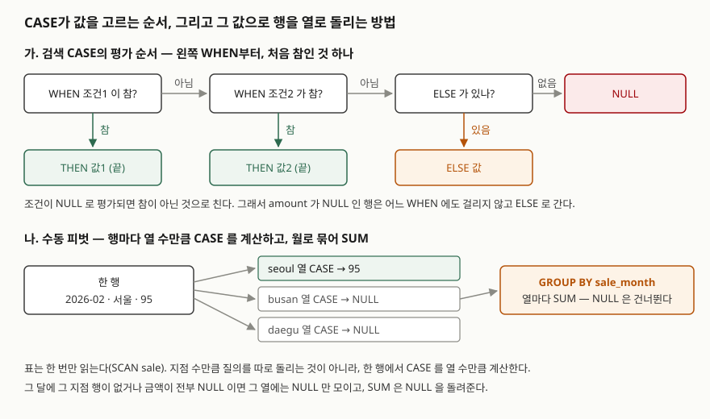

## 들어가며

매출이 한 건에 한 줄씩 쌓인 표가 있고, 팀장이 "월을 줄로, 지점을 칸으로 놓은 표"를 달라고 한다.
SQL로 할 줄 모르면 보통 지점마다 `WHERE branch = '서울'` 질의를 따로 돌려 결과를 엑셀에 옆으로
붙인다. 지점이 세 곳이면 세 번, 열 곳이면 열 번이다. 질의가 늘어날 때마다 표를 처음부터 다시
읽고, 붙여 넣다 한 칸이 밀리면 숫자가 다른 지점 밑으로 들어간다. `CASE` 식을 쓰면 표를 한 번만
읽고 같은 모양을 질의 하나로 만든다.

## 개념

**CASE 식**은 조건에 따라 다른 값을 돌려주는 식이다. 프로그래밍 언어의 `if … else`에 해당하고,
`SELECT` 목록·`WHERE`·`ORDER BY`처럼 값이 들어갈 수 있는 자리 어디에나 쓴다. 모양은 두 가지다.

| 형태 | 쓰는 법 | 하는 일 |
|---|---|---|
| **검색 CASE** | `CASE WHEN 조건 THEN 값 … ELSE 값 END` | `WHEN` 뒤의 조건이 참인지 본다 |
| **단순 CASE** | `CASE 식 WHEN 값 THEN 값 … ELSE 값 END` | `CASE` 뒤의 식이 `WHEN` 뒤의 값과 같은지(`=`) 본다 |

**피벗**(pivot)은 행으로 늘어선 값을 열로 돌려 세우는 일이다. SQLite에는 피벗 전용 문법이 없어서
`CASE`와 집계 함수(`SUM`, `COUNT`처럼 여러 행을 하나의 값으로 묶는 함수)를 함께 써서 만든다.

## 구조



> **출처**: 평가 순서·`ELSE`가 없을 때의 NULL·NULL 조건을 참이 아닌 것으로 친다는 규칙은 [SQLite — SQL Language Expressions §7 The CASE expression](https://www.sqlite.org/lang_expr.html#the_case_expression),
> 집계 함수가 NULL을 다루는 방식은 [SQLite — Built-in Aggregate Functions: Descriptions](https://www.sqlite.org/lang_aggfunc.html#descriptions_of_built_in_aggregate_functions)를 따랐다.
> 피벗이 표를 한 번만 읽는다는 부분은 아래 3-D 실행계획에서 확인한 것이다.

## 동작 원리

SQLite 문서는 검색 CASE를 이렇게 정한다. `WHEN`을 **왼쪽부터** 하나씩 평가해, **처음으로 참이 된
`WHEN`의 `THEN` 값**을 돌려준다. 참인 것이 없으면 `ELSE` 값을, `ELSE`도 없으면 NULL을 돌려준다.
뒤에 참인 `WHEN`이 더 있어도 보지 않는다. 그래서 `WHEN`을 쓰는 **순서가 곧 규칙**이다.

두 가지를 더 적는다.

- 조건의 결과가 NULL이면 **참이 아닌 것**으로 친다. `amount >= 100`에서 `amount`가 NULL이면 조건이
  NULL이 되고, 그 `WHEN`은 건너뛴다.
- 단순 CASE는 `CASE 식`과 `WHEN 값`을 `=` 연산자로 비교한다. `NULL = NULL`은 참이 아니므로
  `WHEN NULL`은 **어떤 행에도 맞지 않는다.**

피벗은 이 규칙을 열마다 한 번씩 쓴다. 한 행을 읽을 때 `seoul`·`busan`·`daegu` 세 열의 CASE를 각각
계산해, 자기 지점이면 금액을, 아니면 NULL을 낸다. 그다음 월로 묶어 `SUM`을 하면 `SUM`이 NULL을
건너뛰므로 열마다 그 지점 금액만 더해진다.

## 실습 예제

메모리 SQLite에 매출 9건을 넣었다. **부산은 2월에 매출 행이 없고**, 대구 3월(9번 행)은 행은 있지만
**금액이 아직 확정되지 않아 NULL**이다. 이 두 칸이 글의 중심이다.
전체 소스: [`code/case_when_pivot.py`](code/case_when_pivot.py), 실행 기록: [`code/output.txt`](code/output.txt)

```text
  id | sale_month | branch | amount
  ---+------------+--------+-------
   1 | 2026-01    | 서울   |    120
   2 | 2026-01    | 서울   |     80
   3 | 2026-01    | 부산   |     40
   4 | 2026-01    | 대구   |     55
   5 | 2026-02    | 서울   |     95
   6 | 2026-02    | 대구   |     30
   7 | 2026-03    | 서울   |     60
   8 | 2026-03    | 부산   |    150
   9 | 2026-03    | 대구   |   NULL
```

### WHEN 순서가 결과를 바꾼다

1-A는 `>= 100`을 먼저, 1-B는 `>= 50`을 먼저 썼다. 조건은 같고 순서만 다르다.
두 결과 모두 1번 행과 8·9번 행만 옮겼다(나머지 행은 두 결과가 같다).

```text
[1-A 검색 CASE — 위에서부터 첫 번째로 맞는 WHEN]
  id | amount | size_grade
  (1, 120, '대형')
  (8, 150, '대형')
  (9, None, '소형')

[1-B WHEN 순서를 뒤집으면]
  id | amount | size_grade
  (1, 120, '중형')
  (8, 150, '중형')
  (9, None, '소형')
```

1-B에서 120과 150이 '중형'이 됐다. 120은 `>= 50`에서 먼저 참이 되어 거기서 끝났고, `>= 100`까지 가지
않았다. 범위를 나누는 CASE는 **좁은 조건을 위에** 둔다.

9번 행도 본다. 금액이 NULL인데 두 경우 모두 **'소형'**이다. 두 `WHEN` 모두 NULL로 평가돼 건너뛰었고
`ELSE`로 떨어졌다. 금액을 모르는 매출이 소형으로 분류된 것이다. `ELSE`를 빼면(1-C) 조건에 맞지 않는
행이 전부 `None`이 된다.

### 단순 CASE로는 NULL을 찾지 못한다

```text
[2-A 단순 CASE 로 NULL 을 찾으면]
  id | amount | state
  (8, 150, '확정')
  (9, None, '확정')

[2-B 검색 CASE 에 IS NULL]
  id | amount | state
  (8, 150, '확정')
  (9, None, '미확정')
```

2-A는 `CASE amount WHEN NULL THEN '미확정'`이다. 에러 없이 돌지만 9번 행도 '확정'이다.
`amount = NULL`로 비교했기 때문이다. NULL은 검색 CASE에서 `IS NULL`로 찾는다(2-B).

### 행을 열로 돌린다

```text
[3-B CASE 피벗 — ELSE 없음]
  sale_month | seoul | busan | daegu
  ('2026-01', 200, 40, 55)
  ('2026-02', 95, None, 30)
  ('2026-03', 60, 150, None)

[3-C CASE 피벗 — ELSE 0]
  sale_month | seoul | busan | daegu
  ('2026-01', 200, 40, 55)
  ('2026-02', 95, 0, 30)
  ('2026-03', 60, 150, 0)

[3-D CASE 피벗의 실행계획]
  QUERY PLAN
  |--SCAN sale
  `--USE TEMP B-TREE FOR GROUP BY
```

실행계획에 `SCAN sale`이 한 줄이다. 지점이 셋이어도 표는 한 번 읽는다.

3-B의 `None` 두 칸은 뜻이 다르다. 2월 `busan`은 **행이 없어서**, 3월 `daegu`는 **행은 있는데 금액이
NULL이어서** 비었다. 3-C처럼 `ELSE 0`을 붙이면 두 칸이 모두 0이 된다. 2월 부산은 "매출 없음"이니 맞지만,
3월 대구는 **금액을 아직 모르는데 0원으로 확정된 것처럼** 보인다. `ELSE 0`은 빈칸을 보기 좋게 채우는
대신 이 구분을 지운다.

### 건수를 셀 때 ELSE 0을 붙이면

```text
[4-A COUNT(CASE ... THEN 1 END)]
  sale_month | seoul_cnt
  ('2026-01', 2)
  ('2026-02', 1)
  ('2026-03', 1)

[4-B COUNT(CASE ... THEN 1 ELSE 0 END)]
  sale_month | seoul_cnt
  ('2026-01', 4)
  ('2026-02', 2)
  ('2026-03', 3)
```

`COUNT(식)`은 식이 NULL이 **아닌** 행을 센다. 4-A는 서울이 아니면 NULL이라 서울만 셌다. 4-B는 서울이
아니어도 0을 냈고, 0은 NULL이 아니므로 **그 달의 모든 행**을 셌다. 1월 서울은 2건인데 4가 나왔다.
합계(`SUM`)에서는 `ELSE 0`이 결과를 안 바꾸는 경우가 많아서, 같은 습관을 `COUNT`에 옮기다 틀린다.

SQLite는 집계 함수에 `FILTER (WHERE …)`를 붙이는 문법도 받는다. 4-C에서 `COUNT(*) FILTER (WHERE branch = '서울')`이
4-A와 같은 2, 1, 1을 냈다. 다른 DB로 옮길 질의라면 그 DB가 `FILTER`를 지원하는지 먼저 본다.

## 실무에서 주의할 점

- **범위 조건은 좁은 것부터 쓴다.** CASE는 처음 참인 `WHEN`에서 멈춘다. `>= 50`을 `>= 100`보다 위에 두면
  '대형'은 한 건도 나오지 않고, 에러도 나지 않는다.
- **NULL이 들어올 수 있는 컬럼이면 `WHEN … IS NULL`을 맨 위에 둔다.** 그러지 않으면 NULL은 모든 `WHEN`을
  건너뛰고 `ELSE`로 간다. 9번 행이 '소형'이 된 이유다.
- **단순 CASE에 `WHEN NULL`을 쓰지 않는다.** 문법 오류가 아니라서 아무도 모른 채 넘어간다.
- **피벗에 `ELSE 0`을 붙일지는 빈칸의 뜻을 보고 정한다.** "없음"과 "모름"을 구분해야 하는 보고서라면
  `ELSE`를 빼고 NULL을 남긴다. `COUNT`에는 `ELSE 0`을 붙이지 않는다.
- **피벗의 열은 질의에 적은 만큼만 생긴다.** 지점이 새로 생겨도 질의에 그 지점의 CASE를 추가하기 전에는
  열이 생기지 않는다. 지점 목록이 자주 바뀌면 피벗 전 모양(3-A)으로 받아 프로그램에서 돌리는 편이 낫다.

## 정리

- CASE는 `WHEN`을 왼쪽부터 평가해 처음 참인 것의 `THEN`을 돌려주고, 없으면 `ELSE`, 그것도 없으면 NULL이다.
- 조건이 NULL이면 참이 아닌 것으로 치므로 NULL 행은 `ELSE`로 떨어지고, 단순 CASE의 `WHEN NULL`은 맞지 않는다.
- `SUM(CASE WHEN 지점 THEN 금액 END)`를 열마다 쓰면 표를 한 번만 읽고 행을 열로 돌린다.
- 피벗의 `ELSE 0`은 "행 없음"과 "금액 NULL"을 모두 0으로 만들고, `COUNT`의 `ELSE 0`은 모든 행을 센다.

## 참고 자료

- [SQLite — SQL Language Expressions §7 The CASE expression](https://www.sqlite.org/lang_expr.html#the_case_expression) — 검색 CASE와 단순 CASE, 평가 순서, `ELSE`가 없을 때의 NULL, 단순 CASE가 `=`의 NULL 규칙을 따른다는 설명
- [SQLite — Built-in Aggregate Functions: Descriptions](https://www.sqlite.org/lang_aggfunc.html#descriptions_of_built_in_aggregate_functions) — `count(X)`는 NULL이 아닌 행을 세고, `sum()`은 NULL이 아닌 입력이 없으면 NULL을 돌려준다
- [SQLite — Built-in Aggregate Functions: Syntax](https://www.sqlite.org/lang_aggfunc.html#syntax) — 집계 함수의 `FILTER` 절
