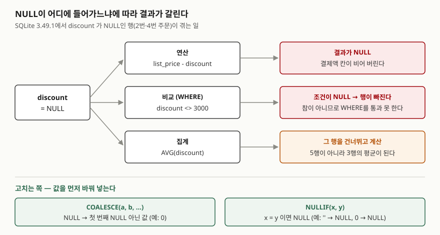

<!-- related:start -->
> **같은 기능을 다른 환경에서 다룬 글** (`null-semantics`)
> - [COUNT(*)와 COUNT(컬럼)이 다른 값을 내는 이유](../2026-10-02-count-star-vs-column-null/index.md) — SQLite 3.49.1, Python 3.13.5, Windows 11
<!-- related:end -->

## 들어가며

쇼핑몰 주문 표에서 결제액을 뽑으려고 `정가 - 할인액`을 계산했는데, 몇 줄의 결제액이 비어 있다.
할인이 없는 주문은 할인액 칸에 0이 아니라 아무것도 넣지 않았기 때문이다. 보통은 그 줄들을 찾아
하나씩 0으로 고치거나, 프로그램에서 받아 온 뒤 빈 값을 0으로 바꾼다. 그런데 비어 있는 칸은 계산만
망치지 않는다. "할인 3000원이 아닌 주문"을 찾는 조건에서 조용히 빠지고, 평균 할인액을 5건이 아니라
3건으로 나눠 부풀린다. 한 곳을 고쳐도 다른 두 곳이 남는다.

## 개념

**NULL**은 "값이 없다" 또는 "모른다"를 나타내는 표시다. 0도 아니고 빈 문자열(`''`)도 아니다.
그래서 SQL은 NULL이 들어간 계산의 답도 "모른다"로 돌려준다.

이것을 다루는 함수가 둘 있다.

| 함수 | 하는 일 | 방향 |
|---|---|---|
| `COALESCE(a, b, …)` | 인자를 왼쪽부터 보고 **처음 나오는 NULL 아닌 값**을 돌려준다 | NULL → 값 |
| `NULLIF(x, y)` | x와 y가 **같으면 NULL**, 다르면 x를 돌려준다 | 값 → NULL |

`COALESCE`는 비어 있는 칸을 채우고, `NULLIF`는 "사실상 비어 있는 값"(빈 문자열, 0 같은)을 NULL로
바꾼다. 방향이 반대라 둘을 겹쳐 쓰는 일이 많다.

## 구조



> **출처**: 연산자가 NULL을 만나면 NULL이 된다는 규칙은 [SQLite — SQL Language Expressions: Operators](https://www.sqlite.org/lang_expr.html#operators_and_parse_affecting_attributes),
> 집계가 NULL을 건너뛴다는 규칙은 [SQLite — Built-in Aggregate Functions: avg()](https://www.sqlite.org/lang_aggfunc.html#avg),
> 두 함수의 정의는 [SQLite — Core Functions: coalesce()](https://www.sqlite.org/lang_corefunc.html#coalesce)·[nullif()](https://www.sqlite.org/lang_corefunc.html#nullif)를 따랐다.

## 동작 원리

SQLite 문서는 연산자가 **피연산자 중 하나라도 NULL이면 NULL**로 계산된다고 적는다. 빼기든 문자열
잇기(`||`)든 같고, 비교 연산자(`=`, `<>`)도 연산자이므로 똑같이 NULL이 된다.

`WHERE`는 조건이 **참인 행만** 남긴다. 조건이 NULL이면 참이 아니므로 그 행은 빠진다.
거짓이어서 빠진 것과 겉으로는 구별되지 않는다. NULL인지 물으려면 NULL을 돌려주지 않는 `IS NULL`을 쓴다.

집계 함수는 규칙이 다르다. `SUM`·`AVG`·`COUNT(컬럼)`은 NULL인 행을 **아예 없는 것으로 치고** 계산한다.
`COUNT(*)`만 행 자체를 센다.

## 실습 예제

메모리 SQLite에 주문 5건을 넣었다. 2번·4번은 할인액이 NULL, 3번은 할인액 0에 수량 0이다.
2번·5번의 휴대폰은 NULL이 아니라 빈 문자열(`''`)로 들어 있다(표에서는 빈칸으로 보인다).
전체 소스: [`code/coalesce_nullif.py`](code/coalesce_nullif.py), 실행 기록: [`code/output.txt`](code/output.txt)

```text
  id | customer | list_price | discount | quantity | mobile        | home_phone
  ---+----------+------------+----------+----------+---------------+-------------
   1 | 김도윤   |      30000 |     3000 |        1 | 010-1111-2222 | NULL
   2 | 이서준   |      45000 |     NULL |        2 |               | 02-333-4444
   3 | 박하은   |      12000 |        0 |        0 | 010-5555-6666 | 031-777-8888
   4 | 최유나   |      28000 |     NULL |        1 | NULL          | NULL
   5 | 정민호   |      50000 |     5000 |        3 |               | NULL
```

### 연산 — 한 칸이 비면 답이 빈다

```text
[1-A 정가 - 할인액]
  (2, 45000, None, None)
  (4, 28000, None, None)
[1-B COALESCE(할인액, 0)으로 바꿔 빼면]
  (2, 45000)
  (4, 28000)
```

파이썬은 NULL을 `None`으로 받는다. 할인액이 NULL인 두 주문의 결제액이 NULL이 됐고,
`COALESCE(discount, 0)`으로 NULL을 0으로 바꿔 넣자 정가가 그대로 나왔다. 할인액 0인 3번은 처음부터 문제가 없었다.

### 비교 — 조건에서 조용히 빠진다

```text
[2-A discount = NULL]
  -> 0행
[2-B discount IS NULL]
  (2,)
  (4,)
[2-C discount <> 3000 (할인 3000원이 아닌 주문)]
  (3,)
  (5,)
[2-D 비교식 자체의 값]
  SELECT NULL = NULL, NULL <> 1, NULL IS NULL, 1 IS NOT NULL
  (None, None, 1, 1)
```

2-C가 가장 틀리기 쉽다. 할인 3000원이 아닌 주문은 사람이 보기에 2·3·4·5번 네 건이지만 두 건만 나왔다.
2-D에서 보듯 `NULL <> 1`은 참이 아니라 NULL이기 때문이다. 넷을 다 받으려면
`COALESCE(discount, 0) <> 3000`이라고 써야 한다.

### 집계 — 분모가 줄어든다

```text
[3-A COUNT(*) 와 COUNT(discount)]
  (5, 3)
[3-B SUM·AVG 할인액]
  (8000, 2666.6666666666665)
[3-C NULL을 0으로 치고 평균]
  (1600.0,)
[3-D 조건에 맞는 행이 없을 때 SUM]
  (None, 0)
```

`AVG(discount)`는 8000을 5가 아니라 3으로 나눴다. "할인을 못 받은 주문까지 넣은 평균"이 필요하면
3-C처럼 먼저 0으로 바꿔야 한다. 어느 쪽이 맞는지는 NULL이 "할인 없음"인지 "아직 모름"인지에 달렸다.
3-D는 행이 하나도 없을 때 `SUM`이 0이 아니라 NULL을 준다는 것을 보여 준다.

### COALESCE와 NULLIF를 겹쳐 쓰기

```text
[4-A COALESCE(mobile, home_phone, '연락처 없음')]
  (2, '')
  (5, '')
[5-B COALESCE(NULLIF(mobile, ''), home_phone, '연락처 없음')]
  (2, '02-333-4444')
  (5, '연락처 없음')
```

4-A에서 2번과 5번 연락처가 빈칸으로 나왔다. 빈 문자열은 NULL이 아니므로 `COALESCE`가 첫 인자에서 멈췄다.
`NULLIF(mobile, '')`로 빈 문자열을 먼저 NULL로 바꾸자 집전화, 그다음 기본 문구로 넘어갔다.

### 0으로 나누기 — 예상과 달랐던 결과

```text
[5-C 수량 0으로 나누기]
  (3, None)
[5-D NULLIF로 0을 NULL로 바꾼 뒤 나누기]
  (3, None)
```

`NULLIF(quantity, 0)`은 0으로 나누는 에러를 막는 관용구로 알려져 있어서, 5-C는 에러가 날 것으로
예상했다. 그런데 SQLite 3.49.1은 에러 없이 NULL을 돌려줬고 5-C와 5-D 결과가 같았다. PostgreSQL은
0으로 나누기를 `division_by_zero`(SQLSTATE 22012) 에러로 다룬다(이 글에서 PostgreSQL은 실행하지 않았다). 같은 SQL이 엔진에 따라 NULL을 주거나 멈추므로,
어느 엔진에서든 같은 결과를 원하면 `NULLIF`를 써 두는 편이 안전하다. 참고로 50000 / 3이 16666인 것은
정수끼리 나누면 소수점 아래를 버리기 때문이다.

## 실무에서 주의할 점

- **`<>`·`NOT IN` 조건은 NULL 행을 빼고 돌려준다.** "~가 아닌 것"을 찾을 때 NULL인 행도 포함해야 하면
  `COALESCE`로 값을 채우거나 `OR 컬럼 IS NULL`을 덧붙인다.
- **NULL을 0으로 바꾸는 것은 뜻을 바꾸는 일이다.** "할인 없음"이면 0이 맞지만 "아직 입력 안 됨"이면
  평균을 틀리게 만든다. 먼저 그 NULL이 무엇을 뜻하는지 정한다.
- **빈 문자열과 NULL을 한 컬럼에 섞지 않는다.** 5-E에서 `mobile IS NULL`에 걸린 것은 4번 하나뿐이었다.
  입력 단계에서 한쪽으로 맞추는 것이 가장 싸고, 이미 섞였으면 `NULLIF(컬럼, '')`로 읽는다.
- **합계를 화면에 보여 줄 때는 `COALESCE(SUM(…), 0)`으로 감싼다.** 조건에 맞는 행이 없으면 `SUM`은 NULL이다.

## 정리

- 연산·비교는 NULL이 하나라도 끼면 NULL이 되고, `WHERE`는 NULL 조건인 행을 뺀다.
- 집계 함수는 NULL 행을 건너뛰므로 `AVG`의 분모가 줄고, 행이 없으면 `SUM`은 NULL이다.
- `COALESCE`는 NULL을 값으로, `NULLIF`는 특정 값을 NULL로 바꾼다. 빈 문자열 처리처럼 둘을 겹쳐 쓴다.
- SQLite는 0으로 나누면 NULL을 주지만 PostgreSQL은 에러를 내므로, 나눗셈의 분모는 `NULLIF`로 감싼다.

## 참고 자료

- [SQLite — SQL Language Expressions: Operators](https://www.sqlite.org/lang_expr.html#operators_and_parse_affecting_attributes) — NULL 피연산자 규칙, `IS`·`IS NOT`의 정의
- [SQLite — Core Functions: coalesce()](https://www.sqlite.org/lang_corefunc.html#coalesce) / [nullif()](https://www.sqlite.org/lang_corefunc.html#nullif) — 두 함수의 정의, 인자 수 규칙
- [SQLite — Built-in Aggregate Functions: avg()](https://www.sqlite.org/lang_aggfunc.html#avg) / [count()](https://www.sqlite.org/lang_aggfunc.html#count) / [sum()·total()](https://www.sqlite.org/lang_aggfunc.html#sumunc) — 집계가 NULL을 건너뛰는 규칙, 입력이 없을 때 `sum()`이 NULL을 주는 것
- [PostgreSQL 16 — Conditional Expressions: COALESCE](https://www.postgresql.org/docs/16/functions-conditional.html#FUNCTIONS-COALESCE-NVL-IFNULL) / [NULLIF](https://www.postgresql.org/docs/16/functions-conditional.html#FUNCTIONS-NULLIF) — 다른 엔진에서의 정의
- [PostgreSQL 16 — Appendix A. Error Codes](https://www.postgresql.org/docs/16/errcodes-appendix.html#ERRCODES-TABLE) — `22012 division_by_zero`
