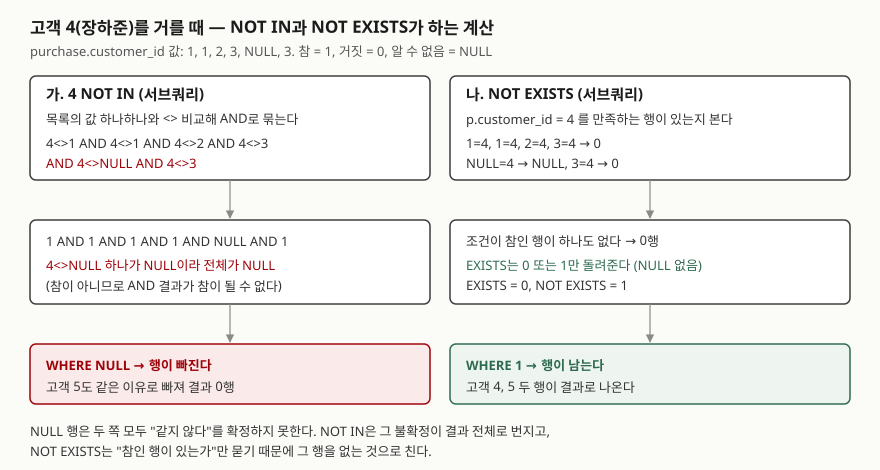

## 들어가며

쇼핑몰 운영팀이 "가입만 하고 한 번도 안 산 고객에게 쿠폰을 보내자"고 한다. 구매 표에 없는 고객을
뽑으면 되니 `WHERE id NOT IN (SELECT customer_id FROM purchase)`를 쓴다. 결과가 0행이다.
전원이 한 번씩은 샀다는 뜻으로 읽고 넘어가면 쿠폰은 한 장도 나가지 않는다. 의심이 들어 고객을 한 명씩
`WHERE customer_id = 4`로 확인하기 시작하면 고객 수만큼 질의를 돌리게 된다. 고객이 5명이면 5번,
5만 명이면 5만 번이다. 원인은 구매 표에 있는 **NULL 한 칸**이고, 확인은 질의 한 번으로 끝난다.

## 개념

`IN`과 `EXISTS`는 둘 다 **서브쿼리**(괄호 안에 넣은 `SELECT`)의 결과를 보고 바깥 행을 남길지
정한다. 묻는 방식이 다르다.

| 연산자 | 묻는 것 | 돌려줄 수 있는 값 |
|---|---|---|
| `x IN (서브쿼리)` | x가 목록의 값 중 하나와 같은가 | 참(1), 거짓(0), 알 수 없음(NULL) |
| `x NOT IN (서브쿼리)` | x가 목록의 **모든** 값과 다른가 | 참, 거짓, 알 수 없음 |
| `EXISTS (서브쿼리)` | 서브쿼리가 한 행이라도 돌려주는가 | 참, 거짓 |
| `NOT EXISTS (서브쿼리)` | 서브쿼리가 한 행도 돌려주지 않는가 | 참, 거짓 |

여기서 **NULL**은 "값이 없다" 또는 "모른다"를 뜻하는 표시다. `4 = NULL`은 참도 거짓도 아닌
"알 수 없음"이 된다. SQL은 조건식을 참·거짓·알 수 없음의 세 값으로 계산하고, `WHERE`는
**참인 행만 남긴다.** 알 수 없음은 거짓처럼 행을 버린다.

표의 마지막 칸이 이 글의 전부다. `EXISTS`는 알 수 없음을 돌려주지 않는다. `IN`과 `NOT IN`은 돌려준다.

## 구조



> **출처**: `IN`·`NOT IN`의 NULL 판정 표는 [SQLite — SQL Language Expressions: The IN and NOT IN operators](https://www.sqlite.org/lang_expr.html#the_in_and_not_in_operators),
> `EXISTS`가 0과 1만 돌려준다는 규칙은 [The EXISTS operator](https://www.sqlite.org/lang_expr.html#the_exists_operator),
> `WHERE`가 참인 행만 남긴다는 규칙은 [SQLite — SELECT: WHERE clause filtering](https://www.sqlite.org/lang_select.html#where_clause_filtering_)을 따랐다.
> `NOT IN`을 `<>`의 `AND`로 풀어 쓴 결과는 아래 실습 1-B·1-E의 실제 출력이다.

## 동작 원리

`4 NOT IN (1, 1, 2, 3, NULL, 3)`은 "4가 여섯 값 모두와 다른가"다. 앞의 다섯 번은 확실히 다르다.
그런데 `4 <> NULL`은 알 수 없음이다. NULL이 사실은 4였을 수도 있기 때문이다. `AND`는 하나라도
참이 아니면 참이 될 수 없으므로, 전체가 알 수 없음이 되고 `WHERE`가 행을 버린다.
고객 5도 같은 이유로 빠진다. **목록에 NULL이 하나만 있어도, 목록에 없는 값에 대한 `NOT IN`은 절대 참이 되지 않는다.**

`NOT EXISTS`는 비교를 목록 전체로 묶지 않는다. 구매 행 하나하나에 `p.customer_id = 4`를 대 보고
**참인 행이 있는지만** 본다. NULL 행은 알 수 없음이라 참이 아니므로 "있는 행"으로 세지 않는다.
참인 행이 없으니 `EXISTS`는 0, `NOT EXISTS`는 1이다.

양쪽 모두 NULL 행을 "같다"로 보지 않는다는 점은 같다. 갈리는 것은 그 결과를 **어떻게 합치는가**다.

## 실습 예제

메모리 SQLite에 고객 5명과 구매 6건을 넣었다. 105번 구매는 비회원 결제라 `customer_id`가 NULL이다.
전체 소스: [`code/in_exists_not_in.py`](code/in_exists_not_in.py), 실행 기록: [`code/output.txt`](code/output.txt)

```text
  id  | customer_id | amount
  ----+-------------+-------
  101 |           1 |  12000
  102 |           1 |   8000
  103 |           2 |  30000
  104 |           3 |   5000
  105 |        NULL |   7000
  106 |           3 |   9000
```

고객 4(장하준)와 5(임채원)는 구매 기록이 없다. 정답은 이 두 명이다.

### 목록에 NULL이 있을 때의 값

```text
[1-A 목록에 있는 값]
  SELECT 1 IN (1, 2, NULL), 1 NOT IN (1, 2, NULL)
  (1, 0)

[1-B 목록에 없는 값]
  SELECT 3 IN (1, 2, NULL), 3 NOT IN (1, 2, NULL)
  (None, None)

[1-C NULL 이 없는 목록]
  SELECT 3 IN (1, 2), 3 NOT IN (1, 2)
  (0, 1)

[1-E 풀어 쓴 NOT IN]
  SELECT 3 <> 1 AND 3 <> 2 AND 3 <> NULL
  (None,)
```

파이썬은 NULL을 `None`으로 찍는다. 1-A처럼 **찾는 값이 목록에 있으면 NULL은 영향이 없다.** 1-B처럼
없을 때만 결과가 NULL로 바뀐다. 1-E는 1-B의 `NOT IN`을 `<>`와 `AND`로 풀어 쓴 것이고 결과가 같다.

### 산 적이 있는 고객 — IN과 EXISTS는 같다

```text
[2-A IN]
  (1, '한지우')
  (2, '오민재')
  (3, '윤서아')
  -> 3행

[2-C INNER JOIN]
  (1, '한지우')
  (1, '한지우')
  (2, '오민재')
  (3, '윤서아')
  (3, '윤서아')
  -> 5행
```

SQL 줄은 뺐다. 2-B `EXISTS`는 2-A와 같은 3행이었다.

찾는 쪽에서는 NULL이 문제를 일으키지 않는다. 대신 **조인과 갈린다.** 조인은 구매 행마다 고객 행을
붙이므로 두 번 산 고객이 두 번 나온다. `IN`과 `EXISTS`는 바깥 행을 남길지만 정하므로 한 번씩 나온다.

### 산 적이 없는 고객 — NOT IN만 다르다

```text
[3-A NOT IN]
  -> 0행

[3-B NOT EXISTS]
  (4, '장하준')
  (5, '임채원')
  -> 2행
```

3-C `LEFT JOIN ... IS NULL`, 3-D `NOT IN` + `IS NOT NULL`, 4-A NULL 행을 지운 뒤의 `NOT IN`도
3-B와 같은 두 행이었다. 3-A가 들어가며에서 본 0행이다. 서브쿼리에 `WHERE p.customer_id IS NOT NULL`을 붙이거나(3-D)
NULL 행을 지우면(4-A) 정답이 나온다. 원인이 105번 한 행이라는 것이 이것으로 확인된다.

### 실행계획

```text
[5-A IN]
  QUERY PLAN
  |--SEARCH c USING INTEGER PRIMARY KEY (rowid=?)
  `--LIST SUBQUERY 1
     |--SCAN p
     `--CREATE BLOOM FILTER

[5-B EXISTS]
  QUERY PLAN
  |--SCAN c
  `--CORRELATED SCALAR SUBQUERY 1
     `--SCAN p

[5-C NOT IN]
  QUERY PLAN
  |--SCAN c
  `--LIST SUBQUERY 1
     |--SCAN p
     `--CREATE BLOOM FILTER
```

5-D `NOT EXISTS`의 계획은 5-B와 한 글자도 다르지 않았다.
`IN`은 서브쿼리 결과로 **목록**(`LIST SUBQUERY`)을 한 번 만든다. 5-A는 그 목록 값으로 고객을
기본 키로 찾아가고, 5-C는 고객을 전부 훑으며 목록에 없는지 본다. `EXISTS`는 `CORRELATED`,
즉 **바깥 행마다** 서브쿼리를 다시 돈다. 결과가 같은 2-A와 2-B도 일하는 방식은 다르다.

## 실무에서 주의할 점

- **NULL이 들어갈 수 있는 컬럼에 `NOT IN (서브쿼리)`를 쓰지 않는다.** 에러도 경고도 없이 0행이
  나온다. 오늘 NULL이 없어도 내일 한 행이 들어오면 그때부터 결과가 빈다. `NOT EXISTS`를 쓴다.
- **`NOT IN`을 꼭 써야 하면 서브쿼리에 `IS NOT NULL`을 붙인다.** 3-D처럼 NULL을 먼저 걸러 내면
  목록에 알 수 없음이 남지 않는다. 컬럼에 `NOT NULL` 제약이 있으면 이 함정 자체가 없다.
- **`IN` 대신 조인을 쓰면 행이 늘 수 있다.** 2-C처럼 두 번 산 고객이 두 번 나온다. "있는가"만
  물을 때는 `IN`이나 `EXISTS`를 쓰고, 조인을 쓰면 `DISTINCT`가 필요한지 따진다.
- **바깥쪽 값이 NULL이어도 결과가 빈다.** `NULL IN (1, 2)`와 `NULL NOT IN (1, 2)`는 둘 다
  알 수 없음이었다(1-D). 바깥 컬럼에 NULL이 있으면 그 행은 `IN` 쪽에도 `NOT IN` 쪽에도 나오지 않는다.

## 정리

- `IN`·`NOT IN`은 참·거짓·알 수 없음을 돌려주고, `EXISTS`는 참·거짓만 돌려준다.
- 목록에 NULL이 하나라도 있으면, 목록에 없는 값의 `NOT IN`은 알 수 없음이 되어 `WHERE`에서 빠진다.
- 같은 데이터에서 `NOT IN`은 0행, `NOT EXISTS`와 `LEFT JOIN ... IS NULL`은 정답 2행이었다.
- 찾는 쪽(`IN`·`EXISTS`)은 결과가 같지만 조인은 행이 늘어난다.

## 참고 자료

- [SQLite — SQL Language Expressions: The IN and NOT IN operators](https://www.sqlite.org/lang_expr.html#the_in_and_not_in_operators) — 왼쪽·오른쪽에 NULL이 있을 때의 판정 표
- [SQLite — SQL Language Expressions: The EXISTS operator](https://www.sqlite.org/lang_expr.html#the_exists_operator) — `EXISTS`가 0 또는 1만 돌려주고 서브쿼리 행의 값은 보지 않는다는 규칙
- [SQLite — SELECT: WHERE clause filtering](https://www.sqlite.org/lang_select.html#where_clause_filtering_) — `WHERE` 식이 참인 행만 결과에 남는다는 규칙
- [SQLite — EXPLAIN QUERY PLAN](https://www.sqlite.org/eqp.html) — 실행계획 출력 형식
