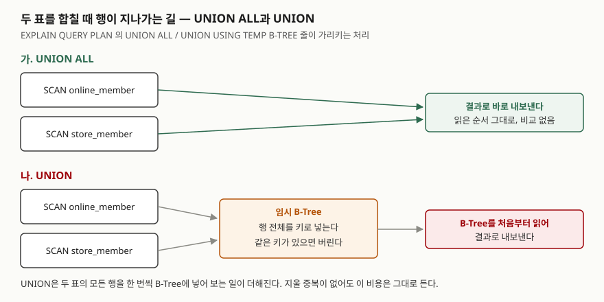

## 들어가며

회원 정보가 온라인 몰과 오프라인 매장에 따로 쌓여 있는데, 안내 메일을 한 번에 보내야 한다는 요청이 온다.
두 표를 이어 붙이면 되니 `UNION`을 쓴다. 같은 사람에게 메일이 두 통 가지 않게 중복까지 지워 준다고
배웠기 때문이다. 그런데 명단을 보니 김도윤이 두 줄이다. 반대로 중복이 없다고 확신하는 표 두 개를 합칠 때도
습관처럼 `UNION`을 쓰면, 지울 것이 하나도 없는데 모든 행을 서로 비교하는 일을 매번 치른다.
20만 행짜리 표 두 개면 40만 행이 그 비교를 거친다.

## 개념

**UNION**과 **UNION ALL**은 두 `SELECT`의 결과를 위아래로 이어 붙이는 연산자다. 이렇게 여러
`SELECT`를 연산자로 묶은 것을 **복합 SELECT**(compound SELECT)라 부른다.

| 연산자 | 하는 일 |
|---|---|
| `UNION ALL` | 두 결과를 그대로 이어 붙인다. 중복도 남는다 |
| `UNION` | 이어 붙인 뒤 **완전히 같은 행**을 하나만 남긴다 |

"완전히 같은 행"이 핵심이다. 컬럼 하나가 아니라 **고른 컬럼 전부**가 같아야 중복으로 본다.

## 구조



> **출처**: 복합 SELECT의 실행계획 표기와 `USING TEMP B-TREE`의 뜻은 [SQLite — EXPLAIN QUERY PLAN: Compound Queries](https://www.sqlite.org/eqp.html#compound_queries),
> 연산자 정의는 [SQLite — SELECT: Compound Select Statements](https://www.sqlite.org/lang_select.html#compound_select_statements)를 따랐다.
> B-Tree를 처음부터 읽어 내보낸다는 부분은 아래 1-B 결과가 정렬된 순서로 나온 것에서 확인한 것이다.

## 동작 원리

`UNION ALL`은 첫 표를 읽으며 행을 내보내고, 이어서 둘째 표를 읽으며 내보낸다. 행끼리 비교하지 않는다.

`UNION`은 중간에 **임시 B-Tree**를 하나 만든다. B-Tree는 값을 정렬된 상태로 보관하는 자료 구조로,
어떤 값이 이미 들어 있는지 빨리 찾을 수 있다. 두 표의 행을 하나씩 이 B-Tree에 넣어 보고, 같은 행이
이미 있으면 버린다. 다 넣고 나면 B-Tree를 처음부터 읽어 결과로 내보낸다.
지울 중복이 하나도 없어도 **넣어 보는 일은 모든 행이 한다.** 이것이 `UNION`의 비용이다.

## 실습 예제

메모리 SQLite에 온라인 회원 5명, 매장 회원 4명을 넣었다. 이서준은 온라인에 두 번 가입했고, 최유나는
두 표 모두 이메일이 비어 있다(NULL). 매장의 김도윤은 이름 뒤에 공백이 하나 붙은 채 입력됐다(표에서는 공백이 보이지 않는다).
전체 소스: [`code/union_vs_union_all.py`](code/union_vs_union_all.py), 실행 기록: [`code/output.txt`](code/output.txt)

### 이메일만 합치면

```text
[1-A UNION ALL (이메일만)]
  -> 9행

[1-B UNION (이메일만)]
  (None,)
  ('jung@example.com',)
  ('kim@example.com',)
  ('lee@example.com',)
  ('park@example.com',)
  -> 5행
```

1-A는 행 목록을 빼고 행 수만 옮겼다. `UNION ALL`은 5 + 4 = 9행을 그대로 냈다. `UNION`은 5행이다. 표 사이의 중복(kim, park)뿐 아니라
**온라인 표 안의** lee 중복도 지웠다. 이메일이 없는 두 행(NULL)도 한 행으로 합쳐졌다.
`WHERE`에서 `NULL = NULL`은 참이 아니지만, 중복을 가릴 때는 NULL끼리 같은 것으로 쳤다.

### 이름까지 합치면

```text
[1-C UNION (이메일, 이름)]
  (None, '최유나')
  ('jung@example.com', '정민호')
  ('kim@example.com', '김도윤')
  ('kim@example.com', '김도윤 ')
  ('lee@example.com', '이서준')
  ('park@example.com', '박하은')
  -> 6행
```

들어가며에서 본 김도윤 두 줄이다. 이메일은 같지만 이름 끝의 공백 하나가 달라서 다른 행이 됐다.
`UNION`은 사람을 알아보는 것이 아니라 **고른 컬럼의 값을 글자 그대로 비교**한다.

### 합칠 때의 규칙

```text
[2-B 컬럼 이름은 첫 SELECT 를 따른다]
  컬럼 이름: ['contact']

[2-C 컬럼 수가 다르면]
  에러: OperationalError: SELECTs to the left and right of UNION do not have the same number of result columns
```

2-B의 둘째 `SELECT`는 `name`을 골랐지만 결과 컬럼 이름은 첫 `SELECT`의 `contact`였다.
두 `SELECT`의 컬럼 수가 다르면 2-C처럼 실행 자체가 거부된다. 맨 끝에 쓴 `ORDER BY`는 둘째
`SELECT`만이 아니라 합친 결과 전체를 정렬했다(2-D).

### 실행계획과 시간

```text
[3-A UNION ALL]
  QUERY PLAN
  `--COMPOUND QUERY
     |--LEFT-MOST SUBQUERY
     |  `--SCAN online_member
     `--UNION ALL
        `--SCAN store_member

[3-B UNION]
  QUERY PLAN
  `--COMPOUND QUERY
     |--LEFT-MOST SUBQUERY
     |  `--SCAN online_member
     `--UNION USING TEMP B-TREE
        `--SCAN store_member
```

두 계획의 차이는 한 줄, `USING TEMP B-TREE`다. 표마다 20만 행을 넣고(매장 회원의 절반은 온라인과
같은 이메일) 다섯 번씩 돌린 최솟값은 다음과 같았다.

```text
  UNION ALL  400,000행    127.1 ms
  UNION      300,085행    482.7 ms
```

`UNION`이 약 3.8배 걸렸다. 결과 행이 10만 줄 적은데도 느리다. 내보내는 행보다 **넣어 보는 행**이
시간을 정한다는 뜻이다. 시간 값은 실행할 때마다 조금씩 흔들린다.

## 실무에서 주의할 점

- **중복이 없다고 알면 `UNION ALL`을 쓴다.** 날짜로 나눈 표(9월 주문 / 10월 주문)처럼 겹칠 수 없는
  결과를 합칠 때 `UNION`은 아무것도 지우지 못하고 시간만 쓴다.
- **`UNION`의 중복 제거를 사람 단위 중복 제거로 믿지 않는다.** 공백 하나, 대소문자 하나가 다르면
  다른 행이다. 사람을 한 명씩 남기려면 기준 컬럼(이메일)만 고르거나, 값을 먼저 `TRIM`·`LOWER`로 맞춘다.
- **`UNION` 결과가 정렬돼 나와도 기대지 않는다.** 1-B는 알파벳 순서로 나왔지만 B-Tree를 쓴 결과일
  뿐이다. 순서가 필요하면 `ORDER BY`를 적는다.
- **컬럼 이름은 첫 `SELECT`에서 정한다.** 결과를 받는 프로그램이 컬럼 이름으로 값을 꺼낸다면 별칭(`AS`)은
  첫 `SELECT`에 붙인다.

## 정리

- `UNION ALL`은 그대로 이어 붙이고, `UNION`은 고른 컬럼 전부가 같은 행을 하나만 남긴다.
- `UNION`은 한 표 안의 중복도 지우고, 중복을 가릴 때 NULL끼리 같은 것으로 쳤다.
- `UNION`은 임시 B-Tree에 모든 행을 넣어 보므로, 20만 행씩 합칠 때 `UNION ALL`보다 약 3.8배 느렸다.
- 겹칠 수 없는 결과를 합칠 때는 `UNION ALL`, 순서가 필요하면 `ORDER BY`를 쓴다.

## 참고 자료

- [SQLite — SELECT: Compound Select Statements](https://www.sqlite.org/lang_select.html#compound_select_statements) — `UNION`·`UNION ALL`의 정의, 컬럼 수 규칙, 복합 SELECT의 `ORDER BY`
- [SQLite — EXPLAIN QUERY PLAN: Compound Queries](https://www.sqlite.org/eqp.html#compound_queries) — `COMPOUND QUERY`·`USING TEMP B-TREE` 표기의 뜻
- [SQLite — EXPLAIN QUERY PLAN: Temporary Sorting B-Trees](https://www.sqlite.org/eqp.html#temporary_sorting_b_trees) — 임시 B-Tree가 실행계획에 나타나는 경우
