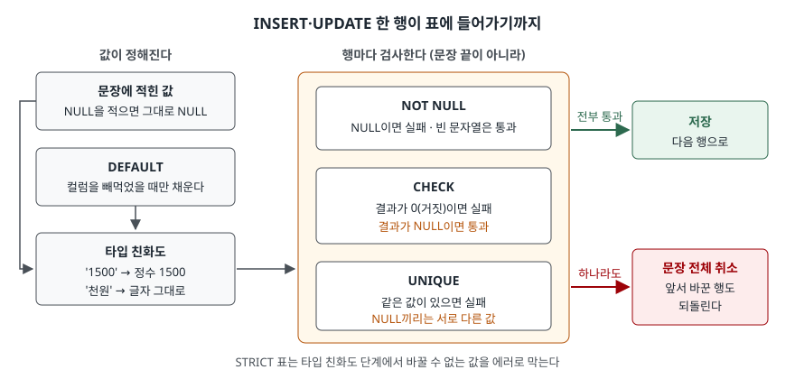

## 들어가며

상품 목록을 담을 표를 처음 만들 때, 가격 칸에 `CHECK (price > 0)`을 걸어 두면 0원이나 마이너스 가격은
들어오지 않으리라 믿게 된다. 몇 주 뒤 화면에 가격이 비어 있는 상품이 보인다. 가격을 안 적고 저장한
행이었다. 보통은 여기서 입력 화면 코드를 고치고, 제약은 다시 들여다보지 않는다. 그런데 이 행은 제약이
**막을 대상이 아니었다.** 제약마다 막는 것과 통과시키는 것이 정해져 있고, 그 경계를 모르면 같은 구멍이
다른 컬럼에서 또 생긴다.

## 개념

**CREATE TABLE**은 표를 만드는 문장이다. 컬럼마다 이름과 **타입**을 적고, 그 뒤에 **제약조건**을 붙인다.
제약조건은 표에 들어갈 수 있는 값을 제한하는 규칙이다. 규칙을 어기는 행은 DB가 저장하지 않는다.

```sql
CREATE TABLE product (
  product_id INTEGER PRIMARY KEY,
  sku        TEXT    NOT NULL UNIQUE,
  name       TEXT    NOT NULL,
  price      INTEGER CHECK (price > 0),
  barcode    TEXT    UNIQUE,
  status     TEXT    NOT NULL DEFAULT 'draft'
);
```

| 제약 | 뜻 |
|---|---|
| `NOT NULL` | 이 컬럼에 NULL(값 없음)을 넣을 수 없다 |
| `UNIQUE` | 이 컬럼의 값이 다른 행과 겹칠 수 없다 |
| `CHECK (식)` | 식의 결과가 거짓인 행을 넣을 수 없다 |
| `DEFAULT 값` | 값을 안 적었을 때 대신 넣을 값 |

`DEFAULT`는 막는 규칙이 아니라 **채우는** 규칙이라 성격이 다르다. 그래서 다른 셋과 부딪히는 자리가 생긴다.

## 구조



> **출처**: 각 제약의 규정은 [SQLite — CREATE TABLE: The DEFAULT clause](https://www.sqlite.org/lang_createtable.html#the_default_clause)·[CHECK constraints](https://www.sqlite.org/lang_createtable.html#check_constraints)·[UNIQUE constraints](https://www.sqlite.org/lang_createtable.html#unique_constraints)·[NOT NULL constraints](https://www.sqlite.org/lang_createtable.html#not_null_constraints), 타입 변환은 [SQLite — Datatypes: Type Affinity](https://www.sqlite.org/datatype3.html#type_affinity)와 [STRICT Tables](https://www.sqlite.org/stricttables.html)를 따랐다.
> "행마다 검사"와 "문장 전체 취소"는 실습 8의 실행 결과다.

## 동작 원리

행 하나가 들어갈 때 먼저 **값이 정해진다.** 문장에 적힌 컬럼은 적힌 값을 쓰고, 빠진 컬럼에만 `DEFAULT`가
들어간다. 매뉴얼은 DEFAULT를 "사용자가 값을 명시하지 않았을 때" 쓰는 값이라고 적는다. `NULL`을 적은 것도
값을 명시한 것이므로 DEFAULT는 끼어들지 않는다.

다음으로 **타입**에 맞춰 값을 바꿔 본다. SQLite의 보통 표에서 `INTEGER` 컬럼은 정수처럼 생긴 글자(`'1500'`)를
정수로 바꿔 저장하고, 바꿀 수 없는 글자(`'천원'`)는 **글자 그대로** 저장한다. 에러가 나지 않는다. 이것을 타입
친화도(type affinity)라 한다. 표 끝에 `STRICT`를 붙이면 바꿀 수 없는 값은 에러로 막는다.

마지막으로 세 제약을 검사한다. 판정 기준이 제각각이다.

- `NOT NULL`은 값이 NULL인지만 본다. 빈 문자열 `''`은 NULL이 아니다
- `CHECK`는 식의 결과가 **0(거짓)일 때만** 막는다. 매뉴얼은 결과가 NULL이면 위반이 아니라고 적는다.
  `price`가 NULL이면 `price > 0`도 NULL이므로 통과한다
- `UNIQUE`에서 NULL은 다른 모든 값, **다른 NULL과도 다른 값**으로 친다. 그래서 NULL은 몇 개든 들어간다

## 실습 예제

전체 소스: [`code/constraints_basics.py`](code/constraints_basics.py), 실행 기록: [`code/output.txt`](code/output.txt).
표는 위 정의 그대로이고, `(1, 'A-100', '연필', 500, '880001')`과 `(2, 'A-200', '지우개', 300, NULL)` 두 행으로 시작한다.

### DEFAULT와 NOT NULL

```text
-- 1. DEFAULT — 컬럼을 빼면 채운다
   INSERT INTO product (product_id, sku, name, price) VALUES (3, 'A-300', '자', 1200)
   성공 · 바뀐 행 1
   SELECT product_id, status FROM product WHERE product_id = 3
   3 | draft

-- 2. DEFAULT — NULL 을 직접 적으면 채우지 않는다
   INSERT INTO product (product_id, sku, name, price, status) VALUES (4, 'A-400', '풀', 800, NULL)
   에러: NOT NULL constraint failed: product.status
```

2번은 `DEFAULT 'draft'`가 있는데도 실패했다. 화면에서 빈 칸을 NULL로 바꿔 보내는 코드가 있으면 이렇게 된다.

```text
   INSERT INTO product (product_id, sku, name, price) VALUES (5, 'A-500', NULL, 700)
   에러: NOT NULL constraint failed: product.name
   INSERT INTO product (product_id, sku, name, price) VALUES (5, 'A-500', '', 700)
   성공 · 바뀐 행 1
```

이름이 빈 문자열인 행은 들어갔다. `NOT NULL`은 "비어 있지 않음"을 보장하지 않는다.

### CHECK와 UNIQUE — NULL은 통과한다

```text
   INSERT INTO product (product_id, sku, name, price) VALUES (6, 'A-600', '가위', 0)
   에러: CHECK constraint failed: price > 0
   INSERT INTO product (product_id, sku, name, price) VALUES (6, 'A-600', '가위', NULL)
   성공 · 바뀐 행 1
   INSERT INTO product (product_id, sku, name, price, barcode) VALUES (7, 'A-700', '자석', 900, '880001')
   에러: UNIQUE constraint failed: product.barcode
   INSERT INTO product (product_id, sku, name, price, barcode) VALUES (7, 'A-700', '자석', 900, NULL)
   성공 · 바뀐 행 1
   SELECT COUNT(*) FROM product WHERE barcode IS NULL
   5
```

가격 없는 가위가 들어갔다. 들어가며의 장면이 이것이다. 바코드가 NULL인 행은 5개가 되었다.

### 타입 — 보통 표와 STRICT 표

```text
   SELECT product_id, price, typeof(price) FROM product WHERE product_id IN (8, 9)
   8 | 1500 | integer
   9 | 천원 | text
   INSERT INTO product_strict VALUES (2, '천원')
   에러: cannot store TEXT value in INTEGER column product_strict.price
```

`typeof()`는 값이 실제로 어떤 종류로 저장됐는지 알려 준다. 예상과 달랐던 것은 9번 행이다. **`'천원'`은
`CHECK (price > 0)`도 통과했다.** SQLite는 정수를 어떤 글자보다도 작은 값으로 비교하므로 `'천원' > 0`이 참이다.
타입을 막지 않는 표에서는 CHECK의 숫자 비교도 믿을 수 없다.

### 검사 시점 — 행마다

```text
   UPDATE product SET sku = CASE product_id WHEN 2 THEN 'A-300' WHEN 3 THEN 'A-200' END WHERE product_id IN (2, 3)
   에러: UNIQUE constraint failed: product.sku
   SELECT product_id, sku FROM product WHERE product_id IN (2, 3)
   2 | A-200
   3 | A-300
```

두 행의 `sku`를 맞바꾸면 끝 상태에는 겹치는 값이 없다. 그래도 실패했다. 2번 행을 `A-300`으로 바꾼 순간
3번 행이 아직 `A-300`이기 때문이다. 검사는 문장이 끝난 뒤가 아니라 **행을 바꿀 때마다** 일어난다. 실패하자
먼저 바뀐 2번 행도 되돌아가 두 행 모두 원래 값이었다. 임시 값 `'TMP'`를 거쳐 세 문장으로 나누자 성공했다.

## 실무에서 주의할 점

- **CHECK에는 NULL 처리를 같이 적는다.** 값이 반드시 있어야 하면 `NOT NULL`을 함께 걸거나
  `CHECK (price IS NOT NULL AND price > 0)`처럼 쓴다. `CHECK`만으로는 빈 칸을 막지 못한다.
- **DEFAULT를 믿고 NULL을 보내지 않는다.** 기본값을 쓰려면 INSERT에서 그 컬럼을 아예 빼야 한다.
  NULL을 보내면 `NOT NULL`에 걸리거나, `NOT NULL`이 없으면 NULL이 그대로 저장된다.
- **값이 없을 수 있는 UNIQUE 컬럼은 NULL 여러 개를 전제로 한다.** 바코드처럼 "있으면 겹치면 안 되는" 값에는
  맞지만, "하나만 비어 있어야 한다"는 규칙은 UNIQUE로 만들 수 없다.
- **SQLite에서 타입을 강제하려면 `STRICT`를 붙인다.** 보통 표의 `INTEGER`는 글자도 받아 주고, 그 글자는 숫자
  CHECK까지 통과한다. `STRICT`는 SQLite 3.37.0부터 쓸 수 있다.

## 정리

- 제약은 막는 규칙(`NOT NULL`·`UNIQUE`·`CHECK`)과 채우는 규칙(`DEFAULT`)으로 나뉜다.
- `DEFAULT`는 컬럼을 빼먹었을 때만 채운다. NULL을 직접 적으면 채우지 않는다.
- `CHECK`는 결과가 NULL이면 통과시키고, `UNIQUE`는 NULL끼리를 서로 다른 값으로 본다.
- 보통 표의 SQLite 타입은 변환을 시도할 뿐 막지 않는다. `STRICT` 표만 막는다.
- 제약은 행마다 검사되므로, 값을 맞바꾸는 UPDATE는 끝 상태가 맞아도 실패한다.

## 참고 자료

- [SQLite — CREATE TABLE: The DEFAULT clause](https://www.sqlite.org/lang_createtable.html#the_default_clause), [CHECK constraints](https://www.sqlite.org/lang_createtable.html#check_constraints), [UNIQUE constraints](https://www.sqlite.org/lang_createtable.html#unique_constraints), [NOT NULL constraints](https://www.sqlite.org/lang_createtable.html#not_null_constraints)
- [SQLite — Datatypes In SQLite: Type Affinity](https://www.sqlite.org/datatype3.html#type_affinity), [Sort Order](https://www.sqlite.org/datatype3.html#sort_order) — 정수·실수는 어떤 글자보다도 작다
- [SQLite — STRICT Tables](https://www.sqlite.org/stricttables.html) — 3.37.0에서 추가
- [SQLite — ON CONFLICT clause](https://www.sqlite.org/lang_conflict.html) — 기본 처리 `ABORT`가 문장이 바꾼 것을 되돌린다
