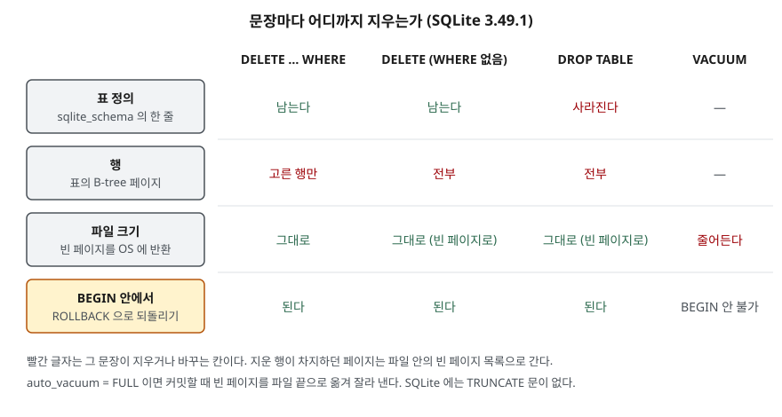

## 들어가며

테스트용으로 쌓아 둔 로그 표가 커져서 비우기로 한다. 검색해 보면 `DELETE`, `TRUNCATE`, `DROP` 세 가지가
나오고, 대개 "셋 다 지우는 거니까 아무거나"라며 손에 익은 것을 친다. 그런데 셋은 지우는 범위가 다르다.
어떤 것은 표 자체를 없애 버리고, 어떤 것은 DB에 따라 되돌릴 수 없다. 그리고 셋 중 무엇을 쳐도
SQLite에서는 디스크가 1바이트도 비워지지 않는 경우가 있다. 이 글에서는 2만 행을 지웠는데 파일이 4,232KB 그대로였다.

## 개념

- **DELETE**는 표에서 **행**을 지운다. `WHERE`로 고른 행만 지우고, `WHERE`가 없으면 전부 지운다. 표는 남는다
- **DROP TABLE**은 **표 자체**를 지운다. 행과 함께 표 정의(컬럼·제약)도 사라져서 그 표를 다시 조회할 수 없다
- **TRUNCATE TABLE**은 표는 남기고 행을 한꺼번에 비우는 문장이다. SQL:2008 표준에 들어 있지만
  **SQLite에는 없다.** SQLite는 대신 `WHERE` 없는 `DELETE`를 빠르게 처리하는 최적화를 둔다

**트랜잭션**은 여러 변경을 한 묶음으로 다루는 단위다. `BEGIN`으로 열고 `COMMIT`으로 확정하거나
`ROLLBACK`으로 연 시점 이전으로 되돌린다. **페이지**는 SQLite가 파일을 나눠 쓰는 고정 크기 칸이고,
이 예제에서는 한 칸이 4KB다.

## 구조



> **출처**: 빈 페이지가 남고 VACUUM이 파일을 줄인다는 것은 [SQLite — VACUUM: Description](https://www.sqlite.org/lang_vacuum.html#description),
> auto_vacuum의 동작은 [SQLite — PRAGMA auto_vacuum](https://www.sqlite.org/pragma.html#pragma_auto_vacuum),
> TRUNCATE가 없고 WHERE 없는 DELETE에 최적화가 걸린다는 것은 [SQLite — DELETE: The Truncate Optimization](https://www.sqlite.org/lang_delete.html#the_truncate_optimization)을 따랐다.
> ROLLBACK 칸은 실습 1~3장과 5장의 실행 결과다.

## 동작 원리

SQLite가 행을 지우면 그 행이 있던 페이지는 파일에서 잘려 나가지 않는다. 비게 된 페이지는 파일 안의
**빈 페이지 목록**(freelist)에 올라가고, 다음에 행을 넣을 때 다시 쓰인다. 문서는 이것을 "지운 자리가
빈 공간으로 남아 파일이 필요보다 클 수 있다"고 설명한다.

파일을 실제로 줄이는 방법은 두 가지다.

1. **VACUUM** — DB 파일을 처음부터 다시 써서 빈 페이지를 없앤다. 열린 트랜잭션 안에서는 돌지 않는다
2. **auto_vacuum = FULL** — 커밋할 때마다 빈 페이지를 파일 끝으로 옮기고 잘라 낸다.
   표를 만들기 **전에** 켜야 한다. 이미 표가 있으면 설정 뒤 VACUUM을 한 번 돌려야 바뀐다

## 실습 예제

전체 소스: [`code/delete_truncate_drop.py`](code/delete_truncate_drop.py), 실행 기록: [`code/output.txt`](code/output.txt).
상품 표 `product (product_id, name, price)`에 4행을 넣고 시작한다. 가격은 500·1500·300·1000이다.

### 되돌릴 수 있는가

```text
-- 1. DELETE ... WHERE — 고른 행만 지우고, ROLLBACK 으로 되돌린다
   DELETE FROM product WHERE price < 1000  → 지운 행 2
   ROLLBACK 뒤
   SELECT COUNT(*) FROM product
   4

-- 3. DROP TABLE — 표 정의까지 사라진다. SQLite 에서는 이것도 ROLLBACK 된다
   DROP TABLE product
   남은 표: []
   SELECT COUNT(*) FROM product  → 에러: no such table: product
   ROLLBACK 뒤
   남은 표: ['product']
```

`WHERE` 없는 DELETE(2장)도 4행을 지운 뒤 ROLLBACK으로 4행이 돌아왔다. SQLite에서는 표를 지우는 `DROP`까지
트랜잭션 안에 들어간다. `TRUNCATE TABLE product`는 `near "TRUNCATE": syntax error`로 거부됐다.

### 파일은 줄어드는가

`access_log` 표에 200자짜리 행 2만 개를 넣고 지웠다.

```text
-- 5. 지워도 파일은 줄지 않는다 — 빈 페이지로 남고 VACUUM 이 돌려준다
   파일  4232 KB · 전체 페이지 1058 · 빈 페이지    0  ← 20000행 넣은 뒤
   파일  4232 KB · 전체 페이지 1058 · 빈 페이지 1056  ← DELETE (WHERE 없음) 뒤
   파일  4232 KB · 전체 페이지 1058 · 빈 페이지 1057  ← DROP TABLE 뒤
   BEGIN 안에서 VACUUM  → 에러: cannot VACUUM from within a transaction
   파일     4 KB · 전체 페이지    1 · 빈 페이지    0  ← VACUUM 뒤

-- 6. auto_vacuum = FULL 이면 커밋 시점에 파일이 줄어든다
   파일  4240 KB · 전체 페이지 1060 · 빈 페이지    0  ← 20000행 넣은 뒤
   파일    12 KB · 전체 페이지    3 · 빈 페이지    0  ← DELETE (WHERE 없음) 뒤
```

행을 전부 지워도, 표를 통째로 지워도 파일은 4,232KB 그대로다. 달라진 것은 빈 페이지 수뿐이다.
DELETE 뒤 빈 페이지가 1056이고 DROP 뒤 1057인 것은, DELETE는 표의 시작 페이지 하나를 남기고
DROP은 그것까지 내놓기 때문이다. VACUUM을 돌리자 파일이 한 페이지(4KB)로 줄었다.

## 다른 환경에서는

SQLite에 없는 TRUNCATE는 제품마다 되돌릴 수 있는지가 다르다. 아래는 각 매뉴얼의 설명이며
이 글에서 실행해 보지는 않았다.

| 제품 | TRUNCATE를 ROLLBACK할 수 있는가 | 근거 |
|---|---|---|
| MySQL 8.0 | 없다. 암묵적 커밋이 일어난다 | MySQL 8.0 매뉴얼 TRUNCATE TABLE |
| Oracle 19c | 없다 | Oracle 19c SQL Language Reference TRUNCATE TABLE |
| PostgreSQL 16 | 있다. 트랜잭션이 커밋되지 않으면 되돌린다 | PostgreSQL 16 문서 TRUNCATE |

MySQL 매뉴얼은 TRUNCATE를 DML이 아닌 DDL로 분류하고, `AUTO_INCREMENT` 값도 처음으로 되돌린다고 적는다.

## 실무에서 주의할 점

- **"지웠으니 디스크가 비었다"고 보지 않는다.** SQLite는 VACUUM이나 auto_vacuum 없이는 파일이 줄지 않는다.
  디스크 부족을 풀려고 DELETE를 돌렸다면 그 뒤에 VACUUM까지 해야 한다
- **VACUUM은 트랜잭션 밖에서, 여유 공간을 두고 돌린다.** 문서에 따르면 VACUUM은 내용을 임시 파일로
  복사한 뒤 원본을 덮어쓰므로 최대 원본의 두 배만큼 빈 디스크가 필요하다. 디스크가 꽉 찬 뒤에는 못 돌 수 있다
- **TRUNCATE를 ROLLBACK으로 되돌리려 하지 않는다.** MySQL·Oracle에서는 되돌릴 수 없다.
  되돌릴 가능성이 있으면 `BEGIN` 안에서 `DELETE`를 쓴다
- **표를 비울 생각이었다면 DROP을 쓰지 않는다.** 표 정의가 사라져 그 표를 쓰는 질의가 전부
  `no such table`로 실패한다. 다시 만들려면 `CREATE TABLE`을 알아야 한다

## 정리

- DELETE는 행을, DROP은 표 정의까지 지운다. SQLite에서는 둘 다 `BEGIN` 안에서 ROLLBACK된다.
- SQLite에는 TRUNCATE가 없다. 다른 제품에서는 TRUNCATE를 되돌릴 수 있는지가 갈린다.
- 지운 페이지는 빈 페이지로 남아 파일 크기는 그대로다. VACUUM이나 auto_vacuum이 파일을 줄인다.

## 참고 자료

- [SQLite — DELETE: The Truncate Optimization](https://www.sqlite.org/lang_delete.html#the_truncate_optimization) — WHERE 없는 DELETE의 최적화, TRUNCATE 문 부재
- [SQLite — VACUUM: Description](https://www.sqlite.org/lang_vacuum.html#description) — 빈 페이지와 파일 크기, 트랜잭션 안 실행 불가
- [SQLite — PRAGMA auto_vacuum](https://www.sqlite.org/pragma.html#pragma_auto_vacuum) — 커밋 시 빈 페이지 잘라 내기, 표 생성 전 설정
- [SQLite — DROP TABLE](https://www.sqlite.org/lang_droptable.html)
- [MySQL 8.0 Reference Manual — TRUNCATE TABLE Statement](https://dev.mysql.com/doc/refman/8.0/en/truncate-table.html)
- [Oracle Database 19c SQL Language Reference — TRUNCATE TABLE](https://docs.oracle.com/en/database/oracle/oracle-database/19/sqlrf/TRUNCATE-TABLE.html)
- [PostgreSQL 16 — TRUNCATE](https://www.postgresql.org/docs/16/sql-truncate.html) — 트랜잭션 안전성, SQL:2008 표준
