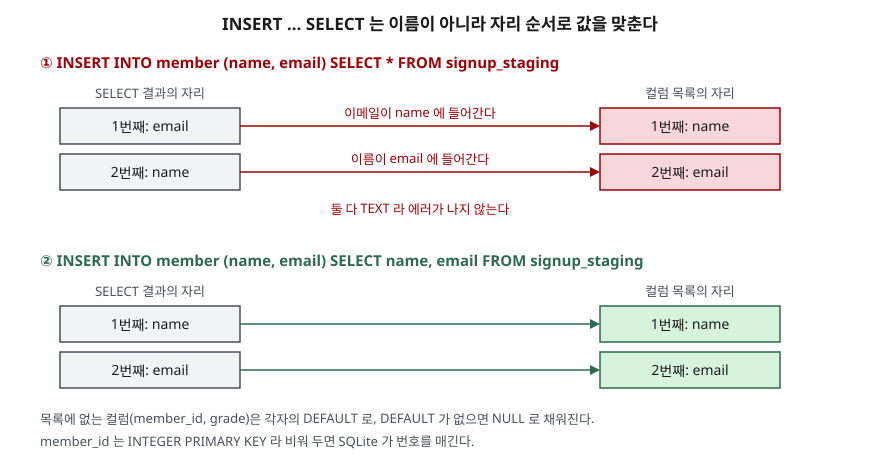

## 들어가며

가입 신청을 임시 표에 모아 두었다가, 하루에 한 번 회원 표로 옮기는 작업을 맡는다.
두 표 모두 이름과 이메일 컬럼이 있으니 `INSERT INTO member (name, email) SELECT * FROM signup_staging`
한 줄이면 될 것 같다. 돌려 보니 에러 없이 3행이 들어간다. 그런데 며칠 뒤 회원 목록 화면에 이름 대신
이메일 주소가 찍혀 있다는 문의가 온다. 이때 대개는 화면 코드를 먼저 뒤지는데, 원인은 옮길 때 이미
생겼다. 두 표의 컬럼 **순서**가 반대였고, `INSERT ... SELECT`는 이름이 아니라 순서로 값을 맞추기 때문이다.

## 개념

**INSERT**는 표에 새 행을 넣는 문장이다. 모양은 세 가지다.

| 모양 | 예 | 쓰는 때 |
|---|---|---|
| 단건 | `INSERT INTO member (name, email) VALUES ('김하나', 'kim@…')` | 한 행을 넣을 때 |
| 다건 | `... VALUES (…), (…), (…)` | 여러 행을 한 문장으로 넣을 때 |
| SELECT로 넣기 | `INSERT INTO member (name, email) SELECT … FROM …` | 다른 표의 조회 결과를 옮길 때 |

표 이름 뒤 괄호가 **컬럼 목록**이다. 값은 이 목록의 순서대로 들어간다. 목록에 없는 컬럼은
표를 만들 때 정한 기본값(`DEFAULT`)이, 기본값이 없으면 `NULL`이 채워진다.
컬럼 목록을 생략하면 표의 모든 컬럼을 정의된 순서대로 채워야 한다.

## 구조



> **출처**: SELECT 결과의 왼쪽 컬럼부터 컬럼 목록의 왼쪽 컬럼에 차례로 넣는다는 규정과, 목록에 없는 컬럼은 기본값 또는 NULL이 된다는 규정은 [SQLite — INSERT](https://www.sqlite.org/lang_insert.html)의 본문 설명을 따랐다.
> INTEGER PRIMARY KEY 컬럼을 비우면 번호가 매겨진다는 것은 [SQLite — CREATE TABLE: ROWIDs and the INTEGER PRIMARY KEY](https://www.sqlite.org/lang_createtable.html#rowid)에 있다.

## 동작 원리

`INSERT ... SELECT`는 두 단계로 일어난다.

1. SELECT를 실행해 결과 행을 만든다. 이때 결과 컬럼에는 **자리 번호**만 있다
2. 결과 행마다 1번째 값을 컬럼 목록의 1번째 컬럼에, 2번째 값을 2번째 컬럼에 넣는다

DB는 2단계에서 결과 컬럼의 이름을 보지 않는다. `SELECT *`는 원본 표의 정의 순서를 그대로 따르므로,
원본이 `(email, name)`이고 목록이 `(name, email)`이면 값이 서로 바뀐다. 두 컬럼이 모두 글자(TEXT)라
들어가는 데에 막힘이 없다. 개수가 다를 때만 에러가 난다.

## 실습 예제

전체 소스: [`code/insert_basics.py`](code/insert_basics.py), 실행 기록: [`code/output.txt`](code/output.txt).
회원 표 `member (member_id, name, email, grade DEFAULT 'basic')`와 가입 신청 표 `signup_staging (email, name)` 3행으로 시작한다.

### 단건과 다건

```text
-- 3. 다건 중 한 행이 실패하면 — 3번 id 가 이미 있다
   INSERT INTO member (member_id, name, email) VALUES (4, '오늘', 'oh@example.com'), (3, '중복', 'dup@example.com')
   에러: UNIQUE constraint failed: member.member_id

   SELECT * FROM member ORDER BY member_id
   1 | 최고참 | choi@example.com | basic
   2 | 정가람 | jung@example.com | gold
   3 | 한별 | han@example.com | basic
```

1행(단건)은 `grade`를 적지 않아 기본값 `basic`이 들어갔다. 3번 문장은 둘째 행의 id가 겹쳐 실패했는데,
**문제없던 첫째 행(4번)도 들어가지 않았다.** 기본 충돌 처리(`ABORT`)는 실패한 문장이 바꾼 것을 전부 되돌린다.

### 개수가 맞지 않으면

```text
   INSERT INTO member (member_id, name, email) VALUES (5, '개수부족')
   에러: 2 values for 3 columns
   INSERT INTO member VALUES (5, '생략', 'skip@example.com')
   에러: table member has 4 columns but 3 values were supplied
```

두 번째는 컬럼 목록을 생략했기 때문에 표의 컬럼 4개를 전부 채워야 했다.

### SELECT *로 옮기면

```text
   INSERT INTO member (name, email) SELECT * FROM signup_staging
   성공 · 바뀐 행 3

   SELECT member_id, name, email FROM member WHERE member_id > 3
   4 | kim@example.com | 김하나
```

에러 없이 3행이 들어갔고, `name` 칸에 이메일이 있다. 행 수만 확인하는 적재 스크립트라면 성공으로 끝난다.

### 옮긴 뒤 검사하기

원본의 `(이름, 이메일)` 쌍이 대상에 그대로 있는지 `EXCEPT`로 확인한다. `EXCEPT`는 앞 조회 결과에서
뒤 조회 결과에 있는 행을 뺀다. 맞게 옮겼다면 남는 행이 없어야 한다.

```text
   SELECT name, email FROM signup_staging EXCEPT SELECT name, email FROM member
   김하나 | kim@example.com
   박세찬 | park@example.com
   이두리 | lee@example.com
```

3행이 전부 남았다. 되돌린 뒤 `SELECT name, email`로 컬럼을 적어 다시 옮기자 같은 검사가 `(행 없음)`을 돌려줬다.

## 실무에서 주의할 점

- **`INSERT ... SELECT *`를 쓰지 않는다.** 원본 표에 컬럼이 하나 추가되거나 순서가 바뀌면, 같은
  문장이 에러 없이 다른 값을 넣는다. 양쪽 모두 컬럼 이름을 적는다.
- **옮긴 뒤 행 수가 아니라 내용을 검사한다.** 실습에서 행 수는 3으로 맞았다. `EXCEPT`로 원본과 대상을
  같은 컬럼 순서로 비교하면 순서가 바뀐 경우를 잡는다.
- **다건 INSERT는 한 문장이 한 단위다.** 한 행이 실패하면 나머지도 들어가지 않는다. 실패한 행만 빼고
  넣으려면 문장을 나누거나 충돌 처리 방식을 따로 정한다.
- **컬럼 목록을 생략하지 않는다.** 표에 컬럼이 늘어나면 생략한 INSERT는 전부 개수 에러로 멈춘다.

## 정리

- INSERT는 단건·다건·SELECT로 넣기 세 모양이 있고, 값은 컬럼 목록의 순서대로 들어간다.
- 목록에 없는 컬럼은 기본값, 기본값이 없으면 NULL이 된다.
- `INSERT ... SELECT`는 이름이 아니라 자리 순서로 맞추므로, 타입이 같은 컬럼끼리 뒤바뀌어도 에러가 없다.
- 적재 뒤 `원본 EXCEPT 대상`이 빈 결과인지 확인하면 순서 오류를 잡을 수 있다.

## 참고 자료

- [SQLite — INSERT](https://www.sqlite.org/lang_insert.html)
- [SQLite — ON CONFLICT clause](https://www.sqlite.org/lang_conflict.html) — 기본 충돌 처리 `ABORT`가 문장 단위로 되돌린다는 설명
- [SQLite — CREATE TABLE: ROWIDs and the INTEGER PRIMARY KEY](https://www.sqlite.org/lang_createtable.html#rowid)
- [SQLite — SELECT: Compound Select Statements](https://www.sqlite.org/lang_select.html#compound_select_statements) — `EXCEPT`
- [SQLite — Datatypes In SQLite: Type Affinity](https://www.sqlite.org/datatype3.html#type_affinity)
