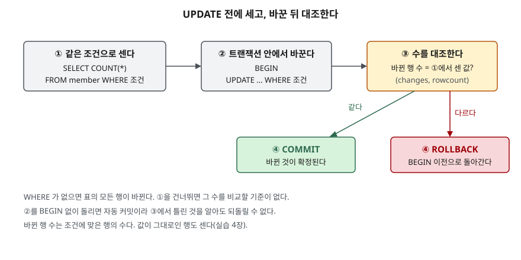

## 들어가며

운영 DB에서 회원 한 명의 등급을 고쳐 달라는 요청이 온다. 콘솔을 열어 `UPDATE member SET grade = 'gold'`까지
치고, `WHERE member_id = 3`을 붙이려다 실수로 엔터가 먼저 눌린다. 화면에는 `5 rows affected`가 찍힌다.
이런 일을 겪은 사람은 대개 "앞으로 조심하자"로 끝내는데, 조심은 횟수가 쌓이면 언젠가 빠진다.
한 번 나면 백업에서 표를 되살리느라 몇 시간이 들고, 그 사이 들어온 변경은 손으로 다시 맞춰야 한다.
필요한 것은 주의력이 아니라, 틀렸을 때 **바뀐 행 수**로 알아차리고 되돌릴 수 있는 절차다.

## 개념

**UPDATE**는 이미 있는 행의 값을 바꾸는 문장이다.

```sql
UPDATE 표이름 SET 컬럼 = 새 값, 컬럼 = 새 값 WHERE 조건;
```

- `SET` 뒤에 바꿀 컬럼과 값을 쉼표로 이어 적는다. 적지 않은 컬럼은 그대로 남는다
- `WHERE`는 바꿀 **행**을 고른다. SQLite 문서는 WHERE가 없으면 표의 모든 행이 바뀐다고 적는다
- 바꾼 뒤 DB는 **바뀐 행 수**를 돌려준다. 파이썬에서는 `cursor.rowcount`로 읽는다

**트랜잭션**은 여러 변경을 한 묶음으로 다루는 단위다. `BEGIN`으로 열고, `COMMIT`으로 확정하거나
`ROLLBACK`으로 연 시점 이전 상태로 되돌린다. `BEGIN` 없이 문장을 치면 문장 하나가 끝나는 즉시
확정된다(자동 커밋). 이때는 되돌릴 방법이 없다.

## 구조



> **출처**: WHERE가 없으면 모든 행이 바뀐다는 것과 SET의 식이 대입 전에 전부 계산된다는 것은 [SQLite — UPDATE: Overview](https://www.sqlite.org/lang_update.html#overview),
> 자동 커밋과 ROLLBACK은 [SQLite — Transaction: Transactions](https://www.sqlite.org/lang_transaction.html#transactions),
> 바뀐 행 수는 [SQLite C API — sqlite3_changes()](https://www.sqlite.org/c3ref/changes.html)를 따랐다.
> 네 단계로 묶은 것은 글쓴이의 절차다.

## 동작 원리

UPDATE는 두 단계로 일어난다.

1. `WHERE` 조건에 맞는 행을 찾는다. 조건이 없으면 전부가 대상이다
2. 대상 행마다 `SET`의 오른쪽 식을 계산해 새 값을 넣는다

2단계에서 문서가 짚는 점이 하나 있다. 오른쪽 식이 같은 행의 컬럼을 읽으면, **대입이 일어나기 전에
모든 식을 먼저 계산한다.** 그래서 `SET a = b, b = a`는 앞의 대입이 뒤의 식에 끼어들지 않고 두 값을 맞바꾼다.

바뀐 행 수는 1단계에서 고른 행의 수다. 그래서 1단계와 똑같은 조건으로 `COUNT(*)`를 먼저 돌리면 UPDATE가
몇 행을 바꿀지 미리 알 수 있고, 두 수가 다르면 조건이 어긋났다는 뜻이 된다.

## 실습 예제

전체 소스: [`code/update_basics.py`](code/update_basics.py), 실행 기록: [`code/output.txt`](code/output.txt).
회원 표 `member (member_id, name, grade, point)` 5행으로 시작한다. basic 3명, gold 2명이다.

### WHERE를 빠뜨리면

```text
-- 1. WHERE 를 빠뜨리면 — 트랜잭션 안에서 돌리고 되돌린다
   UPDATE member SET grade = 'gold'  → 바뀐 행 5
   SELECT grade, COUNT(*) FROM member GROUP BY grade
   gold | 5

   ROLLBACK 뒤
   SELECT grade, COUNT(*) FROM member GROUP BY grade
   basic | 3
   gold | 2
```

5행이 전부 gold가 됐다. `BEGIN` 안이었으므로 `ROLLBACK`으로 원래대로 돌아왔다.

### 절차대로 돌리면

포인트 2000 이상인 basic 회원을 gold로 올린다. 같은 조건으로 먼저 세고, 바꾼 뒤 대조한다.

```text
   SELECT COUNT(*) FROM member WHERE grade = 'basic' AND point >= 2000  → 1
   UPDATE member SET grade = 'gold' WHERE grade = 'basic' AND point >= 2000  → 바뀐 행 1
   같으므로 COMMIT
```

### 조건을 옮겨 적다 틀리면

세는 조건은 맞게 썼는데, UPDATE로 옮기면서 `AND`를 `OR`로 적었다.

```text
   SELECT COUNT(*) FROM member WHERE grade = 'basic' AND point < 500  → 1
   UPDATE member SET point = point + 100 WHERE grade = 'basic' OR point < 500  → 바뀐 행 2
   다르므로 ROLLBACK
```

센 값은 1, 바뀐 행은 2다. 절차가 없었다면 포인트 1200인 김하나 회원에게도 100점이 붙은 채 확정됐다.
에러는 나지 않으므로 **수를 대조하는 것 말고는 알아챌 방법이 없다.**

### 값이 그대로여도 센다

```text
-- 4. 값이 그대로여도 바뀐 행으로 센다
   UPDATE member SET grade = 'gold' WHERE grade = 'gold'  → 바뀐 행 3
```

이미 gold인 3행에 gold를 다시 넣었는데 바뀐 행은 3이다. `sqlite3_changes()` 문서는 "바뀐 행 수"라고만 적고
값이 같은 경우는 따로 언급하지 않는다. 실측으로는 **조건에 맞은 행 수**가 나온다. 대조가 성립하는 이유다.

### 맞바꾸기와 RETURNING

`a = 1, b = 2`인 한 행짜리 표 `pair`에 `UPDATE pair SET a = b, b = a`를 돌린 뒤 조회했다.

```text
-- 5. SET 의 오른쪽은 바뀌기 전 값을 읽는다 — 두 컬럼 맞바꾸기
   SELECT a, b FROM pair
   2 | 1

-- 6. RETURNING — 바뀐 행을 그 자리에서 돌려받는다
   UPDATE member SET point = point - 300 WHERE member_id = 3 RETURNING member_id, name, point
   3 | 박세찬 | 0
```

`RETURNING`은 바뀐 행을 그 자리에서 돌려준다. 따로 SELECT를 하지 않아도 무엇이 바뀌었는지 보인다.
SQLite는 3.35.0부터 지원한다.

## 실무에서 주의할 점

- **세는 조건과 UPDATE 조건을 한 곳에서 가져온다.** 실습 3장처럼 손으로 두 번 적으면 그 사이에서 틀린다.
  `WHERE` 이하를 복사해 붙이거나, 코드라면 같은 문자열 변수를 쓴다.
- **대조는 `BEGIN` 안에서 해야 의미가 있다.** 자동 커밋 상태에서 바뀐 행 수가 다르다는 것을 알아도, 이미
  확정된 뒤라 되돌릴 수 없다.
- **`BEGIN`을 열어 둔 채 오래 두지 않는다.** 확인하는 동안 다른 연결의 쓰기가 막힐 수 있다. 세고, 바꾸고,
  대조하는 일을 한 번에 끝낸다.
- **값이 같은 행도 센다.** "실제로 값이 바뀐 행"만 세고 싶다면 `AND grade <> 'gold'`처럼 조건에 넣는다.
  그러지 않으면 재실행할 때마다 같은 수가 나와 이미 적용됐는지 구분이 안 된다.

## 정리

- UPDATE는 `WHERE`로 행을 고르고 `SET`으로 값을 바꾼다. `WHERE`가 없으면 모든 행이 바뀐다.
- 같은 조건으로 먼저 세고, `BEGIN` 안에서 바꾸고, 바뀐 행 수를 대조해 다르면 `ROLLBACK`한다.
- 조건을 잘못 옮겨 적어도 에러는 나지 않는다. 수의 대조가 그것을 잡는다.
- `SET`의 식은 대입 전에 전부 계산되고, `RETURNING`으로 바뀐 행을 바로 볼 수 있다.

## 참고 자료

- [SQLite — UPDATE](https://www.sqlite.org/lang_update.html) — WHERE 없는 UPDATE, SET 식의 계산 시점
- [SQLite — Transaction](https://www.sqlite.org/lang_transaction.html) — 자동 커밋, BEGIN·COMMIT·ROLLBACK
- [SQLite C API — sqlite3_changes()](https://www.sqlite.org/c3ref/changes.html) — 바뀐 행 수
- [SQLite — RETURNING](https://www.sqlite.org/lang_returning.html) — 3.35.0부터 지원
