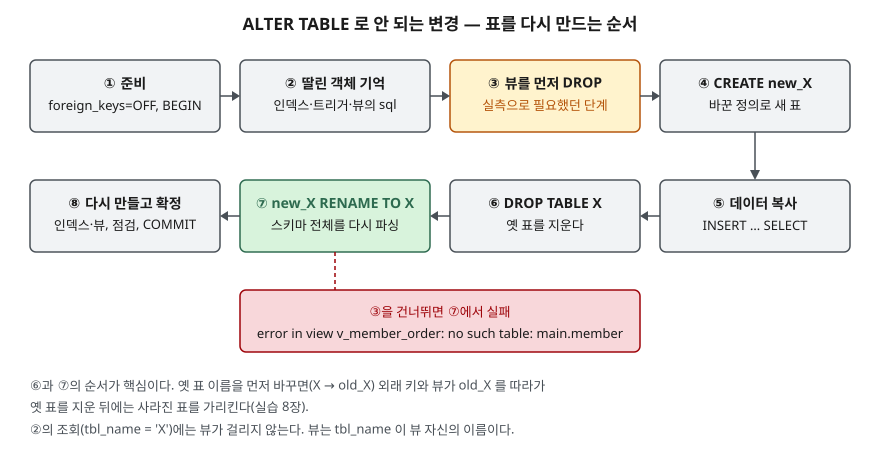

## 들어가며

취미로 만든 가계부 앱이 쓸 만해져서 회원 표의 `name` 컬럼에 `NOT NULL`을 걸고 싶어진다. 다른 DB에서 하던 대로
`ALTER TABLE member ALTER COLUMN name SET NOT NULL`을 치면 SQLite는 `syntax error`만 돌려준다.
검색해서 나온 "새 표를 만들어 옮기라"는 답을 따라 하다 보면, 옛 표 이름부터 바꾸는 순서로 적힌 글도 많다.
그 순서로 하면 에러 없이 끝나는데, 며칠 뒤 주문을 넣을 때 `no such table`이 난다. 원인을 찾으려면 표 정의를
하나씩 열어 봐야 하고, 그 사이 들어온 데이터를 옛 구조와 맞춰야 한다.

## 개념

**ALTER TABLE**은 이미 만든 표의 구조를 바꾸는 문장이다. SQLite가 직접 받아들이는 형태는 넷뿐이다.

| 형태 | 하는 일 |
|---|---|
| `RENAME TO 새이름` | 표 이름을 바꾼다 |
| `RENAME COLUMN 옛 TO 새` | 컬럼 이름을 바꾼다. 인덱스·트리거·뷰 안의 이름도 함께 바뀐다 |
| `ADD COLUMN 컬럼정의` | 컬럼을 맨 끝에 붙인다 |
| `DROP COLUMN 컬럼` | 컬럼을 지운다. 3.35.0부터 된다 |

컬럼의 제약을 바꾸는 `ALTER COLUMN`은 **3.53.0(2026-04-09)에** 들어왔다. 문서의 ALTER COLUMN 절은
NOT NULL을 넣고 빼는 형태를 적고, 릴리스 노트는 CHECK 제약도 넣고 뺄 수 있게 했다고 적는다. 타입 변경은 없다.
이 글의 3.49.1에는 `ALTER COLUMN` 자체가 없다. 그 밖의 변경은 표를 새로 만들어 데이터를 옮기는 **재구성 절차**로 한다.

**뷰**는 SELECT 문에 이름을 붙여 표처럼 쓰는 객체이고, **외래 키**는 다른 표의 행을 가리키는 컬럼 제약이다.
재구성 절차에서 깨지는 것이 이 둘이다.

## 구조



> **출처**: 네 형태와 ADD COLUMN·DROP COLUMN의 제약, 재구성 절차는 [SQLite — ALTER TABLE: Making Other Kinds Of Table Schema Changes](https://www.sqlite.org/lang_altertable.html#otheralter),
> ALTER 뒤 스키마 전체를 다시 파싱한다는 것은 같은 문서의 [How It Works](https://www.sqlite.org/lang_altertable.html#how_it_works),
> ALTER COLUMN이 들어온 판은 [SQLite Release History — 3.53.0](https://www.sqlite.org/changes.html)을 따랐다.
> ③을 앞으로 당긴 것은 실습 6·7장의 실측에 따른 글쓴이의 조정이다. 문서는 뷰 처리를 이름 바꾸기 뒤(9단계)에 둔다.

## 동작 원리

SQLite는 표 정의를 `sqlite_schema` 표에 **CREATE 문 원문 그대로** 저장한다. ALTER TABLE은 그 글자를 고쳐 쓴 뒤
**스키마 전체를 다시 파싱**한다. 그래서 두 가지가 따라온다.

1. 지원되는 변경은 대부분 저장된 원문을 고쳐 끝난다(이름 바꾸기, 끝에 컬럼 붙이기). 문서에 따르면
   `DROP COLUMN`은 여기에 더해 표 내용을 다시 써서 지운 컬럼의 데이터를 없앤다
2. 다시 파싱하다 어느 객체든 말이 안 되면 **ALTER 전체가 실패한다.** 지금 바꾸는 표와 무관한 뷰라도 그렇다

표 이름을 바꾸면 트리거·뷰(3.25.0부터)와 외래 키(3.26.0부터) 안의 참조도 새 이름으로 바뀐다.
재구성 절차의 순서가 중요한 이유가 이것이다.

## 실습 예제

전체 소스: [`code/alter_table_basics.py`](code/alter_table_basics.py), 실행 기록: [`code/output.txt`](code/output.txt).
회원 `member` 3행, 이를 외래 키로 가리키는 주문 `orders` 2행, `phone` 인덱스, 두 표를 잇는 뷰 `v_member_order`로 시작한다.

### ADD COLUMN이 거절하는 것

```text
   [실패] ALTER TABLE member ADD COLUMN email TEXT NOT NULL
          → OperationalError: Cannot add a NOT NULL column with default value NULL
   [실패] ALTER TABLE member ADD COLUMN email TEXT UNIQUE
          → OperationalError: Cannot add a UNIQUE column
   [실패] ALTER TABLE member ADD COLUMN joined_at TEXT DEFAULT CURRENT_TIMESTAMP
          → OperationalError: Cannot add a column with non-constant default
   [실패] ALTER TABLE member ADD COLUMN point INTEGER DEFAULT 0 CHECK (point > 0)
          → OperationalError: CHECK constraint failed
   [성공] ALTER TABLE member ADD COLUMN email TEXT NOT NULL DEFAULT ''
```

기존 행에 넣을 값이 정해지지 않으면 거절한다. `CHECK`는 기존 행이 받을 기본값 0이 조건을 어겨 실패했다.

### DROP COLUMN과 ALTER COLUMN

```text
   [실패] ALTER TABLE member DROP COLUMN phone
          → OperationalError: error in index ix_member_phone after drop column: no such column: phone
   [실패] ALTER TABLE member ALTER COLUMN member_name SET NOT NULL
          → OperationalError: near "ALTER": syntax error
```

인덱스가 걸린 컬럼은 지울 수 없다. 인덱스를 먼저 지워야 한다.

### 재구성 — 문서의 단계 번호대로 하면

`member_name`에 `NOT NULL`을 걸려고 새 표 `new_member`를 만들고, 복사하고, 옛 표를 지우고, 이름을 바꿨다.

```text
   tbl_name = 'member' 로 찾은 객체: [('index', 'ix_member_phone')]
   [실패] ALTER TABLE new_member RENAME TO member
          → OperationalError: error in view v_member_order: no such table: main.member
```

**예상과 다른 결과다.** 옛 표를 지운 순간 뷰는 없는 표를 가리키고, 이름 바꾸기가 스키마를 다시 파싱하다 그 뷰에서 멈췄다.
또 딸린 객체를 찾는 문서의 조회(`tbl_name = 'member'`)에 뷰가 걸리지 않았다. 뷰의 `tbl_name`은 뷰 자신의 이름이다.
`BEGIN` 안이었으므로 `ROLLBACK`으로 원래 표가 그대로 남았다.

### 뷰를 먼저 지우면

```text
   [성공] 새 표 → 복사 → DROP TABLE member → RENAME → 인덱스·뷰 재생성 → COMMIT
   [실패] INSERT INTO member (member_id, member_name) VALUES (4, NULL)
          → IntegrityError: NOT NULL constraint failed: member.member_name
```

`orders`의 외래 키는 `REFERENCES member (member_id)` 그대로 남았고 `PRAGMA foreign_key_check`는 빈 결과였다.

### 옛 표 이름부터 바꾸면

```text
   이름을 바꾼 직후 orders 정의: … member_id  INTEGER REFERENCES "old_member" (member_id), …
   [실패] SELECT * FROM v_member_order
          → OperationalError: no such table: main.old_member
   [실패] INSERT INTO orders VALUES (12, 2, 3000)
          → OperationalError: no such table: main.old_member
```

외래 키와 뷰가 이름을 따라 `old_member`로 바뀌었고, 옛 표를 지운 뒤로는 사라진 표를 가리킨다. 절차 중에는 에러가 없었다.

## 실무에서 주의할 점

- **옛 표의 이름을 먼저 바꾸지 않는다.** 새 표를 임시 이름으로 만들고, 옛 표를 지운 뒤, 새 표를 원래 이름으로 바꾼다.
- **그 표를 쓰는 뷰는 `sqlite_schema`의 `sql` 원문으로 따로 찾아 먼저 지운다.** `tbl_name` 조회로는 안 나온다.
- **재구성은 `BEGIN` 안에서 한다.** 실습 6장처럼 중간에 실패해도 되돌릴 수 있다.
- **`DROP COLUMN` 전에 인덱스를 확인한다.** 인덱스·유일 제약·CHECK·외래 키·뷰에 쓰인 컬럼은 지워지지 않는다.

## 정리

- SQLite의 ALTER TABLE은 이름 바꾸기 2가지, 컬럼 추가, 컬럼 삭제만 받는다. `ALTER COLUMN`은 3.53.0부터다.
- ADD COLUMN은 기본값 없는 NOT NULL, UNIQUE, 상수가 아닌 기본값, 기존 행이 어기는 CHECK를 거절한다.
- 나머지는 새 표 → 복사 → 옛 표 삭제 → 이름 바꾸기로 한다. 뷰는 옛 표보다 먼저 지워야 이름 바꾸기가 된다.

## 참고 자료

- [SQLite — ALTER TABLE](https://www.sqlite.org/lang_altertable.html) — 네 형태의 제약, 재구성 절차, 스키마 재파싱
- [SQLite — Release History](https://www.sqlite.org/changes.html) — DROP COLUMN(3.35.0), ALTER COLUMN NOT NULL(3.53.0)
- [SQLite — CREATE VIEW](https://www.sqlite.org/lang_createview.html) — 뷰 정의
