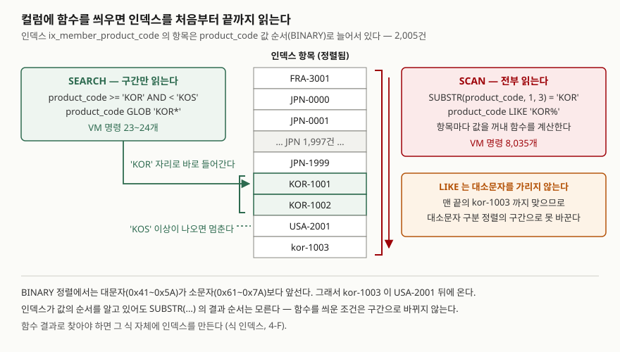

## 들어가며

회원 표에서 한국 상품을 산 사람만 뽑으라는 요청을 받았다. 상품 코드가 `KOR-1001`처럼 생겼으니
앞 세 글자를 잘라 `'KOR'`과 비교하면 되겠다 싶어 `WHERE SUBSTR(product_code, 1, 3) = 'KOR'`을 쓴다.
결과는 맞게 나온다. 그런데 이 조건은 상품 코드에 인덱스가 있어도 회원 2,005명의 코드를 전부 꺼내
하나씩 잘라 본다. 같은 결과를 범위 조건으로 쓰면 SQLite 가상 머신이 수행하는 명령이 8,035개에서
23개로 줄어든다. 문자열 함수는 결과만 보고 쓰면 이 차이가 드러나지 않는다.

## 개념

**문자열 함수**는 글자 값을 받아 가공한 값을 돌려주는 함수다. 표에 저장된 값은 바뀌지 않고,
조회 결과에서만 바뀐 값이 나온다. 하는 일로 나누면 세 갈래다.

| 갈래 | 함수 | 하는 일 |
|---|---|---|
| 자르기 | `SUBSTR(x, 시작, 길이)` | 시작 위치부터 길이만큼 잘라 낸다. 위치는 1부터 센다 |
| | `INSTR(x, 찾을 글자)` | 찾을 글자가 처음 나오는 위치. 없으면 0 |
| | `LENGTH(x)` | 글자 수 |
| 붙이기 | `x \|\| y` | 두 값을 잇는다. 표준 SQL의 연결 연산자 |
| | `CONCAT(x, y, …)` | 여러 값을 잇는다. NULL은 빈 문자열로 친다 |
| | `CONCAT_WS(구분자, x, y, …)` | 사이사이에 구분자를 넣어 잇는다. NULL은 건너뛴다 |
| 바꾸기 | `REPLACE(x, 찾을 것, 바꿀 것)` | 찾은 곳을 전부 바꾼다 |
| | `TRIM(x)` / `LTRIM` / `RTRIM` | 양끝(왼쪽·오른쪽) 공백을 지운다 |
| | `UPPER(x)` / `LOWER(x)` | 대문자·소문자로 바꾼다 |

`CONCAT`과 `CONCAT_WS`는 SQLite 3.44.0에서 들어왔다. 그보다 낮은 판에서는 `||`만 쓸 수 있다.

## 구조



> **출처**: LIKE·GLOB을 범위 조건으로 바꾸는 규칙과 그 조건은 [SQLite — The SQLite Query Optimizer Overview: The LIKE Optimization](https://www.sqlite.org/optoverview.html#the_like_optimization),
> 식 인덱스는 [SQLite — Indexes On Expressions](https://www.sqlite.org/expridx.html)를 따랐다. VM 명령 수는 이 글의 예제([`code/output.txt`](code/output.txt))에서 센 값이다.

## 동작 원리

인덱스는 컬럼 값을 **정렬해 둔 목록**이다. 사전에서 단어를 찾듯 `'KOR'`이 들어갈 자리를 곧장 찾아
들어가고, `'KOS'` 이상인 값이 나오면 멈출 수 있다. 실행계획에 `SEARCH`로 찍히는 경우다.

`SUBSTR(product_code, 1, 3)`은 사정이 다르다. 인덱스는 `product_code`의 순서만 알고, 그 값을
잘라 만든 결과의 순서는 모른다. 그래서 SQLite는 항목을 처음부터 하나씩 꺼내 함수를 계산하고 비교한다.
실행계획에는 `SCAN`으로 찍힌다. 인덱스 이름이 같이 찍혀도 인덱스를 **다 읽는다**는 뜻이다.

`LIKE 'KOR%'`은 함수 호출이 아닌데도 같은 일이 생긴다. SQLite 문서에 따르면 `LIKE`는 기본적으로
대소문자를 가리지 않으므로, 컬럼 인덱스가 대소문자를 가리지 않는 `NOCASE` 정렬일 때만 범위 조건으로
바뀐다. 이 예제의 인덱스는 기본 정렬(`BINARY`)이라 `kor-1003`이 표 맨 끝에 가 있고, `'KOR'`~`'KOS'`
구간 하나로는 그 값을 담을 수 없다. 대소문자를 가리는 `GLOB`은 `BINARY` 인덱스를 범위로 탄다.

## 실습 예제

메모리 SQLite에 회원 5명을 넣었다. 2번의 메모 앞에는 탭 문자가 있고, 3번은 메모가 NULL,
4번은 상품 코드가 소문자다. 전체 소스: [`code/string_functions.py`](code/string_functions.py),
실행 기록: [`code/output.txt`](code/output.txt)

```text
  id | member_name | email                 | product_code | memo
  ---+-------------+-----------------------+--------------+--------
   1 | 김도윤      | Doyun.Kim@Example.com | KOR-1001     |   VIP
   2 | 이서준      | seojun@example.com    | KOR-1002     | 	신규
   3 | 박하은      | HAEUN@example.COM     | USA-2001     | NULL
   4 | 최유나      | yuna@example.com      | kor-1003     | 재구매
   5 | Émile       | emile@example.fr      | FRA-3001     | 해외
```

### 자르기

```text
[1-B 음수 시작 위치 — 뒤에서부터 센다]
  ('KOR-1001', '1001', '10')
[1-C 이메일에서 @ 앞뒤 나누기]
  ('Doyun.Kim@Example.com', 10, 'Doyun.Kim', 'Example.com')
  ('seojun@example.com', 7, 'seojun', 'example.com')
[1-D LENGTH — 글자 수인가 바이트 수인가]
  ('김도윤', 3, 9)
  ('Émile', 5, 6)
```

`SUBSTR(x, -4)`는 뒤에서 네 번째 글자부터 끝까지다. 1-C는 `INSTR`로 `@`의 위치를 찾고, 그 앞은
`위치 - 1`글자, 뒤는 `위치 + 1`부터 잘랐다. 길이가 제각각인 값을 자를 때 쓰는 모양이다.
1-D에서 `LENGTH`는 한글 이름을 3으로 셌다. 바이트가 아니라 글자를 센다. 같은 값을 `BLOB`으로
바꿔 세면 UTF-8 바이트 수인 9가 나온다. 컬럼 크기를 바이트로 제한하는 다른 DB로 옮길 때 이 차이가 드러난다.

### 붙이기 — NULL을 만났을 때 셋이 다르다

```text
[2-A || 로 이름과 메모 잇기]
  (3, None)
[2-B CONCAT 으로 같은 일]
  (3, '박하은 / ')
[2-C CONCAT_WS — 구분자를 한 번만 쓰고 NULL 은 건너뛴다]
  (3, '박하은 / USA-2001')
```

메모가 NULL인 3번 회원만 뽑았다. `||`는 한쪽이 NULL이면 결과 전체가 NULL이 되어 이름까지 사라졌다.
`CONCAT`은 NULL을 빈 문자열로 치고 이었으므로 구분자 `' / '`가 꼬리에 남았다. `CONCAT_WS`는 NULL 인자를
아예 건너뛰어 구분자도 넣지 않았다. 빈 칸이 섞인 값을 이어 붙일 때는 `CONCAT_WS`가 가장 손이 덜 간다.

### 바꾸기 — 기본값이 생각보다 좁다

```text
[3-A REPLACE — 대소문자를 구분한다]
  ('Doyun.Kim@Example.com', 'Doyun.Kim@Example.com')
  ('seojun@example.com', 'seojun@example.net')
  ('HAEUN@example.COM', 'HAEUN@example.COM')
[3-B TRIM — 기본은 공백만 지운다]
  (1, '[  VIP  ]', '[VIP]', '[VIP]')
  (2, '[\t신규]', '[\t신규]', '[신규]')
[3-C UPPER/LOWER — ASCII 밖의 글자는 그대로]
  ('Émile', 'ÉMILE', 'Émile', 'emile@example.fr')
```

`REPLACE`는 `Example.com`과 `example.COM`을 바꾸지 않았다. 글자를 정확히 같은지로 비교하기 때문이다.
`TRIM(memo)`는 1번의 공백은 지웠지만 2번 앞의 탭(`\t`)은 남겼다. 기본으로 지우는 글자는 공백 하나뿐이고,
탭도 지우려면 두 번째 인자에 지울 글자를 넘긴다. `LOWER('Émile')`은 `É`를 그대로 뒀다. SQLite 기본
`LOWER`·`UPPER`는 ASCII 글자만 바꾸고, 다른 글자까지 바꾸려면 ICU 확장을 올려야 한다고 문서가 적는다.

### WHERE 절에 함수를 쓰면 — 예상과 달랐던 결과

JPN- 코드 회원 2,000명을 더 넣고 `ANALYZE`로 통계를 만든 뒤 여섯 가지 조건의 실행계획과 VM 명령 수를 쟀다.

```text
[4-A 컬럼에 SUBSTR 을 씌운 조건]  결과 2행 · VM 명령 8,035개
  `--SCAN member USING COVERING INDEX ix_member_product_code
[4-B LIKE 'KOR%']  결과 3행 · VM 명령 8,035개
  `--SCAN member USING COVERING INDEX ix_member_product_code
[4-C 범위 조건으로 바꿔 쓴 접두 검색]  결과 2행 · VM 명령 23개
  `--SEARCH member USING COVERING INDEX ix_member_product_code (product_code>? AND product_code<?)
[4-D GLOB 'KOR*']  결과 2행 · VM 명령 24개
  `--SEARCH member USING COVERING INDEX ix_member_product_code (product_code>? AND product_code<?)
[4-E 컬럼에 LOWER 를 씌운 이메일 검색]  결과 1행 · VM 명령 8,031개
  `--SCAN member USING COVERING INDEX ix_member_email
[4-F 식 인덱스 LOWER(email) 을 만든 뒤 같은 질의]  결과 1행 · VM 명령 16개
  `--SEARCH member USING COVERING INDEX ix_member_lower_email (<expr>=?)
[4-G 식 인덱스는 그대로 두고 UPPER 로 찾으면]  결과 1행 · VM 명령 8,031개
  `--SCAN member USING COVERING INDEX ix_member_email
```

(실행계획은 `EXPLAIN QUERY PLAN` 결과를 `sqlite3` CLI 모양의 트리로 그린 것이다. 각 케이스의 `QUERY PLAN` 머리줄은 줄였다.)

`LIKE 'KOR%'`이 인덱스를 범위로 탈 것이라 예상했지만 4-B는 `SUBSTR`과 똑같이 `SCAN`이었고, 결과도
한 행 많은 3행이었다. 소문자 `kor-1003`까지 맞았기 때문이다. 결과 행 수가 다르니 4-B는 4-A의 대체가
아니다. 대소문자를 가려 찾으려면 4-C처럼 범위로 쓰거나 4-D의 `GLOB`을 쓴다. 대소문자를 가리지 않고
찾아야 하면 4-E·4-F처럼 `LOWER(email)` 식 자체에 인덱스를 만든다. 명령 수가 8,031개에서 16개가 됐다.

## 실무에서 주의할 점

- **`WHERE` 절에서 함수는 컬럼 쪽이 아니라 비교 값 쪽에 둔다.** `SUBSTR(code, 1, 3) = 'KOR'`보다
  `code >= 'KOR' AND code < 'KOS'`가 같은 뜻이면서 인덱스를 구간으로 탄다. 바꿔 쓸 수 없으면 식 인덱스를 만든다.
- **식 인덱스는 질의에 적힌 식과 모양이 같아야 쓰인다.** `LOWER(email)`로 만들었으면 조건도
  `LOWER(email) = …`이어야 한다. 4-G처럼 같은 뜻의 `UPPER(email)`로 찾으면 다시 `SCAN`이다.
- **`||`로 이을 컬럼에 NULL이 있을 수 있으면 `CONCAT_WS`나 `COALESCE`로 감싼다.** 한 칸이 비면
  문자열 전체가 NULL이 되고, 화면에는 빈칸으로만 보여 원인을 찾기 어렵다.
- **입력 값 다듬기를 `TRIM` 하나로 끝내지 않는다.** 탭·줄바꿈·전각 공백은 기본 `TRIM`이 지우지 않는다.
  저장하기 전에 애플리케이션에서 정리하거나, 지울 글자를 두 번째 인자로 명시한다.
- **`LENGTH`의 단위를 확인한다.** SQLite는 글자 수를 돌려주지만, MySQL 8.0 문서는 `LENGTH()`가 바이트
  수를, `CHAR_LENGTH()`가 글자 수를 돌려준다고 적는다(이 글에서 MySQL은 실행하지 않았다).
  한글이 섞인 값의 길이 검사는 엔진을 옮기면 결과가 달라질 수 있다.

## 정리

- `SUBSTR`·`INSTR`·`LENGTH`로 자르고, `||`·`CONCAT`·`CONCAT_WS`로 잇고, `REPLACE`·`TRIM`·`UPPER`/`LOWER`로 바꾼다.
- NULL을 만나면 `||`는 전체가 NULL, `CONCAT`은 빈 문자열로 치고, `CONCAT_WS`는 그 인자를 건너뛴다.
- SQLite 기본 `TRIM`은 공백만, `LOWER`·`UPPER`는 ASCII만, `REPLACE`는 대소문자를 구분해 다룬다.
- `WHERE` 절 컬럼에 함수를 씌우면 인덱스를 전부 읽는다. 범위 조건으로 바꾸거나 식 인덱스를 만든다.

## 참고 자료

- [SQLite — Built-In Scalar SQL Functions](https://www.sqlite.org/lang_corefunc.html) — [substr()](https://www.sqlite.org/lang_corefunc.html#substr), [instr()](https://www.sqlite.org/lang_corefunc.html#instr), [length()](https://www.sqlite.org/lang_corefunc.html#length), [concat()](https://www.sqlite.org/lang_corefunc.html#concat), [concat_ws()](https://www.sqlite.org/lang_corefunc.html#concat_ws), [replace()](https://www.sqlite.org/lang_corefunc.html#replace), [trim()](https://www.sqlite.org/lang_corefunc.html#trim), [lower()](https://www.sqlite.org/lang_corefunc.html#lower)
- [SQLite — The SQLite Query Optimizer Overview: The LIKE Optimization](https://www.sqlite.org/optoverview.html#the_like_optimization) — LIKE·GLOB이 범위 조건으로 바뀌는 조건
- [MySQL 8.0 Reference Manual — 14.8 String Functions and Operators](https://dev.mysql.com/doc/refman/8.0/en/string-functions.html#function_length) — `LENGTH()`는 바이트, `CHAR_LENGTH()`는 글자 수
- [SQLite — Indexes On Expressions](https://www.sqlite.org/expridx.html) — 식 인덱스가 쓰이려면 질의의 식이 인덱스 정의와 같아야 한다는 규칙
- [SQLite Release 3.44.0](https://www.sqlite.org/releaselog/3_44_0.html) — `concat()`·`concat_ws()` 추가
