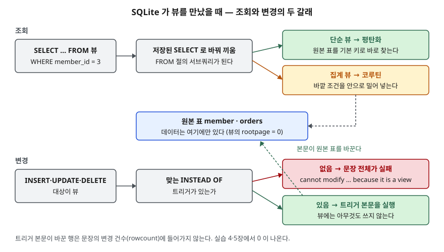

## 들어가며

취미로 만든 쇼핑몰 연습 앱에서 "활동 중인 회원 목록"을 뽑는 쿼리를 화면 세 곳에 붙여 넣었다. 나중에 조건에
"휴면 제외"를 더해야 하는데, 세 곳을 다 찾아 고쳐야 하고 한 곳을 빠뜨리면 화면마다 회원 수가 다르게 나온다.
이 쿼리에 이름을 붙여 한 곳에 두는 것이 뷰다. 그런데 뷰를 표처럼 쓰다가 `UPDATE`까지 걸면
SQLite는 `cannot modify … because it is a view`를 돌려준다. 어디까지가 표처럼 되고 어디부터 안 되는지를
알아야 뷰를 믿고 쓸 수 있다.

## 개념

**뷰(VIEW)** 는 SELECT 문에 이름을 붙여 표처럼 쓰게 한 객체다. `CREATE VIEW 이름 AS SELECT …`로 만들고,
`SELECT * FROM 이름`으로 조회한다. 뷰는 **행을 따로 저장하지 않는다.** 저장되는 것은 SELECT 문뿐이고,
뷰를 조회할 때마다 그 SELECT 가 원본 표를 다시 읽는다. 그래서 원본 표가 바뀌면 뷰의 결과도 바로 바뀐다.

뷰를 쓰는 이유는 둘이다. 같은 조건을 한 곳에 모아 두면 고칠 곳이 하나가 된다. 또 컬럼 이름을 바꾸거나
일부 컬럼만 보여서, 쓰는 쪽이 원본 표의 구조를 몰라도 되게 한다.

| 문법 | 뜻 |
|---|---|
| `CREATE VIEW v AS SELECT …` | 뷰를 만든다 |
| `CREATE VIEW v (a, b) AS SELECT …` | 뷰의 컬럼 이름을 직접 정한다. 3.9.0부터 된다 |
| `CREATE TEMP VIEW v AS …` | 만든 연결에서만 보이고, 연결이 닫히면 없어진다 |
| `DROP VIEW v` | 뷰를 지운다. 원본 표는 그대로다 |

SQLite 문서는 뷰를 **읽기 전용**이라고 적는다. 뷰에 INSERT·UPDATE·DELETE 를 하려면
**INSTEAD OF 트리거**를 달아야 한다. 트리거는 어떤 문장이 실행될 때 대신 또는 함께 돌 문장을 미리
적어 둔 객체이고, INSTEAD OF 트리거는 뷰에 대한 변경 문장이 오면 **그 문장 대신** 본문을 실행한다.

## 구조



> **출처**: 뷰가 읽기 전용이고 INSTEAD OF 트리거로 대신한다는 것은 [SQLite — CREATE VIEW](https://www.sqlite.org/lang_createview.html),
> 트리거 본문만 실행되고 변경 건수에 안 들어간다는 것은 [SQLite — CREATE TRIGGER: INSTEAD OF triggers](https://www.sqlite.org/lang_createtrigger.html#instead_of_triggers),
> 뷰가 서브쿼리로 바뀌어 평탄화·코루틴·조건 밀어넣기를 거치는 것은 [SQLite Query Optimizer Overview — Query Flattening](https://www.sqlite.org/optoverview.html#flattening),
> [Subquery Co-routines](https://www.sqlite.org/optoverview.html#subquery_co_routines), [Push-Down Optimization](https://www.sqlite.org/optoverview.html#the_predicate_push_down_optimization)을 따랐다.

## 동작 원리

옵티마이저 문서에 따르면 뷰를 쓰는 자리는 **FROM 절의 서브쿼리로 바뀐다.** 그 다음 두 길 중 하나를 탄다.

1. **평탄화(flattening)**: 서브쿼리를 풀어 바깥 쿼리에 합친다. 뷰가 없던 것처럼 원본 표를 직접 읽으므로
   원본 표의 인덱스를 그대로 쓴다
2. **코루틴(co-routine)**: 풀 수 없는 서브쿼리(집계가 든 뷰 등)는 한 행씩 만들어 바깥에 넘긴다. 이때
   바깥 WHERE 조건을 안으로 **밀어 넣어(push-down)** 만드는 행 수를 줄인다

변경 문장은 다르다. 대상이 뷰이고 맞는 INSTEAD OF 트리거가 없으면 문장 전체가 실패한다.
트리거가 있으면 뷰에는 아무것도 쓰지 않고 트리거 본문만 실행한다.

## 실습 예제

전체 소스: [`code/view_basics.py`](code/view_basics.py), 실행 기록: [`code/output.txt`](code/output.txt).
회원 `member` 3행(그중 2번은 `active = 0`)과 주문 `orders` 3행으로 시작한다. 활동 회원만 보이는
`v_active_member`와 회원별 주문 합계 `v_member_total` 두 뷰를 만든다.

```sql
CREATE VIEW v_active_member (member_id, member_name, phone) AS
    SELECT member_id, name, phone FROM member WHERE active = 1;
```

### 뷰는 데이터가 없다

```text
   type | name | rootpage
   table | member | 2
   table | orders | 3
   view | v_active_member | 0
   view | v_member_total | 0
```

`rootpage`는 그 객체의 데이터가 시작되는 페이지 번호다. 뷰는 0이다. 원본 표에서 2번 회원을
`active = 1`로 바꾸자 뷰를 다시 만들지 않았는데도 2번이 결과에 나왔다.

### 뷰에 직접 쓰면

```text
   [실패] UPDATE v_active_member SET phone = '010-2222' WHERE member_id = 2
          → OperationalError: cannot modify v_active_member because it is a view
```

INSERT·DELETE 도 같은 문구로 실패했다. 원본이 표 하나이고 컬럼을 그대로 옮긴 단순한 뷰여도 그렇다.

### INSTEAD OF 트리거를 달면

```sql
CREATE TRIGGER tr_active_member_update
INSTEAD OF UPDATE OF phone ON v_active_member
BEGIN
    UPDATE member SET phone = NEW.phone WHERE member_id = OLD.member_id;
END;
```

```text
   [성공] UPDATE v_active_member SET phone = '010-2222' WHERE member_id = 2
          → rowcount = 0
   [실패] UPDATE v_active_member SET member_name = '이둘' WHERE member_id = 2
          → OperationalError: cannot modify v_active_member because it is a view
```

**예상과 다른 결과가 둘이다.** 원본 표의 전화번호는 바뀌었는데 변경 건수(`rowcount`)는 0이다.
트리거 문서가 적은 대로 트리거가 바꾼 행은 문장의 변경 건수에 들어가지 않는다. 또 `UPDATE OF phone`으로
만든 트리거는 `member_name`을 바꾸는 문장에는 불리지 않아, 그 문장은 트리거가 없는 것처럼 실패했다.

### 넣었는데 안 보이는 행

INSERT 트리거를 `active = 0`으로 넣게 만들고 뷰에 4번 회원을 넣었다. 성공했지만 뷰를 다시 조회하면
4번이 없다. 원본 표에는 `active = 0`으로 들어가 있다. PostgreSQL 같은 DB가 이런 행을 막는 데 쓰는 `WITH CHECK OPTION`은
SQLite 3.49.1에서 `near "WITH": syntax error`로 거절됐다.

### 뷰를 조회할 때의 실행계획

```text
   QUERY PLAN
   `--SEARCH member USING INTEGER PRIMARY KEY (rowid=?)
```

```text
   QUERY PLAN
   |--CO-ROUTINE v_member_total
   |  |--SEARCH m USING INTEGER PRIMARY KEY (rowid=?)
   |  `--SCAN o LEFT-JOIN
   `--SCAN v_member_total
```

위는 `v_active_member`, 아래는 집계 뷰 `v_member_total`에 `WHERE member_id = 3`을 건 계획이다.
단순 뷰는 평탄화돼 뷰 이름이 계획에서 사라졌다. 집계 뷰는 코루틴으로 돌지만, 바깥 조건이 안으로 들어가
`member`를 기본 키로 한 행만 찾는다.

### 원본 표가 바뀌면

`SELECT *`로 만든 뷰는 원본 표에 `ALTER TABLE … ADD COLUMN email`을 한 뒤 조회하자 `email` 컬럼까지 보였다.
컬럼을 적어 만든 `v_active_member`는 그대로 세 컬럼이다. `DROP TABLE orders`는 경고 없이 성공했고,
그 뒤 `v_member_total`을 조회하자 `no such table: main.orders`로 실패했다. 뷰 자체는 목록에 남아 있다.

## 실무에서 주의할 점

- **트리거로 받는 뷰에서 변경 건수로 성공 여부를 판단하지 않는다.** 실제로 바뀌어도 0이 나온다.
  필요하면 원본 표를 다시 조회해 확인한다.
- **뷰 조건을 어기는 행이 트리거로 들어갈 수 있다.** SQLite에는 `WITH CHECK OPTION`이 없으므로
  트리거 본문에서 조건을 맞추거나 `RAISE(ABORT, …)`로 막는다.
- **`SELECT *` 뷰는 원본 표를 따라 모양이 바뀐다.** 쓰는 쪽이 컬럼 수를 가정하면 깨진다.
  컬럼을 적어서 만든다.
- **원본 표를 지우거나 이름을 바꿀 때 그 표를 쓰는 뷰를 먼저 찾는다.** 지우는 순간에는 에러가 나지 않고
  뷰를 조회할 때 비로소 실패한다.

## 정리

- 뷰는 SELECT 문에 붙인 이름이다. 데이터는 원본 표에만 있고 `rootpage`가 0이다.
- 뷰를 조회하면 서브쿼리로 바뀌어 평탄화되거나 코루틴으로 돈다. 어느 쪽이든 원본 표의 인덱스를 쓸 수 있다.
- SQLite의 뷰는 읽기 전용이다. 쓰려면 INSTEAD OF 트리거를 달고, 이때 변경 건수는 0으로 나온다.
- `WITH CHECK OPTION`이 없고, 원본 표를 지워도 뷰는 남는다.

## 참고 자료

- [SQLite — CREATE VIEW](https://www.sqlite.org/lang_createview.html) — 뷰 문법, 컬럼 이름 목록(3.9.0), 읽기 전용
- [SQLite — CREATE TRIGGER: INSTEAD OF triggers](https://www.sqlite.org/lang_createtrigger.html#instead_of_triggers) — 뷰에 대한 변경을 트리거 본문으로 대신하는 것, 변경 건수
- [SQLite Query Optimizer Overview — Query Flattening](https://www.sqlite.org/optoverview.html#flattening) — 뷰가 서브쿼리로 바뀌는 것
- [SQLite Query Optimizer Overview — Subquery Co-routines](https://www.sqlite.org/optoverview.html#subquery_co_routines)
- [SQLite Query Optimizer Overview — Push-Down Optimization](https://www.sqlite.org/optoverview.html#the_predicate_push_down_optimization)
- [PostgreSQL 16 — CREATE VIEW](https://www.postgresql.org/docs/16/sql-createview.html) — `WITH CHECK OPTION`이 뷰 조건을 어기는 INSERT·UPDATE 를 막는다는 설명
