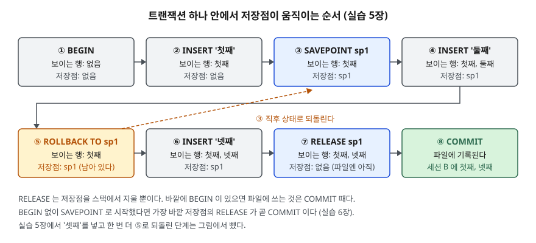

## 들어가며

연습용 가계부 앱에서 "통장 A에서 3,000원을 빼서 통장 B에 넣는" 기능을 만들었다. `UPDATE` 두 줄이면 끝나 보이는데,
첫 줄이 실행된 직후 프로그램이 죽으면 A에서는 돈이 빠졌고 B에는 들어가지 않은 상태가 파일에 남는다.
이걸 막으려고 실패하면 첫 줄을 되돌리는 `UPDATE`를 손으로 짜 넣기 시작하면, 문장이 셋이면 되돌리는 경로가 셋,
다섯이면 다섯이 된다. 되돌리는 코드 자체가 실패하면 또 방법이 없다. 이 일을 DB가 맡게 하는 장치가 트랜잭션이다.

## 개념

**트랜잭션(transaction)** 은 여러 SQL 문장을 하나로 묶은 작업 단위다. 묶인 문장은 **전부 저장되거나 전부 취소된다.**
중간까지만 저장되는 일은 없다.

| 문장 | 뜻 |
|---|---|
| `BEGIN` | 트랜잭션을 연다. 이후 문장은 아직 확정되지 않은 상태로 쌓인다 |
| `COMMIT` | 쌓인 변경을 확정해 파일에 남긴다. 다른 세션도 이제 본다 |
| `ROLLBACK` | 쌓인 변경을 전부 버리고 `BEGIN` 전 상태로 돌아간다 |
| `SAVEPOINT 이름` | 트랜잭션 안에 되돌아올 지점(저장점)을 표시한다 |
| `ROLLBACK TO 이름` | 그 저장점 직후 상태로만 되돌린다. 트랜잭션은 계속 열려 있다 |
| `RELEASE 이름` | 그 저장점을 지운다. 되돌릴 수 없게 될 뿐 저장이 확정되지는 않는다 |

`BEGIN`을 쓰지 않으면 SQLite는 **문장 하나하나를 각자의 트랜잭션으로** 처리한다. 문장이 끝나는 순간 바로 확정된다.
이것을 **자동 커밋(autocommit)** 이라고 한다. 앞의 가계부 문제는 `UPDATE` 두 줄이 자동 커밋으로 따로따로 확정됐기
때문에 생긴다.

**세션**은 DB에 붙은 연결 하나를 말한다. 같은 파일을 두 프로그램이 열면 세션이 둘이다.

## 구조



> **출처**: 저장점 스택과 ROLLBACK TO·RELEASE의 동작은 [SQLite — SAVEPOINT](https://www.sqlite.org/lang_savepoint.html),
> BEGIN·COMMIT·ROLLBACK과 자동 커밋은 [SQLite — Transaction](https://www.sqlite.org/lang_transaction.html)을 따랐다.

## 동작 원리

SQLite 문서에 따르면 저장점은 **스택(stack)**, 곧 나중에 넣은 것이 위에 쌓이는 목록에 들어간다.

1. `SAVEPOINT sp1`은 스택 맨 위에 `sp1`을 올린다. 바깥에 `BEGIN`이 없으면 이 문장이 트랜잭션을 연다.
   문서는 이때의 동작을 `BEGIN DEFERRED TRANSACTION`과 같다고 적는다
2. `ROLLBACK TO sp1`은 DB 상태를 `sp1`을 만든 직후로 되돌린다. `sp1` 위에 쌓인 저장점은 지우지만
   **`sp1` 자신은 스택에 남긴다.** 그래서 같은 저장점으로 몇 번이고 다시 되돌릴 수 있다
3. `RELEASE sp1`은 스택 위에서부터 `sp1`까지를 지운다. 바깥에 트랜잭션이 남아 있으면 파일에는 아무것도 쓰지 않는다.
   **가장 바깥 저장점을 지워 스택이 비면 그때는 `COMMIT`과 같다**

`ROLLBACK`(뒤에 `TO`가 없는 것)은 스택과 상관없이 트랜잭션 전체를 버린다.

## 실습 예제

전체 소스: [`code/transaction_basics.py`](code/transaction_basics.py), 실행 기록: [`code/output.txt`](code/output.txt).
임시 폴더에 파일 DB를 만들고 두 연결(세션 A·B)을 연다. 계좌 표 `account`는 `balance >= 0` CHECK 제약을 갖는다.

```text
[account]  2행
  account_id | owner  | balance
  -----------+--------+--------
           1 | 김하나 |   10000
           2 | 이두리 |    5000

[transfer_log]  0행
  log_id | memo
```

파이썬 `sqlite3` 모듈은 기본 설정에서 쓰기 문장 앞에 `BEGIN`을 알아서 끼워 넣는다. 예제는 `isolation_level=None`으로
열어 이 동작을 끄고, 화면에 찍힌 문장만 SQLite로 가게 했다. 각 줄 끝의 `트랜잭션 진행 중/없음`은
연결의 `in_transaction` 값이다.

### COMMIT 전에는 다른 세션에 안 보인다

```text
   [A] BEGIN                                                      → 성공  (트랜잭션 진행 중)
   [A] UPDATE account SET balance = balance - 3000 WHERE account_id = 1 → 성공  (트랜잭션 진행 중)
   [A] UPDATE account SET balance = balance + 3000 WHERE account_id = 2 → 성공  (트랜잭션 진행 중)
   [A] 잔액 조회 → 1번=7000, 2번=8000
   [B] 잔액 조회 → 1번=10000, 2번=5000
   [A] COMMIT                                                     → 성공  (트랜잭션 없음)
   [B] 잔액 조회 → 1번=7000, 2번=8000
```

A는 자기 변경을 바로 보지만 B는 `COMMIT` 전까지 옛 값을 본다. 반대로 `BEGIN` 없이 쓴 1장의 `UPDATE`는
다음 줄에서 B가 곧바로 새 값을 봤다. 3장에서는 `BEGIN` 뒤 `balance = 0`으로 바꿨다가 `ROLLBACK`하자 7000으로 돌아왔다.

### 쓰는 중에는 남이 못 쓴다

```text
   [A] UPDATE account SET balance = balance - 1 WHERE account_id = 1 → 성공  (트랜잭션 진행 중)
   [B] UPDATE account SET balance = balance + 1 WHERE account_id = 2 → OperationalError: database is locked  (트랜잭션 없음)
   [B] 잔액 조회 → 1번=7000, 2번=8000
```

A가 1번 행만 바꾸고 있는데 B는 **다른 행인 2번도** 바꾸지 못했다. SQLite의 기본 저널 방식(`delete`)에서는
쓰기 잠금이 행이 아니라 파일 전체에 걸린다. 읽기는 됐다. A가 `ROLLBACK`한 뒤에는 B의 같은 문장이 성공했다.

### SAVEPOINT 로 일부만 되돌린다

```text
   [A] SAVEPOINT sp1                                              → 성공  (트랜잭션 진행 중)
   [A] INSERT INTO transfer_log (memo) VALUES ('둘째')              → 성공  (트랜잭션 진행 중)
   [A] ROLLBACK TO sp1                                            → 성공  (트랜잭션 진행 중)
   [A] transfer_log → ['첫째']
   [A] INSERT INTO transfer_log (memo) VALUES ('셋째')              → 성공  (트랜잭션 진행 중)
   [A] ROLLBACK TO sp1                                            → 성공  (트랜잭션 진행 중)
   [A] transfer_log → ['첫째']
   [A] INSERT INTO transfer_log (memo) VALUES ('넷째')              → 성공  (트랜잭션 진행 중)
   [A] RELEASE sp1                                                → 성공  (트랜잭션 진행 중)
   [A] ROLLBACK TO sp1                                            → OperationalError: no such savepoint: sp1  (트랜잭션 진행 중)
   [A] COMMIT                                                     → 성공  (트랜잭션 없음)
   [B] transfer_log → ['첫째', '넷째']
```

`ROLLBACK TO sp1`을 두 번 불러도 두 번 다 됐다. 저장점이 남아 있기 때문이다. `RELEASE` 뒤에는 `no such savepoint`로
실패했고, `RELEASE` 직후에도 `in_transaction`은 여전히 참이었다. 저장이 확정된 것은 `COMMIT` 때다.
6장처럼 `BEGIN` 없이 `SAVEPOINT outer_sp`로 시작하면 `RELEASE outer_sp` 한 줄에 트랜잭션이 끝나고 B에 새 행이 보였다.

### 한 문장이 실패해도 트랜잭션은 남는다

```text
   [A] BEGIN                                                      → 성공  (트랜잭션 진행 중)
   [A] UPDATE account SET balance = balance + 500 WHERE account_id = 2 → 성공  (트랜잭션 진행 중)
   [A] UPDATE account SET balance = balance - 99999 WHERE account_id = 1 → IntegrityError: CHECK constraint failed: balance >= 0  (트랜잭션 진행 중)
   [A] 잔액 조회 → 1번=7000, 2번=8500
```

**입문자가 가장 많이 오해하는 부분이다.** 두 번째 `UPDATE`가 CHECK 제약에 걸려 실패했지만 트랜잭션은 열린 채이고,
앞의 +500은 그대로 살아 있다. 여기서 `COMMIT`을 부르면 "절반만 된 이체"가 저장된다. SQLite 문서도 제약 위반은
**실패한 그 문장만** 되돌리고 트랜잭션 전체를 되돌리지는 않는다고 적는다. 예제는 `ROLLBACK`으로 8000으로 돌렸다.
8장에서는 세션 C가 `BEGIN` 뒤 값을 바꾸고 `COMMIT` 없이 연결을 닫았는데, A가 보기에 값은 바뀌지 않았다.

## 실무에서 주의할 점

- **오류를 받으면 직접 `ROLLBACK`한다.** 실패한 문장 앞의 변경은 남아 있으므로, 예외 처리에서 `ROLLBACK`을 부르지 않고
  다음 작업으로 넘어가 `COMMIT`하면 절반만 된 결과가 저장된다.
- **트랜잭션을 오래 열어 두지 않는다.** SQLite 기본 설정에서는 쓰는 트랜잭션 하나가 파일 전체를 잠가 다른 세션의 쓰기가
  `database is locked`로 실패한다. 사용자 입력을 기다리는 동안 트랜잭션을 열어 두면 그동안 아무도 못 쓴다.
- **`RELEASE`를 저장으로 착각하지 않는다.** 바깥에 `BEGIN`이 있으면 `RELEASE`는 되돌릴 지점을 지울 뿐이다.
  마지막에 `COMMIT`이 없으면 연결을 닫을 때 전부 사라진다.
- **드라이버가 `BEGIN`을 대신 넣는지 확인한다.** 파이썬 `sqlite3`의 기본 설정처럼 드라이버가 알아서 트랜잭션을 여는 경우,
  직접 쓴 `BEGIN`과 겹치거나 `COMMIT`을 빠뜨린 줄 모르고 지나가기 쉽다.

## 정리

- 트랜잭션은 여러 문장을 전부 저장(`COMMIT`)하거나 전부 취소(`ROLLBACK`)하는 단위다. `BEGIN`이 없으면 문장마다 따로 확정된다.
- `COMMIT` 전의 변경은 자기 세션에만 보이고, 기본 설정에서는 그동안 다른 세션이 쓰지 못한다.
- `ROLLBACK TO`는 저장점 직후로만 되돌리고 저장점을 남긴다. `RELEASE`는 저장점을 지울 뿐이고, 가장 바깥 것일 때만 `COMMIT`이 된다.
- 문장 하나가 실패해도 트랜잭션은 열려 있다. 되돌릴지는 직접 정한다.

## 참고 자료

- [SQLite — Transaction](https://www.sqlite.org/lang_transaction.html) — BEGIN·COMMIT·ROLLBACK, 자동 커밋, 트랜잭션 중 오류 처리, 연결을 닫을 때의 ROLLBACK
- [SQLite — SAVEPOINT](https://www.sqlite.org/lang_savepoint.html) — 저장점 스택, ROLLBACK TO 뒤에 저장점이 남는 것, 가장 바깥 RELEASE 가 COMMIT 인 것
- [SQLite — File Locking And Concurrency In SQLite Version 3](https://www.sqlite.org/lockingv3.html) — 쓰기 잠금이 파일 단위로 걸리는 것
- [Python 3.13 — sqlite3: Transaction control](https://docs.python.org/3.13/library/sqlite3.html#sqlite3-controlling-transactions) — `isolation_level`, `in_transaction`
