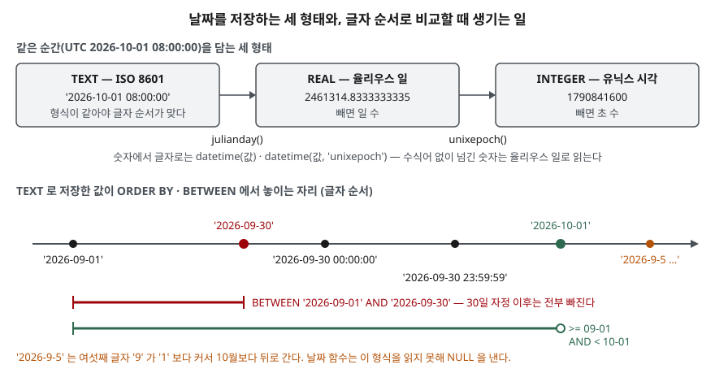

## 들어가며

쇼핑몰 주문 표에 주문 시각 컬럼을 만들면서 타입을 고민하다가, 화면에서 받은 글자를 그대로 넣으면 되겠다 싶어 `TEXT`로 만든다.
몇 달 뒤 9월 주문만 뽑으라는 요청을 받고 `WHERE ordered_at BETWEEN '2026-09-01' AND '2026-09-30'`을 쓴다.
결과는 에러 없이 나오지만, 이 글의 예제에서는 9월 주문 5건 중 2건만 잡혔다. 한 건은 `2026-9-5`처럼 0을 빼고 적혀 있었고,
한 건은 슬래시로 적혀 있었고, 30일 밤 주문은 끝값 `'2026-09-30'`보다 뒤로 판정됐다. 틀린 줄 모르고 넘어가기 쉬운 종류의 실수다.

## 개념

**날짜·시간 값**은 달력 위의 한 순간이다. 많은 DB가 `DATE`·`TIMESTAMP` 같은 전용 타입을 두지만, SQLite에는 날짜 전용 저장 부류가 없다.
SQLite 문서는 날짜를 세 형태 중 하나로 저장하라고 한다.

| 형태 | 값의 예 | 뜻 |
|---|---|---|
| `TEXT` | `'2026-10-01 08:00:00'` | ISO 8601 형식 문자열 `YYYY-MM-DD HH:MM:SS` |
| `REAL` | `2461314.8333…` | 율리우스 일. 기원전 4714년 11월 24일 정오부터 센 일 수 |
| `INTEGER` | `1790841600` | 유닉스 시각. 1970-01-01 00:00:00 UTC부터 센 초 수 |

어느 형태로 저장하든 **날짜 함수**가 해석한다. `date()`·`time()`·`datetime()`은 글자로, `julianday()`는 율리우스 일로,
`unixepoch()`는 유닉스 시각으로 돌려준다. `strftime()`은 원하는 모양의 글자를 만든다. 함수 뒤에 붙이는 `'+1 day'`,
`'start of month'` 같은 인자는 **수식어**라고 부르며, 시각을 옮기거나 잘라 낸다.

## 구조



> **출처**: 세 저장 형태는 [SQLite — Datatypes In SQLite §2.2 Date and Time Datatype](https://www.sqlite.org/datatype3.html#date_and_time_datatype),
> 함수·수식어·숫자 인자 해석은 [SQLite — Date And Time Functions](https://www.sqlite.org/lang_datefunc.html#modifiers)를 따랐다. 축 위의 순서와 숫자 값은 이 글의 예제([`code/output.txt`](code/output.txt))에서 나온 것이다.

## 동작 원리

`TEXT` 컬럼끼리 비교하면 SQLite는 그것이 날짜인지 모른다. 왼쪽 글자부터 하나씩 비교할 뿐이다. ISO 8601은 큰 단위(년)부터 적고
자릿수를 0으로 채우므로, **형식이 모두 같을 때만** 글자 순서가 시간 순서와 같아진다. `'2026-9-5'`는 여섯째 글자 `9`가
`'2026-10-01'`의 `1`보다 커서 10월보다 뒤로 간다.

같은 이유로 `'2026-09-30'`은 `'2026-09-30 00:00:00'`보다 작다. 앞 10글자가 같으면 짧은 쪽이 먼저다. 그래서 끝값에 날짜만 쓴
`BETWEEN`은 30일 자정 정각 주문까지 빠뜨린다.

날짜 함수는 문서에 적힌 12가지 형식만 읽는다. `2026-9-5`나 `2026/09/28`은 읽지 못해 `NULL`을 낸다. 에러가 아니라 `NULL`이라서
조용히 조건에서 빠진다. 반대로 이 판에서는 `'2026-02-30'`을 에러 없이 받아 `2026-03-02`로 넘겼다. 문서에 이 처리 규칙은 적혀 있지 않다.

## 실습 예제

메모리 SQLite에 주문 6건을 넣었다. 2·3번은 형식이 틀렸고, 6번은 시각 없이 날짜만 있다.
전체 소스: [`code/date_time_basics.py`](code/date_time_basics.py), 실행 기록: [`code/output.txt`](code/output.txt)

```text
  id | customer | ordered_at
  ---+----------+--------------------
   1 | 김도윤   | 2026-09-05 09:30:00
   2 | 이서준   | 2026-9-5 14:00:00
   3 | 박하은   | 2026/09/28 18:10:00
   4 | 최유나   | 2026-10-01 08:00:00
   5 | 정민재   | 2026-09-30 23:59:59
   6 | 한지우   | 2026-09-30
```

### 형식이 섞인 문자열의 정렬과 비교

```text
[1-A ORDER BY ordered_at — 글자 순서로 정렬된다]
  (1, '2026-09-05 09:30:00')
  (6, '2026-09-30')
  (5, '2026-09-30 23:59:59')
  (4, '2026-10-01 08:00:00')
  (2, '2026-9-5 14:00:00')
  (3, '2026/09/28 18:10:00')
[1-B 9월 주문을 BETWEEN 으로 찾기]
  (1, '2026-09-05 09:30:00')
  (6, '2026-09-30')
[1-D 형식 검사 — 알아보지 못한 행 찾기]
  SELECT id, ordered_at FROM orders WHERE datetime(ordered_at) IS NULL
  (2, '2026-9-5 14:00:00')
  (3, '2026/09/28 18:10:00')
```

9월 5일 오후 주문(2번)이 10월 주문보다 뒤에 섰다. `/`는 `-`보다 글자 값이 커서 3번은 맨 끝이다.
`datetime(컬럼) IS NULL`로 찾으면 날짜 함수가 읽지 못하는 행이 드러난다. 데이터를 옮겨 받았을 때 먼저 돌려 볼 검사다.

### ISO 8601로 고친 뒤 — 예상과 달랐던 결과

2·3·6번을 `YYYY-MM-DD HH:MM:SS`로 고치자 정렬은 시간 순서가 됐다. 그런데 `BETWEEN`은 여전히 틀렸다.

```text
[2-B BETWEEN 끝값에 날짜만 쓰면]
  (1, '2026-09-05 09:30:00')
  (2, '2026-09-05 14:00:00')
  (3, '2026-09-28 18:10:00')
  -> 3행
[2-C 반열림 구간 — 이상 AND 미만]
  SELECT id, ordered_at FROM orders WHERE ordered_at >= '2026-09-01' AND ordered_at < '2026-10-01'
  ...
  -> 5행
```

고치기 전에는 잡히던 6번이 고친 뒤에 빠졌다. 값이 `'2026-09-30'`에서 `'2026-09-30 00:00:00'`으로 길어지면서 끝값보다 커졌기 때문이다.
**이상(`>=`)과 미만(`<`)으로 쓰는 반열림 구간**은 끝값을 다음 날 0시로 잡으므로 시각이 붙든 안 붙든 하루 전체를 담는다.

### 저장 형태와 더하기·빼기

```text
[3-A TEXT · REAL · INTEGER]
  ('2026-10-01 08:00:00', 2461314.8333333335, 1790841600)
[3-B 숫자에서 다시 글자로]
  SELECT datetime(jd), datetime(ux, 'unixepoch'), datetime(ux), datetime(ux, 'auto') FROM t
  ('2026-10-01 08:00:00', '2026-10-01 08:00:00', None, '2026-10-01 08:00:00')
[4-B 월말에 한 달 더하기]
  SELECT date('2026-01-31', '+1 month'), date('2026-01-31', 'start of month', '+1 month', '-1 day'), date('2026-01-31', '+1 month', 'floor')
  ('2026-03-03', '2026-01-31', '2026-02-28')
[4-C 수식어는 왼쪽부터 차례로 적용된다]
  ('2026-02-01', '2026-03-01')
[5-A 문자열끼리 빼면]
  (0,)
[5-B julianday 차이(일)와 unixepoch 차이(초)]
  (26.0, 28801)
```

유닉스 시각을 수식어 없이 `datetime()`에 넘기면 율리우스 일로 읽혀 범위를 벗어나 `NULL`이 됐다. `'unixepoch'`나 `'auto'`를 붙여야 한다.
1월 31일에 `+1 month`를 하면 "2월 31일"을 만든 뒤 넘치는 3일을 3월로 넘겨 `2026-03-03`이 된다. 2월 말일이 필요하면
`'floor'`를 붙인다. `'start of month'`를 앞에 두면 1일로 먼저 내린 뒤 옮기므로 결과가 달라진다(4-C).

날짜 문자열끼리 `-`로 빼면 둘 다 앞의 숫자 `2026`으로 바뀌어 0이 나온다. 차이는 `julianday()`끼리 빼 일 수로 얻거나
`unixepoch()`끼리 빼 초 수로 얻는다. `timediff()`는 `'+0000-00-26 00:00:00.000'`처럼 년·월·일로 풀어 준다.

### strftime의 결과는 글자다

```text
[6-C strftime 결과의 타입]
  SELECT strftime('%m', '2026-09-05') = 9, strftime('%m', '2026-09-05') = '09', CAST(strftime('%m', '2026-09-05') AS INTEGER) = 9
  (0, 1, 1)
```

`strftime('%m', …)`은 `'09'`라는 글자를 돌려주므로 숫자 `9`와 같지 않다. 월로 거를 때는 `'09'`와 비교하거나 `CAST`로 바꾼다.

## 실무에서 주의할 점

- **한 컬럼에는 한 형식만 넣는다.** `TEXT`로 저장한다면 `YYYY-MM-DD HH:MM:SS`로 통일하고, 넣을 때 `datetime(?)`으로 감싸면
  읽지 못하는 값은 `NULL`이 된다. `NOT NULL` 제약과 함께 쓰면 잘못된 형식이 들어오는 순간 막힌다.
- **기간 조건은 `>= 시작 AND < 다음 시작`으로 쓴다.** `BETWEEN … AND '말일'`은 말일 0시 이후를 전부 빠뜨린다.
  `'말일 23:59:59'`로 막으면 소수 초가 붙은 값(`23:59:59.500`)이 다시 빠진다.
- **월 단위 계산은 월말에서 확인한다.** `+1 month`는 넘친 날을 다음 달로 넘긴다. 결제일·만기일처럼 말일이 중요한 계산은
  `floor` 수식어(3.46.0부터)나 `'start of month'` 순서를 정해 두고 1월 31일로 시험한다.
- **시간대를 정해 둔다.** SQLite는 `+09:00`이 붙은 값을 UTC로 바꿔 계산한다(7-A에서 `08:00+09:00` → `23:00`).
  같은 순간이 표에 `08:00`과 `23:00` 두 모양으로 섞이면 글자 비교가 틀린다(7-B). 저장은 UTC로 하고 보여 줄 때 바꾸는 편이 단순하다.
- **함수의 등장 판을 확인한다.** `unixepoch()`는 3.38.0, `timediff()`는 3.43.0, `floor`·`ceiling`은 3.46.0부터다.
  다른 DB는 날짜 타입과 함수 이름이 다르므로(`DATE_ADD`, `INTERVAL` 등) 옮길 때 그 DB의 문서를 따로 본다.

## 정리

- SQLite에는 날짜 타입이 없고 `TEXT`(ISO 8601)·`REAL`(율리우스 일)·`INTEGER`(유닉스 시각) 중 하나로 저장한다.
- `TEXT`는 형식이 모두 같을 때만 글자 순서가 시간 순서다. 날짜 함수가 읽지 못하는 형식은 `NULL`이 된다.
- `BETWEEN` 끝값에 날짜만 쓰면 그날 0시부터 빠진다. 기간은 이상·미만으로 쓴다.
- 1월 31일 `+1 month`는 3월 3일이다. 수식어는 왼쪽부터 적용되고, `floor`로 말일에 맞춘다.
- 차이는 `julianday()`나 `unixepoch()`끼리 뺀다. 문자열끼리 빼면 0이 나온다.

## 참고 자료

- [SQLite — Datatypes In SQLite §2.2 Date and Time Datatype](https://www.sqlite.org/datatype3.html#date_and_time_datatype) — 세 저장 형태
- [SQLite — Date And Time Functions](https://www.sqlite.org/lang_datefunc.html) — [Time Values](https://www.sqlite.org/lang_datefunc.html#time_values)(12가지 형식, 시간대 표기), [Modifiers](https://www.sqlite.org/lang_datefunc.html#modifiers)(`auto`·`floor`·`ceiling`·`start of month`), [Caveats And Bugs](https://www.sqlite.org/lang_datefunc.html#caveats_and_bugs)
- [SQLite — Datatypes In SQLite §4.1 Sort Order](https://www.sqlite.org/datatype3.html#sort_order) — TEXT 값 비교 규칙
- [SQLite Release History](https://www.sqlite.org/changes.html) — `unixepoch()`·`auto` 3.38.0, `timediff()` 3.43.0, `floor`·`ceiling` 3.46.0
