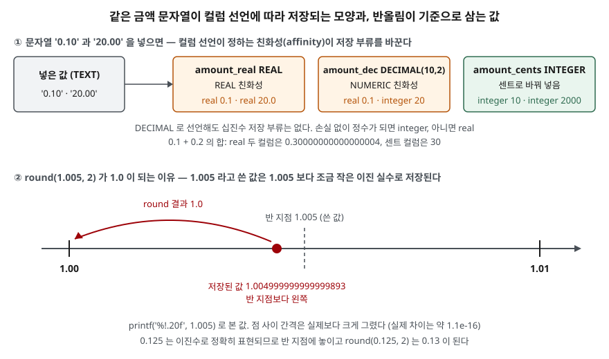

## 들어가며

카페 주문 앱을 만들면서 가격 컬럼을 `REAL`로 만들고 `0.10`, `0.20`처럼 달러 금액을 넣는다. 화면에서는 소수 둘째 자리까지만
보이니 문제가 없어 보인다. 그런데 아메리카노와 시럽을 담은 장바구니 합계가 `0.30`인지 검사하는 조건이 거짓으로 나오고,
결제 대행사에 센트 단위로 넘긴 `19.99`달러가 `1998`센트로 찍힌다. 이때 흔히 화면 표시 자리에서 `round()`를 한 번 더 감싸는데,
이 글의 예제에서는 그 `round()`도 `1.005`를 `1.0`으로 내렸다. 틀린 곳마다 덧대는 방식은 계산식이 늘어날 때마다 같은 수만큼 손볼 곳이 늘어난다.

## 개념

SQL의 숫자 값은 크게 **정수**와 **실수**로 나뉜다. 정수(`INTEGER`)는 소수점이 없는 값이고 범위 안에서는 정확하다.
실수(`REAL`)는 IEEE 754 **배정밀도 부동소수점**, 즉 이진수 유효숫자 53비트와 지수로 값을 적는 형식이다.
이진수로 끝나지 않는 `0.1` 같은 십진 소수는 가장 가까운 이진 실수로 바뀌어 저장된다.

많은 DB는 십진수를 그대로 담는 `DECIMAL`·`NUMERIC` 타입을 따로 둔다. SQLite는 저장 부류(storage class)가
`NULL`·`INTEGER`·`REAL`·`TEXT`·`BLOB` 다섯뿐이고 십진수 부류가 없다. 컬럼에 적은 타입 이름은
**친화성**(affinity), 즉 "이 컬럼에 값이 들어올 때 어느 부류로 바꿔 보려 하는가"만 정한다.
`DECIMAL(10, 2)`라고 적으면 `NUMERIC` 친화성이 붙고, 괄호 안의 자릿수는 무시된다.

## 구조



> **출처**: 친화성과 저장 부류는 [SQLite — Datatypes In SQLite §3 Type Affinity](https://www.sqlite.org/datatype3.html#type_affinity)와
> [§3.1.1 Affinity Name Examples](https://www.sqlite.org/datatype3.html#affinity_name_examples)를,
> 26자리 출력은 [SQLite — printf §2.5 The Options Flags Field](https://www.sqlite.org/printf.html)를 따랐다. 저장된 값과 결과는 이 글의 예제([`code/output.txt`](code/output.txt))에서 나온 것이다.

## 동작 원리

`NUMERIC` 친화성 컬럼에 글자 `'20.00'`이 들어오면 SQLite는 그것이 숫자로 읽히는지 본다. 정수로 손실 없이 바뀌면 `INTEGER`로,
아니면 `REAL`로 저장한다. 문서는 `'3.0e+5'`가 정수 `300000`으로 저장된다는 예를 든다. 그래서 같은 `DECIMAL` 컬럼 안에서
`20.00`은 정수 `20`, `0.10`은 실수 `0.1`이 된다. 소수 둘째 자리를 지켜 주는 장치는 어디에도 없다.

실수끼리의 연산은 결과를 다시 가장 가까운 이진 실수로 맞춘다. `0.1`과 `0.2`는 각각 조금씩 어긋난 값이고,
그 합은 `0.3`을 적었을 때 저장되는 값과 다른 이진 실수가 된다. `=` 비교는 비트가 같은지를 보므로 거짓이다.

`round(X, Y)`는 십진수로 쓴 값이 아니라 **저장된 이진 실수**를 반올림한다. `1.005`는 `1.004999…`로 저장되므로
반 지점에 못 미쳐 내려간다. `CAST(실수 AS INTEGER)`는 문서대로 0 쪽으로 가장 가까운 정수, 즉 소수부를 버린다.
`19.99 * 100`이 `1998.9999999999998`이면 `1998`이 된다.

정수끼리 나누면 몫만 남는다. 문서는 두 피연산자가 정수면 정수 연산을 하고 "0 쪽으로 버린다"고 적는다.

## 실습 예제

메모리 SQLite의 `price` 표에 같은 가격 문자열을 세 컬럼에 넣었다. `amount_cents`에는 센트로 바꾼 정수를 넣었다.
전체 소스: [`code/numeric_money.py`](code/numeric_money.py), 실행 기록: [`code/output.txt`](code/output.txt)

```text
  id | item       | amount_real | amount_dec | amount_cents
  ---+------------+-------------+------------+-------------
   1 | 아메리카노 |         0.1 |        0.1 |           10
   2 | 시럽 추가  |         0.2 |        0.2 |           20
   3 | 머그컵     |       19.99 |      19.99 |         1999
   4 | 원두 1kg   |        20.0 |         20 |         2000
```

### DECIMAL로 선언해도 실수다

```text
[1-A typeof — 저장 부류]
  (1, 'real', 'real', 'integer')
  (4, 'real', 'integer', 'integer')
[1-B 0.1 은 실제로 어떤 값인가]
  SELECT printf('%.20f', amount_real), printf('%!.20f', amount_real) FROM price WHERE id = 1
  ('0.10000000000000000000', '0.1000000000000000055')
```

`amount_dec`는 행마다 부류가 다르다. 4번만 정수다. `printf('%.20f')`가 `0.1000…0`으로 찍힌 것은 이 글을 쓰며 예상하지 못한 결과였다.
SQLite의 `printf`는 기본으로 유효숫자 16자리까지만 보여 주고 나머지를 0으로 채운다. `!` 플래그를 붙여야 26자리까지 나와
`…055`라는 실제 값이 보인다. 소수점 아래 20자리를 요청했다고 저장된 값이 그대로 보이는 것이 아니다.

### 더하고 비교하기

```text
[2-A 아메리카노 + 시럽]
  (0.30000000000000004, 0.30000000000000004, 30)
[2-B 합계가 0.30 과 같은가]
  (0, 0, 1)
[2-C 0.1 을 열 번 더하면]
  SELECT SUM(0.1), SUM(0.1) = 1.0, SUM(10) FROM n
  (1.0, 1, 100)
[2-D 같은 열 번을 + 로 이어 쓰면]
  (0.9999999999999999,)
[2-F decimal 확장이 들어 있는가]
  에러: OperationalError: no such function: decimal_sum
```

두 실수 컬럼 모두 `0.3`과 같지 않고, 센트 컬럼만 `30`과 같다. 2-C와 2-D는 예상과 달랐다. 같은 `0.1` 열 개인데
`SUM()`은 `1.0`, `+`를 이어 쓴 식은 `0.9999999999999999`를 냈다. SQLite 문서는 `SUM()`이 어떤 방식으로 더하는지 적지 않으므로
이 차이는 3.49.1에서 관찰한 결과로만 적는다. 다만 `SUM()`이 맞게 나온 경우가 있다고 실수 합계를 믿을 수는 없다. 두 값의 합인 2-A는 `SUM()`으로도 틀렸다.
SQLite 문서가 정확한 합계용으로 권하는 `decimal_sum()`은 확장 모듈이라 파이썬에 들어 있는 SQLite에는 없었다.

### 나누기와 반올림

```text
[3-A 1000원을 세 명이 나누기]
  SELECT 1000 / 3, 1000 % 3, 1000 / 3.0, 1000 / 3 * 3
  (333, 1, 333.3333333333333, 999)
[3-B 비율 계산에서]
  SELECT 1 / 4 * 100, 1 * 100 / 4, 1.0 / 4 * 100
  (0, 25, 25.0)
[4-A 정확히 반인 값]
  SELECT round(0.5), round(1.5), round(2.5), round(-2.5)
  (1.0, 2.0, 3.0, -3.0)
[4-B 소수 둘째 자리로]
  SELECT round(0.125, 2), round(1.005, 2), round(2.675, 2)
  (0.13, 1.0, 2.67)
[4-C 그 값들이 실제로 저장된 모양]
  ('0.125', '1.004999999999999893', '2.674999999999999823')
[4-D 같은 값을 파이썬 round 에 넣으면]
  (0, 2, 2, -2)
  (0.12, 1.0, 2.67)
```

1000원을 셋으로 나누면 333원씩이고 1원이 남는다. 몫과 나머지를 같이 구해 남는 1원을 누구에게 줄지 정해야 합계가 맞는다.
`1 / 4 * 100`은 먼저 `1 / 4`가 `0`이 되어 비율이 0%로 나온다. 곱하기를 먼저 하거나 한쪽을 실수로 쓴다.

SQLite의 `round()`는 정확히 반인 값을 0에서 먼 쪽으로 올렸다(`2.5`→`3`, `-2.5`→`-3`). 파이썬 `round()`는 짝수 쪽으로 보내
`2.5`가 `2`다. 같은 반올림이라는 이름으로 DB와 애플리케이션이 다른 값을 낸다. `1.005`와 `2.675`는 저장된 값이 반 지점보다 작아서
둘 다 내려갔고, 이 둘은 SQLite와 파이썬의 결과가 같다.

### 달러를 센트로

```text
[5-A 곱한 결과]
  (1998.9999999999998, '1999.00', '1998.999999999999772')
[5-B CAST 는 버린다]
  SELECT CAST(amount_real * 100 AS INTEGER), CAST(round(amount_real * 100) AS INTEGER), CAST(-19.99 AS INTEGER)
  (1998, 1999, -19)
```

`printf('%.2f')`로 보면 `1999.00`이라 맞아 보이지만 `CAST`는 `1998`을 낸다. 화면에 보이는 값과 계산에 쓰이는 값이 다르다.
`round()`를 먼저 하고 `CAST`하면 `1999`가 된다.

### 정수의 끝

```text
[6-A SUM 이 64비트를 넘으면]
  에러: OperationalError: integer overflow
[6-B total 은 실수로 더한다]
  (9.223372036854776e+18, 'real')
```

정수도 무한하지 않다. 부호 있는 64비트를 넘으면 `SUM()`은 에러를 내고, `total()`은 실수로 더해 끝자리를 잃는다.
원 단위 금액에서 닿을 일은 드물지만, 마이크로 단위로 저장하면 범위가 그만큼 줄어든다.

## 실무에서 주의할 점

- **금액은 최소 단위 정수로 저장한다.** 원이면 원, 달러면 센트로 `INTEGER` 컬럼에 넣는다. 더하기·비교가 정확해지고
  소수점은 화면에 보일 때만 붙인다. 통화마다 최소 단위가 다르면 통화 코드 컬럼을 함께 둔다.
- **SQLite의 `DECIMAL`을 믿지 않는다.** 이름만 있고 십진수 저장은 하지 않는다. 다른 DB에서 옮겨 온 스키마가
  `DECIMAL(10,2)`라도 SQLite에서는 실수 컬럼과 같다. 정확한 십진 연산이 필요하면 정수로 바꾸거나 애플리케이션의 십진수 타입을 쓴다.
- **실수를 `=`로 비교하지 않는다.** 꼭 실수로 남겨야 하면 차이가 허용 범위 안인지(`abs(a - b) < 0.000001`)로 본다.
- **반올림 규칙을 한 곳에서 정한다.** SQLite와 파이썬은 반인 값을 다르게 처리했다. 금액을 어디서 반올림할지,
  반인 값을 어느 쪽으로 보낼지를 정해 한쪽에서만 한다.
- **실수를 정수로 바꿀 때는 `round` 후 `CAST`한다.** `CAST`는 버린다. 버림이 필요한 경우(절사 정책)라면 그 사실을 코드에 적는다.
- **나누기 전에 피연산자 타입을 본다.** 정수끼리 나누면 몫만 남아 비율이 0이 된다. 나머지가 생기는 분배는 `%`로 남은 금액을 따로 처리한다.

## 정리

- SQLite에는 십진수 저장 부류가 없다. `DECIMAL(10,2)`는 `NUMERIC` 친화성일 뿐이고, 값은 정수 아니면 실수로 저장된다.
- 실수는 `0.1`을 정확히 담지 못해 `0.1 + 0.2 = 0.3`이 거짓이다. `printf`는 기본 16자리만 보여 주므로 `%!`로 확인한다.
- `round()`는 저장된 이진 실수를 반올림해 `1.005`가 `1.0`이 되고, 반인 값 처리는 SQLite와 파이썬이 다르다.
- `CAST(실수 AS INTEGER)`는 버리고, 정수끼리 나누면 몫만 남는다.
- 금액은 최소 단위 정수로 저장하고 소수점은 보일 때만 붙인다.

## 참고 자료

- [SQLite — Datatypes In SQLite](https://www.sqlite.org/datatype3.html) — [§2 Storage Classes](https://www.sqlite.org/datatype3.html#storage_classes_and_datatypes), [§3 Type Affinity](https://www.sqlite.org/datatype3.html#type_affinity), [§3.1.1 Affinity Name Examples](https://www.sqlite.org/datatype3.html#affinity_name_examples)
- [SQLite — SQL Language Expressions](https://www.sqlite.org/lang_expr.html) — [Operators](https://www.sqlite.org/lang_expr.html#operators_and_parse_affecting_attributes)(정수 나눗셈), [CAST expressions](https://www.sqlite.org/lang_expr.html#cast_expressions)(실수→정수 버림), [Literal Values](https://www.sqlite.org/lang_expr.html#literal_values_constants_)
- [SQLite — Built-In Scalar SQL Functions: round()](https://www.sqlite.org/lang_corefunc.html#round)
- [SQLite — Built-in Aggregate Functions: sum() and total()](https://www.sqlite.org/lang_aggfunc.html#sumunc) — 정수 넘침 에러, `decimal_sum()` 권고
- [SQLite — printf §2.5 The Options Flags Field](https://www.sqlite.org/printf.html) — `!` 플래그가 유효숫자를 16에서 26자리로 늘린다
- [Python 3.13 — Built-in Functions: round()](https://docs.python.org/3.13/library/functions.html#round) — 짝수 쪽 반올림과 `round(2.675, 2)` 예
