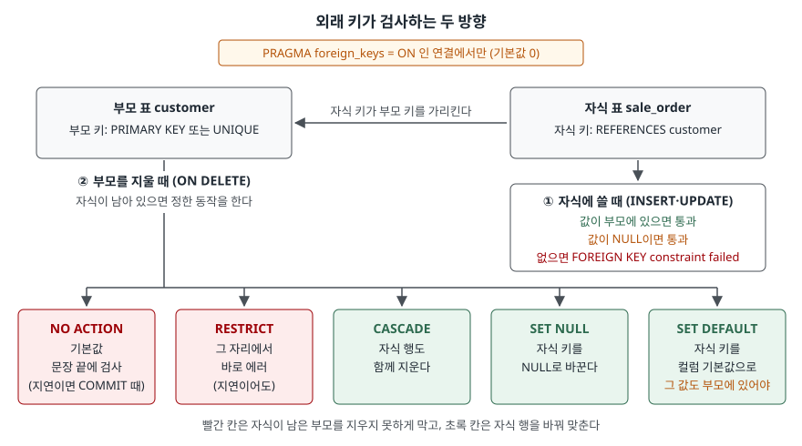

## 들어가며

쇼핑몰 연습 프로젝트에 고객 표와 주문 표를 만들고, 주문 표에 `customer_id INTEGER REFERENCES customer`까지 적어 둔다.
탈퇴한 고객을 `DELETE`로 지웠는데 에러가 나지 않는다. 몇 주 뒤 주문 목록에 고객 이름이 비어 있는 줄이 섞여 나온다.
이때 흔히 하는 일은 고객을 지우기 전에 주문을 먼저 지우는 코드를 화면마다 붙이는 것이다. 고객을 지우는 경로가
세 군데면 세 군데 모두에 같은 코드를 넣어야 하고, 하나만 빠져도 주인 없는 주문이 생긴다. SQLite에서는 원인이
하나 더 있다. **적어 둔 외래 키를 검사하지 않고 있었다.**

## 개념

**외래 키**(foreign key)는 한 표의 컬럼 값이 다른 표에 실제로 있는 값만 가리키도록 묶는 제약이다.
가리키는 쪽을 **자식 표**, 가리켜지는 쪽을 **부모 표**라고 부른다. 주문(자식)의 `customer_id`는 고객(부모)의
`customer_id` 중 하나여야 한다. 이렇게 "가리키는 값이 늘 존재한다"는 성질을 **참조 무결성**이라고 한다.

이 제약은 두 방향에서 깨질 수 있다. 자식에 없는 고객 번호를 넣을 때, 그리고 주문이 남아 있는 고객을 지울 때다.
앞쪽은 막기만 하면 되지만, 뒤쪽은 "그럼 주문은 어떻게 할 것인가"를 정해야 한다. 그것을 정하는 것이 `ON DELETE` 절이다.

SQLite 문서는 외래 키 검사가 **하위 호환을 위해 기본으로 꺼져 있고**, 연결마다 `PRAGMA foreign_keys = ON`으로
켜야 한다고 적는다. 표를 만들 때 쓴 `REFERENCES`는 저장되지만, 켜지 않은 연결에서는 검사하지 않는다.

## 구조



> **출처**: [SQLite Foreign Key Support — 2. Enabling Foreign Key Support](https://www.sqlite.org/foreignkeys.html#fk_enable),
> [1. Introduction to Foreign Key Constraints](https://www.sqlite.org/foreignkeys.html#fk_basics)(자식 키 NULL 허용, 부모 키 조건),
> [4.3 ON DELETE and ON UPDATE Actions](https://www.sqlite.org/foreignkeys.html#fk_actions)(다섯 동작과 NO ACTION·RESTRICT의 검사 시점).
> 에러 문구는 아래 실습의 실제 출력이다.

## 동작 원리

외래 키는 행이 바뀔 때마다 반대편 표를 찾아본다.

- **자식에 쓸 때**: 새 `customer_id`로 부모 표를 찾는다. 있으면 통과, 없으면 에러다. 값이 NULL이면 찾지 않고 통과시킨다.
  "아직 고객이 정해지지 않은 주문"을 허용하는 자리다. 막으려면 `NOT NULL`을 따로 붙인다.
- **부모를 지울 때**: 지우려는 고객 번호로 **자식 표를 찾는다.** 자식이 하나도 없으면 그냥 지운다.
  남아 있으면 `ON DELETE`에 적은 동작을 한다. 아무것도 안 적으면 `NO ACTION`이다.

부모를 지울 때 자식 표를 찾는다는 점이 중요하다. 자식 표의 `customer_id`에 인덱스가 없으면 이 찾기가 표 전체를
훑는다. 문서는 자식 키에 인덱스가 필수는 아니지만 없으면 부모를 지울 때마다 전체 탐색이 일어난다고 적는다.

`NO ACTION`과 `RESTRICT`는 둘 다 지우기를 막지만 **언제 검사하느냐**가 다르다. `RESTRICT`는 부모 행을 지우는 그 자리에서
바로 에러를 낸다. `NO ACTION`은 문장이 끝날 때 검사하고, 제약을 `DEFERRABLE INITIALLY DEFERRED`로 미뤄 두면
`COMMIT` 때 검사한다. 그 사이에 같은 번호의 부모를 다시 넣으면 통과한다.

## 실습 예제

메모리 SQLite에 고객 3명, 주문 3건을 넣었다. 전체 소스: [`code/foreign_key_basics.py`](code/foreign_key_basics.py),
실행 기록: [`code/output.txt`](code/output.txt)

```text
  customer_id | name
  ------------+-------
            1 | 김서준
            2 | 이하윤
            3 | 박도윤

  order_id | customer_id | amount
  ---------+-------------+-------
       101 |           1 |    120
       102 |           1 |     80
       103 |           2 |    150
```

아래 출력은 실행 기록에서 해당 부분을 옮겼다. 4번부터는 동작을 바꿀 때마다 이 데이터로 표를 새로 만들어 출발한다.

### 꺼진 상태 — 아무것도 막지 않는다

```text
-- 1. 기본값 — 외래 키 검사가 꺼져 있다
   PRAGMA foreign_keys
   0
   INSERT INTO sale_order VALUES (104, 99, 70)
   성공 · 바뀐 행 1
   DELETE FROM customer WHERE customer_id = 2
   성공 · 바뀐 행 1
```

없는 99번 고객의 주문이 들어가고, 주문이 있는 2번 고객이 지워졌다. 이 상태에서 검사를 켜 본다.

```text
-- 2. 켜도 이미 들어간 행은 검사하지 않는다
   PRAGMA foreign_keys = ON
   성공 · 바뀐 행 -1
   PRAGMA foreign_keys
   1
   PRAGMA foreign_key_check
   sale_order | 103 | customer | 0
   sale_order | 104 | customer | 0
```

켜는 순간 에러가 나지 않는다. **이미 들어간 행은 다시 검사하지 않기 때문이다.** 주인 없는 행은 `PRAGMA foreign_key_check`로
따로 찾아야 한다. 칸은 차례로 자식 표, 그 행의 rowid, 부모 표, 몇 번째 외래 키인지다. 103번은 지워진 2번 고객의 주문이다.

```text
-- 3. 트랜잭션 안에서는 켜고 끌 수 없다
   BEGIN
   PRAGMA foreign_keys = OFF
   성공 · 바뀐 행 -1
   PRAGMA foreign_keys
   1
```

**예상과 달랐던 결과다.** 끄라는 명령이 에러 없이 "성공"하고 값은 그대로 1이다. 문서는 이 PRAGMA가 트랜잭션 안에서는
아무 일도 하지 않는다고 적는다. 성공 메시지만 보고 꺼졌다고 믿으면 안 된다.

### 켠 상태 — 두 방향을 막는다

```text
   INSERT INTO sale_order VALUES (104, 99, 70)
   에러: FOREIGN KEY constraint failed
   INSERT INTO sale_order VALUES (104, NULL, 70)
   성공 · 바뀐 행 1
   DELETE FROM customer WHERE customer_id = 1
   에러: FOREIGN KEY constraint failed
   DELETE FROM customer WHERE customer_id = 3
   성공 · 바뀐 행 1
```

에러 문구에 어느 표, 어느 값이 문제인지는 나오지 않는다. 주문이 없는 3번 고객은 그냥 지워진다.

### ON DELETE 동작

같은 데이터에서 `REFERENCES` 뒤만 바꿔 1번 고객을 지웠다.

| 자식 키 정의 | `DELETE … customer_id = 1` | 남은 주문 |
|---|---|---|
| `ON DELETE CASCADE` | 성공 · 1행 | `103 \| 2 \| 150` |
| `ON DELETE SET NULL` | 성공 · 1행 | `101 \| NULL`, `102 \| NULL`, `103 \| 2` |
| `DEFAULT 3 … ON DELETE SET DEFAULT` | 성공 · 1행 | `101 \| 3`, `102 \| 3`, `103 \| 2` |
| `DEFAULT 0 … ON DELETE SET DEFAULT` | `FOREIGN KEY constraint failed` | (지우지 못함) |

`SET DEFAULT`는 기본값 0이 부모 표에 없어서 막혔다. 바꾼 값도 외래 키 검사를 다시 받는다.
`CASCADE`의 "바뀐 행 1"은 고객 1행만 센 값이다. 함께 지워진 주문 2건은 세지 않았다.

### NO ACTION과 RESTRICT

둘 다 `DEFERRABLE INITIALLY DEFERRED`로 두고, 한 트랜잭션 안에서 1번 고객을 지웠다가 같은 번호로 다시 넣었다.

```text
   [... ON DELETE NO ACTION DEFERRABLE INITIALLY DEFERRED]
   DELETE FROM customer WHERE customer_id = 1
   성공 · 바뀐 행 1
   INSERT INTO customer VALUES (1, '김서준(재등록)')
   성공 · 바뀐 행 1
   COMMIT
   성공 · 바뀐 행 -1
   [... ON DELETE RESTRICT DEFERRABLE INITIALLY DEFERRED]
   DELETE FROM customer WHERE customer_id = 1
   에러: FOREIGN KEY constraint failed
```

`NO ACTION`은 `COMMIT` 시점에 101·102번 주문이 1번 고객을 다시 찾았으므로 통과했다. `RESTRICT`는 미뤄 둔 제약인데도
`DELETE`에서 바로 막혔다. 이어진 `INSERT`가 `UNIQUE constraint failed`로 실패한 것은 1번 고객이 지워지지 않고 남았기 때문이다.

### 부모 키 조건과 자식 키 인덱스

```text
   INSERT INTO sale_order VALUES (101, 'a@example.com')
   에러: foreign key mismatch - "sale_order" referencing "customer"

-- 10. 자식 키 인덱스 — 부모 한 행을 지울 때 엔진이 돈 명령 수
   자식 20003행 · 인덱스 없음: 60023
   자식 20003행 · 인덱스 있음: 17
```

부모 쪽 `email`에 `UNIQUE`가 없으면 표는 만들어지지만 **자식에 쓰는 순간** 에러가 난다. 표를 만들 때가 아니라는 점이 함정이다.

아래 두 줄은 주문이 하나도 없는 고객 1명을 지울 때 엔진이 실행한 명령 수다. 실행계획에는 외래 키 검사가 보이지 않아서,
`set_progress_handler`로 명령마다 하나씩 세었다. 지울 행은 1개인데 인덱스가 없으면 자식 2만 행을 전부 훑었다.

## 실무에서 주의할 점

- **연결을 열 때마다 `PRAGMA foreign_keys = ON`을 실행한다.** 파일에 저장되는 설정이 아니라 연결의 설정이다.
  파이썬 `sqlite3`도 켜 주지 않는다. 연결 풀을 쓰면 연결을 만드는 함수 한 곳에 넣는다.
- **켜기 전에 `PRAGMA foreign_key_check`를 돌린다.** 꺼진 채로 운영한 기간에 생긴 주인 없는 행은 켠다고 드러나지 않는다.
- **`PRAGMA foreign_keys`는 트랜잭션 밖에서 바꾼다.** 안에서는 성공 메시지를 내고 아무것도 바꾸지 않는다.
- **자식 키에 인덱스를 만든다.** 부모를 지우거나 키를 바꿀 때마다 자식 표를 찾는다. 인덱스가 없으면 지울 때마다 전체 탐색이다.
- **`CASCADE`는 지워지는 범위를 확인하고 쓴다.** `rowcount`에 함께 지워진 자식 행은 잡히지 않는다. 주문처럼 기록으로
  남겨야 하는 자식에는 `NO ACTION`으로 막고 부모를 "탈퇴" 상태로 바꾸는 편이 안전하다.

## 정리

- 외래 키는 자식에 쓸 때 부모를 찾고, 부모를 지울 때 자식을 찾는다. 자식 키 NULL은 통과한다.
- SQLite는 연결마다 `PRAGMA foreign_keys = ON`을 해야 검사한다. 켜도 기존 행은 검사하지 않고, 트랜잭션 안에서는 바뀌지 않는다.
- `ON DELETE`는 다섯 가지다. 막는 `NO ACTION`(기본)·`RESTRICT`, 자식을 고치는 `CASCADE`·`SET NULL`·`SET DEFAULT`.
- `NO ACTION`은 문장 끝(지연이면 `COMMIT`)에, `RESTRICT`는 그 자리에서 검사한다.
- 부모 키는 `PRIMARY KEY`나 `UNIQUE`여야 하고, 자식 키에는 인덱스를 둔다.

## 참고 자료

- [SQLite — Foreign Key Support: 2. Enabling Foreign Key Support](https://www.sqlite.org/foreignkeys.html#fk_enable) — 기본으로 꺼져 있는 이유, 연결마다 켜는 방법
- [SQLite — Foreign Key Support: 1. Introduction to Foreign Key Constraints](https://www.sqlite.org/foreignkeys.html#fk_basics) — 자식 키 NULL 허용, 부모 키가 PRIMARY KEY·UNIQUE여야 한다는 조건과 "foreign key mismatch"
- [SQLite — Foreign Key Support: 3. Required and Suggested Database Indexes](https://www.sqlite.org/foreignkeys.html#fk_indexes) — 부모를 바꿀 때 자식 표를 찾는 질의와 자식 키 인덱스 권고
- [SQLite — Foreign Key Support: 4.2 Deferred Foreign Key Constraints](https://www.sqlite.org/foreignkeys.html#fk_deferred) — `DEFERRABLE INITIALLY DEFERRED`와 `COMMIT` 시점 검사
- [SQLite — Foreign Key Support: 4.3 ON DELETE and ON UPDATE Actions](https://www.sqlite.org/foreignkeys.html#fk_actions) — 다섯 동작, `NO ACTION`과 `RESTRICT`의 검사 시점 차이
- [SQLite — PRAGMA foreign_keys](https://www.sqlite.org/pragma.html#pragma_foreign_keys) — 트랜잭션 안에서는 아무 일도 하지 않는다는 규정
- [SQLite — PRAGMA foreign_key_check](https://www.sqlite.org/pragma.html#pragma_foreign_key_check) — 출력 네 칸의 뜻
