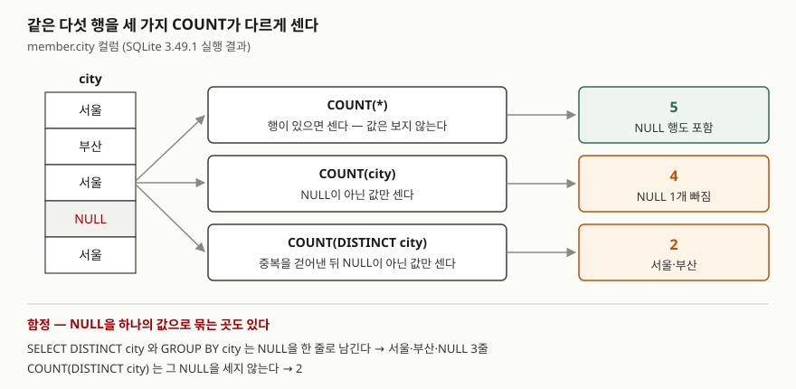

<!-- related:start -->
> **같은 기능을 다른 환경에서 다룬 글** (`null-semantics`)
> - [COALESCE와 NULLIF — NULL을 다루는 두 함수](../2026-09-28-coalesce-nullif-null-handling/index.md) — SQLite 3.49.1, Python 3.13.5, Windows 11
<!-- related:end -->

## 들어가며

회원 관리 화면에 "전체 회원 수"와 "휴대폰 등록 회원 수"를 띄우려고 두 질의를 짰는데, 둘 다
`COUNT`를 썼는데도 하나는 5, 하나는 3이 나온다. 같은 표를 셌는데 숫자가 다르니 보통은 데이터가
잘못 들어갔다고 의심하고 표를 처음부터 훑는다. 다음 날에는 회원별 주문 수 보고서에서 주문이 한 번도
없는 회원이 "1건"으로 찍힌다. 두 일은 원인이 같다. `COUNT` 괄호 안에 무엇을 넣느냐에 따라 세는
대상이 달라진다는 것을 알면, 표를 훑지 않고 질의 한 줄만 보고 숫자를 설명할 수 있다.

## 개념

`COUNT`는 개수를 돌려주는 **집계 함수**다. 집계 함수는 여러 행을 받아 값 하나를 만든다.
괄호 안에 무엇을 넣느냐에 따라 세 가지로 나뉜다.

| 쓰는 법 | 세는 것 |
|---|---|
| `COUNT(*)` | 행의 개수. 칸에 무엇이 들었는지 보지 않는다 |
| `COUNT(컬럼)` | 그 컬럼 값이 **NULL이 아닌** 행의 개수 |
| `COUNT(DISTINCT 컬럼)` | 중복을 걷어낸 뒤, NULL이 아닌 **서로 다른 값**의 개수 |

**NULL**은 "값이 없음"을 뜻하는 표시다. 0이나 빈 문자열(`''`)과 다르다. 그래서 `COUNT(컬럼)`은
빈 문자열은 세고 NULL은 세지 않는다.

## 구조



> **출처**: 세 가지 COUNT의 정의는 [SQLite — Built-in Aggregate Functions: count()](https://www.sqlite.org/lang_aggfunc.html#count),
> `SELECT DISTINCT`가 NULL을 하나로 묶는다는 것은 [SQLite — NULL Handling in SQLite Versus Other Database Engines](https://www.sqlite.org/nulls.html)의 비교표를 따랐다.
> 아래쪽 숫자는 이 글의 예제를 실행해 얻은 값이다.

## 동작 원리

SQLite 문서는 `count(X)`를 "X가 NULL이 아닌 횟수", `count(*)`를 "그룹의 전체 행 수"로 정의한다.
엔진은 행을 하나씩 읽으며 카운터를 올리는데, `COUNT(컬럼)`은 올리기 전에 값이 NULL인지 한 번 더 본다.
`COUNT(*)`는 그 검사를 하지 않는다.

`DISTINCT`가 붙으면 값을 함수에 넘기기 전에 중복부터 걷어낸다. 이때 남은 NULL도 결국
`COUNT(컬럼)` 규칙에 따라 세지 않는다. 문서는 `DISTINCT`를 인자가 하나인 집계 함수에만 쓸 수 있다고 적는다.

세는 대상이 하나도 없으면 `COUNT`는 0을 돌려준다. 같은 상황에서 `SUM`은 NULL을 돌려준다.

## 실습 예제

메모리 SQLite에 회원 5명, 주문 5건을 넣었다. 2번·5번은 휴대폰이 NULL, 4번은 빈 문자열이고
지역도 NULL이다. 2번·4번 회원은 주문이 없다.
전체 소스: [`code/count_variants.py`](code/count_variants.py), 실행 기록: [`code/output.txt`](code/output.txt)

```text
  id | name   | mobile        | city
  ---+--------+---------------+-----
   1 | 김도윤 | 010-1111-2222 | 서울
   2 | 이서준 | NULL          | 부산
   3 | 박하은 | 010-3333-4444 | 서울
   4 | 최유나 |               | NULL
   5 | 정민호 | NULL          | 서울
```

### 같은 표, 세 가지 COUNT

```text
[1-A 행 수 / 휴대폰 수 / 지역 수 / 서로 다른 지역 수]
  ('COUNT(*)', 'COUNT(mobile)', 'COUNT(city)', 'COUNT(DISTINCT city)')
  (5, 3, 4, 2)
[1-B 빈 문자열은 NULL이 아니므로 센다]
  ('COUNT(mobile)', "COUNT(NULLIF(mobile, ''))")
  (3, 2)
[1-C 괄호 안에 상수를 넣으면]
  ('COUNT(1)', "COUNT('x')", 'COUNT(NULL)')
  (5, 5, 0)
```

`COUNT(mobile)`이 3인 것은 1·3번의 번호와 4번의 빈 문자열을 셌기 때문이다. 화면에 "휴대폰 등록
회원"으로 띄우려면 1-B처럼 `NULLIF(mobile, '')`로 빈 문자열을 NULL로 바꾼 뒤 세야 2가 나온다.
1-C의 `COUNT(1)`은 모든 행에서 1이 NULL이 아니므로 `COUNT(*)`와 값이 같다. `COUNT(NULL)`은 늘 0이다.

### 예상과 달랐던 결과 — DISTINCT와 GROUP BY의 NULL

```text
[1-D SELECT DISTINCT 로 뽑은 지역을 세면]
  (3,)
[3-A 지역별 회원 수와 휴대폰 등록 수]
  ('city', 'member_cnt', 'mobile_cnt')
  (None, 1, 1)
  ('부산', 1, 0)
  ('서울', 3, 2)
```

`COUNT(DISTINCT city)`는 2였는데, `SELECT DISTINCT city`로 뽑은 줄을 세자 3이 나왔다.
`SELECT DISTINCT`와 `GROUP BY`는 NULL을 **한 줄로 묶어 남기고**, `COUNT(DISTINCT)`는 그 NULL을
**세지 않기** 때문이다. "지역 종류가 몇 개인가"를 두 방법으로 구하면 답이 갈린다.
3-A에서 NULL 그룹의 `mobile_cnt`가 1인 것도 4번의 빈 문자열을 센 결과다.

### 세는 대상이 없을 때

```text
[2-A 조건에 맞는 행이 없으면 COUNT는 0, SUM은 NULL]
  ('COUNT(*)', 'COUNT(mobile)', 'SUM(id)')
  (0, 0, None)
```

### LEFT JOIN 뒤에 무엇을 세는가

```text
[4-A 회원별 주문 수를 COUNT(*)로]
  ('id', 'name', 'order_cnt')
  (1, '김도윤', 2)
  (2, '이서준', 1)
  (3, '박하은', 2)
  (4, '최유나', 1)
  (5, '정민호', 1)

[4-B 회원별 주문 수를 COUNT(o.id)로]
  ('id', 'name', 'order_cnt')
  (1, '김도윤', 2)
  (2, '이서준', 0)
  (3, '박하은', 2)
  (4, '최유나', 0)
  (5, '정민호', 1)
```

`LEFT JOIN`은 주문이 없는 회원도 버리지 않고 주문 쪽 칸을 NULL로 채운 **한 줄**을 남긴다(4-C).
`COUNT(*)`는 그 줄을 세서 1이 되고, `COUNT(o.id)`는 NULL인 주문 번호를 세지 않아 0이 된다.

### 조건부로 세기

```text
[5-A CASE 로 조건에 맞을 때만 값을 준다]
  ('seoul_cnt', 'wrong_cnt')
  (3, 5)
[5-B FILTER 절]
  (3,)
[5-C DISTINCT 에 컬럼 두 개]
  에러: OperationalError: wrong number of arguments to function COUNT()
```

5-A의 `wrong_cnt`가 5인 것은 `ELSE 0`이 틀렸기 때문이다. 0도 NULL이 아니므로 센다.
조건에 안 맞으면 NULL이 되도록 `ELSE`를 빼야 한다. 5-B의 `FILTER (WHERE …)`는 조건이 참인 행만
집계에 넣는 문법이다. 5-C처럼 컬럼 두 개의 조합을 세려면 SQLite에서는 `SELECT DISTINCT`를
서브쿼리로 감싸 바깥에서 `COUNT(*)`를 한다.

## 실무에서 주의할 점

- **LEFT JOIN 뒤에는 오른쪽 표의 NOT NULL 컬럼을 센다.** `COUNT(*)`를 쓰면 짝이 없는 행이 1로
  찍힌다. 기본 키처럼 원래 NULL이 될 수 없는 컬럼을 고르면 NULL은 "짝 없음"만 뜻하게 된다.
- **조건부 COUNT에 `ELSE 0`을 쓰지 않는다.** `SUM(CASE … THEN 1 ELSE 0 END)`과 섞어 쓰다 생기는
  실수다. `COUNT`라면 `ELSE`를 빼고, `SUM`이라면 `ELSE 0`을 둔다.
- **"종류 수"는 NULL을 종류로 칠지 먼저 정한다.** `COUNT(DISTINCT)`와 `SELECT DISTINCT` 후 세기는
  NULL 하나만큼 답이 다르다. 보고서 두 장이 서로 다른 방법을 쓰면 숫자가 안 맞는다.
- **빈 문자열이 섞인 컬럼은 `COUNT(컬럼)`이 실제보다 크게 나온다.** 입력 단계에서 한쪽으로 맞추거나
  `NULLIF(컬럼, '')`로 감싸 센다.

## 정리

- `COUNT(*)`는 행을, `COUNT(컬럼)`은 NULL 아닌 값을, `COUNT(DISTINCT 컬럼)`은 NULL 아닌 서로 다른 값을 센다.
- 빈 문자열과 0은 NULL이 아니므로 센다.
- `SELECT DISTINCT`·`GROUP BY`는 NULL을 한 줄로 남기지만 `COUNT(DISTINCT)`는 세지 않는다.
- LEFT JOIN 뒤에 `COUNT(*)`를 쓰면 짝 없는 행이 1이 되므로 오른쪽 표의 NOT NULL 컬럼을 센다.

## 참고 자료

- [SQLite — Built-in Aggregate Functions: count()](https://www.sqlite.org/lang_aggfunc.html#count) — `count(X)`·`count(*)` 정의, `DISTINCT`는 인자 하나짜리 집계에만 쓸 수 있다는 규칙, `FILTER` 절
- [SQLite — Built-in Aggregate Functions: sum()·total()](https://www.sqlite.org/lang_aggfunc.html#sumunc) — 입력이 없을 때 `sum()`이 NULL을 돌려주는 것
- [SQLite — NULL Handling in SQLite Versus Other Database Engines](https://www.sqlite.org/nulls.html) — `SELECT DISTINCT`·`UNION`에서 NULL을 하나로 보는 엔진별 비교표
- [SQLite — SELECT: Removal of duplicate rows (DISTINCT processing)](https://www.sqlite.org/lang_select.html#removal_of_duplicate_rows_distinct_processing_)
