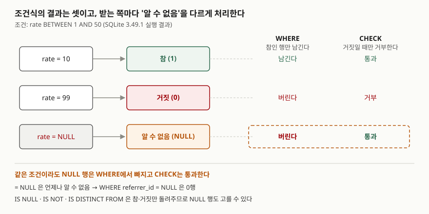

<!-- related:start -->
> **같은 기능을 다른 환경에서 다룬 글** (`null-semantics`)
> - [NULL이 인덱스, 집계, 비교에서 각각 다르게 동작하는 이유](../../2026-10-03-null-index-group-unique-distinct/index.md) — SQLite 3.49.1, Python 3.13.5, Windows 11
> - [COALESCE와 NULLIF — NULL을 다루는 두 함수](../2026-09-28-coalesce-nullif-null-handling/index.md) — SQLite 3.49.1, Python 3.13.5, Windows 11
> - [COUNT(*)와 COUNT(컬럼)이 다른 값을 내는 이유](../2026-10-02-count-star-vs-column-null/index.md) — SQLite 3.49.1, Python 3.13.5, Windows 11
<!-- related:end -->

## 들어가며

추천인 없이 가입한 회원을 뽑으려고 `WHERE referrer_id = NULL`을 쳤더니 결과가 0행이다. 표를 열어
보면 추천인 칸이 빈 회원이 분명히 두 명 있다. 이럴 때 보통은 데이터가 빈 문자열로 들어갔는지,
컬럼 타입이 틀렸는지를 의심하며 행을 하나씩 확인한다. 회원이 수천 명이면 그 확인만 한참 걸리는데,
원인은 데이터가 아니라 `=` 연산자에 있다. NULL과 비교한 결과가 "참"도 "거짓"도 아닌 세 번째 값이라는
것을 알면 질의 한 줄만 보고 0행의 이유를 설명할 수 있다.

## 개념

**NULL**은 "값을 모름" 또는 "값이 없음"을 나타내는 표시다. 0이나 빈 문자열(`''`)과 다르다.

모르는 값과 비교하면 결과도 모른다. 추천인이 누구인지 모르는 회원에게 "추천인이 1번인가?"라고
물으면 답은 "그렇다"도 "아니다"도 아니고 "알 수 없다"다. 그래서 SQL의 조건식은 **참·거짓·알 수 없음**
세 가지 결과를 갖는다. 이것을 **삼값 논리**(three-valued logic)라고 부른다. SQLite는 참을 1, 거짓을 0,
알 수 없음을 NULL로 돌려준다.

`NULL = NULL`도 알 수 없음이다. 두 값을 다 모르니 같은지도 모른다. NULL인지 물으려면 결과가
참·거짓 둘 중 하나로만 나오는 연산자를 따로 써야 한다.

| 연산자 | NULL과 만나면 | 쓰임 |
|---|---|---|
| `=`, `<>`, `<`, `>`, `IN` | 알 수 없음(NULL) | 값끼리 비교 |
| `IS NULL`, `IS NOT NULL` | 참 또는 거짓 | NULL인지 묻기 |
| `IS`, `IS NOT` | 참 또는 거짓 | NULL을 하나의 값처럼 비교 (SQLite 확장 문법) |
| `IS DISTINCT FROM`, `IS NOT DISTINCT FROM` | 참 또는 거짓 | `IS NOT`·`IS`와 같은 뜻의 표준 문법. SQLite 3.39.0부터 |

## 구조



> **출처**: WHERE가 참인 행만 남기는 규칙은 [SQLite — SELECT: WHERE clause filtering](https://www.sqlite.org/lang_select.html#whereclause),
> CHECK가 0일 때만 위반으로 보는 규칙은 [SQLite — CREATE TABLE: CHECK constraints](https://www.sqlite.org/lang_createtable.html#check_constraints)를 따랐다.
> 오른쪽 결과는 이 글의 예제를 실행해 얻은 값이다.

## 동작 원리

조건식은 어디에 쓰이느냐에 따라 결과를 받아들이는 방식이 다르다. 이 차이가 NULL 문제의 대부분을 만든다.

- **`WHERE`**: SQLite 문서는 WHERE 식이 **참**인 행만 결과에 넣는다고 적는다. 알 수 없음은 참이 아니므로
  거짓과 똑같이 버려진다. `referrer_id = NULL`은 모든 행에서 알 수 없음이니 0행이 된다.
- **`CHECK`**: 문서는 결과가 **0일 때만** 제약 위반이고, NULL이나 0이 아닌 값이면 위반이 아니라고 적는다.
  같은 조건이라도 값이 NULL이면 통과한다.
- **`UNIQUE`**: 문서는 UNIQUE 제약에서 NULL을 "다른 NULL을 포함해 모든 값과 다른 값"으로 본다고 적는다.
  그래서 NULL은 몇 개든 들어간다.

`AND`·`OR`·`NOT`도 알 수 없음을 받아 계산한다. 규칙은 "알 수 없는 쪽이 참이든 거짓이든 결과가 같으면
그 결과를, 갈리면 알 수 없음을" 돌려주는 것이다. `거짓 AND 알 수 없음`은 알 수 없는 쪽이 무엇이든
거짓이므로 거짓이고, `참 AND 알 수 없음`은 알 수 없는 쪽에 따라 갈리므로 알 수 없음이다.

## 실습 예제

메모리 SQLite에 회원 5명을 넣었다. 1·4번은 추천인이, 3번은 등급이 NULL이다.
전체 소스: [`code/null_comparison.py`](code/null_comparison.py), 실행 기록: [`code/output.txt`](code/output.txt)

```text
[member]  5행
  id | name   | referrer_id | grade
  ---+--------+-------------+-------
   1 | 김도윤 |        NULL | gold
   2 | 이서준 |           1 | silver
   3 | 박하은 |           1 | NULL
   4 | 최유나 |        NULL | silver
   5 | 정민호 |           3 | gold
```

### 진리표를 SQLite가 직접 계산한다

1, 0, NULL 세 값을 서로 짝지어 `AND`·`OR`·`NOT`을 계산하게 했다.

```text
[1-A AND · OR]
  ('p', 'q', 'p_and_q', 'p_or_q')
  (1, 1, 1, 1)
  (1, 0, 0, 1)
  (1, None, None, 1)
  (0, 1, 0, 1)
  (0, 0, 0, 0)
  (0, None, 0, None)
  (None, 1, None, 1)
  (None, 0, 0, None)
  (None, None, None, None)
[1-C NULL과의 비교는 전부 NULL]
  ('NULL = NULL', 'NULL <> NULL', 'NULL = 1', 'NULL > 1', '1 IN (NULL)', '1 IN (1, NULL)')
  (None, None, None, None, None, 1)
```

`0 AND NULL`은 0, `1 OR NULL`은 1이다. 한쪽만으로 답이 정해지는 자리에서는 NULL이 결과를 흔들지 않는다.
`1 IN (1, NULL)`이 1인 것도 같은 이유다. 목록에서 1을 찾았으니 나머지가 무엇이든 참이다.

### WHERE — `=`와 `IS`의 차이

```text
[2-A = NULL]
  SELECT id, name FROM member WHERE referrer_id = NULL
  ('id', 'name')

[2-B IS NULL]
  SELECT id, name FROM member WHERE referrer_id IS NULL
  ('id', 'name')
  (1, '김도윤')
  (4, '최유나')

[2-C <> 1 은 NULL 행을 빼고 돌려준다]
  SELECT id, name, referrer_id FROM member WHERE referrer_id <> 1
  ('id', 'name', 'referrer_id')
  (5, '정민호', 3)

[2-E IS NOT 1 은 NULL 행을 포함한다]
  SELECT id, name, referrer_id FROM member WHERE referrer_id IS NOT 1
  ('id', 'name', 'referrer_id')
  (1, '김도윤', None)
  (4, '최유나', None)
  (5, '정민호', 3)
```

"추천인이 1번이 **아닌** 회원"을 `<>`로 물으면 5번 하나만 나온다. 1·4번은 추천인이 1번인지 알 수
없으므로 빠진다. `NOT (referrer_id = 1)`도 같은 결과다(2-D). `NOT 알 수 없음`은 여전히 알 수 없음이기
때문이다. NULL 행을 "아닌 쪽"에 넣고 싶으면 `IS NOT`이나 표준 문법 `IS DISTINCT FROM`(2-F)을 쓴다.

질의문을 하나 만들어 두고 값만 바꿔 넘기는 바인딩 변수에서도 차이가 드러난다.

```text
[2-G 바인딩 변수에 None 을 넘기면]
  SELECT id FROM member WHERE referrer_id = ?   값=None  -> []
  SELECT id FROM member WHERE referrer_id = ?   값=1     -> [2, 3]
  SELECT id FROM member WHERE referrer_id IS ?  값=None  -> [1, 4]
  SELECT id FROM member WHERE referrer_id IS ?  값=1     -> [2, 3]
```

`IS ?`는 값이 있으면 `=`과 같은 행을, NULL이면 `IS NULL`과 같은 행을 돌려준다.

같은 원리로 `NOT IN` 목록에 NULL이 하나만 섞여도 결과가 통째로 비는데, 이 함정은
[IN, EXISTS, NOT IN — 결과가 갈리는 지점](../2026-09-28-in-exists-not-in-null/index.md)에서 따로 다뤘다.

### 예상과 달랐던 결과 — 같은 조건이 CHECK에서는 통과한다

할인율을 1~50으로 묶은 쿠폰 표에 네 줄을 넣었다. `code`에는 UNIQUE를 걸었다.
WHERE에서 NULL 행이 빠지는 것을 봤으니 CHECK도 NULL을 막을 것이라고 예상했다.

```text
== 3. CHECK 와 UNIQUE 는 NULL 을 통과시킨다 ==
  INSERT ('A10', 10) -> 성공
  INSERT ('B99', 99) -> 에러: CHECK constraint failed: rate BETWEEN 1 AND 50
  INSERT (None, None) -> 성공
  INSERT (None, 30) -> 성공

[3-B WHERE 로 같은 조건을 걸면]
  SELECT code, rate FROM coupon WHERE rate BETWEEN 1 AND 50
  ('code', 'rate')
  ('A10', 10)
  (None, 30)
```

할인율이 NULL인 줄은 CHECK를 통과해 표에 들어갔지만, 같은 조건을 WHERE에 걸자 빠졌다.
CHECK는 "거짓이면 거부", WHERE는 "참이면 남김"이라 알 수 없음이 정반대로 처리된다.
`code`가 UNIQUE인데 NULL이 두 줄 들어간 것도 확인된다.

### CASE 안의 비교

```text
[4-A CASE x WHEN NULL 은 NULL 을 못 잡는다]
  ('id', 'grade', 'by_value', 'by_is_null')
  (1, 'gold', '지정', '지정')
  (2, 'silver', '지정', '지정')
  (3, None, '지정', '미지정')
  (4, 'silver', '지정', '지정')
  (5, 'gold', '지정', '지정')
```

SQLite 문서는 CASE의 기준 식이 NULL이면 ELSE 결과를 돌려준다고 적는다. 그래서 `CASE grade WHEN NULL`은
등급이 빈 3번도 '지정'으로 분류한다. `CASE WHEN grade IS NULL`로 써야 잡힌다.

## 실무에서 주의할 점

- **`= NULL`은 문법 오류가 아니라서 아무 경고 없이 0행을 돌려준다.** 화면에서 바인딩 변수에 NULL이
  넘어오는 경우(`WHERE referrer_id = ?`)에도 같은 일이 생긴다(2-G). "값이 없으면 NULL 행을 찾는다"는
  뜻이면 `WHERE referrer_id IS ?`로 쓴다.
- **"~가 아닌 것"을 찾을 때 NULL 행이 어느 쪽인지 먼저 정한다.** `<>`와 `NOT (… = …)`은 NULL 행을 뺀다.
  포함해야 하면 `IS NOT`·`IS DISTINCT FROM`을 쓰거나 `OR 컬럼 IS NULL`을 덧붙인다.
- **CHECK로 값의 범위를 묶어도 NULL은 막히지 않는다.** 비면 안 되는 컬럼이면 `NOT NULL`을 따로 건다.
  "검증 규칙을 걸었으니 이상한 값은 없다"고 믿고 WHERE로 집계하면 NULL 행만큼 숫자가 빈다.
- **`IS DISTINCT FROM`은 SQLite 3.39.0부터 쓸 수 있다.** 그보다 오래된 엔진을 함께 지원해야 하면
  같은 뜻의 `IS NOT`을 쓴다.

NULL을 다른 값으로 바꿔 계산하는 `COALESCE`·`NULLIF`는
[COALESCE와 NULLIF — NULL을 다루는 두 함수](../2026-09-28-coalesce-nullif-null-handling/index.md)에서,
집계에서 NULL이 빠지는 규칙은 [COUNT(*)와 COUNT(컬럼)이 다른 값을 내는 이유](../2026-10-02-count-star-vs-column-null/index.md)에서 다뤘다.

## 정리

- NULL과 `=`·`<>`·`IN`으로 비교하면 결과는 참도 거짓도 아닌 알 수 없음(NULL)이다.
- WHERE는 참인 행만 남기므로 `= NULL`은 0행이고, NULL인지는 `IS NULL`로 묻는다.
- 같은 조건이 CHECK에서는 NULL을 통과시키고, UNIQUE는 NULL을 여러 개 허용한다.
- NULL 행까지 함께 비교하려면 `IS`·`IS NOT`·`IS DISTINCT FROM`을 쓴다.

## 참고 자료

- [SQLite — SQL Language Expressions: IS DISTINCT FROM](https://www.sqlite.org/lang_expr.html#isdf) — `IS`·`IS NOT`이 NULL을 다루는 규칙과 표준 문법 대응
- [SQLite — SQL Language Expressions: The IN and NOT IN operators](https://www.sqlite.org/lang_expr.html#the_in_and_not_in_operators) — 오른쪽에 NULL이 있을 때의 결과표
- [SQLite — SQL Language Expressions: The CASE expression](https://www.sqlite.org/lang_expr.html#the_case_expression)
- [SQLite — SELECT: WHERE clause filtering](https://www.sqlite.org/lang_select.html#whereclause)
- [SQLite — CREATE TABLE: CHECK constraints](https://www.sqlite.org/lang_createtable.html#check_constraints) — NULL이면 위반이 아니라는 규칙
- [SQLite — CREATE TABLE: UNIQUE constraints](https://www.sqlite.org/lang_createtable.html#unique_constraints) — NULL을 서로 다른 값으로 보는 규칙
- [SQLite Release 3.39.0](https://www.sqlite.org/releaselog/3_39_0.html) — `IS DISTINCT FROM` 추가
- [SQLite — NULL Handling in SQLite Versus Other Database Engines](https://www.sqlite.org/nulls.html)
