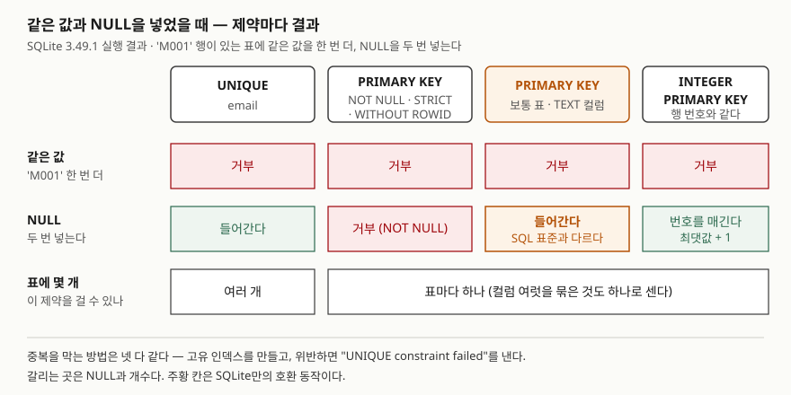

## 들어가며

회원 표를 만들면서 회원 코드에는 `PRIMARY KEY`, 이메일에는 `UNIQUE`를 붙여 둔다. 둘 다 "겹치면 안 된다"는
뜻이니 어느 쪽을 써도 비슷하다고 여기고 넘어간다. 그러다 회원 한 명을 지우려고 `WHERE member_code = ?`를
돌렸는데 지울 행을 찾지 못한다. 열어 보면 회원 코드가 비어 있는 행이 두 개 있다. 기본 키인데도 그렇다.
보통은 입력 코드를 의심하며 한 줄씩 따라가지만, 원인은 표 정의에 있다. 두 제약의 차이 세 가지를 알면
표를 만들 때 바로 막을 수 있다.

## 개념

**기본 키(PRIMARY KEY)**는 표의 행 하나를 가리키는 이름표 역할을 하는 컬럼이다. 회원 코드처럼 그 값만
알면 행이 하나로 정해져야 한다. 그래서 값이 겹쳐도 안 되고, 비어 있어도(NULL) 안 된다. 표마다 하나만 둔다.

**UNIQUE**는 "값이 있으면 다른 행과 겹치면 안 된다"는 규칙이다. 이메일처럼 없을 수도 있지만 있으면
하나뿐이어야 하는 값에 쓴다. 표에 여러 개를 걸 수 있다.

| | 기본 키 | UNIQUE |
|---|---|---|
| 같은 값 | 막는다 | 막는다 |
| NULL | 막는다 (SQL 표준) | 여러 개 허용 |
| 표에 몇 개 | 하나 | 여러 개 |

NULL이 무엇인지, UNIQUE가 NULL을 서로 다른 값으로 치는 이유는
[CREATE TABLE — 타입과 기본 제약조건](../2026-09-29-create-table-constraints-when-checked/index.md)에서 다뤘다.
이 글은 기본 키 쪽을 본다.

## 구조



> **출처**: [SQLite — CREATE TABLE: The PRIMARY KEY](https://www.sqlite.org/lang_createtable.html#the_primary_key), [UNIQUE constraints](https://www.sqlite.org/lang_createtable.html#unique_constraints), [ROWIDs and the INTEGER PRIMARY KEY](https://www.sqlite.org/lang_createtable.html#rowids_and_the_integer_primary_key), [SQLite Autoincrement](https://www.sqlite.org/autoinc.html). 칸의 값은 실습 1~6의 실행 결과다.

## 동작 원리

SQLite는 기본 키와 UNIQUE를 **같은 방식으로** 지킨다. 매뉴얼은 둘 다 보통 고유 인덱스(unique index)를
만들어 구현한다고 적는다. 고유 인덱스는 값이 정렬된 목록이고, 새 값을 넣을 때 이 목록에서 같은 값을
찾아 있으면 거부한다. 그래서 위반하면 기본 키도 `UNIQUE constraint failed`라는 같은 에러를 낸다.

갈리는 곳은 NULL이다. SQL 표준은 기본 키에 NULL을 허용하지 않는다. 그런데 SQLite 매뉴얼은 초기 버전의
버그 때문에 이 규칙이 지켜지지 않았고, 그 버그에 기대 만든 프로그램이 깨지지 않도록 지금도 그대로 둔다고
적는다. 그래서 다음 넷 중 하나가 아니면 기본 키 컬럼에 NULL이 들어간다.

1. `INTEGER PRIMARY KEY` 컬럼
2. `WITHOUT ROWID` 표
3. `STRICT` 표
4. 컬럼에 `NOT NULL`을 붙인 경우

1번은 사정이 다르다. 타입을 정확히 `INTEGER`로 쓴 기본 키는 SQLite가 행마다 매기는 번호(rowid)의
다른 이름이 된다. NULL을 넣으면 거부하는 대신 지금 쓰는 가장 큰 번호보다 1 큰 값을 채운다.

## 실습 예제

전체 소스: [`code/pk_vs_unique.py`](code/pk_vs_unique.py), 실행 기록: [`code/output.txt`](code/output.txt).

```text
member_code | email           | name
------------+-----------------+-------
M001        | kim@example.com | 김도윤
M002        | lee@example.com | 이서준
M003        | NULL            | 박하은
```

`member_code TEXT PRIMARY KEY`, `email TEXT UNIQUE`로 만든 표에 위 세 행이 있다.

```text
-- 1. 같은 값 — 둘 다 막는다
   INSERT INTO member VALUES ('M001', 'new@example.com', '최유나')
   에러: UNIQUE constraint failed: member.member_code
   INSERT INTO member VALUES ('M004', 'kim@example.com', '최유나')
   에러: UNIQUE constraint failed: member.email
```

기본 키 위반인데도 에러 문구는 `UNIQUE`다. 동작 원리에서 본 대로 둘이 같은 장치로 검사되기 때문이다.

```text
-- 3. NULL — 정수가 아닌 기본 키도 받아 준다 (SQLite 호환 동작)
   INSERT INTO member VALUES (NULL, 'jung@example.com', '정민호')
   성공 · 바뀐 행 1
   INSERT INTO member VALUES (NULL, 'han@example.com', '한지우')
   성공 · 바뀐 행 1
   SELECT member_code, name FROM member WHERE member_code IS NULL
   NULL | 정민호
   NULL | 한지우
   SELECT COUNT(*) FROM member WHERE member_code = NULL
   0
```

**기본 키가 NULL인 행이 두 개 들어갔다.** 들어가며의 장면이 이것이다. 이 두 행은 기본 키로 서로를
구별할 수 없고, `= NULL`로는 찾지도 못한다(NULL과의 비교는 참이 되지 않는다).

```text
-- 4. 기본 키의 NULL 을 막는 세 가지 방법
   INSERT INTO member_nn VALUES (NULL, '정민호')
   에러: NOT NULL constraint failed: member_nn.member_code
   INSERT INTO member_strict VALUES (NULL, '정민호')
   에러: NOT NULL constraint failed: member_strict.member_code
   INSERT INTO member_wr VALUES (NULL, '정민호')
   에러: NOT NULL constraint failed: member_wr.member_code

-- 5. INTEGER PRIMARY KEY 에 NULL 을 넣으면 번호를 매긴다
   SELECT post_id, title FROM board
   1 | 첫 글
   10 | 열 번째 글
   11 | 그다음 글
```

5번에서 10번 다음 NULL은 2가 아니라 11이 됐다. 빈 번호를 채우지 않고 가장 큰 번호 뒤에 붙인다.

```text
-- 6. 개수 — 기본 키는 표에 하나, UNIQUE 는 여럿
   CREATE TABLE t_two_pk (a TEXT PRIMARY KEY, b TEXT PRIMARY KEY)
   에러: table "t_two_pk" has more than one primary key
   INSERT INTO enrollment VALUES ('S1', 'DB101')
   에러: UNIQUE constraint failed: enrollment.student_id, enrollment.course_id
```

컬럼마다 `PRIMARY KEY`를 붙이면 기본 키가 둘이 되어 거부된다. 수강 신청처럼 두 값을 묶어야 행이 정해지면
`PRIMARY KEY (student_id, course_id)`로 **묶은 기본 키 하나**를 만든다. 그러면 `('S1','DB101')` 조합이 두 번째로
들어올 때만 막힌다. 7번에서는 `pragma_index_list`로 기본 키(`pk`)와 UNIQUE(`u`)가 각각 고유 인덱스를
하나씩 만든 것을 확인했다. `INTEGER PRIMARY KEY` 표는 따로 만든 인덱스가 0개였다.

## 실무에서 주의할 점

- **SQLite에서 기본 키가 정수가 아니면 `NOT NULL`을 같이 쓴다.** `TEXT PRIMARY KEY`만으로는 NULL을 막지 못한다.
  다른 DB에서 옮겨 온 스키마도 이 점을 확인한다. 반대로 SQLite의 데이터를 SQL 표준대로 기본 키 NULL을
  거부하는 DB로 옮기면, 여기서 들어간 NULL 행이 옮기는 단계에서 걸린다.
- **"없을 수도 있는 값"을 기본 키로 고르지 않는다.** 이메일·전화번호처럼 비거나 바뀌는 값은 UNIQUE로 두고,
  기본 키는 회원 번호처럼 항상 있고 바뀌지 않는 값으로 정한다.
- **`INTEGER PRIMARY KEY`의 번호는 빈 자리를 채우지 않는다.** 번호가 연속이라고 가정한 코드는 중간에 행을
  지우거나 큰 번호를 직접 넣는 순간 틀린다. 또 `INT PRIMARY KEY`나 `INTEGER PRIMARY KEY DESC`는 행 번호의 별칭이
  되지 않는다고 매뉴얼에 적혀 있다. 타입 이름까지 정확히 `INTEGER`여야 한다.
- **에러 문구로 기본 키 위반과 UNIQUE 위반을 구별하지 않는다.** 둘 다 `UNIQUE constraint failed`다. 어느 쪽인지는
  뒤에 붙은 컬럼 이름으로 판단한다.

## 정리

- 기본 키와 UNIQUE는 같은 값을 똑같이 막고, 둘 다 고유 인덱스로 구현된다.
- 기본 키는 표에 하나, UNIQUE는 여럿이다. 컬럼 여럿을 묶은 기본 키도 하나로 센다.
- SQL 표준에서 기본 키는 NULL을 받지 않지만, SQLite의 보통 표에서 정수가 아닌 기본 키는 NULL을 여러 개 받는다.
- 막으려면 `NOT NULL`·`STRICT`·`WITHOUT ROWID` 중 하나를 쓴다. `INTEGER PRIMARY KEY`는 NULL 대신 번호를 채운다.

## 참고 자료

- [SQLite — CREATE TABLE: The PRIMARY KEY](https://www.sqlite.org/lang_createtable.html#the_primary_key) — 표당 하나, NULL 허용 호환 동작과 예외 4가지
- [SQLite — CREATE TABLE: UNIQUE constraints](https://www.sqlite.org/lang_createtable.html#unique_constraints) — 고유 인덱스로 구현, NULL끼리는 다른 값
- [SQLite — CREATE TABLE: ROWIDs and the INTEGER PRIMARY KEY](https://www.sqlite.org/lang_createtable.html#rowids_and_the_integer_primary_key) — 행 번호의 별칭이 되는 조건과 `DESC` 예외
- [SQLite Autoincrement](https://www.sqlite.org/autoinc.html) — NULL을 넣으면 가장 큰 행 번호보다 1 큰 값
- [SQLite — STRICT Tables](https://www.sqlite.org/stricttables.html), [WITHOUT ROWID Tables](https://www.sqlite.org/withoutrowid.html)
- [SQLite — PRAGMA index_list](https://www.sqlite.org/pragma.html#pragma_index_list) — `origin` 칸의 `pk`·`u`
