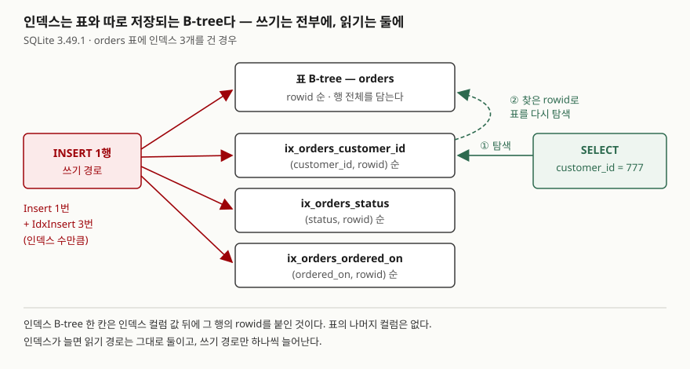

## 들어가며

주문 목록 화면이 느리다는 말을 듣고 검색해 보면 "조건에 쓰는 컬럼에 인덱스를 걸라"는 답이 먼저 나온다.
그대로 걸었더니 빨라졌다. 그러면 다음부터는 느린 화면이 생길 때마다 인덱스를 하나씩 더하게 된다.
표 하나에 인덱스가 여섯, 일곱 개가 붙고, 그때부터는 주문을 **넣는** 쪽이 느려진다. 인덱스가 읽기에서
무엇을 줄이고 쓰기에서 무엇을 늘리는지 숫자로 한 번 봐 두면, 몇 개를 걸지 판단할 근거가 생긴다.

## 개념

**인덱스**(index)는 표의 특정 컬럼 값을 정렬해 따로 저장해 둔 자료 구조다. 값이 정렬돼 있으므로 DB는
원하는 값의 위치를 이진 탐색으로 찾고, 거기에 적힌 행 번호로 표의 행을 읽는다. 인덱스가 없으면 DB는 조건에 맞는 행을 찾으려고 표를 처음부터 끝까지
읽는다. 이것을 **전체 스캔**(SCAN)이라 한다.

```sql
CREATE INDEX ix_orders_customer_id ON orders (customer_id);   -- 만들기
CREATE INDEX IF NOT EXISTS ix_orders_customer_id ON orders (customer_id);  -- 있으면 넘어간다
CREATE UNIQUE INDEX ux_member_email ON member (email);          -- 값이 겹치지 못하게
DROP INDEX ix_orders_customer_id;                               -- 지우기
```

인덱스 이름은 DB 안에서 겹칠 수 없다. 이 글은 `ix_표_컬럼` 꼴로 짓는다.

## 구조



> **출처**: [SQLite — Query Planning §1.3 Lookup By Index](https://www.sqlite.org/queryplanner.html#_lookup_by_index) — 인덱스 칸이 컬럼 값 뒤에 rowid를 붙여 정렬되고, 인덱스와 표를 한 번씩 이진 탐색한다는 설명.
> [SQLite Database File Format §1.6 B-tree Pages](https://www.sqlite.org/fileformat2.html#b_tree_pages) — 표와 인덱스가 각각 별도의 B-tree라는 설명.
> "Insert 1번 + IdxInsert 인덱스 수만큼"은 실습 9의 `EXPLAIN INSERT` 결과다.

## 동작 원리

인덱스는 표와 **따로** 저장된다. 인덱스 한 칸에는 인덱스 컬럼 값과 그 행의 **rowid**(SQLite가 행마다
붙이는 번호)만 있다. 그래서 `customer_id = 777`을 찾을 때는 인덱스에서 777을 찾아 rowid를 얻고, 그 rowid로
표를 한 번 더 찾아 나머지 컬럼을 읽는다.

반대로 행을 넣을 때는 표에 한 번 쓰고, 인덱스마다 한 번씩 더 쓴다. 인덱스는 정렬을 유지해야 하므로 새 값이
들어갈 자리를 찾아 끼워 넣는다. **읽기 경로는 인덱스가 몇 개든 둘이고, 쓰기 경로는 인덱스 수만큼 늘어난다.**

## 실습 예제

전체 소스: [`code/create_index_basics.py`](code/create_index_basics.py), 실행 기록: [`code/output.txt`](code/output.txt).
`orders` 표에 주문 20,000행(고객 2,000명, 상태 `paid`·`shipped`·`cancelled`)을 시드 고정으로 넣었다.
시간은 실행마다 흔들리므로 SQLite 가상 머신이 실행한 **명령 수**(VM 명령)를 함께 센다. 이 값은 매번 같다.

### 만들기 전과 후

```text
-- 1. 인덱스가 없을 때 — 고객 777의 주문
   QUERY PLAN
   `--SCAN orders
   결과 10행 · VM 명령 60,038개

-- 2. CREATE INDEX 로 만든 뒤
   QUERY PLAN
   `--SEARCH orders USING INDEX ix_orders_customer_id (customer_id=?)
   결과 10행 · VM 명령 71개
```

결과는 같은 10행인데 일한 양은 60,038에서 71로 줄었다. `SCAN`은 20,000행을 전부 읽었고,
`SEARCH`는 인덱스로 10행만 골랐다.

```text
   CREATE INDEX ix_orders_customer_id ON orders (customer_id)
   에러: index ix_orders_customer_id already exists
   CREATE INDEX IF NOT EXISTS ix_orders_customer_id ON orders (customer_id)
   성공
   CREATE UNIQUE INDEX ux_orders_customer_id ON orders (customer_id)
   에러: UNIQUE constraint failed: orders.customer_id
```

`UNIQUE INDEX`는 이미 겹치는 값이 있으면 만들어지지 않는다. 고객 한 명이 주문을 여러 번 했기 때문이다.

### 값이 3가지뿐인 컬럼

```text
   SEARCH orders USING INDEX ix_orders_status (status=?)
   인덱스 사용 · 결과 (6586, 165356700) · VM 명령 39,530개 · 0.68 ms
   NOT INDEXED · 결과 (6586, 165356700) · VM 명령 79,771개 · 0.73 ms
```

`status`는 세 값이 3분의 1씩이다. 인덱스로 6,586행을 골라도 행마다 표를 다시 찾아가야 한다.
VM 명령은 절반이 됐지만 시간은 거의 같았다. `NOT INDEXED`는 인덱스를 쓰지 말라고 지정하는 SQLite 문법이다.
`ANALYZE`로 통계(`20000 6667` — 값 하나에 평균 6,667행)를 만든 뒤에도 SQLite는 이 인덱스를 골랐다.

### 저장 공간과 쓰기 비용

```text
   표만: 160 페이지
   + ix_orders_customer_id        210 페이지 (+50)
   + ix_orders_status             283 페이지 (+73)
   + ix_orders_ordered_on         372 페이지 (+89)
   + ix_orders_customer_ordered   476 페이지 (+104)

-- 9. 쓰기 비용 — 같은 20,000행을 인덱스 수만 바꿔 INSERT
   인덱스 0개: VM 명령   400,013개 ·  160 페이지 ·   10.8 ms
   인덱스 1개: VM 명령   520,013개 ·  214 페이지 ·   18.5 ms
   인덱스 3개: VM 명령   720,013개 ·  399 페이지 ·   35.8 ms
   0개로 넣고 3개를 나중에: VM 명령   940,175개 ·  372 페이지 ·   22.8 ms
     인덱스 3개: Insert 1개 · IdxInsert 3개
```

페이지 하나는 4,096바이트다. 인덱스 셋이 표(160페이지)보다 큰 212페이지를 차지했다. 정수 컬럼보다 날짜
글자 컬럼의 인덱스가 더 컸다. INSERT 한 행에 드는 VM 명령은 인덱스가 없을 때 20개, 1개일 때 26개, 3개일 때
36개였고, 이번 실행의 시간은 인덱스 3개가 0개의 3.3배였다.

예상과 달랐던 것은 마지막 줄이다. **인덱스 없이 다 넣고 나중에 만든 쪽이 VM 명령은 더 많은데 더 빠르고 작았다.**
`EXPLAIN CREATE INDEX`에는 `SorterSort` 같은 정렬 명령이 나온다. 이미 있는 값을 한꺼번에 정렬해 채우므로,
한 행씩 끼워 넣을 때보다 페이지가 촘촘하다(399 → 372). VM 명령 수는 일의 양을 대강 보여 줄 뿐 시간과 같지 않다.

UPDATE도 같다. 인덱스에 없는 `amount`를 1,000행 바꾸는 데 14,016개, 인덱스에 있는 `customer_id`를 바꾸는
데 23,014개가 들었다.

## 실무에서 주의할 점

- **인덱스는 읽기에서 줄인 만큼 쓰기에서 늘린다.** 쓰기가 많은 표에 화면마다 인덱스를 더하면 INSERT가 느려진다.
  새 인덱스를 걸기 전에 그 질의가 얼마나 자주 도는지 먼저 본다.
- **값 종류가 적은 컬럼의 인덱스는 이득이 작다.** 상태 3가지 컬럼에서는 시간이 거의 줄지 않았고 저장 공간만 73페이지를 썼다.
- **대량 적재는 인덱스를 나중에 만든다.** 이 실습에서는 시간이 35.8ms에서 22.8ms로, 페이지가 399에서 372로 줄었다.
- **파이썬에서 실행계획을 다시 볼 때는 문장 캐시를 의심한다.** `DROP INDEX` 뒤 같은 연결에서 같은
  `EXPLAIN QUERY PLAN` 문장을 다시 돌리자 지운 인덱스가 그대로 찍혔다. 문장 캐시를 끈 연결(`cached_statements=0`)에서는 `SCAN`이 나왔다.

## 정리

- `CREATE INDEX 이름 ON 표 (컬럼)`으로 만들고 `DROP INDEX 이름`으로 지운다. `IF NOT EXISTS`·`IF EXISTS`는 에러 대신 넘어간다.
- 인덱스는 컬럼 값과 rowid를 정렬해 따로 저장한 B-tree다. 읽기는 인덱스와 표 두 번 탐색으로 끝난다.
- 대신 INSERT 한 행이 인덱스 수만큼 더 쓰이고, 저장 공간도 인덱스마다 늘어난다.
- 값 종류가 적은 컬럼은 인덱스를 걸어도 시간이 거의 줄지 않았다.

## 참고 자료

- [SQLite — CREATE INDEX](https://www.sqlite.org/lang_createindex.html), [DROP INDEX](https://www.sqlite.org/lang_dropindex.html)
- [SQLite — Query Planning §1.3 Lookup By Index](https://www.sqlite.org/queryplanner.html#_lookup_by_index)
- [SQLite Database File Format §1.6 B-tree Pages](https://www.sqlite.org/fileformat2.html#b_tree_pages)
- [SQLite — INDEXED BY](https://www.sqlite.org/lang_indexedby.html) — `NOT INDEXED` 지정
- [SQLite — ANALYZE](https://www.sqlite.org/lang_analyze.html) — `sqlite_stat1` 통계
- [Python — sqlite3.connect](https://docs.python.org/3/library/sqlite3.html#sqlite3.connect) — `cached_statements` 기본값 128
