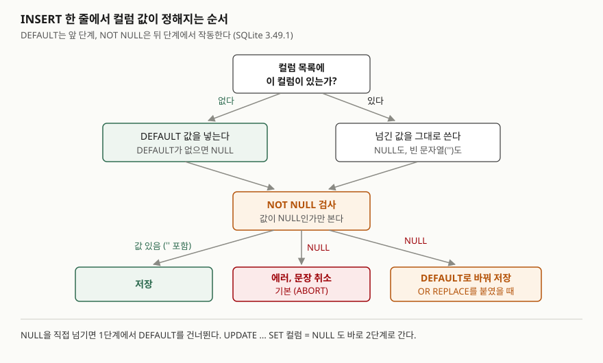

## 들어가며

회원 가입 화면에서 닉네임을 비워 두면 '손님'이 들어가도록 `DEFAULT '손님'`을 걸어 두었다. 그런데
서버 코드가 빈 칸을 `None`으로 바꿔 넘기자 가입이 전부 `NOT NULL constraint failed`로 실패한다.
고치려고 서버 코드에서 `None`을 `''`로 바꿨더니 이번에는 에러 없이 닉네임이 빈 회원이 쌓인다.
이렇게 되면 대개 "기본값이 왜 안 들어가지"를 붙잡고 입력값을 바꿔 가며 몇 번이고 다시 넣어 본다.
DEFAULT가 **언제** 들어가는지 세 가지 경우만 알면 한 번에 정리된다.

## 개념

- **NULL**: 값이 없음을 나타내는 표시다. 숫자 0이나 빈 문자열 `''`과 다르다.
- **빈 문자열 `''`**: 길이가 0인 **문자열 값**이다. 값이 있으므로 NULL이 아니다.
- **`NOT NULL`**: 이 컬럼에 NULL을 저장하지 못하게 막는 제약이다. 값이 NULL인지만 보고, 비었는지는 보지 않는다.
- **`DEFAULT`**: 값이 정해지지 않았을 때 대신 넣을 값이다. SQLite 문서는 INSERT가 그 컬럼의 값을
  **명시하지 않았을 때** 쓴다고 적는다. NULL을 적은 것도 값을 명시한 것이다.

NOT NULL은 **막는** 규칙이고 DEFAULT는 **채우는** 규칙이다. 둘이 어느 순서로 작동하는지가 이 글의 내용이다.
제약 네 가지를 한 번에 비교한 글은 [CREATE TABLE — 타입과 기본 제약조건](../2026-09-29-create-table-constraints-when-checked/index.md)에 있다.

## 구조



> **출처**: 빠진 컬럼에 기본값을 넣는 단계는 [SQLite — INSERT: Overview](https://www.sqlite.org/lang_insert.html#overview)와
> [SQLite — CREATE TABLE: The DEFAULT clause](https://www.sqlite.org/lang_createtable.html#the_default_clause),
> NULL을 검사하는 단계는 [SQLite — CREATE TABLE: NOT NULL constraints](https://www.sqlite.org/lang_createtable.html#not_null_constraints),
> OR REPLACE가 NULL을 기본값으로 바꾸는 갈래는 [SQLite — ON CONFLICT clause](https://www.sqlite.org/lang_conflict.html)를 따랐다.

## 동작 원리

값은 두 단계를 거친다. 먼저 **컬럼 목록에 그 컬럼이 있는지**를 본다. 없으면 DEFAULT 값을, DEFAULT가 없으면
NULL을 넣는다. 있으면 넘긴 값을 그대로 쓴다. 그다음 **NOT NULL 검사**가 그 값이 NULL인지를 본다.

그래서 NULL을 직접 넘기면 첫 단계에서 DEFAULT를 건너뛰고 두 번째 단계에서 걸린다. `''`은 NULL이 아니므로 통과한다.

예외는 충돌 처리 방식을 `REPLACE`로 바꿨을 때다. SQLite 문서는 NOT NULL 위반이 일어나면 REPLACE가
**NULL을 그 컬럼의 기본값으로 바꾼다**고 적는다. 기본값이 없으면 기본 처리인 ABORT로 돌아가 에러를 낸다.

DEFAULT가 쓰이는 경우가 하나 더 있다. 이미 행이 있는 표에 `ALTER TABLE ... ADD COLUMN`으로 컬럼을 더하면,
기존 행의 그 칸은 DEFAULT 값으로 보인다. 그래서 문서는 NOT NULL 컬럼을 더할 때 NULL이 아닌 기본값을
요구하고, `CURRENT_TIMESTAMP`처럼 행마다 달라지는 기본값은 허용하지 않는다.

## 실습 예제

메모리 SQLite에 회원 3명을 넣었다. 2번은 전화번호가 `''`, 3번은 NULL이다.
전체 소스: [`code/not_null_default.py`](code/not_null_default.py), 실행 기록: [`code/output.txt`](code/output.txt)

```text
[member]  3행
  컬럼     | 타입    | 제약
  ---------+---------+--------------------------
  id       | INTEGER | PK
  email    | TEXT    | NOT NULL
  nickname | TEXT    | NOT NULL DEFAULT '손님'
  status   | TEXT    | NOT NULL DEFAULT 'active'
  phone    | TEXT    |

  id | email         | nickname | status  | phone
  ---+---------------+----------+---------+--------------
   1 | a@example.com | 도윤     | active  | 010-1111-2222
   2 | b@example.com | 서준     | active  |
   3 | c@example.com | 하은     | dormant | NULL
```

### 기본값이 들어가는 경우와 안 들어가는 경우

```text
== 1. DEFAULT 는 컬럼을 빼먹었을 때만 들어간다 ==
  성공  INSERT INTO member (id, email) VALUES (4, 'd@example.com')
  에러  INSERT INTO member (id, email, nickname) VALUES (5, 'e@example.com', NULL)
        -> IntegrityError: NOT NULL constraint failed: member.nickname
  에러  INSERT INTO member (id, email, nickname) VALUES (?, ?, ?)   값=(6, 'f@example.com', None)
        -> IntegrityError: NOT NULL constraint failed: member.nickname
  에러  INSERT INTO member (id, email, nickname) VALUES (7, 'g@example.com', DEFAULT)
        -> OperationalError: near "DEFAULT": syntax error
```

4번 행만 들어갔고 닉네임은 '손님'이다. 파이썬의 `None`은 SQL의 NULL로 넘어가므로 5번과 같은 결과다.
마지막 줄은 `VALUES` 안에 `DEFAULT`를 적어 "여기에 기본값을 넣으라"고 한 것인데, SQLite 3.49.1은
문법 오류로 거부했다. PostgreSQL은 이 문법을 받아들인다(문서의 INSERT 매개변수 설명). SQLite에서는 컬럼을 목록에서 빼는 수밖에 없다.

### 예상과 달랐던 결과 — OR REPLACE는 NULL을 기본값으로 바꾼다

```text
== 4. 그냥 UPDATE 는 막히고, OR REPLACE 는 기본값으로 바꾼다 ==
  에러  UPDATE member SET nickname = NULL WHERE id = 1
        -> IntegrityError: NOT NULL constraint failed: member.nickname
  성공  UPDATE OR REPLACE member SET nickname = NULL WHERE id = 1
  성공  INSERT OR REPLACE INTO member (id, email, nickname) VALUES (9, 'i@example.com', NULL)

[4-A OR REPLACE 뒤의 값]
  ('id', 'nickname')
  (1, '손님')
  (9, '손님')
```

`OR REPLACE`는 보통 "키가 겹치면 기존 행을 지우고 새로 넣는다"로 알려져 있어서, NOT NULL과는 상관이 없을 거라 예상했다.
실제로는 1번 회원의 닉네임 '도윤'이 에러 없이 '손님'으로 바뀌었다. 키 충돌을 처리하려고 붙인 `OR REPLACE`가 NULL로
들어온 값을 조용히 기본값으로 바꾸므로, 화면에서 빈 칸이 넘어오면 기존 값이 덮인다.

### 빈 문자열과 NULL은 세는 방법이 다르다

```text
[2-B 세는 방법에 따라 '전화번호 없는 회원' 수가 갈린다]
  ('total', 'count_col', 'null_cnt', 'empty_cnt', 'null_or_empty')
  (3, 2, 1, 1, 2)
```

전화번호가 없는 회원은 2명(2·3번)인데, `IS NULL`로 세면 1명, `= ''`로 세도 1명이다.
`COUNT(phone)`은 `''`을 값으로 보고 세어 2가 나온다. 두 표현이 섞인 컬럼은 `COALESCE(phone, '') = ''`처럼 한쪽으로 모아 세야 한다.
`''`을 아예 못 들어오게 하려면 `CHECK (trim(email) <> '')`를 함께 건다. 실행 기록 3번에서 `''`과 공백 세 칸이 모두 거부됐다.

### 기존 행이 있는 표에 컬럼 더하기

```text
  에러  ALTER TABLE member ADD COLUMN grade TEXT NOT NULL
        -> OperationalError: Cannot add a NOT NULL column with default value NULL
  성공  ALTER TABLE member ADD COLUMN grade TEXT NOT NULL DEFAULT 'basic'
  에러  ALTER TABLE member ADD COLUMN joined TEXT NOT NULL DEFAULT CURRENT_TIMESTAMP
        -> OperationalError: Cannot add a column with non-constant default
```

`DEFAULT 'basic'`을 붙이자 기존 1~3번 행의 `grade`가 모두 `basic`으로 조회됐다(5-A).
가입 시각처럼 행마다 다른 값을 나중에 더해야 하면, 컬럼을 NULL 허용으로 더하고 UPDATE로 채운 뒤 표를 새로 만들어 옮겨야 한다.

## 실무에서 주의할 점

- **기본값을 쓰려면 INSERT에서 그 컬럼을 뺀다.** ORM이나 서버 코드가 빈 입력을 `None`으로 바꿔 모든 컬럼을
  채워 보내면 DEFAULT는 한 번도 쓰이지 않는다. 값이 없을 때 컬럼을 문장에서 빼는지부터 확인한다.
- **`OR REPLACE`를 키 충돌 처리용으로 붙였다면 NULL 처리도 바뀐다는 것을 안다.** 기존 값이 기본값으로
  덮여도 에러가 나지 않아서 데이터가 바뀐 줄 모른다.
- **"비어 있음"을 NULL과 `''` 중 하나로 정한다.** 둘이 섞이면 `IS NULL`과 `= ''` 어느 쪽으로 세도 숫자가 모자란다.
  NOT NULL은 `''`을 막지 않으므로 필요하면 CHECK를 함께 건다.
- **운영 중인 표에 NOT NULL 컬럼을 더할 때는 상수 기본값을 준비한다.** 기본값 없이는 ALTER가 거부되고,
  `CURRENT_TIMESTAMP`도 거부된다.

## 정리

- DEFAULT는 INSERT에서 컬럼을 빼먹었을 때 들어간다. NULL이나 `None`을 넘기면 건너뛴다.
- NOT NULL은 NULL인지만 본다. 빈 문자열 `''`은 통과하고, 세는 방법에 따라 NULL과 다르게 집계된다.
- `OR REPLACE`가 붙으면 NULL이 기본값으로 바뀌고, `ADD COLUMN`은 기존 행에 기본값을 보여 준다.
- SQLite 3.49.1은 `VALUES (..., DEFAULT)`를 문법 오류로 거부한다.

## 참고 자료

- [SQLite — CREATE TABLE: The DEFAULT clause](https://www.sqlite.org/lang_createtable.html#the_default_clause) — 값을 명시하지 않았을 때 쓰는 값, 허용되는 상수 식
- [SQLite — CREATE TABLE: NOT NULL constraints](https://www.sqlite.org/lang_createtable.html#not_null_constraints)
- [SQLite — INSERT: Overview](https://www.sqlite.org/lang_insert.html#overview) — 컬럼 목록에 없는 컬럼은 기본값으로 채운다는 규칙과 `DEFAULT VALUES` 형식
- [SQLite — ON CONFLICT clause](https://www.sqlite.org/lang_conflict.html) — REPLACE가 NOT NULL 위반에서 기본값을 쓰는 규칙
- [SQLite — ALTER TABLE: ADD COLUMN](https://www.sqlite.org/lang_altertable.html#alter_table_add_column) — NOT NULL 컬럼과 비상수 기본값 제한
- [PostgreSQL 16 — INSERT](https://www.postgresql.org/docs/16/sql-insert.html) — `VALUES` 안의 `DEFAULT` 키워드
