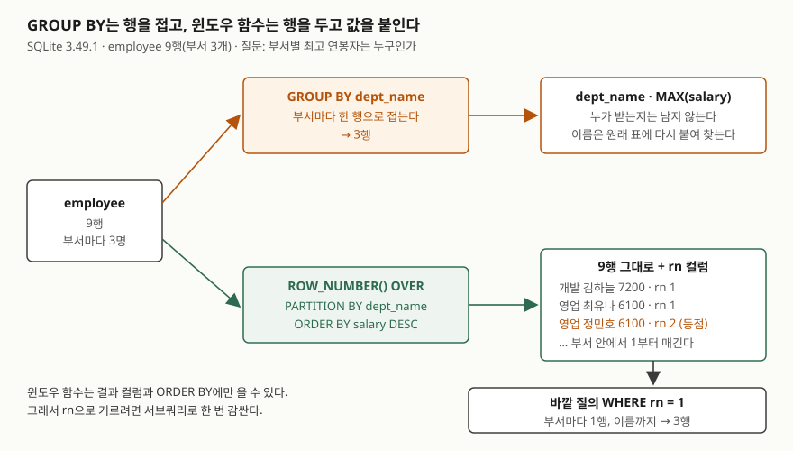

<!-- related:start -->
> **같은 기능을 다른 환경에서 다룬 글** (`window-function`)
> - [Tibero 7 분석 함수의 윈도우 절 — ROWS와 RANGE는 어디서 갈리는가](../../tibero/2026-09-23-tibero7-window-clause/index.md) — Tibero 7
<!-- related:end -->

## 들어가며

사내 대시보드에 "부서별 최고 연봉자" 칸을 넣어 달라는 요청을 받는다. `GROUP BY dept_name`과 `MAX(salary)`로
금액은 바로 나오는데, 정작 화면에 필요한 **이름**이 없다. 그래서 대개 부서 목록을 먼저 뽑고, 부서마다
"이 부서에서 연봉이 이 금액인 사람"을 다시 조회한다. 부서가 30개면 질의가 31번 나가고, 같은 금액을 받는
사람이 둘인 부서에서는 화면에 두 줄이 찍혀 칸이 밀린다. 윈도우 함수를 쓰면 이 일을 질의 한 번으로 끝내고,
동점을 어떻게 처리할지도 질의 안에서 정할 수 있다.

## 개념

**윈도우 함수**(window function)는 행마다 "그 행과 같은 묶음에 속한 행들"을 보고 값을 하나 계산해,
그 값을 **그 행 옆에 컬럼으로 붙이는** 함수다. 집계 함수와 하는 일이 비슷하지만 결과 행 수를 바꾸지 않는다.
SQLite 문서는 윈도우 함수를 질의에 더해도 돌아오는 행 수가 바뀌지 않는다고 적는다.

| | `GROUP BY` + 집계 | 윈도우 함수 |
|---|---|---|
| 결과 행 수 | 묶음마다 1행으로 줄어든다 | 원래 행 수 그대로 |
| 묶음 밖 컬럼(이름 등) | 표준 SQL에서는 쓸 수 없다 | 그대로 쓸 수 있다 |
| 묶는 기준 | `GROUP BY 컬럼` | `OVER (PARTITION BY 컬럼)` |

`ROW_NUMBER()`는 윈도우 함수 가운데 가장 단순한 것으로, 묶음(파티션) 안에서 정한 순서대로 1, 2, 3…을 매긴다.

```sql
ROW_NUMBER() OVER (PARTITION BY dept_name ORDER BY salary DESC)
--                 └ 부서별로 따로 센다      └ 연봉이 높은 순으로 1부터
```

`PARTITION BY`를 빼면 표 전체를 한 묶음으로 보고 번호를 매긴다. SQLite는 3.25.0(2018년)부터 윈도우 함수를 지원한다.

## 구조



> **출처**: [SQLite — Window Functions §1 Introduction to Window Functions](https://www.sqlite.org/windowfunctions.html#introduction_to_window_functions)(행 수를 바꾸지 않는다는 설명, 결과 컬럼과 ORDER BY에만 올 수 있다는 제약),
> [§3 Built-in Window Functions](https://www.sqlite.org/windowfunctions.html#built_in_window_functions)(`row_number()` 정의).
> 행 수와 이름은 실습 1·4·7번의 실행 결과다.

## 동작 원리

`ROW_NUMBER() OVER (PARTITION BY dept_name ORDER BY salary DESC)`를 만나면 SQLite는 행을 `dept_name`, 그다음
`salary` 내림차순으로 정렬한다. 정렬된 행을 위에서부터 읽으며 부서가 바뀔 때마다 번호를 1로 되돌린다.
실습 11번 실행계획의 `USE TEMP B-TREE FOR ORDER BY`가 이 정렬이다. 질의에 `ORDER BY`를 쓰지 않았는데도
정렬이 일어난다.

번호를 매기는 기준은 `OVER` 안의 `ORDER BY`뿐이다. 그래서 **연봉이 같은 두 사람 중 누가 1번이 될지는 질의에
적혀 있지 않다.** SQLite 문서도 `ORDER BY`로 정해지지 않는 순서는 임의라고 적는다. 동점자가 있을 때
1번을 하나로 정하려면 `ORDER BY salary DESC, employee_id`처럼 겹치지 않는 컬럼을 하나 더 붙여야 한다.

윈도우 함수는 `SELECT`의 결과 컬럼과 `ORDER BY`에만 올 수 있다. 윈도우 함수가 보는 행은 `WHERE`가
거르고 남은 행이다. 실습 13번에서 `WHERE dept_name = '개발'`을 건 질의의 `COUNT(*) OVER ()`는 9가 아니라 3이었다.
`WHERE`가 끝나야 값이 정해지므로 `WHERE` 안에서는 그 값을 쓸 수 없다.
`rn = 1`로 거르려면 윈도우 함수를 쓴 질의를 서브쿼리로 감싸고 **바깥에서** 거른다.

## 실습 예제

전체 소스: [`code/row_number_top_per_group.py`](code/row_number_top_per_group.py), 실행 기록: [`code/output.txt`](code/output.txt).
직원 9명을 세 부서에 나눠 넣었다. **영업부에는 최고 연봉 6100을 받는 사람이 둘**(최유나·정민호) 있다.

```text
  employee_id | name   | dept_name | salary
  ------------+--------+-----------+-------
            1 | 김하늘 | 개발      |   7200
            2 | 이도윤 | 개발      |   6800
            3 | 박서준 | 개발      |   5400
            4 | 최유나 | 영업      |   6100
            5 | 정민호 | 영업      |   6100
            6 | 한지우 | 영업      |   4800
            7 | 윤채원 | 인사      |   5200
            8 | 장태오 | 인사      |   4600
            9 | 오세린 | 인사      |   4100
```

### GROUP BY로 풀기

```text
-- 1. GROUP BY — 부서별 최고 연봉
   => dept_name | top_salary
      개발 | 7200
      영업 | 6100
      인사 | 5200
   (3행)

-- 3. GROUP BY 결과를 원래 표에 다시 붙이기
   => dept_name | name | salary
      개발 | 김하늘 | 7200
      영업 | 최유나 | 6100
      영업 | 정민호 | 6100
      인사 | 윤채원 | 5200
   (4행)
```

1번은 금액만 준다. 이름을 얻으려면 3번처럼 그 결과를 원래 표에 다시 조인해야 하고, 그러면 동점자가 **둘 다** 나와
4행이 된다. 부서마다 한 줄을 기대한 화면에서는 이것이 칸이 밀리는 원인이다.

SQLite에서는 2번처럼 `GROUP BY` 질의에 `name`을 그냥 적어도 에러가 나지 않는다.

```text
-- 2. GROUP BY 에 이름을 같이 달라고 하면 (SQLite 전용 동작)
   SELECT dept_name, name, MAX(salary) AS top_salary ...
      개발 | 김하늘 | 7200
      영업 | 최유나 | 6100
      인사 | 윤채원 | 5200
```

`MAX()`가 하나뿐인 집계 질의에서 SQLite는 그 최댓값이 나온 행의 값을 다른 컬럼에 채워 준다.
동점이면 그중 아무 행이나 고른다. 대부분의 다른 DB는 이 질의를 에러로 막는다.

### ROW_NUMBER로 풀기

```text
-- 4. ROW_NUMBER — 행은 그대로, 옆에 순번이 붙는다
   => dept_name | name | salary | rn
      개발 | 김하늘 | 7200 | 1
      개발 | 이도윤 | 6800 | 2
      개발 | 박서준 | 5400 | 3
      영업 | 최유나 | 6100 | 1
      영업 | 정민호 | 6100 | 2
      ...
   (9행)
```

9행이 그대로 남고 `rn`만 붙었다. 부서마다 1부터 다시 센다. 이제 `rn = 1`만 남기면 되는데,
그대로 `WHERE`에 쓰면 막힌다.

```text
-- 5. WHERE 에서 바로 거르면
   에러: misuse of window function ROW_NUMBER()
-- 6. 별칭 rn 을 WHERE 에서 쓰면
   에러: misuse of aliased window function rn

-- 7. 서브쿼리로 한 번 감싼 뒤 rn = 1
   => dept_name | name | salary
      개발 | 김하늘 | 7200
      영업 | 최유나 | 6100
      인사 | 윤채원 | 5200
   (3행)
```

7번이 원하던 모양이다. 부서마다 정확히 한 줄이고 이름도 있다. `rn <= 2`로 바꾸면 부서별 상위 2명이 6행으로
나온다(8번). `GROUP BY`로는 "상위 2명"을 한 질의로 쓰기 어렵다.

### 동점자 중 누가 남는가

예상과 달랐던 것은 9번이다. 같은 9명을 `employee_id`만 거꾸로 매겨(정민호 95, 최유나 96) 다른 표에 넣고
7번과 **글자 하나 다르지 않은** 질의를 돌렸다.

```text
-- 7번 (employee)            -- 9번 (employee_reversed)
      영업 | 최유나 | 6100         영업 | 정민호 | 6100
```

데이터 내용은 같은데 1번이 바뀌었다. 두 번 다 `employee_id`가 작은 쪽, 즉 먼저 저장된 쪽이 1번을 받았다.
하지만 이것은 이번 실행에서 관찰한 결과일 뿐이고, 문서가 보장하는 것은 "임의"까지다.
10번처럼 `ORDER BY salary DESC, employee_id`라고 적으면 그때부터는 질의가 순서를 정한다.

## 실무에서 주의할 점

- **`OVER (ORDER BY ...)`에는 겹치지 않는 컬럼을 끝에 붙인다.** 동점이 생기면 누가 1번인지가 저장 순서에 따라
  바뀐다. 개발 DB에서는 매번 같은 사람이 나오다가 데이터를 다시 적재한 운영 DB에서 다른 사람이 나올 수 있다.
- **동점자를 모두 보여 줘야 하면 `ROW_NUMBER`가 아니다.** `ROW_NUMBER`는 동점이어도 1, 2를 따로 준다.
  동점에 같은 순위를 주는 `RANK`·`DENSE_RANK`를 쓰거나, 3번처럼 최댓값에 다시 조인한다.
- **SQLite의 "GROUP BY에 이름 같이 적기"에 기대지 않는다.** 2번은 `MAX()`가 하나일 때만 뜻이 있고,
  동점이면 아무 행이나 고른다. 같은 질의를 다른 DB로 옮기면 에러가 난다.
- **윈도우 함수는 정렬을 부른다.** 실행계획에 `USE TEMP B-TREE FOR ORDER BY`가 나왔다. 행이 많은 표에서
  `PARTITION BY`·`ORDER BY` 컬럼에 맞는 인덱스가 없으면 이 정렬이 질의 시간의 대부분이 된다.

## 다른 환경에서는

같은 `window-function` 키로 쓴 [Tibero 7 윈도우 절 글](../../tibero/2026-09-23-tibero7-window-clause/index.md)과
겹치는 부분만 비교한다. 두 글 모두 실제로 돌려 확인한 결과다.

| | SQLite 3.49.1 | Tibero 7.2 |
|---|---|---|
| `ROW_NUMBER()`에 `ROWS BETWEEN ...`을 붙이면 | 받아들이고 무시한다 — 1, 2, 3 그대로(실습 12번) | `TBR-8004: Syntax error.` |
| 근거 | 실행 결과 + 문서(대부분의 내장 윈도우 함수는 프레임 지정을 무시한다) | 실행 결과(`RANK`·`DENSE_RANK`·`NTILE`·`LEAD`·`LAG`도 같은 오류) |

SQLite는 틀린 프레임을 조용히 넘기고, Tibero는 문법 단계에서 막는다. SQLite에서 쓴 질의를 그대로 옮길 때
`ROW_NUMBER`에 프레임이 붙어 있으면 Tibero에서 실패한다.

## 정리

- 윈도우 함수는 행 수를 그대로 두고 계산한 값을 컬럼으로 붙인다. `GROUP BY`는 행을 접는다.
- `ROW_NUMBER() OVER (PARTITION BY 묶음 ORDER BY 순서)`로 묶음마다 1부터 번호를 매긴다.
- 윈도우 함수는 `WHERE`에 쓸 수 없으므로 서브쿼리로 감싸고 바깥에서 `rn = 1`로 거른다.
- 동점자 중 누가 1번이 될지는 `OVER`의 `ORDER BY`에 겹치지 않는 컬럼을 더해 정한다.

## 참고 자료

- [SQLite — Window Functions](https://www.sqlite.org/windowfunctions.html) — [§1 Introduction to Window Functions](https://www.sqlite.org/windowfunctions.html#introduction_to_window_functions), [§2.1 The PARTITION BY Clause](https://www.sqlite.org/windowfunctions.html#the_partition_by_clause), [§3 Built-in Window Functions](https://www.sqlite.org/windowfunctions.html#built_in_window_functions), [§6 History](https://www.sqlite.org/windowfunctions.html#history)
- [SQLite — Quirks §6 Aggregate Queries Can Contain Non-Aggregate Result Columns That Are Not In The GROUP BY Clause](https://www.sqlite.org/quirks.html#aggregate_queries_can_contain_non_aggregate_result_columns_that_are_not_in_the_group_by_clause)
- [SQLite — EXPLAIN QUERY PLAN](https://www.sqlite.org/eqp.html)
