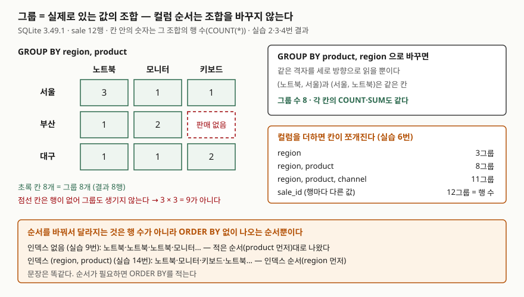

<!-- related:start -->
> **같은 기능을 다른 환경에서 다룬 글** (`group-by`)
> - [GROUP BY와 집계 함수 — 묶는 기준 정하기](../2026-09-22-group-by-aggregate-null/index.md) — SQLite 3.49.1, Python 3.13.5
<!-- related:end -->

## 들어가며

쇼핑몰 매출을 지역별로 뽑아 달라는 요청을 받아 `GROUP BY region`으로 3줄짜리 표를 넘긴다. 다음 날
"상품별로도 나눠 달라"는 말이 오고, 지역마다 따로 `WHERE region = '서울'`을 붙여 상품별 합계를 세 번
뽑아 엑셀에서 이어 붙인다. 판매 경로까지 나눠 달라고 하면 지역 3 × 상품 3 = 9번을 돌려야 한다. 그리고 붙여
놓은 표가 9줄이 아니라 8줄이라 어디가 빠졌는지 한참 찾는다. `GROUP BY`에 컬럼을 여러 개 적으면 이 반복이
질의 하나로 줄고, 몇 줄이 나올지도 미리 알 수 있다.

## 개념

`GROUP BY`는 지정한 값이 같은 행끼리 묶어 묶음마다 한 줄을 돌려준다. 컬럼이 하나면 기준은 그 컬럼의 값이다.
기본 동작과 `NULL` 취급은 [GROUP BY와 집계 함수 글](../2026-09-22-group-by-aggregate-null/index.md)에서 다뤘다.

컬럼을 여러 개 적으면 기준은 **값의 조합**이 된다.

```sql
SELECT region, product, COUNT(*), SUM(amount)
FROM sale
GROUP BY region, product;
```

`region`과 `product`가 **둘 다** 같은 행만 같은 묶음이다. ('서울', '노트북')과 ('서울', '모니터')는 지역이 같아도
다른 묶음이다. SQLite 문서는 결과 행을 만드는 절차를 설명하며 `GROUP BY`의 식들을 행마다 계산해 그 값이
같은 행들을 한 그룹으로 모은다고 적는다.

그래서 결과 행 수는 **표에 실제로 있는 서로 다른 조합의 수**다. 각 컬럼의 고유값 개수를 곱한 값이 아니다.

## 구조



> **출처**: [SQLite — SELECT §2.4 Generation of the set of result rows](https://www.sqlite.org/lang_select.html#generation_of_the_set_of_result_rows)(GROUP BY 식이 같은 행을 한 그룹으로 모으는 규칙),
> [SQLite — Query Optimizer Overview §10 ORDER BY Optimizations](https://www.sqlite.org/optoverview.html#order_by_optimizations)(같은 그룹의 행이 이웃해 있으면 앞 행과만 비교해 묶는다).
> 칸 안의 숫자는 실습 2·3·4·6·9·14번의 실행 결과다.

## 동작 원리

그룹을 만들려면 같은 조합의 행이 **이웃해** 있어야 한다. SQLite 최적화 문서는 같은 그룹에 들어갈 행들이 연달아
나오도록 배치할 수 있으면, 현재 행을 바로 앞 행과만 비교해 같은 그룹인지 판단한다고 적는다.

이웃하게 만드는 길은 두 가지다.

- **인덱스가 없으면** 행을 임시 B-Tree에 넣어 묶는 키 순서로 늘어세운다. 계획에 `USE TEMP B-TREE FOR GROUP BY`가 찍힌다.
- **묶는 컬럼으로 시작하는 인덱스가 있으면** 인덱스가 이미 그 순서로 정렬돼 있으므로 인덱스를 처음부터 읽기만 한다.

여기서 중요한 점은 **"이웃해 있다"에는 컬럼 순서가 없다**는 것이다. (서울, 노트북) 행들이 붙어 있기만 하면
(노트북, 서울)로 묶든 (서울, 노트북)으로 묶든 같은 묶음이 나온다. 컬럼 순서가 묶음을 바꾸지 못하니 행 수와
집계값도 바뀌지 않는다. 바뀔 수 있는 것은 **묶음이 나오는 순서**뿐이다.

## 실습 예제

전체 소스: [`code/group_by_multiple_columns.py`](code/group_by_multiple_columns.py), 실행 기록: [`code/output.txt`](code/output.txt).
판매 12건을 넣었다. **부산에는 키보드 판매가 없고, 대구 11번 행은 판매 경로가 NULL**이다.

```text
  sale_id | region | product | channel | amount
  --------+--------+---------+---------+-------
        1 | 서울   | 노트북  | 온라인  |   1200
        2 | 서울   | 노트북  | 매장    |   1100
        3 | 서울   | 모니터  | 온라인  |    300
        4 | 서울   | 키보드  | 온라인  |     50
        5 | 부산   | 노트북  | 매장    |   1150
        6 | 부산   | 모니터  | 매장    |    280
        7 | 부산   | 모니터  | 온라인  |    310
        8 | 대구   | 노트북  | 온라인  |   1250
        9 | 대구   | 모니터  | 매장    |    290
       10 | 대구   | 키보드  | 매장    |     45
       11 | 대구   | 키보드  | NULL    |     40
       12 | 서울   | 노트북  | 온라인  |   1180
```

### 컬럼을 더할 때마다 몇 그룹이 되는가

```text
-- 6. 묶는 컬럼별 그룹 수
   => group_columns | groups
      region | 3
      region, product | 8
      region, product, channel | 11
      sale_id | 12
```

컬럼을 더할 때마다 기존 묶음이 쪼개진다. 행마다 값이 다른 `sale_id`로 묶으면 그룹 수가 행 수(12)와 같아져
집계할 것이 없어진다. 세 컬럼으로 묶은 5번 결과에서는 대구 키보드가 `None`(경로 NULL)과 `매장` 두 줄로
갈렸다. 묶을 때 NULL은 NULL끼리 한 그룹이 된다.

### 3 × 3인데 왜 8인가

```text
-- 4. 그룹 수와 고유값 개수 비교
   => regions | products | region_product_groups | product_region_groups
      3 | 3 | 8 | 8
```

지역 3곳, 상품 3종이지만 그룹은 8개다. 부산–키보드 조합의 행이 없기 때문이다. `GROUP BY`는 있는 조합만
돌려주고 없는 조합을 0으로 채워 주지 않는다. 0인 줄까지 필요하면 지역 목록과 상품 목록을 `CROSS JOIN`한 뒤
판매를 `LEFT JOIN`해야 한다.

### 순서를 바꿔도 행 수는 같다

2번(`region, product`)과 3번(`product, region`)은 둘 다 8행이고, (서울, 노트북)과 (노트북, 서울)은 둘 다
`3 | 3480`이다. 4번의 마지막 두 칸(8, 8)이 그것을 한 줄로 보여 준다.

### 달라지는 것은 ORDER BY 없이 나오는 순서

예상과 달랐던 것은 여기다. 같은 문장을 `ORDER BY` 없이 인덱스를 만들기 전과 후에 한 번씩 돌렸다.

```text
-- 9. (인덱스 없음)                      -- 14. (인덱스 (region, product) 생성 후)
   노트북 | 대구 | 1                        노트북 | 대구 | 1
   노트북 | 부산 | 1                        모니터 | 대구 | 1
   노트북 | 서울 | 3                        키보드 | 대구 | 2
   모니터 | 대구 | 1                        노트북 | 부산 | 1
```

(출력 두 개를 나란히 놓으려고 앞 4행씩만 옮겼다. 원문은 `output.txt`의 9번과 14번이다.)

`GROUP BY product, region`이라고 적었는데 인덱스가 생긴 뒤에는 지역 순으로 나왔다. 계획을 보면 이유가 보인다.

```text
-- 12. 인덱스 (region, product) 를 만든 뒤 — 순서를 바꿔서
   SQL : SELECT product, region, COUNT(*) FROM sale GROUP BY product, region
   QUERY PLAN
   `--SCAN sale USING COVERING INDEX ix_sale_region_product
```

인덱스 컬럼 순서(`region, product`)와 `GROUP BY` 순서가 반대인데도 임시 B-Tree 없이 인덱스를 그대로 읽었다.
조합만 이웃하면 되므로 SQLite 3.49.1은 순서를 맞추지 않고 인덱스를 썼다. 이 재배열은 문서에 적힌 규칙이 아니라
이번 실행에서 관찰한 동작이다. 반면 앞 컬럼이 빠진 `GROUP BY product`(13번)는 같은 인덱스를 읽고도
`USE TEMP B-TREE FOR GROUP BY`가 붙었다. 인덱스에서 같은 상품이 지역마다 흩어져 있기 때문이다.

## 실무에서 주의할 점

- **결과 행 수를 곱셈으로 예상하지 않는다.** 실습 4번처럼 3 × 3이 8이 된다. 리포트에 "모든 지역 × 모든 상품"
  칸이 있어야 하면 차원 목록을 `CROSS JOIN`으로 먼저 만들고 실적을 `LEFT JOIN`한다.
- **순서가 필요하면 `ORDER BY`를 반드시 적는다.** SQLite 문서는 `ORDER BY` 없는 여러 행의 순서를 정의하지 않는다고
  적는다. 실습 9번과 14번은 같은 문장인데 인덱스 하나로 순서가 바뀌었다. `GROUP BY`의 컬럼 순서는 정렬 지시가 아니다.
- **묶지 않은 컬럼을 SELECT에 두지 않는다.** 실습 8번은 `region`으로만 묶고 `product`를 찍었는데 세 지역 모두
  `노트북`이 나왔다. 그 그룹 안 아무 행의 값일 뿐이고 합계 1625·1740·3830은 상품 전체의 합이다. 표만 보면
  노트북 매출로 읽힌다.
- **잘게 묶은 결과를 다시 묶을 수 있는 건 합계·개수뿐이다.** 실습 7번에서 (지역, 상품) 합계를 지역으로 다시 더하면
  1번과 같은 1625·1740·3830이 나온다. 평균은 묶음마다 행 수가 달라 평균의 평균이 전체 평균과 다르다.
- **인덱스를 만들 때 자주 묶는 컬럼을 앞에 둔다.** `(region, product)` 인덱스는 `region` 단독이나 두 컬럼 조합에는
  쓰였지만 `product` 단독(13번)에서는 정렬을 덜어 주지 못했다.

## 정리

- `GROUP BY`에 컬럼을 여러 개 적으면 기준은 값의 조합이고, 결과 행 수는 실제로 있는 조합의 수다.
- 컬럼을 더하면 그룹이 쪼개지고(3 → 8 → 11), 행이 없는 조합은 결과에 나오지 않는다.
- 컬럼 순서를 바꿔도 그룹 수와 집계값은 같다. 바뀔 수 있는 것은 `ORDER BY` 없이 나오는 순서뿐이다.
- 순서가 필요하면 `ORDER BY`를 적고, 묶지 않은 컬럼은 SELECT에 두지 않는다.

## 참고 자료

- [SQLite — SELECT §2.4 Generation of the set of result rows](https://www.sqlite.org/lang_select.html#generation_of_the_set_of_result_rows) — GROUP BY 식이 같은 행을 한 그룹으로 모으는 규칙, NULL을 같다고 보는 규칙
- [SQLite — SELECT §2.5 Bare columns in an aggregate query](https://www.sqlite.org/lang_select.html#bare_columns_in_an_aggregate_query) — 묶지 않은 컬럼의 값
- [SQLite — SELECT §4 The ORDER BY clause](https://www.sqlite.org/lang_select.html#the_order_by_clause) — ORDER BY가 없으면 행 순서는 정의되지 않는다
- [SQLite — Query Optimizer Overview §10 ORDER BY Optimizations](https://www.sqlite.org/optoverview.html#order_by_optimizations) — GROUP BY에 인덱스를 쓰는 조건
- [SQLite — EXPLAIN QUERY PLAN §1.2 Temporary Sorting B-Trees](https://www.sqlite.org/eqp.html#temporary_sorting_b_trees) — `USE TEMP B-TREE FOR GROUP BY`
