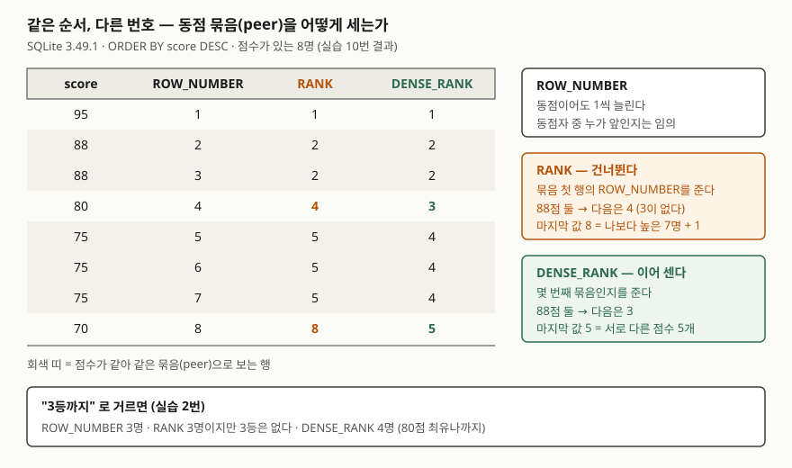

<!-- related:start -->
> **같은 기능을 다른 환경에서 다룬 글** (`window-function`)
> - [윈도우 함수 입문 — ROW_NUMBER로 그룹별 1등 뽑기](../2026-10-03-window-function-row-number-top-per-group/index.md) — SQLite 3.49.1, Python 3.13.5, Windows 11
> - [누적합과 이동평균 — SUM OVER의 프레임](../2026-10-06-sum-over-frame-rows-range/index.md) — SQLite 3.49.1, Python 3.13.5, Windows 11
> - [Tibero 7 분석 함수의 윈도우 절 — ROWS와 RANGE는 어디서 갈리는가](../../tibero/2026-09-23-tibero7-window-clause/index.md) — Tibero 7
<!-- related:end -->

## 들어가며

학원 성적표를 만드는 작은 프로그램을 맡았다고 하자. 점수 순으로 정렬한 뒤 파이썬에서 `enumerate`로 1, 2, 3…을
붙여 등수 칸을 채운다. 그런데 88점을 받은 학생 둘이 2등과 3등으로 갈려 찍히고, 학부모 문의가 들어온다.
그래서 반복문 안에 "앞 사람과 점수가 같으면 같은 등수를 주고, 다르면 지금까지 센 인원 수 + 1을 준다"는
분기를 넣는다. 반마다 따로 매겨야 하면 반이 바뀔 때 카운터를 되돌리는 분기가 또 붙고, 결시자를 어디에 둘지도
코드로 정해야 한다. SQL의 `RANK`와 `DENSE_RANK`는 이 분기를 함수 이름 하나로 정한다.

## 개념

**순위 함수**는 윈도우 함수 가운데 "정한 순서에서 이 행이 몇 번째인가"를 돌려주는 것들이다. 윈도우 함수는 행 수를
바꾸지 않고 계산한 값을 행 옆에 컬럼으로 붙인다. 기본 형태와 `ROW_NUMBER`는
[ROW_NUMBER 글](../2026-10-03-window-function-row-number-top-per-group/index.md)에서 다뤘다.

세 함수는 쓰는 모양이 같다. 괄호 안은 비우고 `OVER` 안의 `ORDER BY`가 순서를 정한다.

```sql
RANK()       OVER (ORDER BY score DESC)
DENSE_RANK() OVER (ORDER BY score DESC)
```

차이는 **동점**에서만 생긴다. `ORDER BY` 기준값이 같은 행들을 SQLite 문서는 **피어**(peer)라고 부른다.
같은 피어끼리 묶인 행 묶음이 "동점 묶음"이다.

| 함수 | 동점 묶음 안에서 | 묶음 다음 번호 | 문서의 정의 |
|---|---|---|---|
| `ROW_NUMBER()` | 서로 다른 번호 | 1씩 늘어난다 | 파티션 안에서 행의 번호 |
| `RANK()` | 같은 번호 | **건너뛴다** | 각 묶음 첫 행의 `row_number()` — 빈자리가 있는 순위 |
| `DENSE_RANK()` | 같은 번호 | **이어 센다** | 이 행이 속한 묶음의 번호 — 빈자리가 없는 순위 |

## 구조



> **출처**: [SQLite — Window Functions §3 Built-in Window Functions](https://www.sqlite.org/windowfunctions.html#built_in_window_functions)(`row_number()`·`rank()`·`dense_rank()` 정의와 피어 묶음).
> 표의 숫자는 실습 10번, "3등까지" 행 수는 실습 2번의 실행 결과다.

## 동작 원리

SQLite는 `OVER (ORDER BY score DESC)`에 맞춰 행을 정렬한 뒤 위에서부터 읽는다. 읽는 동안 두 값을 들고 간다.
지금까지 읽은 행 수와, 지금까지 지나온 동점 묶음 수다.

- 앞 행과 점수가 **다르면** 새 묶음이 시작된다. `RANK`는 이 행의 행 번호(읽은 행 수)를, `DENSE_RANK`는
  묶음 번호(묶음 수)를 준다.
- 앞 행과 점수가 **같으면** 같은 묶음이다. 두 함수 모두 앞 행과 같은 값을 준다.

그래서 `RANK`의 값은 "나보다 점수가 높은 사람 수 + 1"이 되고, `DENSE_RANK`의 값은 "나보다 높은 **서로 다른 점수**의
개수 + 1"이 된다. 실습 4번에서 점수가 있는 8명의 마지막 `RANK`는 8(행 수와 같다), 마지막 `DENSE_RANK`는 5(고유
점수 개수와 같다)였다. `RANK`가 건너뛴 번호의 개수는 동점 묶음 크기에서 1을 뺀 값이다. 88점 2명 뒤에서 1개(3),
75점 3명 뒤에서 2개(6·7)가 비었다.

`OVER` 안에 `ORDER BY`가 없으면 순서가 없으니 모든 행이 한 묶음이 된다. 문서는 이때 두 함수가 항상 1을
돌려준다고 적고, 실습 7번에서 1반 5명이 전부 1이었다.

## 실습 예제

전체 소스: [`code/rank_dense_rank_ties.py`](code/rank_dense_rank_ties.py), 실행 기록: [`code/output.txt`](code/output.txt).
학생 10명을 두 반에 넣었다. **88점 2명, 75점 3명이 동점이고, 결시자 2명은 점수가 NULL**이다.

```text
  student_id | name   | class_name | score
  -----------+--------+------------+------
           1 | 김하늘 | 1반        |    95
           2 | 이도윤 | 1반        |    88
           3 | 박서준 | 1반        |    88
           4 | 최유나 | 1반        |    80
           5 | 정민호 | 1반        |    75
           6 | 한지우 | 2반        |    75
           7 | 윤채원 | 2반        |    75
           8 | 장태오 | 2반        |    70
           9 | 오세린 | 2반        |  NULL
          10 | 서지안 | 2반        |  NULL
```

### 세 함수를 나란히

```text
-- 1. 세 함수를 한 결과에 나란히 (전체, 점수 내림차순)
   => name | score | row_num | rnk | dense_rnk
      김하늘 | 95 | 1 | 1 | 1
      이도윤 | 88 | 2 | 2 | 2
      박서준 | 88 | 3 | 2 | 2
      최유나 | 80 | 4 | 4 | 3
      정민호 | 75 | 5 | 5 | 4
      한지우 | 75 | 6 | 5 | 4
      윤채원 | 75 | 7 | 5 | 4
      장태오 | 70 | 8 | 8 | 5
      오세린 | None | 9 | 9 | 6
      서지안 | None | 10 | 9 | 6
```

동점이 없는 첫 줄까지는 세 컬럼이 같다. 88점 두 명에서 `row_num`만 갈리고, 그 다음 줄에서 `rnk`(4)와
`dense_rnk`(3)가 갈린다. 결시자 둘은 NULL끼리 같은 묶음으로 묶여 같은 순위를 받았다.

### "3등까지"가 몇 명인가

서브쿼리에서 순위를 매기고 바깥에서 `pos <= 3`으로 거른다. 함수 이름만 바꿔 세 번 돌렸다.
`ROW_NUMBER`는 김하늘·이도윤·박서준 3행이었다. 나머지 둘은 이렇다.

```text
-- 2. 상위 3등까지 — RANK() <= 3
   => name | score | pos
      김하늘 | 95 | 1
      이도윤 | 88 | 2
      박서준 | 88 | 2
   (3행)

-- 2. 상위 3등까지 — DENSE_RANK() <= 3
   => name | score | pos
      김하늘 | 95 | 1
      이도윤 | 88 | 2
      박서준 | 88 | 2
      최유나 | 80 | 3
   (4행)
```

`RANK`도 3명을 돌려주지만 **3등인 사람은 없다.** 3이라는 번호를 건너뛰었기 때문이다. "3등까지 시상"이라는 같은
문장이 함수에 따라 3명도 되고 4명도 된다.

### 반별로 따로 매기기

```text
-- 3. 반별로 따로 매기기 — PARTITION BY class_name
   => class_name | name | score | rnk | dense_rnk
      ...
      1반 | 정민호 | 75 | 5 | 4
      2반 | 한지우 | 75 | 1 | 1
      2반 | 윤채원 | 75 | 1 | 1
      2반 | 장태오 | 70 | 3 | 2
```

`PARTITION BY`를 넣으면 반이 바뀔 때 두 값이 모두 1로 돌아간다. 같은 75점인데 1반 정민호는 5등, 2반 두 명은
공동 1등이다.

### 오름차순에서 결시자가 1등이 된다

예상과 달랐던 것은 5번이다. "점수가 낮은 순서로 보충 수업 대상을 뽑자"며 `ORDER BY score`로 바꿨더니
결시자 두 명이 맨 위로 올라왔다.

```text
-- 5. 오름차순이면 NULL 은 어디로 가는가
   => name | score | rnk
      오세린 | None | 1
      서지안 | None | 1
      장태오 | 70 | 3
      ...
```

SQLite는 정렬할 때 NULL을 **다른 어떤 값보다 작게** 본다. 그래서 내림차순에서는 맨 뒤(1번 결과의 9위),
오름차순에서는 맨 앞에 온다. 순위 함수는 정렬된 위치를 그대로 번호로 바꾸므로 결시자가 공동 1등이 된다.
`NULLS LAST`(SQLite 3.30.0부터)를 붙이면 방향과 상관없이 NULL을 뒤로 보낸다. 6번은 2반을 `DESC NULLS LAST`로
매겨 결시자를 4위에 두었다.

### 동점 기준을 더하면 RANK가 ROW_NUMBER가 된다

```text
-- 8. 동점 처리 기준을 하나 더 주면 — ORDER BY score DESC, name
   => name | score | rnk | dense_rnk
      박서준 | 88 | 1 | 1
      이도윤 | 88 | 2 | 2
      윤채원 | 75 | 3 | 3
      ...
```

`ORDER BY score DESC, name`이면 점수와 이름이 **둘 다** 같아야 동점이다. 그런 행이 없으니 묶음이 전부 1행짜리가
되고, `RANK`와 `DENSE_RANK`가 `ROW_NUMBER`와 같은 값을 낸다.

## 실무에서 주의할 점

- **"N등까지"는 함수를 먼저 정하고 쓴다.** 실습 2번처럼 같은 `<= 3`이 `RANK`로는 3명(3등 없음), `DENSE_RANK`로는
  4명이다. 시상 인원이 정해져 있으면 `RANK`(동점자가 몰리면 그만큼 뒤 등수가 사라진다), "점수 단계별 상위 3개"면
  `DENSE_RANK`다.
- **오름차순 순위에는 NULL 처리를 적는다.** NULL은 가장 작은 값으로 정렬되므로 `ORDER BY score`는 결시자를
  1등으로 만든다. `NULLS LAST`를 붙이거나 `WHERE score IS NOT NULL`로 먼저 뺀다.
- **동점을 없애려고 정렬 기준을 더하면 순위 함수를 쓰는 의미가 사라진다.** 실습 8번처럼 기준을 더하면 결과가
  `ROW_NUMBER`와 같아진다. 동점을 인정할 기준과 화면 표시 순서는 따로 정한다. 순위는 `OVER (ORDER BY score DESC)`로
  매기고, 질의 끝의 `ORDER BY score DESC, name`으로 같은 등수 안의 표시 순서를 정한다.
- **`RANK(score)`처럼 괄호 안에 값을 넣지 않는다.** 실습 9번에서 `wrong number of arguments to function RANK()`가
  났다. 무엇으로 순위를 매길지는 `OVER` 안에만 적는다.
- **같은 창을 여러 번 쓰면 `WINDOW` 절로 한 번만 정의한다.** 실습 10번처럼 `WINDOW w AS (ORDER BY score DESC)`를 두고
  `OVER w`로 부르면 두 함수의 기준이 어긋날 일이 없다.

## 다른 환경에서는

같은 `window-function` 키로 쓴 [Tibero 7 윈도우 절 글](../../tibero/2026-09-23-tibero7-window-clause/index.md)에서
`RANK`·`DENSE_RANK`에 `ROWS BETWEEN …` 같은 윈도우 절을 붙이면 Tibero 7.2가 `TBR-8004: Syntax error.`를 낸다는 것을
확인했다. 순위 함수는 프레임이 아니라 피어 묶음으로 값을 정하므로, 이 글의 질의에는 윈도우 절을 쓰지 않았다.

## 정리

- `ROW_NUMBER`는 동점이어도 1씩 늘리고, `RANK`와 `DENSE_RANK`는 동점에 같은 번호를 준다.
- `RANK`는 동점 뒤 번호를 건너뛰고("나보다 높은 사람 수 + 1"), `DENSE_RANK`는 이어 센다("몇 번째 점수 단계인가").
- 그래서 "N등까지"로 거른 인원 수가 함수마다 다르다.
- NULL은 가장 작은 값으로 정렬된다. 오름차순 순위에는 `NULLS LAST`나 `IS NOT NULL`을 붙인다.

## 참고 자료

- [SQLite — Window Functions](https://www.sqlite.org/windowfunctions.html) — [§3 Built-in Window Functions](https://www.sqlite.org/windowfunctions.html#built_in_window_functions), [§1 Introduction to Window Functions](https://www.sqlite.org/windowfunctions.html#introduction_to_window_functions)
- [SQLite — Datatypes In SQLite §4.1 Sort Order](https://www.sqlite.org/datatype3.html#sort_order) — NULL은 다른 어떤 값보다 작다
- [SQLite — SELECT, NULLS FIRST and NULLS LAST](https://www.sqlite.org/lang_select.html#nullslast)
- [SQLite 3.30.0 Release Notes](https://www.sqlite.org/releaselog/3_30_0.html) — `NULLS FIRST`/`NULLS LAST` 추가 (2019-10-04)
