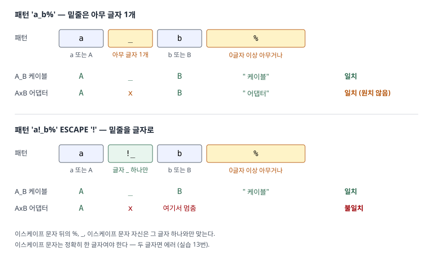

## 들어가며

쇼핑몰 관리 화면에 상품명 검색 칸을 붙이고, 입력값을 받아 `WHERE product_name LIKE '%' || ? || '%'`로 넘긴다.
잘 되던 검색이 어느 날 "100% 면"을 찾았는데 "1000원 균일"까지 같이 나온다는 문의로 돌아온다.
대개는 화면에서 결과를 한 번 더 걸러 내거나, `%`가 들어간 검색어를 아예 막는다.
그런데 문제는 `%` 하나가 아니다. 밑줄 `_`도 와일드카드라서, 상품명에 밑줄이 든 검색어는 전부 엉뚱한 행을 같이 가져온다.
이 글은 두 와일드카드가 정확히 무엇과 맞는지부터 확인한다.

## 개념

**`LIKE`** 는 문자열이 어떤 **패턴**(모양)에 맞는지 검사하는 비교 연산자다. 왼쪽이 검사할 값, 오른쪽이 패턴이다.
결과는 참(1)·거짓(0)·알 수 없음(NULL) 셋 중 하나이고, `WHERE`는 참인 행만 남긴다.

패턴에서 뜻이 있는 글자는 둘뿐이다. 이 둘을 **와일드카드**(wildcard, 아무 글자나 대신하는 기호)라고 부른다.

| 기호 | 맞는 것 | 예 |
|---|---|---|
| `%` | 0글자 이상, 아무 글자 | `'a%'` = a로 시작 · `'%pie'` = pie로 끝남 · `'%과%'` = 과가 들어 있음 |
| `_` | 정확히 1글자, 아무 글자 | `'a_'` = a 뒤에 한 글자만 더 |
| 그 밖의 글자 | 자기 자신 (ASCII는 대소문자 구분 없이) | `'ab'`는 `ab`·`AB`·`Ab`와 맞는다 |

와일드카드 자체를 글자로 찾고 싶을 때 쓰는 것이 **`ESCAPE`** 절이다. 한 글자를 **이스케이프 문자**로 정하면
그 글자 바로 뒤의 `%`·`_`는 와일드카드가 아니라 글자 그대로가 된다.

## 구조



> **출처**: [SQLite — SQL Language Expressions §5 The LIKE, GLOB, REGEXP, MATCH, and extract operators](https://www.sqlite.org/lang_expr.html#the_like_glob_regexp_match_and_extract_operators)(`%`·`_`의 뜻, ESCAPE 문자 규칙).
> 맞고 안 맞는 행은 실습 11·12번의 실행 결과다.

## 동작 원리

SQLite는 패턴을 왼쪽부터 한 칸씩 읽으며 값과 맞춰 본다. 보통 글자는 같은 글자(ASCII면 대소문자 무시)와,
`_`는 아무 글자 하나와 맞는다. `%`를 만나면 0글자부터 남은 글자 전부까지 건너뛰어 보며 나머지 패턴이 맞는 자리를 찾는다.
패턴 끝까지 맞고 값도 남은 글자가 없으면 참이다. 그래서 `%`가 없는 `'Apple'`은 뒤에 공백이 붙은 `'Apple '`과
맞지 않는다(실습 18번). LIKE는 값을 다듬지 않는다.

`_`가 세는 단위는 바이트가 아니라 **글자**다. `'사_'`는 `사과`(두 글자)와 맞고 `사과즙 1L`과는 맞지 않았다(실습 6번).

`ESCAPE '!'`를 주면 `!` 뒤의 `%`, `_`, `!`는 각각 그 글자 하나와만 맞는다. SQLite 문서는 ESCAPE 뒤의 식이
정확히 한 글자여야 한다고 적고, 두 글자를 주면 에러가 났다(실습 13번).

값이나 패턴 어느 한쪽이 NULL이면 결과는 NULL이다(실습 16번). NULL은 참이 아니므로 `WHERE`에서 빠진다.

## 실습 예제

전체 소스: [`code/like_wildcards.py`](code/like_wildcards.py), 실행 기록: [`code/output.txt`](code/output.txt).
상품 14행을 넣었다. 이름에 글자 `%`·`_`가 든 행, 대소문자만 다른 행, 이름이 NULL인 행을 섞었다.

```text
  product_id | product_name   | sku
           5 | A_B 케이블     | 2002
           8 | 100% 면 티셔츠 | 3002
           9 | 1000원 균일    | 3003
          10 | 50_off 쿠폰    | 4001
          11 | coffee 원두    | 4002
          12 | AxB 어댑터     | 4003
          13 | Æble 잼        | 5001
          14 | NULL           | 5002
  (14행 중 일부. 전체는 output.txt)
```

### 글자 그대로의 % 와 _

```text
-- 8. '100%' 를 찾으려고 '%100%%'
      8 | 100% 면 티셔츠
      9 | 1000원 균일
-- 9. ESCAPE '!' 로 % 를 글자로   ... LIKE '%100!%%' ESCAPE '!'
      8 | 100% 면 티셔츠

-- 10. '_off' 를 찾으려고 '%_off%'
      10 | 50_off 쿠폰
      11 | coffee 원두
-- 10-1. ESCAPE 로 _ 를 글자로    ... LIKE '%!_off%' ESCAPE '!'
      10 | 50_off 쿠폰
```

8번의 `%100%%`에서 `100` 뒤의 `%`는 글자가 아니라 와일드카드라서, `100` 뒤에 무엇이 오든 맞는다.
10번은 더 알아채기 어렵다. 검색어 `_off`의 밑줄이 `c`와 맞아 `coffee`가 걸렸다.
검색 칸에 들어온 문자열을 그대로 패턴에 넣으면 이 일이 그대로 일어난다.

### NULL 행은 어디에도 걸리지 않는다

```text
-- 17. '%' 는 모든 행인가 — 14행 중 몇 행?
      13
-- 1번(LIKE 'a%') 6행 + 20번(NOT LIKE 'a%') 7행 = 13행
```

`LIKE '%'`는 "아무거나"처럼 보이지만 이름이 NULL인 14번 행은 빠졌다. 반대로 `NOT LIKE`로 뒤집어도 그 행은 돌아오지 않는다.
LIKE 결과가 NULL이면 `NOT`으로 뒤집어도 NULL이기 때문이다. 빈 문자열 `''`은 NULL이 아니므로 `'' LIKE '%'`는 참이었다.

### 대소문자와 숫자 컬럼

```text
-- 14. SELECT 'a' LIKE 'A', 'Æ' LIKE 'æ', '가' LIKE '가'
      1 | 0 | 1
-- 19. INTEGER 컬럼 sku 에 LIKE '100%'
      1 | 1001 | integer
      2 | 1002 | integer
      3 | 1003 | integer
```

ASCII 글자는 대소문자를 가리지 않지만 `Æ`와 `æ`는 다른 글자로 봤다. SQLite 문서도 기본 설정은 ASCII 범위만 대소문자를
안다고 적는다. 19번처럼 숫자 컬럼에도 LIKE를 쓸 수 있는데, 숫자를 글자로 바꿔 비교한 결과다. 저장된 값의 타입은 그대로 `integer`다.

### 와일드카드 위치와 실행계획

```text
-- 22. GLOB 'A*'
   QUERY PLAN
   `--SEARCH product USING COVERING INDEX ix_product_name (product_name>? AND product_name<?)
-- 23. GLOB '*e'
   QUERY PLAN
   `--SCAN product USING COVERING INDEX ix_product_name
```

`GLOB`은 대소문자를 가리는 LIKE이고 와일드카드가 `*`·`?`다. 앞자리가 고정된 22번은 인덱스에서 `A`로 시작하는 구간만 읽었고
(`SEARCH`), 앞자리가 와일드카드인 23번은 인덱스 전체를 훑었다(`SCAN`). 시작 글자를 모르면 정렬된 인덱스에서 어디부터 읽을지 정할 수 없다.
기본 설정의 `LIKE 'a%'`(21번)도 `SCAN`이었는데, 이유는 앞자리가 아니라 대소문자 규칙이다.
이 부분은 [문자열 함수 글](../2026-09-30-sql-string-functions-basics/index.md)과
[B-Tree 인덱스를 못 타는 조건들](../../sqlite/2026-09-18-btree-index-not-used/index.md)에서 따로 다뤘다.

## 실무에서 주의할 점

- **검색어를 그대로 패턴에 넣지 않는다.** 사용자가 친 `%`·`_`가 와일드카드로 작동한다. 이스케이프 문자를 하나 정하고
  검색어 안의 그 문자, `%`, `_` 앞에 이스케이프 문자를 붙인 뒤 `ESCAPE`를 함께 쓴다. 이스케이프 문자 자신을 먼저 바꿔야 한다.
- **`LIKE '%'`로 "전체"를 표현하지 않는다.** NULL 행이 빠진다. 조건을 빼거나 `IS NULL`을 따로 붙인다.
- **대소문자 무시는 ASCII까지만이다.** 한글은 대소문자가 없어 문제가 없지만, 라틴 확장 글자가 섞인 데이터에서는
  `'æ%'`가 `Æble`을 못 찾았다(실습 15번).
- **앞자리 `%`는 인덱스 구간을 정하지 못한다.** 행이 많은 표에서 `'%검색어%'`는 매번 전체를 읽는다.
  부분 문자열 검색이 잦으면 전문 검색(SQLite FTS5 등)을 검토한다.

## 정리

- `%`는 0글자 이상, `_`는 정확히 1글자와 맞는다. `_`는 바이트가 아니라 글자를 센다.
- 글자 그대로의 `%`·`_`는 `ESCAPE '한 글자'`로 찾는다. 사용자 입력을 패턴에 넣을 때 필수다.
- NULL은 `LIKE '%'`에도 `NOT LIKE`에도 걸리지 않는다.
- 앞자리가 와일드카드면 인덱스 구간을 정할 수 없어 전체를 읽는다.

## 참고 자료

- [SQLite — SQL Language Expressions §5 The LIKE, GLOB, REGEXP, MATCH, and extract operators](https://www.sqlite.org/lang_expr.html#the_like_glob_regexp_match_and_extract_operators) — `%`·`_`, ESCAPE, ASCII 대소문자 규칙
- [SQLite — Built-In Scalar SQL Functions: like()](https://www.sqlite.org/lang_corefunc.html#like) — LIKE 연산자를 구현하는 함수
- [SQLite — The SQLite Query Optimizer Overview: The LIKE Optimization](https://www.sqlite.org/optoverview.html#the_like_optimization) — LIKE·GLOB을 인덱스 구간으로 바꾸는 조건
- [SQLite — FTS5 Extension](https://www.sqlite.org/fts5.html) — 부분 문자열·단어 검색용 전문 검색
