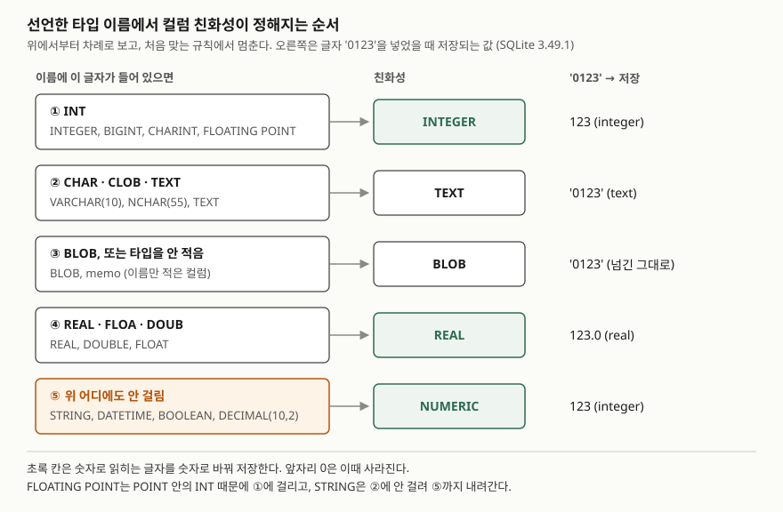

## 들어가며

다른 DB에서 쓰던 습관대로 고객 표의 우편번호 컬럼을 `STRING`으로 선언하고 CSV를 넣었다. 며칠 뒤
배송 라벨을 뽑아 보니 `06236`이 `6236`으로 찍혀 있다. 코드에서 값을 넘길 때 문자열로 넘긴 것은
분명하므로, 대개는 CSV 파일을 다시 열어 보고, 드라이버 설정을 뒤지고, 넣는 코드를 몇 번씩 고쳐
다시 넣어 본다. 수천 행을 넣었다 지우기를 반복해도 원인은 그쪽에 없다. 값을 바꾼 것은
**컬럼 선언**이고, 그 규칙은 다섯 줄이면 끝난다.

## 개념

- **저장 부류**(storage class): 값 하나가 실제로 어떤 종류로 저장됐는지다. `NULL`, `INTEGER`(정수),
  `REAL`(실수), `TEXT`(글자), `BLOB`(바이트 그대로) 다섯 가지다. `typeof(값)`이 이것을 돌려준다.
- **친화성**(type affinity): 컬럼이 "들어오는 값을 어느 부류로 바꿔 보려 하는가"다.
  `TEXT`, `NUMERIC`, `INTEGER`, `REAL`, `BLOB` 다섯 가지다.

대부분의 DB는 컬럼 타입이 곧 값의 타입이고, 맞지 않으면 거부한다. SQLite는 **타입이 컬럼이 아니라
값에 붙는다.** 컬럼 선언은 친화성을 정할 뿐이고, 바꿀 수 없는 값은 그대로 받아 둔다.
공식 문서는 이를 동적 타입이라 부르고, 다른 DB에서 쓰던 SQL이 그대로 돌아가게 하려는 설계라고 설명한다.

## 구조



> **출처**: 규칙 다섯 개와 순서는 [SQLite — Datatypes In SQLite §3.1 Determination Of Column Affinity](https://www.sqlite.org/datatype3.html#determination_of_column_affinity),
> 이름 예시와 FLOATING POINT·STRING의 친화성은 [§3.1.1 Affinity Name Examples](https://www.sqlite.org/datatype3.html#affinity_name_examples)를 따랐다.
> 오른쪽 칸의 값은 예제 출력 2-A다.

## 동작 원리

친화성은 선언 이름을 **글자 단위로** 훑어 정한다. `INT`가 들어 있으면 무조건 ①이므로
`FLOATING POINT`는 POINT 안의 INT 때문에 정수 친화성이 된다. `STRING`은 CHAR도 TEXT도
아니어서 ⑤의 `NUMERIC`까지 내려간다. 들어가며의 우편번호가 바뀐 이유가 이것이다.

값이 들어올 때 친화성마다 하는 일은 다르다.

- `TEXT`: 숫자가 들어오면 글자로 바꿔 저장한다.
- `NUMERIC`·`INTEGER`: 글자가 정수나 실수로 **온전히** 읽히면 숫자로 바꾼다. 실수라도 정수와 값이
  같으면 정수로 둔다. 16진수 `'0x1F'`나 쉼표가 낀 `'1,200'`은 읽히지 않으므로 글자로 남는다.
- `REAL`: `NUMERIC`과 같되 정수도 실수로 바꾼다.
- `BLOB`(타입을 안 적은 컬럼 포함): 아무것도 바꾸지 않는다.

비교할 때도 친화성이 작동한다. 한쪽이 숫자 친화성 컬럼이고 다른 쪽이 글자 상수면, 그 상수에
`NUMERIC`을 적용해 숫자로 바꿔 본 뒤 비교한다. `TEXT` 컬럼과 숫자 상수를 비교하면 상수를 글자로 바꾼다.
친화성이 없는 쪽끼리는 바꾸지 않고 그대로 비교한다.

## 실습 예제

메모리 SQLite에 고객 3명을 넣었다. 넣은 값은 모두 파이썬 문자열이고, `memo`의 2번 행만 정수 `10`이다.
전체 소스: [`code/dynamic_typing.py`](code/dynamic_typing.py), 실행 기록: [`code/output.txt`](code/output.txt)

```text
[customer]  3행
  컬럼     | 타입        | 제약
  ---------+-------------+-----
  id       | INTEGER     | PK
  name     | VARCHAR(20) |
  zip_code | STRING      |
  phone    | TEXT        |
  point    | INTEGER     |
  memo     | (타입 없음) |

  id | name   | zip_code | phone       | point | memo
  ---+--------+----------+-------------+-------+-----
   1 | 김도윤 |     6236 | 01012345678 | 1500  | VIP
   2 | 이서준 |     4524 | 01098765432 | 800   | 10
   3 | 박하은 |    13529 | 0215881234  | 1,200 | 10
```

`zip_code`에 `'06236'`을 넣었는데 `6236`이 남았다. 같은 글자를 `phone`(TEXT)에 넣은 것은 0이 그대로다.

### 같은 값, 다른 컬럼

```text
  ('input', 'TEXT', 'NUMERIC', 'INTEGER', 'REAL', 'BLOB')
  ("'007'", "'007'|text", '7|integer', '7|integer', '7.0|real', "'007'|text")
  ("'3.0e+5'", "'3.0e+5'|text", '300000|integer', '300000|integer', '300000.0|real', "'3.0e+5'|text")
  ("'0x1F'", "'0x1F'|text", "'0x1F'|text", "'0x1F'|text", "'0x1F'|text", "'0x1F'|text")
  ("'1,200'", "'1,200'|text", "'1,200'|text", "'1,200'|text", "'1,200'|text", "'1,200'|text")
  ('12.0', "'12.0'|text", '12|integer', '12|integer', '12.0|real', '12.0|real')
```

지수 표기 `'3.0e+5'`는 `NUMERIC` 컬럼에서 실수가 아니라 정수 300000이 됐다. 값이 정수와 같기 때문이다.

### 예상과 달랐던 결과 — 비교·정렬·합계

```text
[3-D phone(TEXT)과 숫자를 비교하면 숫자 쪽이 글자로 바뀐다]
  SELECT id, phone FROM customer WHERE phone = 01012345678
  ('id', 'phone')

[3-D2 숫자로 적은 01012345678 은 이미 앞자리 0이 없다]
  (1012345678, 'integer', '1012345678')

[3-E 정수와 글자가 섞인 point 를 큰 값부터 정렬하면]
  (3, "'1,200'", 'text')
  (1, '1500', 'integer')
  (2, '800', 'integer')

[3-F 합계에서 글자 '1,200'은 앞의 숫자 부분만 더해진다]
  ('total', 'total_type', 'cast_int')
  (2301.0, 'real', 1)
```

전화번호를 따옴표 없이 적으면 한 행도 안 나온다. 상수가 글자로 바뀌기 **전에** 숫자로 읽히면서 0이 이미 빠졌다.
정렬에서는 글자 `'1,200'`이 1500보다 위에 왔다. SQLite는 정렬할 때 값을 바꾸지 않고, 정수·실수를 모두
글자보다 작게 본다. 합계는 3500이 아니라 2301.0이었다. `'1,200'`이 앞의 `1`만 읽혀 더해졌고, 정수가 아닌
값이 섞였으므로 결과가 실수가 됐다. 에러는 어디에서도 나지 않았다.

### STRICT 표는 막는다

```text
  에러  CREATE TABLE probe_strict_bad (zip_code VARCHAR(5)) STRICT
        -> OperationalError: unknown datatype for probe_strict_bad.zip_code: "VARCHAR(5)"
  성공  INSERT INTO customer_strict VALUES (1, '06236', '1500', '10')
  성공  INSERT INTO customer_strict VALUES (2, 6236, 800, 10)
  에러  INSERT INTO customer_strict VALUES (3, '13529', '1,200', 10)
        -> IntegrityError: cannot store TEXT value in INTEGER column customer_strict.point
```

`STRICT`를 붙인 표는 타입 이름으로 `INT`·`INTEGER`·`REAL`·`TEXT`·`BLOB`·`ANY`만 받는다.
`'1500'`처럼 손실 없이 바뀌는 값은 바꿔 넣고, `'1,200'`처럼 안 바뀌는 값은 거부한다.
`TEXT` 컬럼의 `'06236'`은 0을 지킨 채 들어갔다.

## 실무에서 주의할 점

- **앞자리 0이 뜻을 갖는 값은 `TEXT`로 선언한다.** 우편번호·전화번호·사번 코드를 `STRING`·`NUMBER`로
  적으면 숫자 친화성이 붙어 0이 사라진다. 선언 이름이 ②에 걸리는지 확인한다.
- **비교할 때 상수의 모양을 컬럼에 맞춘다.** `TEXT` 컬럼은 `'010...'`처럼 따옴표로 비교한다.
  숫자로 적으면 앞자리 0이 리터럴 단계에서 사라진다.
- **집계 전에 `typeof()`로 섞인 값을 센다.** `GROUP BY typeof(point)`로 글자가 섞였는지 보면,
  에러 없이 틀린 합계를 막을 수 있다.
- **새 표라면 `STRICT`를 고려한다.** SQLite 3.37.0부터 쓸 수 있다. `VARCHAR(n)` 같은 이름은 쓸 수 없으므로
  다른 DB의 DDL을 옮길 때는 타입 이름을 바꿔야 한다.

## 정리

- SQLite의 타입은 값에 붙고, 컬럼 선언은 바꿔 볼 방향(친화성)만 정한다.
- 친화성은 선언 이름의 글자로 정해지며 INT → CHAR·CLOB·TEXT → BLOB·없음 → REAL·FLOA·DOUB → NUMERIC 순서로 본다.
- 숫자로 읽히지 않는 글자는 숫자 컬럼에도 글자로 남고, 비교·정렬·합계에서 에러 없이 다른 결과를 낸다.
- `STRICT` 표는 손실 없이 바뀌지 않는 값을 거부한다.

## 참고 자료

- [SQLite — Datatypes In SQLite](https://www.sqlite.org/datatype3.html) — [§2 Storage Classes](https://www.sqlite.org/datatype3.html#storage_classes_and_datatypes), [§3.1 Determination Of Column Affinity](https://www.sqlite.org/datatype3.html#determination_of_column_affinity), [§3.1.1 Affinity Name Examples](https://www.sqlite.org/datatype3.html#affinity_name_examples), [§4.1 Sort Order](https://www.sqlite.org/datatype3.html#sort_order), [§4.2 Type Conversions Prior To Comparison](https://www.sqlite.org/datatype3.html#type_conversions_prior_to_comparison)
- [SQLite — STRICT Tables](https://www.sqlite.org/stricttables.html) — 허용 타입 이름 여섯 개, 3.37.0에서 추가
- [SQLite — CAST expressions](https://www.sqlite.org/lang_expr.html#cast_expressions) — 글자를 정수로 바꿀 때 앞에서부터 읽히는 데까지만 쓴다
- [SQLite — Aggregate Functions: sum()](https://www.sqlite.org/lang_aggfunc.html#sumunc) — 정수가 아닌 입력이 섞이면 실수를 돌려준다
