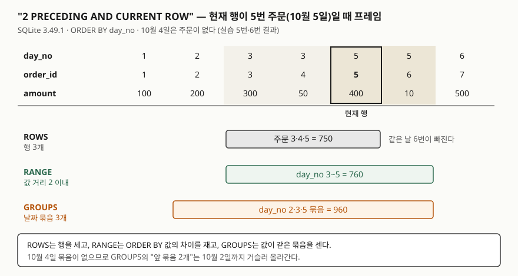

<!-- related:start -->
> **같은 기능을 다른 환경에서 다룬 글** (`window-function`)
> - [윈도우 함수 입문 — ROW_NUMBER로 그룹별 1등 뽑기](../2026-10-03-window-function-row-number-top-per-group/index.md) — SQLite 3.49.1, Python 3.13.5, Windows 11
> - [RANK와 DENSE_RANK — 동점을 어떻게 셀까](../2026-10-06-rank-dense-rank-ties/index.md) — SQLite 3.49.1, Python 3.13.5, Windows 11
> - [Tibero 7 분석 함수의 윈도우 절 — ROWS와 RANGE는 어디서 갈리는가](../../tibero/2026-09-23-tibero7-window-clause/index.md) — Tibero 7
<!-- related:end -->

## 들어가며

쇼핑몰 관리자 화면에 "일별 매출과 누적 매출" 표를 붙여 달라는 요청을 받았다고 하자. 흔히 하는 방법은 날짜순으로
주문을 읽어 와 파이썬에서 변수 하나에 금액을 더해 가며 칸을 채우는 것이다. 그러다 "최근 3일 이동평균"이 추가되면
리스트를 슬라이스해 평균을 내는 코드가 붙고, 지점별로 따로 보여 달라고 하면 지점이 바뀔 때마다 합계를 0으로
되돌리는 분기가 또 붙는다. 주문 1만 건이면 1만 건을 전부 애플리케이션으로 끌고 와야 하는 구조다.
SQL의 `SUM() OVER`는 이 계산을 질의 안에서 끝낸다. 대신 **어느 행까지 더할지**를 정하는 규칙을 알아야 한다.

## 개념

**윈도우 함수**는 행 수를 줄이지 않고, 각 행 옆에 "이 행과 관련된 행들"로 계산한 값을 붙인다. 순위 함수는
[ROW_NUMBER 글](../2026-10-03-window-function-row-number-top-per-group/index.md)과
[RANK 글](../2026-10-06-rank-dense-rank-ties/index.md)에서 다뤘다. 이번에는 `SUM`·`AVG`·`COUNT` 같은
**집계 함수**를 윈도우로 쓴다.

집계 함수를 윈도우로 쓰면 "관련된 행"의 범위가 중요해진다. 이 범위를 **프레임**(frame)이라고 한다.
현재 행을 기준으로 앞뒤 어디까지를 계산에 넣을지 정한 행 묶음이다.

```sql
SUM(amount) OVER (ORDER BY day_no
                  ROWS BETWEEN 2 PRECEDING AND CURRENT ROW)
--                ^^^^ 프레임 종류    ^^^^ 시작          ^^^^ 끝
```

| 프레임 종류 | 무엇을 세는가 | `2 PRECEDING`의 뜻 |
|---|---|---|
| `ROWS` | 행 하나하나 | 앞의 행 2개 |
| `RANGE` | `ORDER BY` 값의 차이 | 값이 현재 값 − 2 이상인 행 |
| `GROUPS` | `ORDER BY` 값이 같은 행 묶음 | 앞의 묶음 2개 |

`ORDER BY` 값이 같은 행을 SQLite 문서는 **피어**(peer)라고 부른다. 세 종류는 피어가 없고 값이 빠진 곳도 없으면
같은 결과를 낸다. 차이는 같은 날짜가 여러 행이거나, 중간에 날짜가 비어 있을 때 생긴다.

## 구조



> **출처**: [SQLite — Window Functions §2.2.1 Frame Type](https://www.sqlite.org/windowfunctions.html#frame_type)(ROWS·GROUPS·RANGE 정의), [§2.2.2 Frame Boundaries](https://www.sqlite.org/windowfunctions.html#frame_boundaries)(`<expr> PRECEDING`의 경계).
> 합계와 행 수는 실습 5번·6번의 실행 결과다.

## 동작 원리

**프레임을 안 적으면 `RANGE`다.** 문서는 `ORDER BY`가 있을 때의 기본 프레임을
`RANGE BETWEEN UNBOUNDED PRECEDING AND CURRENT ROW`로 정한다. `CURRENT ROW`가 `RANGE`에서는 "현재 행"이 아니라
"현재 행과 피어인 마지막 행까지"를 뜻한다. 그래서 같은 날짜 두 행은 그날 주문이 모두 더해진 같은 누적합을 받는다.

**`OVER ()`처럼 `ORDER BY`가 없으면** 모든 행이 서로 피어가 되어 프레임이 파티션 전체가 된다. 전체 합계를 각 행
옆에 붙여 비율을 낼 때 이 형태를 쓴다.

**`RANGE n PRECEDING`은 값으로 거리를 잰다.** 현재 행의 `ORDER BY` 값에서 n을 뺀 값 이상인 행부터 프레임이
시작한다. 그래서 정렬 키가 하나여야 하고(두 개면 뺄 값이 정해지지 않는다), 키가 숫자가 아니면 문서가 정한
다른 규칙이 적용된다. 이 규칙이 실습 9번에서 예상과 다른 결과를 냈다.

## 실습 예제

전체 소스: [`code/sum_over_frame.py`](code/sum_over_frame.py), 실행 기록: [`code/output.txt`](code/output.txt).
주문 7건이다. **10월 3일과 5일에 주문이 두 건씩 있고, 10월 4일에는 주문이 없다.** `day_no`는 10월의 일(日)이다.

```text
  order_id | order_date | day_no | amount
  ---------+------------+--------+-------
         1 | 2026-10-01 |      1 |    100
         2 | 2026-10-02 |      2 |    200
         3 | 2026-10-03 |      3 |    300
         4 | 2026-10-03 |      3 |     50
         5 | 2026-10-05 |      5 |    400
         6 | 2026-10-05 |      5 |     10
         7 | 2026-10-06 |      6 |    500
```

### 누적합 — RANGE와 ROWS

```text
-- 2. 기본 프레임을 풀어 쓴 것과 ROWS 로 바꾼 것을 나란히
   => order_id | order_date | amount | range_total | rows_total
      1 | 2026-10-01 | 100 | 100 | 100
      2 | 2026-10-02 | 200 | 300 | 300
      3 | 2026-10-03 | 300 | 650 | 600
      4 | 2026-10-03 | 50 | 650 | 650
      5 | 2026-10-05 | 400 | 1060 | 1050
      6 | 2026-10-05 | 10 | 1060 | 1060
      7 | 2026-10-06 | 500 | 1560 | 1560
```

`range_total`은 프레임을 안 적은 실습 1번과 값이 똑같다. 같은 날 두 행이 650, 1060으로 같은 값을 받는다.
`rows_total`은 한 행씩 더하므로 3번 주문에서 600이 된다. 600은 "10월 3일까지의 누적"도 "10월 2일까지의 누적"도
아닌 하루 중간값이다. 게다가 같은 날 두 행 중 어느 쪽이 먼저 더해질지는 `ORDER BY order_date`만으로 정해지지
않는다. 실습 3번처럼 `ORDER BY order_date, order_id`로 순서를 고정해야 매번 같은 값이 나온다.

### 최근 3일 — 세 값이 다 다르다

```text
-- 5. 최근 3일 이동평균 — 행 3개(ROWS) / 날짜 3일(RANGE) / 날짜 묶음 3개(GROUPS)
   => order_id | day_no | amount | rows_3 | range_3 | groups_3
      1 | 1 | 100 | 100 | 100 | 100
      2 | 2 | 200 | 300 | 300 | 300
      3 | 3 | 300 | 600 | 650 | 650
      4 | 3 | 50 | 550 | 650 | 650
      5 | 5 | 400 | 750 | 760 | 960
      6 | 5 | 10 | 460 | 760 | 960
      7 | 6 | 500 | 910 | 910 | 1260
```

5번 주문 줄을 읽으면 도식과 같다. `ROWS`는 바로 앞 두 행(3·4번)과 자신을 더해 750이다. 같은 날 6번 주문은
빠진다. `RANGE`는 `day_no`가 3~5인 행을 더해 760이다. 10월 4일은 행이 없으니 더할 것도 없다. `GROUPS`는
날짜 묶음을 세는데 4일 묶음이 없으므로, 앞 묶음 2개가 3일과 **2일**이 되어 960이 된다. "최근 3일"을 달력의
3일로 원하면 `RANGE`, 주문이 있었던 날 3개로 원하면 `GROUPS`다.

프레임에 들어간 행 수를 `COUNT(*)`로 세면(실습 6번) 7번 주문에서 `ROWS` 3, `RANGE` 3, `GROUPS` 5였다.
`AVG`로 이동평균을 내면(실습 7번) 첫 줄은 행이 1개뿐인데도 평균 100.0을 낸다. 모자란 행을 0으로 채우지
않고 있는 행만으로 나눈다.

### 예상과 달랐던 것 — 문자열 날짜에 RANGE를 걸면

`day_no` 대신 문자열 컬럼 `order_date`에 `RANGE BETWEEN 2 PRECEDING AND CURRENT ROW`를 걸었다. 문자열에서 2를
뺄 수 없으니 오류를 예상했는데, 질의가 그대로 돌았다.

```text
-- 9. RANGE n PRECEDING 에 문자열 날짜를 쓰면
   => order_id | order_date | range_3
      1 | 2026-10-01 | 100
      2 | 2026-10-02 | 200
      3 | 2026-10-03 | 350
      4 | 2026-10-03 | 350
      5 | 2026-10-05 | 410
      ...
```

값을 보면 앞 날짜가 하나도 더해지지 않았고 **같은 날짜끼리만** 더했다. 문서의 경계 규칙에 따르면 둘 중 하나라도
숫자가 아니면 시작 경계는 "현재 값과 같은 첫 행"이 된다. 결국 피어만 남는다. 오류가 나지 않으므로 결과를 눈으로
확인하지 않으면 "3일 합계"라고 믿고 하루치를 보게 된다.

반대로 오류가 나는 경우도 확인했다. 정렬 키를 두 개 주면 `RANGE with offset PRECEDING/FOLLOWING requires one
ORDER BY expression`(실습 8번), 끝 경계를 시작보다 앞에 두면(`CURRENT ROW AND 1 PRECEDING`)
`unsupported frame specification`(실습 10번)이 났다.

## 실무에서 주의할 점

- **누적합에는 동점 처리 기준을 넣는다.** 기본 프레임(`RANGE`)은 같은 날짜를 한꺼번에 더하고, `ROWS`는 하루
  중간값을 만든다. 어느 쪽이든 원하는 쪽을 정하고, `ROWS`라면 `ORDER BY`에 고유한 컬럼을 덧붙인다.
- **"최근 N일"과 "직전 N건"을 구분한다.** 날짜가 빠지는 데이터에서 `ROWS`·`GROUPS`는 더 먼 과거까지 가져온다.
  달력 기준이면 `RANGE`에 숫자 키를 쓴다.
- **`RANGE n PRECEDING`의 키가 숫자인지 확인한다.** 실습 9번처럼 문자열이면 오류 없이 피어만 더한다.
  날짜를 `TEXT`로 저장했다면 `julianday(order_date)`처럼 숫자로 바꾼 식을 정렬 키로 쓴다. 실습 12번에서
  이렇게 바꾸자 `range_3`이 실습 5번과 같은 100·300·650·650·760·760·910이 됐다.
- **이동평균의 첫 몇 줄은 표본이 적다.** `AVG`는 있는 행만으로 나누므로 첫 줄 평균은 1건짜리다.
  `COUNT(*) OVER (같은 프레임)`을 같이 뽑아 행 수가 모자란 줄을 걸러낸다.
- **`RANGE n PRECEDING`과 `GROUPS`는 SQLite 3.28.0(2019-04-16)에서 추가됐다.** 그보다 오래된 판이 붙은
  환경이면 버전부터 확인한다. 이 글은 3.49.1에서만 돌렸다.

## 다른 환경에서는

같은 `window-function` 키로 쓴 [Tibero 7 윈도우 절 글](../../tibero/2026-09-23-tibero7-window-clause/index.md)에서
Tibero 7.2도 `ORDER BY`만 쓰면 기본이 `RANGE BETWEEN UNBOUNDED PRECEDING AND CURRENT ROW`이고, 날짜가 빠진
데이터에서 `ROWS`와 `RANGE`의 `2 PRECEDING`이 다른 값을 낸다는 것을 실행으로 확인했다. 그 글에서는 `GROUPS`와
문자열 키에 `RANGE` 오프셋을 거는 경우를 시험하지 않았으므로, 이 두 가지는 SQLite 3.49.1의 결과로만 읽는다.

| 항목 | SQLite 3.49.1 (이 글) | Tibero 7.2 (윈도우 절 글) |
|---|---|---|
| `ORDER BY`만 쓸 때 기본 프레임 | `RANGE … CURRENT ROW` (실행 확인) | `RANGE … CURRENT ROW` (실행 확인) |
| `GROUPS` | 동작 (실습 5번) | 그 글에서 시험하지 않음 |

## 정리

- 집계 함수에 `OVER`를 붙이면 프레임 안의 행으로 계산한 값이 각 행에 붙는다.
- 프레임을 안 적으면 `RANGE … CURRENT ROW`라 같은 `ORDER BY` 값의 행은 같은 누적합을 받는다.
- `ROWS`는 행을, `RANGE`는 값의 거리를, `GROUPS`는 값이 같은 묶음을 센다. 동점이나 빈 날짜가 있으면 셋이 갈린다.
- `RANGE n PRECEDING`은 정렬 키가 하나이고 숫자여야 뜻대로 동작한다.

## 참고 자료

- [SQLite — Window Functions](https://www.sqlite.org/windowfunctions.html) — [§2.2 Frame Specifications](https://www.sqlite.org/windowfunctions.html#frame_specifications), [§2.2.1 Frame Type](https://www.sqlite.org/windowfunctions.html#frame_type), [§2.2.2 Frame Boundaries](https://www.sqlite.org/windowfunctions.html#frame_boundaries)
- [SQLite 3.28.0 Release Notes](https://www.sqlite.org/releaselog/3_28_0.html) — `GROUPS` 프레임, `RANGE`의 `<expr> PRECEDING/FOLLOWING`, `EXCLUDE` 절 추가 (2019-04-16)
- [SQLite — Date And Time Functions](https://www.sqlite.org/lang_datefunc.html) — `julianday()`
