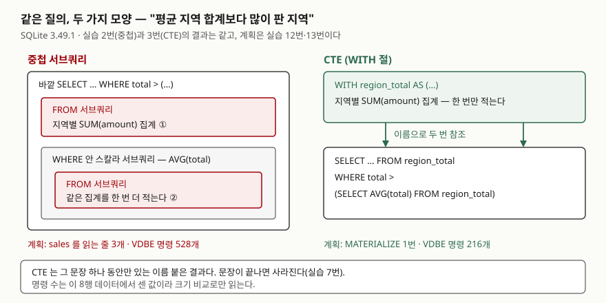

<!-- related:start -->
> **같은 기능을 다른 환경에서 다룬 글** (`cte`)
> - [Tibero 7 WITH 절 — 이름 붙인 부질의와 재귀 질의, SEARCH·CYCLE 절](../../tibero/2026-10-07-tibero7-with-clause-recursive-cte/index.md) — Tibero 7
<!-- related:end -->

## 들어가며

사내 대시보드에 "평균보다 많이 판 지역" 표를 붙이려고 질의를 짜다 보면, 지역별 합계를 내는 `SELECT`를
`FROM` 괄호 안에 한 번, 평균을 구하는 `WHERE` 괄호 안에 또 한 번 적게 된다. 처음엔 돌아가니 넘어가지만,
한 달 뒤 "취소 주문은 빼 달라"는 요청이 오면 똑같은 조건을 두 군데 고쳐야 하고 한 군데를 빠뜨리면 숫자가
조용히 어긋난다. 괄호가 세 겹이 되면 질의를 안쪽부터 거꾸로 읽어야 하고, 중간 결과를 확인하려면 괄호를
잘라 따로 붙여 넣어야 한다. `WITH` 절은 이 중간 결과에 이름을 붙여 위에서 아래로 읽히게 만든다.

## 개념

**CTE**(Common Table Expression, 공통 테이블 표현식)는 질의 맨 앞의 `WITH` 절에서 `SELECT` 결과에 이름을
붙인 것이다. 뒤따르는 본 질의는 그 이름을 테이블처럼 `FROM`에 쓴다.

```sql
WITH region_total AS (                 -- 이름 AS (질의)
    SELECT region, SUM(amount) AS total FROM sales GROUP BY region
)
SELECT region, total FROM region_total -- 테이블처럼 읽는다
WHERE total > (SELECT AVG(total) FROM region_total);
```

SQLite 문서는 CTE를 **그 문장 하나가 실행되는 동안만 있는 뷰**처럼 동작한다고 설명한다. 뷰(`CREATE VIEW`)는
데이터베이스에 저장되어 다른 문장에서도 쓰지만, CTE는 문장이 끝나면 이름이 사라진다.
[인라인 뷰(FROM 절 서브쿼리)](../2026-09-23-subquery-scalar-inline-correlated/index.md)와 하는 일은 같고,
다른 점은 **이름이 있다는 것** 하나다. 이름이 있으니 두 번 부를 수 있고, 앞에서 만든 것을 뒤에서 이어 쓸 수 있다.

`WITH`는 `SELECT`뿐 아니라 `INSERT`·`UPDATE`·`DELETE` 앞에도 붙일 수 있다. 자기 자신을 부르는 재귀 CTE도
있지만 이 글은 재귀하지 않는 보통 CTE만 다룬다.

## 구조



> **출처**: [SQLite — The WITH Clause §2 Ordinary Common Table Expressions](https://www.sqlite.org/lang_with.html#ordinary_common_table_expressions)(문장 하나 동안의 뷰).
> 계획의 줄 수와 VDBE 명령 수는 실습 12번·13번의 실행 결과다.

## 동작 원리

CTE를 쓰면 SQLite가 그 결과를 따로 만들어 두는지, 아니면 서브쿼리처럼 본 질의 안에 풀어 넣는지가 궁금해진다.
문서는 **힌트가 없으면 SQLite가 더 낫다고 보는 쪽을 고른다**고만 적고 규칙을 약속하지 않는다.
그래서 실행계획(`EXPLAIN QUERY PLAN`)으로 실제 선택을 봤다.

- **한 번만 쓰는 CTE는 풀어 넣었다.** 실습 10번의 계획에 CTE 이름이 아예 없고, 바깥 `WHERE region = '서울'`이
  `sales`의 인덱스 탐색(`SEARCH … USING INDEX`)으로 바뀌었다. 문서가 말하는 **쿼리 평탄화**(flattening)다.
- **두 번 쓰는 CTE는 한 번 만들어 두 번 읽었다.** 실습 12번의 계획에 `MATERIALIZE region_total`이 한 줄 있고,
  본 질의와 스칼라 서브쿼리가 둘 다 `SCAN region_total`로 그것을 읽는다. 이 임시 결과를 **구체화**(materialize)라고 한다.

`AS` 뒤에 `MATERIALIZED`나 `NOT MATERIALIZED`를 붙여 이 선택을 강제할 수 있다(SQLite 3.35.0부터). 문서는
`MATERIALIZED`를 붙이면 **평탄화와 푸시다운 최적화의 기회를 잃는다**고 적고, 강한 이유가 없으면 힌트를 쓰지 말라고 권한다.
위의 두 관찰은 3.49.1에서 이 데이터로 본 결과이고, 문서가 보장한 동작은 아니다.

## 실습 예제

전체 소스: [`code/cte_basics.py`](code/cte_basics.py), 실행 기록: [`code/output.txt`](code/output.txt).
영업 실적 8건이고 `region` 컬럼에 인덱스가 있다.

```text
  sale_id | seller | region | amount
  --------+--------+--------+-------
        1 | 김하나 | 서울   |    300
        2 | 이두리 | 서울   |    250
        3 | 박세나 | 서울   |    150
        4 | 최네오 | 부산   |    400
        5 | 정다섯 | 부산   |    100
        6 | 한여섯 | 대구   |    120
        7 | 윤일곱 | 대구   |     80
        8 | 조여덟 | 광주   |    500
```

지역 합계는 서울 700, 광주 500, 부산 500, 대구 200이고 평균은 475다.

### 중첩 서브쿼리를 CTE로 펴기

실습 2번(중첩)과 3번(CTE)은 둘 다 아래 3행을 냈다. 결과는 같고, CTE 쪽은 집계를 한 번만 적었다.

```text
   => region | total
      서울 | 700
      광주 | 500
      부산 | 500
```

CTE는 쉼표로 이어 여러 개를 둘 수 있고, 뒤의 CTE가 앞의 CTE를 읽는다. 실습 4번은 평균을 `avg_total`이라는
두 번째 CTE로 뺐다. 이렇게 단계를 나눠 두면 **마지막 `SELECT`만 바꿔 중간 단계를 확인할 수 있다.** 실습 6번은
본 질의를 `SELECT avg_value FROM avg_total`로 바꿔 평균 475.0을 바로 찍었다. 중첩 서브쿼리였다면 괄호를
잘라 내야 하는 일이다.

CTE 이름 뒤에 괄호로 컬럼 이름을 줄 수도 있다(실습 5번). 안쪽 `SELECT`에 별칭이 없어도 바깥에서
`region_name`, `sum_amount`로 부른다. 개수가 다르면 `table region_total has 3 values for 2 columns`
오류가 났다(실습 9번).

### 계획으로 본 차이 — 두 번 쓰는 경우

같은 질의를 행 수로 바꿔 계획을 찍었다.

```text
-- 13. 중첩 서브쿼리
   QUERY PLAN
   |--CO-ROUTINE (subquery-1)
   |  |--SCAN sales USING INDEX idx_sales_region
   |  `--SCALAR SUBQUERY 3
   |     |--CO-ROUTINE (subquery-2)
   |     |  `--SCAN sales USING INDEX idx_sales_region
   |     `--SCAN (subquery-2)
   |--SCAN (subquery-1)
   `--SCALAR SUBQUERY 3
      |--CO-ROUTINE (subquery-2)
      |  `--SCAN sales USING INDEX idx_sales_region
      `--SCAN (subquery-2)
   결과 [(3,)] / VDBE 명령 528개

-- 12. 두 번 쓰는 CTE — 힌트 없음
   QUERY PLAN
   |--MATERIALIZE region_total
   |  `--SCAN sales USING INDEX idx_sales_region
   |--SCAN region_total
   `--SCALAR SUBQUERY 2
      `--SCAN region_total
   결과 [(3,)] / VDBE 명령 216개
```

중첩 쪽은 `sales`를 읽는 줄이 세 번 나온다. 바깥 `WHERE`의 스칼라 서브쿼리가 첫 서브쿼리 안에도 들어가
있는데, 문서가 설명하는 **푸시다운**(바깥 `WHERE` 조건을 서브쿼리 안으로 내려보내는 최적화)으로 보인다.
CTE 쪽은 집계를 한 번 만들어 두 번 읽었다. SQLite는 실행 비용을 찍지 않으므로 실제로 실행된 가상 머신(VDBE)
명령 수를 셌고, 528개와 216개였다. 8행짜리 데이터의 숫자라 크기만 비교한다.

### 예상과 달랐던 것 — MATERIALIZED는 인덱스를 막는다

한 번만 쓰는 CTE에 `MATERIALIZED`를 붙이면 "미리 만들어 두니 빠르겠다"는 생각이 들기 쉽다. 결과는 반대였다.

```text
-- 10. 힌트 없음
   QUERY PLAN
   `--SEARCH sales USING INDEX idx_sales_region (region=?)
   결과 [(700,)] / VDBE 명령 27개

-- 11. MATERIALIZED
   QUERY PLAN
   |--MATERIALIZE all_sales
   |  `--SCAN sales
   `--SCAN all_sales
   결과 [(700,)] / VDBE 명령 105개
```

힌트가 없을 때는 `WHERE region = '서울'`이 안쪽 `sales`까지 내려가 서울 3행만 인덱스로 찾았다. `MATERIALIZED`를
붙이자 `sales` 8행을 전부 임시 결과로 복사한 뒤 그것을 처음부터 훑었다. 임시 결과에는 인덱스가 없다.

### 문장 범위와 이름 가리기

CTE는 그 문장이 끝나면 없다. 다음 문장에서 `SELECT * FROM region_total`을 부르자
`no such table: region_total`이 났다(실습 7번).

실제 테이블과 같은 이름을 CTE에 붙이면 그 문장 안에서는 CTE가 테이블을 가린다. 실습 8번은 `WITH sales AS
(1행짜리 가짜 데이터)`를 두고 `SELECT COUNT(*) FROM sales`를 돌렸는데, 오류 없이 `1`을 냈다. 진짜
`sales`는 8행이다.

## 실무에서 주의할 점

- **같은 서브쿼리를 두 번 이상 적고 있으면 CTE로 뺀다.** 조건을 고칠 때 한 군데만 고치면 된다. 실습 12·13번처럼
  집계를 한 번만 하는 계획이 나올 수도 있지만, 그건 엔진이 고른 결과이지 약속이 아니다.
- **`MATERIALIZED`를 성능 힌트로 습관처럼 붙이지 않는다.** 실습 11번처럼 바깥 조건이 인덱스로 내려가지 못한다.
  붙이기 전후로 `EXPLAIN QUERY PLAN`을 찍어 `SEARCH`가 `SCAN`으로 바뀌지 않는지 본다.
  이 힌트는 SQLite 3.35.0(2021-03-12)부터 쓸 수 있다.
- **CTE 이름을 테이블 이름과 겹치지 않게 짓는다.** 오류가 나지 않고 결과만 달라진다(실습 8번). 접두어를 붙이거나
  `region_total`처럼 무엇을 담는지 드러나는 이름을 쓴다.
- **CTE는 저장되지 않는다.** 여러 질의가 같은 중간 결과를 쓰면 문장마다 다시 만든다. 그럴 때는 뷰나 임시 테이블이 맞다.
- **`WITH`의 위치가 정해져 있다.** 문서에 따르면 최상위 `SELECT`나 서브쿼리의 맨 앞에만 올 수 있고,
  `UNION`으로 이은 두 번째 이후 `SELECT` 앞에는 붙일 수 없다. 트리거 안에서도 쓸 수 없다.

## 정리

- CTE는 `WITH 이름 AS (질의)`로 중간 결과에 이름을 붙인 것이고, 그 문장 하나 동안만 존재한다.
- 이름이 있으니 같은 결과를 두 번 부르고, 앞의 CTE를 뒤에서 이어 쓰고, 마지막 `SELECT`만 바꿔 중간 단계를 볼 수 있다.
- SQLite 3.49.1은 한 번 쓰는 CTE를 풀어 넣고, 두 번 쓰는 CTE는 한 번 만들어 두 번 읽었다.
- `MATERIALIZED`로 굳히면 바깥 조건이 안으로 내려가지 못해 인덱스를 잃을 수 있다.

## 참고 자료

- [SQLite — The WITH Clause](https://www.sqlite.org/lang_with.html) — [§2 Ordinary Common Table Expressions](https://www.sqlite.org/lang_with.html#ordinary_common_table_expressions), [Materialization Hints](https://www.sqlite.org/lang_with.html#materialization_hints), [Limitations And Caveats](https://www.sqlite.org/lang_with.html#limitations_and_caveats)
- [SQLite — The SQLite Query Optimizer Overview](https://www.sqlite.org/optoverview.html) — [Query Flattening](https://www.sqlite.org/optoverview.html#flattening), [The Push-Down Optimization](https://www.sqlite.org/optoverview.html#pushdown)- [SQLite — EXPLAIN QUERY PLAN](https://www.sqlite.org/eqp.html)
