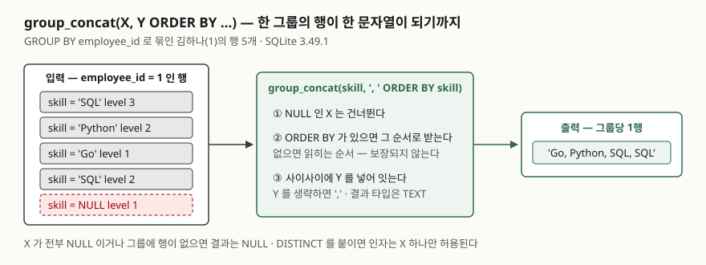

## 들어가며

사내 관리자 화면에 직원 목록을 띄우는데, 기획자가 "보유 기술도 옆 칸에 쉼표로 이어서 보여 달라"고 한다.
기술은 직원 한 명에 여러 행이 들어 있는 별도 표다. 처음에는 직원 목록을 한 번 조회하고, 화면에 그릴 때
직원마다 기술 표를 다시 조회해 코드에서 쉼표로 잇는다. 직원이 5명이면 질의가 6번, 500명이면 501번 나간다.
페이지를 한 번 열 때마다 DB를 501번 왕복하는 셈이고, 목록이 느려지는 이유를 찾다 보면 이 반복문이 나온다.
여러 행을 한 줄로 합치는 일은 집계 함수 하나가 한다.

## 개념

`group_concat(X)`는 **집계 함수**다. `SUM`이 그룹의 숫자를 더해 하나로 만들듯, `group_concat`은 그룹의
문자열을 이어 붙여 하나로 만든다. 집계 함수이므로 `GROUP BY`와 같이 쓰고, 그룹마다 결과 한 행이 나온다.

```sql
SELECT e.name, group_concat(s.skill, ', ' ORDER BY s.skill) AS skills
FROM employee AS e
JOIN employee_skill AS s ON s.employee_id = e.employee_id
GROUP BY e.employee_id;
```

SQLite 문서는 이 함수를 세 가지 모양으로 적는다. `group_concat(X)`는 `X`의 NULL이 아닌 값을 전부 이은
문자열을 돌려주고, 구분자는 쉼표다. `group_concat(X, Y)`는 `Y`를 구분자로 쓴다. `string_agg(X, Y)`는
`group_concat(X, Y)`의 **다른 이름**이다. 문서는 `string_agg()`가 PostgreSQL·SQL Server와, `group_concat()`이
MySQL과 호환되는 이름이라고 적는다. 어느 이름을 쓰든 같은 함수다.

이어 붙이는 **순서는 임의**다. 문서는 마지막 인자 뒤에 `ORDER BY`를 붙이지 않으면 순서가 정해지지 않고
실행마다 달라질 수 있다고 적는다. 집계 함수 인자 안에 `ORDER BY`를 쓰는 문법은 SQLite 3.44.0(2023-11-01)에서
들어왔고, `string_agg()` 이름도 같은 판에서 추가됐다. 그보다 오래된 SQLite에서는 둘 다 문법 오류다.

## 구조



> **출처**: [SQLite — Built-in Aggregate Functions §3 group_concat()](https://www.sqlite.org/lang_aggfunc.html#group_concat)(NULL 제외, 기본 구분자, 순서는 임의),
> [같은 문서 — ORDER BY Clause in Aggregate Functions](https://www.sqlite.org/lang_aggfunc.html#aggorderby)(인자 처리 순서).
> 그림의 입력·출력 값은 실습 5번·7번의 실행 결과다.

## 동작 원리

집계 함수는 그룹의 행을 **한 행씩 받아** 중간 상태를 갱신하고, 그룹이 끝나면 최종값을 낸다. `group_concat`의
중간 상태는 지금까지 이은 문자열이고, 새 행이 오면 구분자와 값을 뒤에 덧붙인다. 그래서 세 가지가 따라 나온다.

- **받는 순서가 곧 문자열의 순서다.** 함수 안에 `ORDER BY`가 없으면 엔진이 행을 읽어 넘기는 순서를 그대로 받는다.
  그 순서는 테이블을 훑는 순서일 수도, 인덱스 순서일 수도 있다. 실습 9번이 이것을 보인다.
- **바깥 `ORDER BY`는 결과 행의 순서만 정한다.** 집계가 끝난 뒤에 적용되므로 문자열 안의 순서에는 손을 대지
  못한다(실습 4번).
- **구분자는 값과 값 사이에만 들어간다.** 첫 값 앞이나 마지막 값 뒤에는 붙지 않는다. NULL은 받는 단계에서
  건너뛰므로 구분자도 남지 않는다.

## 실습 예제

전체 소스: [`code/group_concat_basics.py`](code/group_concat_basics.py), 실행 기록: [`code/output.txt`](code/output.txt).
직원 5명과 보유 기술 11행이다. 김하나(1)는 `SQL`이 두 번 들어 있고, 최네오(4)는 기술 이름이 비어 있는
행이 하나 있고, 정다섯(5)은 기술 행이 없다.

```text
  employee_id | skill  | level
  ------------+--------+------
            1 | SQL    |     3
            1 | Python |     2
            1 | Go     |     1
            1 | SQL    |     2
            2 | Java   |     3
            2 | SQL    |     2
            3 | Python |     3
            3 | Spark  |     2
            3 | SQL    |     3
            4 | React  |     2
            4 | NULL   |     1
```

### 직원마다 질의 vs 한 번의 집계

실습 1번은 들어가며의 방식 그대로다. 직원 목록 1번과 직원마다 1번씩, 질의가 6번 나갔다. 실습 2번은
`group_concat(s.skill)` 하나로 같은 결과를 한 번에 냈다.

```text
-- 2. group_concat 기본 — 구분자를 안 주면 쉼표
   => name | skills
      김하나 | SQL,Python,Go,SQL
      이두리 | Java,SQL
      박세나 | Python,Spark,SQL
      최네오 | React
```

두 번째 인자를 주면 그것이 구분자다(실습 3번, `' / '`). 최네오의 `NULL` 행은 결과에 흔적이 없다.

### 순서 — 바깥 ORDER BY와 안쪽 ORDER BY

실습 4번은 바깥에 `ORDER BY s.skill`을 뒀다. 결과 행의 순서는 바뀌었지만 김하나의 문자열은 여전히
`SQL, Python, Go, SQL`이다. 실습 5번에서 함수 안에 `ORDER BY`를 넣자 문자열 안이 정렬됐다.

```text
-- 5. 함수 안의 ORDER BY 가 문자열 안의 순서를 정한다 (SQLite 3.44.0+)
   => name | by_name | by_level
      김하나 | Go, Python, SQL, SQL | SQL, Python, SQL, Go
      이두리 | Java, SQL | Java, SQL
      박세나 | Python, SQL, Spark | Python, SQL, Spark
```

`by_level`은 `ORDER BY s.level DESC, s.skill`이다. 레벨 3인 `SQL`이 앞에, 레벨 2인 `Python`과 `SQL`이
이름순으로, 레벨 1인 `Go`가 뒤에 왔다. 같은 레벨끼리의 순서를 정하지 않으면 그 안은 다시 임의다.

### 예상과 달랐던 것 — 인덱스 하나에 순서가 뒤집힌다

`ORDER BY`를 빼면 "그래도 넣은 순서대로 나오겠지"라고 생각하기 쉽다. 실습 9번은 박세나(3)의 기술을
`ORDER BY` 없이 합친 뒤, `(employee_id, skill DESC)` 인덱스를 만들고 **같은 질의**를 다시 돌렸다.

```text
-- 9-A. ORDER BY 없이 — 인덱스가 없을 때
      3 | Python,Spark,SQL
-- 9-B. 같은 질의 — (employee_id, skill DESC) 인덱스를 만든 뒤
      3 | Spark,SQL,Python
-- 9-C. 계획
   QUERY PLAN
   `--SEARCH employee_skill USING COVERING INDEX idx_skill_employee_skill_desc (employee_id=?)
```

질의는 한 글자도 바뀌지 않았는데 문자열이 달라졌다. 인덱스가 생기자 엔진이 인덱스 순서(`skill` 내림차순)로
행을 읽어 넘겼기 때문이다. 문서가 "임의"라고 적은 것은 이런 뜻이다. 화면에 보여 줄 순서가 있다면 함수 안에
`ORDER BY`를 반드시 적는다.

### NULL, DISTINCT, 결과 타입

실습 7번은 `LEFT JOIN`으로 기술이 없는 정다섯(5)까지 넣었다. 기술 행이 0개인 그룹의 `group_concat`은 `NULL`이고,
`COALESCE(..., '(없음)')`으로 화면용 값을 만들었다. 최네오는 `NULL` 행이 하나 있어도 `React`만 나왔다.

중복은 `DISTINCT`로 걷어 낸다(실습 8-A, `SQL,Python,Go`). 그런데 `group_concat(DISTINCT s.skill, ' / ')`처럼
구분자를 같이 주자 `DISTINCT aggregates must have exactly one argument` 에러가 났다(8-B). `DISTINCT`를 붙이면
인자는 하나만 허용된다. 구분자와 정렬이 같이 필요하면 서브쿼리에서 `SELECT DISTINCT`로 먼저 지운 뒤 합친다(8-C).

숫자 컬럼을 합치면 결과는 `TEXT`다(실습 10번, `3,2,2,1`에 `typeof`가 `text`). 합친 뒤에는 숫자 연산을 할 수 없다.

### 길이 상한과 되돌릴 수 없는 합치기

SQLite에서 문자열 하나의 최대 길이는 컴파일 상수 `SQLITE_MAX_LENGTH`가 정하고 기본값은 10억 바이트다.
실행 중에 `sqlite3_limit()`으로 낮출 수 있어서, 실습 11번은 상한을 60바이트로 낮추고 긴 문자열을 만들어 봤다.

```text
-- 11-A. 상한 안에 드는 길이
      58
-- 11-B. 행마다 50글자를 붙여 상한을 넘기면
   에러: string or blob too big
```

결과가 잘려서 나오지 않고 **에러가 난다.** 이 점은 다른 엔진과 다르다. MySQL 8.0 매뉴얼은 `GROUP_CONCAT`의
결과가 `group_concat_max_len` 시스템 변수(기본 1024)까지 **잘린다**고 적는다. 실행 검증 없이 매뉴얼만 옮긴
것이지만, 같은 함수 이름이 한쪽에서는 에러를 내고 한쪽에서는 조용히 자른다는 차이는 알고 있어야 한다.

마지막으로 실습 12번은 값 안에 구분자가 들어 있는 경우다. `C, C++`이라는 기술을 넣고 `', '`로 합치자
`C, C++, Java, SQL`이 됐다. 쉼표로 되나누면 네 조각이 되어 원래 세 값으로 돌아갈 수 없다. 합친 결과를 다시
나눠 쓸 것이면 `json_group_array`를 쓴다. `["C, C++","Java","SQL"]`이 나오고 `json_each`로 세 요소가 그대로 돌아왔다.

## 실무에서 주의할 점

- **화면에 보일 순서가 있으면 함수 안에 `ORDER BY`를 적는다.** 바깥 `ORDER BY`는 소용없고(4번), 인덱스 하나에
  순서가 바뀐다(9번). 3.44.0보다 오래된 SQLite라면 서브쿼리에서 정렬한 뒤 합치는 방법이 있지만 그것도 보장은 아니다.
- **`DISTINCT`와 구분자는 같이 못 쓴다.** 둘 다 필요하면 서브쿼리에서 중복을 먼저 지운다(8-C).
- **합친 문자열을 다시 나누지 않는다.** 값 안에 구분자가 있으면 되돌릴 수 없다(12-A). 표시용이면 `group_concat`,
  데이터로 다시 쓸 것이면 `json_group_array`나 아예 합치지 않는 쪽이 맞다.
- **길이 상한의 동작이 엔진마다 다르다.** SQLite는 에러, MySQL은 잘림이다. 긴 목록을 합칠 때 결과 길이를
  `length()`로 한 번 확인한다.
- **기술이 없는 쪽을 보여 주려면 `LEFT JOIN`이다.** `JOIN`이면 정다섯 행 자체가 사라진다(2번에는 4행, 7번에는 5행).

## 정리

- `group_concat(X, Y ORDER BY …)`는 그룹의 NULL이 아닌 값을 `Y`로 이어 한 문자열을 만든다. `string_agg`는 같은 함수다.
- 순서는 함수 안의 `ORDER BY`가 정한다. 없으면 임의이고, 인덱스 하나로 뒤집히는 것을 봤다.
- `DISTINCT`를 붙이면 인자는 하나뿐이다. 결과는 `TEXT`이고 길이 상한을 넘으면 SQLite는 에러를 낸다.
- 되돌려 쓸 값이면 `json_group_array`를 쓴다. 값 안의 구분자는 합친 뒤 구분할 수 없다.

## 참고 자료

- [SQLite — Built-in Aggregate Functions](https://www.sqlite.org/lang_aggfunc.html) — [§3 group_concat() · string_agg()](https://www.sqlite.org/lang_aggfunc.html#group_concat), [ORDER BY Clause in Aggregate Functions](https://www.sqlite.org/lang_aggfunc.html#aggorderby)
- [SQLite Release 3.44.0 (2023-11-01)](https://www.sqlite.org/releaselog/3_44_0.html) — 집계 함수의 `ORDER BY`, `string_agg()` 추가
- [SQLite — Limits In SQLite §2 Maximum length of a string or BLOB](https://www.sqlite.org/limits.html) — `SQLITE_MAX_LENGTH` 기본 10억 바이트, `sqlite3_limit()`
- [SQLite — JSON Functions: json_group_array()](https://www.sqlite.org/json1.html#jgrouparray)
- [MySQL 8.0 Reference Manual — GROUP_CONCAT()](https://dev.mysql.com/doc/refman/8.0/en/aggregate-functions.html#function_group-concat) — `group_concat_max_len` 기본 1024, 잘림 (실행 검증 없음)
