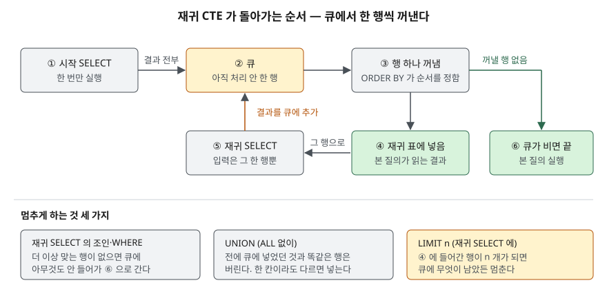

<!-- related:start -->
> **같은 기능을 다른 환경에서 다룬 글** (`hierarchical-query`)
> - [Tibero 7 계층 질의 — CONNECT BY와 순환 참조](../../tibero/2026-09-22-tibero7-connect-by-hierarchy/index.md) — Tibero 7
<!-- related:end -->

## 들어가며

사내 결재 시스템에 "내 아래 전원에게 공지"를 붙이려고 직원 표를 열어 보면, 상사가 누구인지는 `manager_id`
컬럼 하나에만 적혀 있다. 그래서 처음엔 직속 부하를 조회하고, 그 결과로 다시 부하의 부하를 조회하는 코드를
짠다. 4단계 조직이면 질의가 4번 오가고, 조직 개편으로 5단계가 되면 코드를 고쳐야 한다. SQL 안에서 풀어
보려고 자기 조인을 세 번 적어 봐도 마찬가지다. 조인을 적은 횟수까지만 내려간다. 깊이를 모르는 구조를 한
질의로 훑는 문법이 재귀 CTE다.

## 개념

**CTE**(Common Table Expression)는 `WITH` 절에서 질의 결과에 이름을 붙인 것이다. 재귀하지 않는 보통 CTE는
[WITH 절 — 질의에 이름을 붙이는 법](../2026-10-07-cte-with-clause/index.md)에서 다뤘다. **재귀 CTE**는 그
이름을 **자기 자신의 정의 안에서 다시 부르는** CTE다. 모양이 정해져 있다.

```sql
WITH RECURSIVE 이름(컬럼, ...) AS (
    시작 SELECT                 -- 재귀 표를 참조하지 않는다
    UNION ALL                   -- 또는 UNION
    재귀 SELECT                 -- FROM 에 '이름' 이 딱 한 번 나온다
)
SELECT ... FROM 이름;
```

- **시작 SELECT**: 출발점이 되는 행을 만든다. 조직도라면 사장 한 명, 또는 특정 본부장 한 명이다.
- **재귀 SELECT**: 직전에 만들어진 행을 입력으로 받아 다음 행을 만든다. 조직도라면 "이 사람을 상사로 둔 직원"이다.
- 둘을 `UNION ALL`이나 `UNION`으로 잇는다. 어느 쪽을 쓰느냐가 뒤에서 멈추는 조건을 가른다.

SQLite는 3.8.3(2014-02-03)에서 CTE와 `WITH` 절을 넣었다.

## 구조



> **출처**: [SQLite — The WITH Clause §3 Recursive Common Table Expressions](https://www.sqlite.org/lang_with.html#recursive_common_table_expressions)의
> 실행 절차(큐에 넣고, 하나 꺼내 재귀 표에 넣고, 그 행으로 재귀 SELECT를 돌린다), `UNION`의 중복 처리, `ORDER BY`·`LIMIT`의 역할을 그대로 옮겼다.

## 동작 원리

문서가 적은 절차는 짧다. 시작 SELECT를 돌려 결과를 **큐**에 넣는다. 큐가 빌 때까지 **행 하나**를 꺼내 재귀 표에
넣고, **그 한 행만 재귀 표에 있는 것처럼** 재귀 SELECT를 돌려 나온 행을 전부 큐에 넣는다. 이 절차에서 세 가지가 따라 나온다.

- **꺼내는 순서는 재귀 SELECT의 `ORDER BY`가 정한다.** 깊이 오름차순이면 같은 깊이를 다 처리한 뒤 다음 깊이로
  가는 너비 우선, 내림차순이면 한 가지를 끝까지 내려가는 깊이 우선이 된다. `ORDER BY`가 없으면 순서가 정해지지
  않는다. 문서는 현재 구현이 FIFO라고만 적는다.
- **`UNION`은 전에 큐에 넣었던 것과 똑같은 행을 버린다.** 이미 꺼낸 행이라도 같다. `UNION ALL`은 전부 넣는다.
  "똑같은"은 모든 컬럼이 같다는 뜻이라, 한 칸이라도 다르면 새 행이다.
- **`LIMIT`은 재귀 표에 들어간 행 수의 상한이다.** 상한에 닿으면 큐에 무엇이 남았든 멈춘다. 문서는 재귀의
  크기를 안다면 안전장치로 항상 `LIMIT`을 두라고 권한다.

## 실습 예제

직원 9명, 4단계 조직이다. 전체 소스: [`code/recursive_cte.py`](code/recursive_cte.py), 실행 기록: [`code/output.txt`](code/output.txt)

```text
  id | name   | title      | manager_id
  ---+--------+------------+-----------
   1 | 김대표 | 사장       |       NULL
   2 | 이본부 | 개발본부장 |          1
   3 | 박본부 | 영업본부장 |          1
   4 | 최팀장 | 플랫폼팀장 |          2
   5 | 정팀장 | 데이터팀장 |          2
   6 | 한사원 | 플랫폼팀   |          4
   7 | 오사원 | 플랫폼팀   |          4
   8 | 서사원 | 데이터팀   |          5
   9 | 윤사원 | 영업1팀    |          3
```

### 아래로 내려가기

```text
[2-A 개발본부장(2) 아래 전원, level 은 2 를 1 로 둔 깊이]
  ('level', 'id', 'name', 'title')
  (1, 2, '이본부', '개발본부장')
  (2, 5, '정팀장', '데이터팀장')
  (2, 4, '최팀장', '플랫폼팀장')
  (3, 8, '서사원', '데이터팀')
  (3, 7, '오사원', '플랫폼팀')
  (3, 6, '한사원', '플랫폼팀')
```

자기 조인(1-A·1-B)은 조인 한 번에 한 단계였다. 재귀 CTE는 시작 SELECT에 `WHERE id = 2`를, 재귀 SELECT에
`JOIN subordinate AS s ON e.manager_id = s.id`를 적으면 깊이와 상관없이 5명이 다 나온다. `level`은 시작 행을
1로 두고 재귀마다 `s.level + 1`로 늘린 값이다.

방향을 바꾸는 것은 조인 조건 하나다. `ON e.id = c.manager_id`로 적으면 한사원(6)에서 사장까지 **위로** 올라간다(3-A).
경로 문자열은 재귀마다 `o.path || ' > ' || e.name`으로 이어 붙여 `김대표 > 이본부 > 최팀장 > 한사원`처럼 만들었다(4-A).

### 꺼내는 순서

```text
[5-B ORDER BY o.level + 1 — 너비 우선]      [5-C ORDER BY o.level + 1 DESC — 깊이 우선]
  (1, '김대표')                               (1, '김대표')
  (2, '박본부')                               (2, '박본부')
  (2, '이본부')                               (3, '윤사원')
  (3, '윤사원')                               (2, '이본부')
  (3, '정팀장')                               (3, '정팀장')
  (3, '최팀장')                               (4, '서사원')
  (4, '서사원')                               (3, '최팀장')
  (4, '오사원')                               (4, '오사원')
  (4, '한사원')                               (4, '한사원')
```

재귀 SELECT 끝의 `ORDER BY` 하나로 같은 데이터가 두 모양으로 나온다. 깊이 우선 쪽이 조직도를 들여쓰기로 찍을 때의
순서다. `ORDER BY`를 뺀 5-A는 5-B와 같았지만, 문서가 보장하는 순서가 아니므로 기대고 쓰지 않는다.

실행계획(6)에는 `CO-ROUTINE subordinate` 아래 `SETUP`과 `RECURSIVE STEP`이 따로 보인다. 재귀 단계에서 SQLite는
`manager_id`에 **자동 인덱스**(`AUTOMATIC COVERING INDEX`)를 만들어 썼다. 큐에서 꺼낸 행마다 부하를 찾는 조회가
반복되므로, 실제 표라면 `manager_id` 인덱스를 미리 만들어 두는 편이 낫다.

### 종료 조건을 빠뜨리면

```text
[8-A WHERE 없는 숫자 생성 — 끝나지 않아서 끊었다]
  -> OperationalError: interrupted  (VDBE 명령 200,000개에서 끊음)

[8-B 같은 질의에 LIMIT 10 — 재귀가 멈춘다]
  행 10개, VDBE 명령 179개 만에 끝남
```

`SELECT x + 1 FROM cnt`처럼 재귀 SELECT가 항상 새 행을 만들면 큐가 비지 않는다. 질의는 에러 없이 **그냥 끝나지 않는다.**
예제에서는 가상 머신 명령을 세다가 20만 개에서 SQLite에 중단을 요청해 `interrupted`로 받았다. 같은 질의에 `LIMIT 10`을
붙이자 179개 명령 만에 끝났다.

### 예상과 달랐던 것 — UNION이 순환을 막아 주지 않을 때

사장(1)의 상사를 한사원(6)으로 고쳐 6 → 4 → 2 → 1 → 6의 고리를 만들었다.

```text
[9-B UNION — 똑같은 행은 큐에 다시 넣지 않아 스스로 멈춘다]
  (6, '한사원', 4) (4, '최팀장', 2) (2, '이본부', 1) (1, '김대표', 6)      -- 4행에서 끝

[9-C UNION 인데 hop 컬럼이 있으면 — 행이 매번 달라 멈추지 않는다]
  (6, '한사원', 4, 0) (4, '최팀장', 2, 1) (2, '이본부', 1, 2) (1, '김대표', 6, 3)
  (6, '한사원', 4, 4) (4, '최팀장', 2, 5) ...                              -- LIMIT 12 에 걸려 멈춤
```

`UNION ALL`(9-A)은 같은 네 행이 세 바퀴 돌다 `LIMIT 12`에 걸렸다. `UNION`(9-B)은 한 바퀴 돌아 `(6, '한사원', 4)`가
다시 나오자 버리고 멈췄다. 여기까지는 기대대로다. 그런데 깊이를 세려고 `hop` 컬럼을 넣은 9-C는 `UNION`인데도
멈추지 않았다. `(6, '한사원', 4, 0)`과 `(6, '한사원', 4, 4)`는 다른 행이기 때문이다. 순환을 `UNION`으로 막으려면
**매 단계 달라지는 컬럼이 없어야** 한다. 깊이나 경로가 필요하면 `UNION`에 기대지 말고 `WHERE hop < 20` 같은 깊이 제한이나
`LIMIT`을 함께 둔다.

### 재귀 SELECT에 쓸 수 없는 것

재귀 SELECT에 집계 함수를 쓰면 `recursive aggregate queries not supported`, 재귀 표를 두 번 참조하면
`multiple references to recursive table`로 준비 단계에서 막힌다(7-A·7-B). 문서는 윈도 함수도 금지하고, 시작 SELECT에는
`ORDER BY`·`LIMIT`·`OFFSET`을 쓸 수 없다고 적는다.

## 다른 환경에서는

같은 기능(`hierarchical-query`)을 Tibero 7.2에서 돌린 글이 [Tibero 7 계층 질의 — CONNECT BY와 순환 참조](../../tibero/2026-09-22-tibero7-connect-by-hierarchy/index.md)다.
두 문법은 같은 일을 다른 자리에서 한다.

| 항목 | SQLite 3.49.1 재귀 CTE | Tibero 7.2 `CONNECT BY` |
|---|---|---|
| 출발 행 | 시작 SELECT의 `WHERE` | `START WITH` |
| 부모·자식 연결 | 재귀 SELECT의 `JOIN ... ON` | `CONNECT BY PRIOR 부모컬럼 = 자식컬럼` |
| 깊이 | 직접 `level + 1` 컬럼을 만든다 | 의사 컬럼 `LEVEL` |
| 경로 | 직접 `path \|\| ' > ' \|\| name`으로 잇는다 | `SYS_CONNECT_BY_PATH(컬럼, '/')` |
| 꺼내는 순서 | 재귀 SELECT의 `ORDER BY` (없으면 미정의) | 깊이 우선. 형제 순서는 `ORDER SIBLINGS BY` |
| 순환 데이터 | `UNION`·`LIMIT`·깊이 조건으로 직접 막는다 | `LEVEL` 조건의 위치에 따라 결과와 에러가 갈린다 |

SQLite 쪽은 깊이·경로·순서를 전부 손으로 적는 대신 재귀 SELECT가 **일반 SELECT**라서 조인·조건을 자유롭게 넣을 수 있다.
Tibero 쪽은 의사 컬럼이 주어지는 대신 `PRIOR`·`LEVEL`의 규칙을 알아야 한다. 표준 SQL(SQL:1999)의 재귀 질의는 `WITH RECURSIVE`
쪽이고, Oracle·PostgreSQL·MySQL 8.0도 이 문법을 받는다.

## 실무에서 주의할 점

- **깊이 제한이나 `LIMIT`을 항상 둔다.** 데이터에 순환이 생기면 질의가 끝나지 않고, 에러도 나지 않는다(8-A). 조직도처럼
  "사람이 안 만들 것 같은" 고리도 입력 실수 한 번이면 생긴다(9).
- **`UNION`에 순환 차단을 맡기려면 단계마다 변하는 컬럼이 없어야 한다.** `hop`·`path`가 있으면 `UNION`은 아무것도 막지
  못한다(9-C). 그런 컬럼이 필요하면 깊이 조건을 같이 적는다.
- **재귀 조인 컬럼에 인덱스를 둔다.** 큐에서 행을 꺼낼 때마다 `manager_id = ?` 조회가 돈다. 예제는 9행이라 자동 인덱스로
  넘어갔지만, 수만 행이면 `manager_id` 인덱스가 없을 때 매 단계가 전체 스캔이 된다.
- **순서가 필요하면 재귀 SELECT에 `ORDER BY`를 적는다.** 바깥 `SELECT ... ORDER BY`는 결과 전체를 다시 줄 세우므로
  트리 모양이 흩어진다. 들여쓰기 출력은 5-C처럼 안쪽에서 깊이 우선으로 뽑는다.
- **재귀 SELECT에 집계·윈도 함수를 넣지 않는다.** 단계별 합계가 필요하면 재귀로 행을 다 편 뒤 바깥 질의에서 `GROUP BY`한다.

## 정리

- 재귀 CTE는 `시작 SELECT UNION [ALL] 재귀 SELECT`로 적고, 큐에서 행 하나씩 꺼내 그 행으로 재귀 SELECT를 돌린다.
- 방향은 조인 조건이, 깊이와 경로는 직접 만든 컬럼이, 꺼내는 순서는 재귀 SELECT의 `ORDER BY`가 정한다.
- 종료 조건이 없으면 에러 없이 끝나지 않는다. `LIMIT`은 재귀 표 행 수로 멈춘다.
- `UNION`은 똑같은 행만 버린다. `hop` 컬럼 하나가 있으면 순환을 막지 못했다.

## 참고 자료

- [SQLite — The WITH Clause §3 Recursive Common Table Expressions](https://www.sqlite.org/lang_with.html#recursive_common_table_expressions) — 구조, 실행 절차, `UNION`·`ORDER BY`·`LIMIT`의 역할, 제약 사항
- [SQLite — The WITH Clause: Controlling Depth-First Versus Breadth-First Search](https://www.sqlite.org/lang_with.html#controlling_depth_first_versus_breadth_first_search_of_a_tree_using_order_by) — `ORDER BY`로 탐색 순서를 정하는 예
- [SQLite — The WITH Clause: Hierarchical Query Examples](https://www.sqlite.org/lang_with.html#hierarchical_query_examples) — 조직도 예제
- [SQLite Release 3.8.3](https://www.sqlite.org/releaselog/3_8_3.html) — CTE와 `WITH` 절 추가(2014-02-03)
- [Tibero 7.2.6 SQL 참조 안내서 — 계층 질의](https://docs.tibero.com/tibero-manuals/7.2.6.manuals/sql-reference-guide/sql-queries/hierarchical-queries.md) — `START WITH`·`CONNECT BY`·`PRIOR`·`LEVEL`
