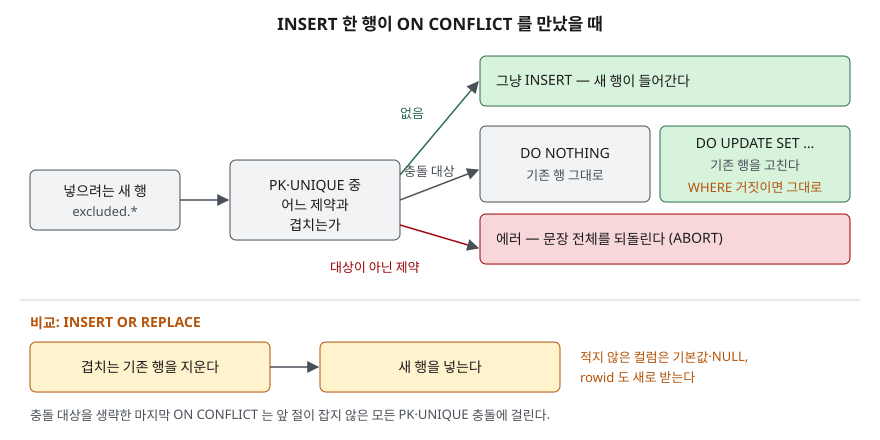

## 들어가며

쇼핑몰 재고 표에 매일 아침 입고 파일을 반영하는 일을 맡았다. 처음 보는 상품이면 새 줄을 넣고, 이미 있는
상품이면 수량을 더해야 한다. 그래서 상품마다 `SELECT`로 있는지 먼저 보고, 결과에 따라 `INSERT`나
`UPDATE`를 고르는 코드를 짠다. 상품 500개면 문장이 1,000번 오가고, 확인과 반영 사이에 다른 작업이
같은 상품을 넣으면 `UNIQUE constraint failed`로 멈춘다. 이 판단을 데이터베이스에 한 문장으로 맡기는
문법이 UPSERT다.

## 개념

- **UPSERT**: UPDATE와 INSERT를 합친 말이다. 넣으려는 행이 기존 행과 **키가 겹치면 고치고,
  안 겹치면 넣는다.** Tibero 같은 제품은 `MERGE` 문으로 이 일을 하고, SQLite는
  `INSERT` 끝에 `ON CONFLICT` 절을 붙인다. SQLite에는 3.24.0(2018-06-04)에 들어왔다.
- **충돌(conflict)**: 새 행이 PRIMARY KEY나 UNIQUE 제약을 어기는 것이다. "같은 키가 이미 있다"는 뜻이다.
- **충돌 대상(conflict target)**: `ON CONFLICT (sku)`의 괄호 안이다. **어느 제약에서 충돌했을 때**
  이 절을 쓸지 정한다.
- **`excluded`**: 넣으려다 막힌 새 행을 가리키는 이름이다. `excluded.qty`는 새로 들어온 수량,
  그냥 `qty`는 표에 이미 있는 수량이다.

INSERT 문법 자체는 [INSERT — 단건, 다건, SELECT로 넣기](../2026-09-29-insert-single-multi-select/index.md)에서 다뤘다.
Tibero에서 같은 일을 하는 `MERGE` 문은 [Tibero 7 MERGE 문](../../tibero/2026-09-22-tibero7-merge-upsert/index.md)에 정리했다.

## 구조



> **출처**: 충돌 대상·`excluded`·`DO UPDATE ... WHERE`는 [SQLite — UPSERT](https://www.sqlite.org/lang_upsert.html),
> 대상이 아닌 제약에서 문장을 되돌리는 ABORT와 기존 행을 지우는 REPLACE는 [SQLite — ON CONFLICT clause](https://www.sqlite.org/lang_conflict.html)를 따랐다.

## 동작 원리

INSERT는 행을 넣기 전에 PRIMARY KEY와 UNIQUE 제약을 검사한다. 겹치는 행이 없으면 그냥 넣는다.
겹쳤을 때 할 일이 세 가지로 갈린다.

1. **충돌 대상에서 겹쳤다** — `DO NOTHING`이면 넘어가고, `DO UPDATE`면 **기존 행**에 `SET`을 적용한다.
   새 행은 들어가지 않는다. `DO UPDATE` 끝의 `WHERE`가 거짓이면 아무것도 하지 않는다.
2. **대상이 아닌 제약에서 겹쳤다** — UPSERT가 끼어들지 않는다. 기본 처리인 ABORT로 에러를 내고
   그 문장이 바꾼 것을 되돌린다.
3. **충돌 대상을 생략했다** — SQLite 3.35.0부터 마지막 `ON CONFLICT`는 대상을 비워 둘 수 있고,
   앞 절이 잡지 않은 **모든** PK·UNIQUE 충돌에 걸린다.

`INSERT OR REPLACE`는 다르게 움직인다. 겹치는 기존 행을 **지우고** 새 행을 넣는다. 고치는 것이 아니라
바꿔 끼우는 것이다.

## 실습 예제

메모리 SQLite에 재고 표 `stock`과 회원 표 `member`를 만들었다. `member.email`에는 UNIQUE를 걸었다.
전체 소스: [`code/upsert.py`](code/upsert.py), 실행 기록: [`code/output.txt`](code/output.txt)

```text
[stock]  2행
  sku   | name | qty | memo     | updated_at
  ------+------+-----+----------+-----------
  A-100 | 볼펜 |  10 | 창고 2층 | 2026-10-01
  B-200 | 공책 |   5 | NULL     | 2026-10-01
```

### DO NOTHING과 DO UPDATE

```text
  성공  INSERT INTO stock (sku, name, qty, updated_at) VALUES ('A-100', '볼펜', 3, '2026-10-05') ON CONFLICT (sku) DO NOTHING
        -> 바뀐 행 0
  성공  INSERT INTO stock (sku, name, qty, updated_at) VALUES ('A-100', '볼펜', 3, '2026-10-05') ON CONFLICT (sku) DO UPDATE SET qty = qty + excluded.qty, updated_at = excluded.updated_at
        -> 바뀐 행 1
  (1, 'A-100', 13, '창고 2층', '2026-10-05')
```

`ON CONFLICT`가 없으면 같은 문장이 `UNIQUE constraint failed: stock.sku`로 멈췄다. `DO NOTHING`은 에러 없이
0행을 바꿨고, 없는 상품 `C-300`은 넣었다. `DO UPDATE`는 수량을 10 + 3 = 13으로 더했고, `SET`에 적지 않은
메모 '창고 2층'은 그대로 남았다.

`WHERE excluded.updated_at > stock.updated_at`를 붙이면 날짜가 더 오래된 입고(`2026-09-30`)는 0행,
새 입고(`2026-10-06`)는 1행을 바꿨다. 늦게 도착한 옛 데이터가 새 값을 덮는 일을 이것으로 막는다.

### 예상과 달랐던 결과 — OR REPLACE는 메모를 지운다

```text
  성공  INSERT OR REPLACE INTO stock (sku, name, qty, updated_at) VALUES ('A-100', '볼펜', 20, '2026-10-07')
        -> 바뀐 행 1
  (4, 'A-100', 20, None, '2026-10-07')
```

수량만 바꾸려 했는데 메모가 `None`이 되고 rowid가 1에서 4로 바뀌었다. 기존 행을 지우고 새로 넣었기 때문이다.
적지 않은 컬럼은 고쳐지지 않고 **사라진다.** 같은 일을 UPSERT로 하면 메모가 남는다.

### 충돌 대상을 무엇으로 잡는가

```text
  에러  INSERT INTO member (id, email, nickname) VALUES (1, 'new@example.com', '새회원') ON CONFLICT (email) DO UPDATE SET login_count = login_count + 1
        -> IntegrityError: UNIQUE constraint failed: member.id
  에러  INSERT INTO member (id, email, nickname) VALUES (1, 'new@example.com', '새회원') ON CONFLICT (nickname) DO NOTHING
        -> OperationalError: ON CONFLICT clause does not match any PRIMARY KEY or UNIQUE constraint
```

이메일이 대상인데 id가 겹치자 UPSERT가 끼어들지 않고 에러가 났다. UNIQUE가 없는 `nickname`은 대상으로
적을 수조차 없다. `ON CONFLICT (email) DO UPDATE ... ON CONFLICT (id) DO NOTHING`처럼 절을 둘 적으면
id 충돌은 0행으로 넘어갔다. 대상을 생략한 `ON CONFLICT DO UPDATE`는 id가 겹친 행과 이메일이 겹친 행 모두에서
2번 회원의 `login_count`를 올렸다.

한 문장에 `('D-400', 1)`, `('D-400', 2)`를 함께 넣으면 두 번째 행이 방금 들어간 첫 번째 행과 충돌해 수량이 3이 됐다.

### INSERT ... SELECT에는 WHERE true

```text
  에러  INSERT INTO stock (sku, name, qty, updated_at) SELECT sku, name, qty, '2026-10-07' FROM incoming ON CONFLICT (sku) DO UPDATE SET qty = qty + excluded.qty
        -> OperationalError: near "DO": syntax error
  성공  INSERT INTO stock (sku, name, qty, updated_at) SELECT sku, name, qty, '2026-10-07' FROM incoming WHERE true ON CONFLICT (sku) DO UPDATE SET qty = qty + excluded.qty
        -> 바뀐 행 2
```

`FROM incoming ON ...`을 SQLite가 조인의 `ON` 조건으로 읽기 시작해서 `DO`에서 막혔다. SQLite 문서가
이 경우 `WHERE true`라도 붙이라고 안내한다.

## 실무에서 주의할 점

- **충돌 대상은 실제로 겹칠 수 있는 키 전부를 생각해 정한다.** 대상이 아닌 제약에서 겹치면 그대로 에러다.
  대상을 생략하면 모든 제약을 잡지만, 어느 키로 겹쳤는지와 상관없이 같은 `SET`이 적용된다.
- **"덮어쓰기"가 목적이어도 `INSERT OR REPLACE`보다 `DO UPDATE`를 먼저 생각한다.** REPLACE는 행을 지우므로
  적지 않은 컬럼이 기본값이나 NULL이 되고 rowid가 바뀐다. rowid를 다른 곳에 저장해 두었다면 그 값이 어긋난다.
- **`qty = qty + excluded.qty`와 `qty = excluded.qty`를 구분한다.** 앞은 누적, 뒤는 덮어쓰기다.
  같은 입고 파일을 두 번 돌리면 누적 쪽은 수량이 두 배가 된다.
- **바뀐 행 수로 "새로 넣었는지"를 가리지 않는다.** 넣어도 1, 고쳐도 1이 나왔다.

## 정리

- `ON CONFLICT (대상) DO NOTHING | DO UPDATE SET ...`은 겹치면 기존 행을 두거나 고치고, 안 겹치면 넣는다.
- `excluded.컬럼`은 새로 넣으려던 값, 그냥 `컬럼`은 기존 값이다. `WHERE`로 고칠지 말지를 한 번 더 거른다.
- 대상이 아닌 제약에서 겹치면 에러다. 대상을 여럿 적거나 마지막 절에서 생략할 수 있다.
- `INSERT OR REPLACE`는 지우고 넣어서, 적지 않은 컬럼을 잃고 rowid가 바뀌었다.
- `INSERT ... SELECT`에 붙일 때는 `WHERE true`가 있어야 문법 오류가 나지 않았다.

## 참고 자료

- [SQLite — UPSERT](https://www.sqlite.org/lang_upsert.html) — 도입 버전(3.24.0), `excluded`, 대상 생략과 여러 절(3.35.0), `INSERT ... SELECT`의 구문 모호성과 `WHERE true`
- [SQLite — ON CONFLICT clause](https://www.sqlite.org/lang_conflict.html) — 기본 처리 ABORT, REPLACE가 기존 행을 지우고 넣는다는 설명
- [SQLite — INSERT](https://www.sqlite.org/lang_insert.html) — `INSERT OR REPLACE` 문법과 upsert 절의 위치
